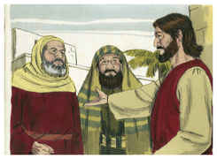

# Lucas Capítulo 20

## 1
E ACONTECEU num daqueles dias que, estando ele ensinando o povo no templo, e anunciando o evangelho, sobrevieram os principais dos sacerdotes e os escribas com os anciãos,

## 2
E falaram-lhe, dizendo: Dize-nos, com que autoridade fazes estas coisas? Ou, quem é que te deu esta autoridade?

## 3
E, respondendo ele, disse-lhes: Também eu vos farei uma pergunta: Dizei-me pois:

## 4
O batismo de João era do céu ou dos homens?

## 5
E eles arrazoavam entre si, dizendo: Se dissermos: Do céu, ele nos dirá: Então por que o não crestes?

## 6
E se dissermos: Dos homens; todo o povo nos apedrejará, pois têm por certo que João era profeta.

## 7
E responderam que não sabiam de onde era.

## 8
E Jesus lhes disse: Tampouco vos direi com que autoridade faço isto.

## 9
E começou a dizer ao povo esta parábola: Certo homem plantou uma vinha, e arrendou-a a uns lavradores, e partiu para fora da terra por muito tempo;

## 10
E no tempo próprio mandou um servo aos lavradores, para que lhe dessem dos frutos da vinha; mas os lavradores, espancando-o, mandaram-no vazio.

## 11
E tornou ainda a mandar outro servo; mas eles, espancando também a este, e afrontando-o, mandaram-no vazio.

## 12
E tornou ainda a mandar um terceiro; mas eles, ferindo também a este, o expulsaram.

## 13
E disse o senhor da vinha: Que farei? Mandarei o meu filho amado; talvez, vendo-o, seja respeitado.

## 14
Mas, vendo-o os lavradores, arrazoaram entre si, dizendo: Este é o herdeiro; vinde, matemo-lo, para que a herança seja nossa.

## 15
E, lançando-o fora da vinha, o mataram. Que lhes fará, pois, o senhor da vinha?

## 16
Irá, e destruirá estes lavradores, e dará a outros a vinha. E, ouvindo eles isto, disseram: Não seja assim!

## 17
Mas ele, olhando para eles, disse: Que é isto, pois, que está escrito? A pedra, que os edificadores reprovaram, Essa foi feita cabeça da esquina.

## 18
Qualquer que cair sobre aquela pedra ficará em pedaços, e aquele sobre quem ela cair será feito em pó.

## 19
E os principais dos sacerdotes e os escribas procuravam lançar mão dele naquela mesma hora; mas temeram o povo; porque entenderam que contra eles dissera esta parábola.

## 20
E, observando-o, mandaram espias, que se fingissem justos, para o apanharem nalguma palavra, e o entregarem à jurisdição e poder do presidente.

## 21
E perguntaram-lhe, dizendo: Mestre, nós sabemos que falas e ensinas bem e retamente, e que não consideras a aparência da pessoa, mas ensinas com verdade o caminho de Deus.

## 22
É-nos lícito dar tributo a César ou não?

## 23
E, entendendo ele a sua astúcia, disse-lhes: Por que me tentais?

## 24
Mostrai-me uma moeda. De quem tem a imagem e a inscrição? E, respondendo eles, disseram: De César.

## 25
Disse-lhes então: Dai, pois, a César o que é de César, e a Deus o que é de Deus.

## 26
E não puderam apanhá-lo em palavra alguma diante do povo; e, maravilhados da sua resposta, calaram-se.

## 27
E, chegando-se alguns dos saduceus, que dizem não haver ressurreição, perguntaram-lhe,

## 28
Dizendo: Mestre, Moisés nos deixou escrito que, se o irmão de algum falecer, tendo mulher, e não deixar filhos, o irmão dele tome a mulher, e suscite posteridade a seu irmão.

## 29
Houve, pois, sete irmãos, e o primeiro tomou mulher, e morreu sem filhos;

## 30
E tomou-a o segundo por mulher, e ele morreu sem filhos.

## 31
E tomou-a o terceiro, e igualmente também os sete; e morreram, e não deixaram filhos.

## 32
E por último, depois de todos, morreu também a mulher.

## 33
Portanto, na ressurreição, de qual deles será a mulher, pois que os sete por mulher a tiveram?

## 34
E, respondendo Jesus, disse-lhes: Os filhos deste mundo casam-se, e dão-se em casamento;

## 35
Mas os que forem havidos por dignos de alcançar o mundo vindouro, e a ressurreição dentre os mortos, nem hão de casar, nem ser dados em casamento;

## 36
Porque já não podem mais morrer; pois são iguais aos anjos, e são filhos de Deus, sendo filhos da ressurreição.

## 37
E que os mortos hão de ressuscitar também o mostrou Moisés junto da sarça, quando chama ao Senhor Deus de Abraão, e Deus de Isaque, e Deus de Jacó.

## 38
Ora, Deus não é Deus de mortos, mas de vivos; porque para ele vivem todos.

## 39
E, respondendo alguns dos escribas, disseram: Mestre, disseste bem.

## 40
E não ousavam perguntar-lhe mais coisa alguma.

## 41
E ele lhes disse: Como dizem que o Cristo é filho de Davi?

## 42
Visto como o mesmo Davi diz no livro dos Salmos: Disse o SENHOR ao meu Senhor: Assenta-te à minha direita,

## 43
Até que eu ponha os teus inimigos por escabelo de teus pés.

## 44
Se Davi lhe chama Senhor, como é ele seu filho?

## 45
E, ouvindo-o todo o povo, disse Jesus aos seus discípulos:

## 46
Guardai-vos dos escribas, que querem andar com vestes compridas; e amam as saudações nas praças, e as principais cadeiras nas sinagogas, e os primeiros lugares nos banquetes;

## 47
Que devoram as casas das viúvas, fazendo, por pretexto, longas orações. Estes receberão maior condenação.

