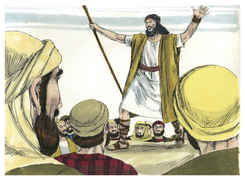
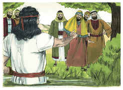
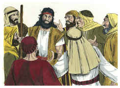
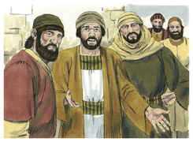
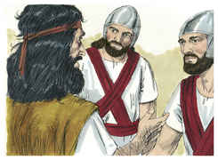
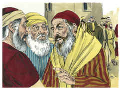
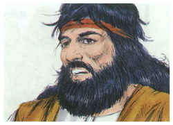
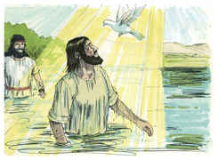
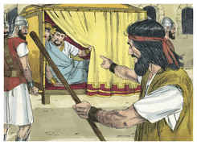

# Lucas Capítulo 3

## 1
E NO ano quinze do império de Tibério César, sendo Pôncio Pilatos presidente da Judéia, e Herodes tetrarca da Galiléia, e seu irmão Filipe tetrarca da Ituréia e da província de Traconites, e Lisânias tetrarca de Abilene,

## 2
Sendo Anás e Caifás sumos sacerdotes, veio no deserto a palavra de Deus a João, filho de Zacarias.

## 3
E percorreu toda a terra ao redor do Jordão, pregando o batismo de arrependimento, para o perdão dos pecados;

## 4
Segundo o que está escrito no livro das palavras do profeta Isaías, que diz: Voz do que clama no deserto: Preparai o caminho do Senhor; Endireitai as suas veredas.

## 5
Todo o vale se encherá, E se abaixará todo o monte e outeiro; E o que é tortuoso se endireitará, E os caminhos escabrosos se aplanarão;

## 6
E toda a carne verá a salvação de Deus.

## 7
Dizia, pois, João à multidão que saía para ser batizada por ele: Raça de víboras, quem vos ensinou a fugir da ira que está para vir?

## 8
Produzi, pois, frutos dignos de arrependimento, e não comeceis a dizer em vós mesmos: Temos Abraão por pai; porque eu vos digo que até destas pedras pode Deus suscitar filhos a Abraão.

## 9
E também já está posto o machado à raiz das árvores; toda a árvore, pois, que não dá bom fruto, corta-se e lança-se no fogo.

## 10
E a multidão o interrogava, dizendo: Que faremos, pois?

## 11
E, respondendo ele, disse-lhes: Quem tiver duas túnicas, reparta com o que não tem, e quem tiver alimentos, faça da mesma maneira.

## 12
E chegaram também uns publicanos, para serem batizados, e disseram-lhe: Mestre, que devemos fazer?

## 13
E ele lhes disse: Não peçais mais do que o que vos está ordenado.

## 14
E uns soldados o interrogaram também, dizendo: E nós que faremos? E ele lhes disse: A ninguém trateis mal nem defraudeis, e contentai-vos com o vosso soldo.

## 15
E, estando o povo em expectação, e pensando todos de João, em seus corações, se porventura seria o Cristo,

## 16
Respondeu João a todos, dizendo: Eu, na verdade, batizo-vos com água, mas eis que vem aquele que é mais poderoso do que eu, do qual não sou digno de desatar a correia das alparcas; esse vos batizará com o Espírito Santo e com fogo.

## 17
Ele tem a pá na sua mão; e limpará a sua eira, e ajuntará o trigo no seu celeiro, mas queimará a palha com fogo que nunca se apaga.

## 18
E assim, admoestando-os, muitas outras coisas também anunciava ao povo.

## 19
Sendo, porém, o tetrarca Herodes repreendido por ele por causa de Herodias, mulher de seu irmão Filipe, e por todas as maldades que Herodes tinha feito,

## 20
Acrescentou a todas as outras ainda esta, a de encerrar João num cárcere.

## 21
E aconteceu que, como todo o povo se batizava, sendo batizado também Jesus, orando ele, o céu se abriu;

## 22
E o Espírito Santo desceu sobre ele em forma corpórea, como pomba; e ouviu-se uma voz do céu, que dizia: Tu és o meu Filho amado, em ti me comprazo.

## 23
E o mesmo Jesus começava a ser de quase trinta anos, sendo (como se cuidava) filho de José, e José de Heli,

## 24
E Heli de Matã, e Matã de Levi, e Levi de Melqui, e Melqui de Janai, e Janai de José,

## 25
E José de Matatias, e Matatias de Amós, e Amós de Naum, e Naum de Esli, e Esli de Nagaí,

## 26
E Nagaí de Máate, e Máate de Matatias, e Matatias de Semei, e Semei de José, e José de Jodá,

## 27
E Jodá de Joanã, e Joanã de Resá, e Resá de Zorobabel, e Zorobabel de Salatiel, e Salatiel de Neri,

## 28
E Neri de Melqui, e Melqui de Adi, e Adi de Cosã, e Cosã de Elmadã, e Elmadã de Er,

## 29
E Er de Josué, e Josué de Eliézer, e Eliézer de Jorim, e Jorim de Matã, e Matã de Levi,

## 30
E Levi de Simeão, e Simeão de Judá, e Judá de José, e José de Jonã, e Jonã de Eliaquim,

## 31
E Eliaquim de Meleá, e Meleá de Mená, e Mená de Matatá, e Matatá de Natã, e Natã de Davi,

## 32
E Davi de Jessé, e Jessé de Obede, e Obede de Boaz, e Boaz de Salá, e Salá de Naassom,

## 33
E Naassom de Aminadabe, e Aminadabe de Arão, e Arão de Esrom, e Esrom de Perez, e Perez de Judá,

## 34
E Judá de Jacó, e Jacó de Isaque, e Isaque de Abraão, e Abraão de Terá, e Terá de Nacor,

## 35
E Nacor de Seruque, e Seruque de Ragaú, e Ragaú de Fáleque, e Fáleque de Éber, e Éber de Salá,

## 36
E Salá de Cainã, e Cainã de Arfaxade, e Arfaxade de Sem, e Sem de Noé, e Noé de Lameque,

## 37
E Lameque de Matusalém, e Matusalém de Enoque, e Enoque de Jarete, e Jarete de Maleleel, e Maleleel de Cainã,

## 38
E Cainã de Enos, e Enos de Sete, e Sete de Adão, e Adão de Deus.

