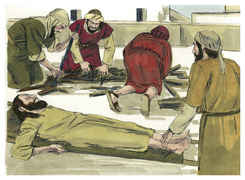
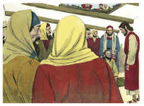
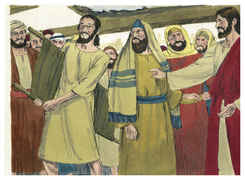
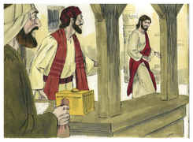
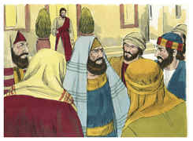
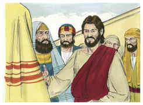

# Lucas Capítulo 5

## 1
E ACONTECEU que, apertando-o a multidão, para ouvir a palavra de Deus, estava ele junto ao lago de Genesaré;

## 2
E viu estar dois barcos junto à praia do lago; e os pescadores, havendo descido deles, estavam lavando as redes.

## 3
E, entrando num dos barcos, que era o de Simão, pediu-lhe que o afastasse um pouco da terra; e, assentando-se, ensinava do barco a multidão.

## 4
E, quando acabou de falar, disse a Simão: Faze-te ao mar alto, e lançai as vossas redes para pescar.

## 5
E, respondendo Simão, disse-lhe: Mestre, havendo trabalhado toda a noite, nada apanhamos; mas, sobre a tua palavra, lançarei a rede.

## 6
E, fazendo assim, colheram uma grande quantidade de peixes, e rompia-se-lhes a rede.

## 7
E fizeram sinal aos companheiros que estavam no outro barco, para que os fossem ajudar. E foram, e encheram ambos os barcos, de maneira tal que quase iam a pique.

## 8
E vendo isto Simão Pedro, prostrou-se aos pés de Jesus, dizendo: Senhor, ausenta-te de mim, que sou um homem pecador.

## 9
Pois que o espanto se apoderara dele, e de todos os que com ele estavam, por causa da pesca de peixe que haviam feito.

## 10
E, de igual modo, também de Tiago e João, filhos de Zebedeu, que eram companheiros de Simão. E disse Jesus a Simão: Não temas; de agora em diante serás pescador de homens.

## 11
E, levando os barcos para terra, deixaram tudo, e o seguiram.

## 12
E aconteceu que, quando estava numa daquelas cidades, eis que um homem cheio de lepra, vendo a Jesus, prostrou-se sobre o rosto, e rogou-lhe, dizendo: Senhor, se quiseres, bem podes limpar-me.

## 13
E ele, estendendo a mão, tocou-lhe, dizendo: Quero, sê limpo. E logo a lepra desapareceu dele.

## 14
E ordenou-lhe que a ninguém o dissesse. Mas vai, disse, mostra-te ao sacerdote, e oferece, pela tua purificação, o que Moisés determinou, para que lhes sirva de testemunho.

## 15
A sua fama, porém, se propagava ainda mais, e ajuntava-se muita gente para o ouvir e para ser por ele curada das suas enfermidades.

## 16
Ele, porém, retirava-se para os desertos, e ali orava.

## 17
E aconteceu que, num daqueles dias, estava ensinando, e estavam ali assentados fariseus e doutores da lei, que tinham vindo de todas as aldeias da Galiléia, e da Judéia, e de Jerusalém. E a virtude do Senhor estava ali para os curar.

## 18
E eis que uns homens transportaram numa cama um homem que estava paralítico, e procuravam fazê-lo entrar e pô-lo diante dele.

## 19
E, não achando por onde o pudessem levar, por causa da multidão, subiram ao telhado, e por entre as telhas o baixaram com a cama, até ao meio, diante de Jesus.

## 20
E, vendo ele a fé deles, disse-lhe: Homem, os teus pecados te são perdoados.

## 21
E os escribas e os fariseus começaram a arrazoar, dizendo: Quem é este que diz blasfêmias? Quem pode perdoar pecados, senão só Deus?

## 22
Jesus, porém, conhecendo os seus pensamentos, respondeu, e disse-lhes: Que arrazoais em vossos corações?

## 23
Qual é mais fácil? dizer: Os teus pecados te são perdoados; ou dizer: Levanta-te, e anda?

## 24
Ora, para que saibais que o Filho do homem tem sobre a terra poder de perdoar pecados (disse ao paralítico), a ti te digo: Levanta-te, toma a tua cama, e vai para tua casa.

## 25
E, levantando-se logo diante deles, e tomando a cama em que estava deitado, foi para sua casa, glorificando a Deus.

## 26
E todos ficaram maravilhados, e glorificaram a Deus; e ficaram cheios de temor, dizendo: Hoje vimos prodígios.

## 27
E, depois disto, saiu, e viu um publicano, chamado Levi, assentado na recebedoria, e disse-lhe: Segue-me.

## 28
E ele, deixando tudo, levantou-se e o seguiu.

## 29
E fez-lhe Levi um grande banquete em sua casa; e havia ali uma multidão de publicanos e outros que estavam com eles à mesa.

## 30
E os escribas deles, e os fariseus, murmuravam contra os seus discípulos, dizendo: Por que comeis e bebeis com publicanos e pecadores?

## 31
E Jesus, respondendo, disse-lhes: Não necessitam de médico os que estão sãos, mas, sim, os que estão enfermos;

## 32
Eu não vim chamar os justos, mas, sim, os pecadores, ao arrependimento.

## 33
Disseram-lhe, então, eles: Por que jejuam os discípulos de João muitas vezes, e fazem orações, como também os dos fariseus, mas os teus comem e bebem?

## 34
E ele lhes disse: Podeis vós fazer jejuar os filhos das bodas, enquanto o esposo está com eles?

## 35
Dias virão, porém, em que o esposo lhes será tirado, e então, naqueles dias, jejuarão.

## 36
E disse-lhes também uma parábola: Ninguém deita um pedaço de uma roupa nova para a coser em roupa velha, pois romperá a nova e o remendo não condiz com a velha.

## 37
E ninguém deita vinho novo em odres velhos; de outra sorte o vinho novo romperá os odres, e entornar-se-á o vinho, e os odres se estragarão;

## 38
Mas o vinho novo deve deitar-se em odres novos, e ambos juntamente se conservarão.

## 39
E ninguém tendo bebido o velho quer logo o novo, porque diz: Melhor é o velho.

