# Lucas Capítulo 9

## 1
E, CONVOCANDO os seus doze discípulos, deu-lhes virtude e poder sobre todos os demônios, para curarem enfermidades.

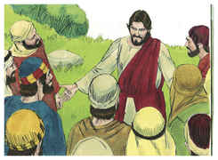

## 2
E enviou-os a pregar o reino de Deus, e a curar os enfermos.

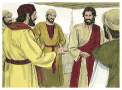

## 3
E disse-lhes: Nada leveis convosco para o caminho, nem bordões, nem alforje, nem pão, nem dinheiro; nem tenhais duas túnicas.

## 4
E em qualquer casa em que entrardes, ficai ali, e de lá saireis.

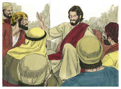

## 5
E se em qualquer cidade vos não receberem, saindo vós dali, sacudi o pó dos vossos pés, em testemunho contra eles.

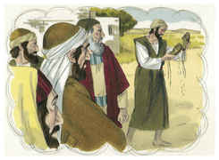

## 6
E, saindo eles, percorreram todas as aldeias, anunciando o evangelho, e fazendo curas por toda a parte.

## 7
E o tetrarca Herodes ouviu todas as coisas que por ele foram feitas, e estava em dúvida, porque diziam alguns que João ressuscitara dentre os mortos; e outros que Elias tinha aparecido;

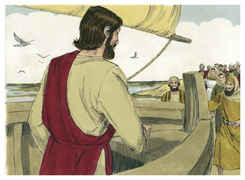

## 8
E outros que um profeta dos antigos havia ressuscitado.

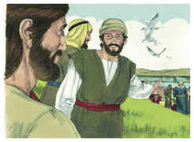

## 9
E disse Herodes: A João mandei eu degolar; quem é, pois, este de quem ouço dizer tais coisas? E procurava vê-lo.

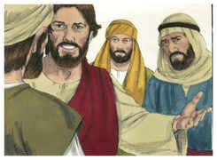

## 10
E, regressando os apóstolos, contaram-lhe tudo o que tinham feito. E, tomando-os consigo, retirou-se para um lugar deserto de uma cidade chamada Betsaida.

## 11
E, sabendo-o a multidão, o seguiu; e ele os recebeu, e falava-lhes do reino de Deus, e sarava os que necessitavam de cura.

## 12
E já o dia começava a declinar; então, chegando-se a ele os doze, disseram-lhe: Despede a multidão, para que, indo aos lugares e aldeias em redor, se agasalhem, e achem o que comer; porque aqui estamos em lugar deserto.

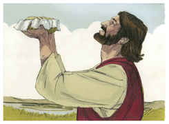

## 13
Mas ele lhes disse: Dai-lhes vós de comer. E eles disseram: Não temos senão cinco pães e dois peixes, salvo se nós próprios formos comprar comida para todo este povo.

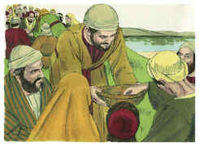

## 14
Porquanto estavam ali quase cinco mil homens. Disse, então, aos seus discípulos: Fazei-os assentar, em ranchos de cinqüenta em cinqüenta.

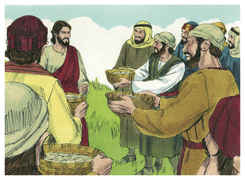

## 15
E assim o fizeram, fazendo-os assentar a todos.

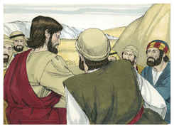

## 16
E, tomando os cinco pães e os dois peixes, e olhando para o céu, abençoou-os, e partiu-os, e deu-os aos seus discípulos para os porem diante da multidão.

## 17
E comeram todos, e saciaram-se; e levantaram, do que lhes sobejou, doze alcofas de pedaços.

## 18
E aconteceu que, estando ele só, orando, estavam com ele os discípulos; e perguntou-lhes, dizendo: Quem diz a multidão que eu sou?

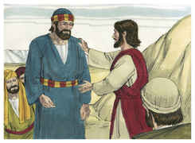

## 19
E, respondendo eles, disseram: João o Batista; outros, Elias, e outros que um dos antigos profetas ressuscitou.

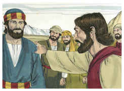

## 20
E disse-lhes: E vós, quem dizeis que eu sou? E, respondendo Pedro, disse: O Cristo de Deus.

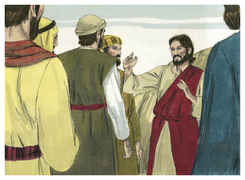

## 21
E, admoestando-os, mandou que a ninguém referissem isso,

## 22
Dizendo: É necessário que o Filho do homem padeça muitas coisas, e seja rejeitado dos anciãos e dos escribas, e seja morto, e ressuscite ao terceiro dia.

## 23
E dizia a todos: Se alguém quer vir após mim, negue-se a si mesmo, e tome cada dia a sua cruz, e siga-me.

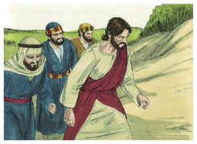

## 24
Porque, qualquer que quiser salvar a sua vida, perdê-la-á; mas qualquer que, por amor de mim, perder a sua vida, a salvará.

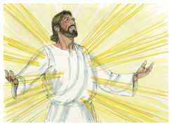

## 25
Porque, que aproveita ao homem granjear o mundo todo, perdendo-se ou prejudicando-se a si mesmo?

## 26
Porque, qualquer que de mim e das minhas palavras se envergonhar, dele se envergonhará o Filho do homem, quando vier na sua glória, e na do Pai e dos santos anjos.

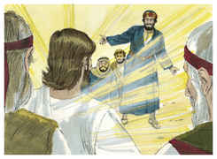

## 27
E em verdade vos digo que, dos que aqui estão, alguns há que não provarão a morte até que vejam o reino de Deus.

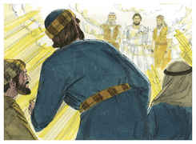

## 28
E aconteceu que, quase oito dias depois destas palavras, tomou consigo a Pedro, a João e a Tiago, e subiu ao monte a orar.

## 29
E, estando ele orando, transfigurou-se a aparência do seu rosto, e a sua roupa ficou branca e mui resplandecente.

## 30
E eis que estavam falando com ele dois homens, que eram Moisés e Elias,

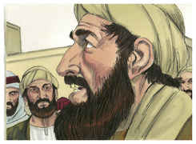

## 31
Os quais apareceram com glória, e falavam da sua morte, a qual havia de cumprir-se em Jerusalém.

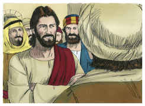

## 32
E Pedro e os que estavam com ele estavam carregados de sono; e, quando despertaram, viram a sua glória e aqueles dois homens que estavam com ele.

## 33
E aconteceu que, quando aqueles se apartaram dele, disse Pedro a Jesus: Mestre, bom é que nós estejamos aqui, e façamos três tendas: uma para ti, uma para Moisés, e uma para Elias, não sabendo o que dizia.

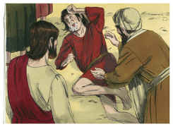

## 34
E, dizendo ele isto, veio uma nuvem que os cobriu com a sua sombra; e, entrando eles na nuvem, temeram.

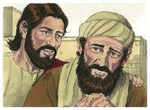

## 35
E saiu da nuvem uma voz que dizia: Este é o meu amado Filho; a ele ouvi.

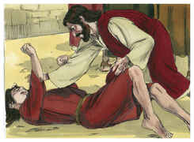

## 36
E, tendo soado aquela voz, Jesus foi achado só; e eles calaram-se, e por aqueles dias não contaram a ninguém nada do que tinham visto.

## 37
E aconteceu, no dia seguinte, que, descendo eles do monte, lhes saiu ao encontro uma grande multidão;

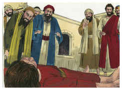

## 38
E eis que um homem da multidão clamou, dizendo: Mestre, peço-te que olhes para meu filho, porque é o único que eu tenho.

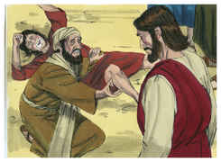

## 39
Eis que um espírito o toma e de repente clama, e o despedaça até espumar; e só o larga depois de o ter quebrantado.

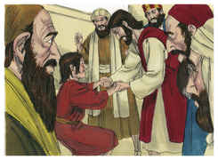

## 40
E roguei aos teus discípulos que o expulsassem, e não puderam.

## 41
E Jesus, respondendo, disse: Ó geração incrédula e perversa! até quando estarei ainda convosco e vos sofrerei? Traze-me aqui o teu filho.

## 42
E, quando vinha chegando, o demônio o derrubou e convulsionou; porém, Jesus repreendeu o espírito imundo, e curou o menino, e o entregou a seu pai.

## 43
E todos pasmavam da majestade de Deus. E, maravilhando-se todos de todas as coisas que Jesus fazia, disse aos seus discípulos:

## 44
Ponde vós estas palavras em vossos ouvidos, porque o Filho do homem será entregue nas mãos dos homens.

## 45
Mas eles não entendiam esta palavra, que lhes era encoberta, para que a não compreendessem; e temiam interrogá-lo acerca desta palavra.

## 46
E suscitou-se entre eles uma discussão sobre qual deles seria o maior.

## 47
Mas Jesus, vendo o pensamento de seus corações, tomou um menino, pô-lo junto a si,

## 48
E disse-lhes: Qualquer que receber este menino em meu nome, recebe-me a mim; e qualquer que me receber a mim, recebe o que me enviou; porque aquele que entre vós todos for o menor, esse mesmo será grande.

## 49
E, respondendo João, disse: Mestre, vimos um que em teu nome expulsava os demônios, e lho proibimos, porque não te segue conosco.

## 50
E Jesus lhe disse: Não o proibais, porque quem não é contra nós é por nós.

## 51
E aconteceu que, completando-se os dias para a sua assunção, manifestou o firme propósito de ir a Jerusalém.

## 52
E mandou mensageiros adiante de si; e, indo eles, entraram numa aldeia de samaritanos, para lhe prepararem pousada,

## 53
Mas não o receberam, porque o seu aspecto era como de quem ia a Jerusalém.

## 54
E os seus discípulos, Tiago e João, vendo isto, disseram: Senhor, queres que digamos que desça fogo do céu e os consuma, como Elias também fez?

## 55
Voltando-se, porém, repreendeu-os, e disse: Vós não sabeis de que espírito sois.

## 56
Porque o Filho do homem não veio para destruir as almas dos homens, mas para salvá-las. E foram para outra aldeia.

## 57
E aconteceu que, indo eles pelo caminho, lhe disse um: Senhor, seguir-te-ei para onde quer que fores.

## 58
E disse-lhe Jesus: As raposas têm covis, e as aves do céu, ninhos, mas o Filho do homem não tem onde reclinar a cabeça.

## 59
E disse a outro: Segue-me. Mas ele respondeu: Senhor, deixa que primeiro eu vá a enterrar meu pai.

## 60
Mas Jesus lhe observou: Deixa aos mortos o enterrar os seus mortos; porém tu vai e anuncia o reino de Deus.

## 61
Disse também outro: Senhor, eu te seguirei, mas deixa-me despedir primeiro dos que estão em minha casa.

## 62
E Jesus lhe disse: Ninguém, que lança mão do arado e olha para trás, é apto para o reino de Deus.

