# Marcos Capítulo 1

## 1
PRINCÍPIO do Evangelho de Jesus Cristo, Filho de Deus;

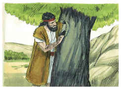

## 2
Como está escrito nos profetas: Eis que eu envio o meu anjo ante a tua face, o qual preparará o teu caminho diante de ti.

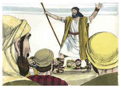

## 3
Voz do que clama no deserto: Preparai o caminho do Senhor, Endireitai as suas veredas.

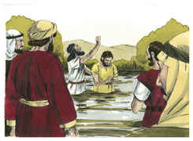

## 4
Apareceu João batizando no deserto, e pregando o batismo de arrependimento, para remissão dos pecados.

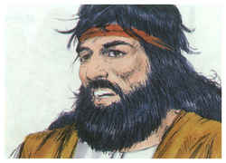

## 5
E toda a província da Judéia e os de Jerusalém iam ter com ele; e todos eram batizados por ele no rio Jordão, confessando os seus pecados.

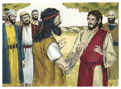

## 6
E João andava vestido de pêlos de camelo, e com um cinto de couro em redor de seus lombos, e comia gafanhotos e mel silvestre.

## 7
E pregava, dizendo: Após mim vem aquele que é mais forte do que eu, do qual não sou digno de, abaixando-me, desatar a correia das suas alparcas.

## 8
Eu, em verdade, tenho-vos batizado com água; ele, porém, vos batizará com o Espírito Santo.

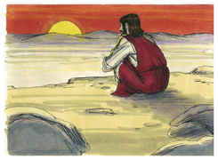

## 9
E aconteceu naqueles dias que Jesus, tendo ido de Nazaré da Galiléia, foi batizado por João, no Jordão.

## 10
E, logo que saiu da água, viu os céus abertos, e o Espírito, que como pomba descia sobre ele.

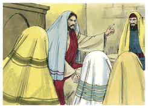

## 11
E ouviu-se uma voz dos céus, que dizia: Tu és o meu Filho amado em quem me comprazo.

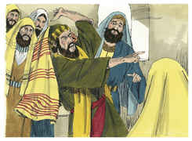

## 12
E logo o Espírito o impeliu para o deserto.

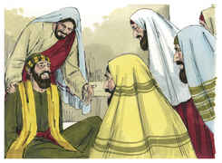

## 13
E ali esteve no deserto quarenta dias, tentado por Satanás. E vivia entre as feras, e os anjos o serviam.

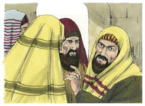

## 14
E, depois que João foi entregue à prisão, veio Jesus para a Galiléia, pregando o evangelho do reino de Deus,

## 15
E dizendo: O tempo está cumprido, e o reino de Deus está próximo. Arrependei-vos, e crede no evangelho.

## 16
E, andando junto do mar da Galiléia, viu Simão, e André, seu irmão, que lançavam a rede ao mar, pois eram pescadores.

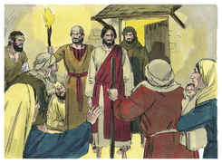

## 17
E Jesus lhes disse: Vinde após mim, e eu farei que sejais pescadores de homens.

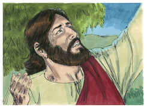

## 18
E, deixando logo as suas redes, o seguiram.

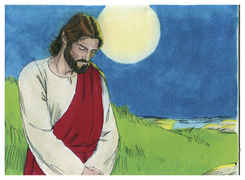

## 19
E, passando dali um pouco mais adiante, viu Tiago, filho de Zebedeu, e João, seu irmão, que estavam no barco consertando as redes,

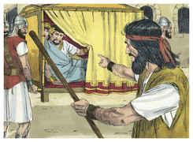

## 20
E logo os chamou. E eles, deixando o seu pai Zebedeu no barco com os jornaleiros, foram após ele.

## 21
Entraram em Cafarnaum e, logo no sábado, indo ele à sinagoga, ali ensinava.

## 22
E maravilharam-se da sua doutrina, porque os ensinava como tendo autoridade, e não como os escribas.

## 23
E estava na sinagoga deles um homem com um espírito imundo, o qual exclamou,

## 24
Dizendo: Ah! que temos contigo, Jesus Nazareno? Vieste destruir-nos? Bem sei quem és: o Santo de Deus.

## 25
E repreendeu-o Jesus, dizendo: Cala-te, e sai dele.

## 26
Então o espírito imundo, convulsionando-o, e clamando com grande voz, saiu dele.

## 27
E todos se admiraram, a ponto de perguntarem entre si, dizendo: Que é isto? Que nova doutrina é esta? Pois com autoridade ordena aos espíritos imundos, e eles lhe obedecem!

## 28
E logo correu a sua fama por toda a província da Galiléia.

## 29
E logo, saindo da sinagoga, foram à casa de Simão e de André com Tiago e João.

## 30
E a sogra de Simão estava deitada com febre; e logo lhe falaram dela.

## 31
Então, chegando-se a ela, tomou-a pela mão, e levantou-a; e imediatamente a febre a deixou, e servia-os.

## 32
E, tendo chegado a tarde, quando já se estava pondo o sol, trouxeram-lhe todos os que se achavam enfermos, e os endemoninhados.

## 33
E toda a cidade se ajuntou à porta.

## 34
E curou muitos que se achavam enfermos de diversas enfermidades, e expulsou muitos demônios, porém não deixava falar os demônios, porque o conheciam.

## 35
E, levantando-se de manhã, muito cedo, fazendo ainda escuro, saiu, e foi para um lugar deserto, e ali orava.

## 36
E seguiram-no Simão e os que com ele estavam.

## 37
E, achando-o, lhe disseram: Todos te buscam.

## 38
E ele lhes disse: Vamos às aldeias vizinhas, para que eu ali também pregue; porque para isso vim.

## 39
E pregava nas sinagogas deles, por toda a Galiléia, e expulsava os demônios.

## 40
E aproximou-se dele um leproso que, rogando-lhe, e pondo-se de joelhos diante dele, lhe dizia: Se queres, bem podes limpar-me.

## 41
E Jesus, movido de grande compaixão, estendeu a mão, e tocou-o, e disse-lhe: Quero, sê limpo.

## 42
E, tendo ele dito isto, logo a lepra desapareceu, e ficou limpo.

## 43
E, advertindo-o severamente, logo o despediu.

## 44
E disse-lhe: Olha, não digas nada a ninguém; porém vai, mostra-te ao sacerdote, e oferece pela tua purificação o que Moisés determinou, para lhes servir de testemunho.

## 45
Mas, tendo ele saído, começou a apregoar muitas coisas, e a divulgar o que acontecera; de sorte que Jesus já não podia entrar publicamente na cidade, mas conservava-se fora em lugares desertos; e de todas as partes iam ter com ele.

