# Marcos Capítulo 12

## 1
E COMEÇOU a falar-lhes por parábolas: Um homem plantou uma vinha, e cercou-a de um valado, e fundou nela um lagar, e edificou uma torre, e arrendou-a a uns lavradores, e partiu para fora da terra.

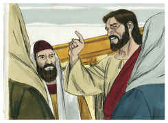

## 2
E, chegado o tempo, mandou um servo aos lavradores para que recebesse, dos lavradores, do fruto da vinha.

## 3
Mas estes, apoderando-se dele, o feriram e o mandaram embora vazio.

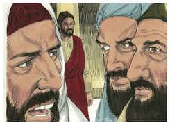

## 4
E tornou a enviar-lhes outro servo; e eles, apedrejando-o, o feriram na cabeça, e o mandaram embora, tendo-o afrontado.

## 5
E tornou a enviar-lhes outro, e a este mataram; e a outros muitos, dos quais a uns feriram e a outros mataram.

## 6
Tendo ele, pois, ainda um seu filho amado, enviou-o também a estes por derradeiro, dizendo: Ao menos terão respeito ao meu filho.

## 7
Mas aqueles lavradores disseram entre si: Este é o herdeiro; vamos, matemo-lo, e a herança será nossa.

## 8
E, pegando dele, o mataram, e o lançaram fora da vinha.

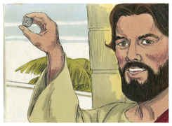

## 9
Que fará, pois, o senhor da vinha? Virá, e destruirá os lavradores, e dará a vinha a outros.

## 10
Ainda não lestes esta Escritura: A pedra, que os edificadores rejeitaram, Esta foi posta por cabeça de esquina;

## 11
Isto foi feito pelo Senhor E é coisa maravilhosa aos nossos olhos?

## 12
E buscavam prendê-lo, mas temiam a multidão; porque entendiam que contra eles dizia esta parábola; e, deixando-o, foram-se.

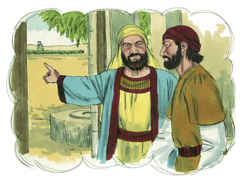

## 13
E enviaram-lhe alguns dos fariseus e dos herodianos, para que o apanhassem nalguma palavra.

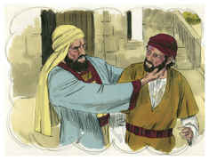

## 14
E, chegando eles, disseram-lhe: Mestre, sabemos que és homem de verdade, e de ninguém se te dá, porque não olhas à aparência dos homens, antes com verdade ensinas o caminho de Deus; é lícito dar o tributo a César, ou não? Daremos, ou não daremos?

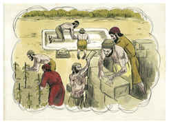

## 15
Então ele, conhecendo a sua hipocrisia, disse-lhes: Por que me tentais? Trazei-me uma moeda, para que a veja.

## 16
E eles lha trouxeram. E disse-lhes: De quem é esta imagem e inscrição? E eles lhe disseram: De César.

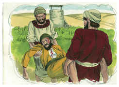

## 17
E Jesus, respondendo, disse-lhes: Dai pois a César o que é de César, e a Deus o que é de Deus. E maravilharam-se dele.

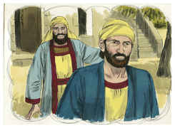

## 18
Então os saduceus, que dizem que não há ressurreição, aproximaram-se dele, e perguntaram-lhe, dizendo:

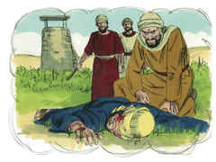

## 19
Mestre, Moisés nos escreveu que, se morresse o irmão de alguém, e deixasse a mulher e não deixasse filhos, seu irmão tomasse a mulher dele, e suscitasse descendência a seu irmão.

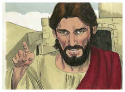

## 20
Ora, havia sete irmãos, e o primeiro tomou a mulher, e morreu sem deixar descendência;

## 21
E o segundo também a tomou e morreu, e nem este deixou descendência; e o terceiro da mesma maneira.

## 22
E tomaram-na os sete, sem, contudo, terem deixado descendência. Finalmente, depois de todos, morreu também a mulher.

## 23
Na ressurreição, pois, quando ressuscitarem, de qual destes será a mulher? porque os sete a tiveram por mulher.

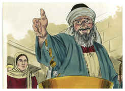

## 24
E Jesus, respondendo, disse-lhes: Porventura não errais vós em razão de não saberdes as Escrituras nem o poder de Deus?

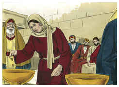

## 25
Porquanto, quando ressuscitarem dentre os mortos, nem casarão, nem se darão em casamento, mas serão como os anjos que estão nos céus.

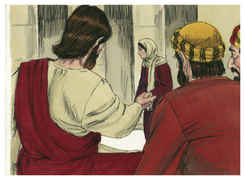

## 26
E, acerca dos mortos que houverem de ressuscitar, não tendes lido no livro de Moisés como Deus lhe falou na sarça, dizendo: Eu sou o Deus de Abraão, e o Deus de Isaque, e o Deus de Jacó?

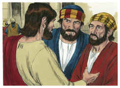

## 27
Ora, Deus não é de mortos, mas sim, é Deus de vivos. Por isso vós errais muito.

## 28
Aproximou-se dele um dos escribas que os tinha ouvido disputar, e sabendo que lhes tinha respondido bem, perguntou-lhe: Qual é o primeiro de todos os mandamentos?

## 29
E Jesus respondeu-lhe: O primeiro de todos os mandamentos é: Ouve, Israel, o Senhor nosso Deus é o único Senhor.

## 30
Amarás, pois, ao Senhor teu Deus de todo o teu coração, e de toda a tua alma, e de todo o teu entendimento, e de todas as tuas forças; este é o primeiro mandamento.

## 31
E o segundo, semelhante a este, é: Amarás o teu próximo como a ti mesmo. Não há outro mandamento maior do que estes.

## 32
E o escriba lhe disse: Muito bem, Mestre, e com verdade disseste que há um só Deus, e que não há outro além dele;

## 33
E que amá-lo de todo o coração, e de todo o entendimento, e de toda a alma, e de todas as forças, e amar o próximo como a si mesmo, é mais do que todos os holocaustos e sacrifícios.

## 34
E Jesus, vendo que havia respondido sabiamente, disse-lhe: Não estás longe do reino de Deus. E já ninguém ousava perguntar-lhe mais nada.

## 35
E, falando Jesus, dizia, ensinando no templo: Como dizem os escribas que o Cristo é filho de Davi?

## 36
O próprio Davi disse pelo Espírito Santo: O Senhor disse ao meu Senhor: Assenta-te à minha direita Até que eu ponha os teus inimigos por escabelo dos teus pés.

## 37
Pois, se Davi mesmo lhe chama Senhor, como é logo seu filho? E a grande multidão o ouvia de boa vontade.

## 38
E, ensinando-os, dizia-lhes: Guardai-vos dos escribas, que gostam de andar com vestes compridas, e das saudações nas praças,

## 39
E das primeiras cadeiras nas sinagogas, e dos primeiros assentos nas ceias;

## 40
Que devoram as casas das viúvas, e isso com pretexto de largas orações. Estes receberão mais grave condenação.

## 41
E, estando Jesus assentado defronte da arca do tesouro, observava a maneira como a multidão lançava o dinheiro na arca do tesouro; e muitos ricos deitavam muito.

## 42
Vindo, porém, uma pobre viúva, deitou duas pequenas moedas, que valiam meio centavo.

## 43
E, chamando os seus discípulos, disse-lhes: Em verdade vos digo que esta pobre viúva deitou mais do que todos os que deitaram na arca do tesouro;

## 44
Porque todos ali deitaram do que lhes sobejava, mas esta, da sua pobreza, deitou tudo o que tinha, todo o seu sustento.

