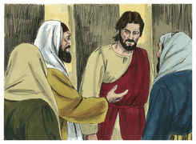
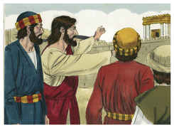
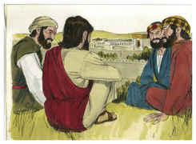
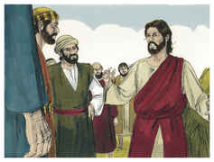
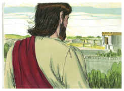

# Marcos Capítulo 13

## 1
E, SAINDO ele do templo, disse-lhe um dos seus discípulos: Mestre, olha que pedras, e que edifícios!

## 2
E, respondendo Jesus, disse-lhe: Vês estes grandes edifícios? Não ficará pedra sobre pedra que não seja derrubada.

## 3
E, assentando-se ele no Monte das Oliveiras, defronte do templo, Pedro, e Tiago, e João e André lhe perguntaram em particular:

## 4
Dize-nos, quando serão essas coisas, e que sinal haverá quando todas elas estiverem para se cumprir.

## 5
E Jesus, respondendo-lhes, começou a dizer: Olhai que ninguém vos engane;

## 6
Porque muitos virão em meu nome, dizendo: Eu sou o Cristo; e enganarão a muitos.

## 7
E, quando ouvirdes de guerras e de rumores de guerras, não vos perturbeis; porque assim deve acontecer; mas ainda não será o fim.

## 8
Porque se levantará nação contra nação, e reino contra reino, e haverá terremotos em diversos lugares, e haverá fomes e tribulações. Estas coisas são os princípios das dores.

## 9
Mas olhai por vós mesmos, porque vos entregarão aos concílios e às sinagogas; e sereis açoitados, e sereis apresentados perante presidentes e reis, por amor de mim, para lhes servir de testemunho.

## 10
Mas importa que o evangelho seja primeiramente pregado entre todas as nações.

## 11
Quando, pois, vos conduzirem e vos entregarem, não estejais solícitos de antemão pelo que haveis de dizer, nem premediteis; mas, o que vos for dado naquela hora, isso falai, porque não sois vós os que falais, mas o Espírito Santo.

## 12
E o irmão entregará à morte o irmão, e o pai ao filho; e levantar-se-ão os filhos contra os pais, e os farão morrer.

## 13
E sereis odiados por todos por amor do meu nome; mas quem perseverar até ao fim, esse será salvo.

## 14
Ora, quando vós virdes a abominação do assolamento, que foi predita por Daniel o profeta, estar onde não deve estar (quem lê, entenda), então os que estiverem na Judéia fujam para os montes.

## 15
E o que estiver sobre o telhado não desça para casa, nem entre a tomar coisa alguma de sua casa;

## 16
E o que estiver no campo não volte atrás, para tomar as suas vestes.

## 17
Mas ai das grávidas, e das que criarem naqueles dias!

## 18
Orai, pois, para que a vossa fuga não suceda no inverno.

## 19
Porque naqueles dias haverá uma aflição tal, qual nunca houve desde o princípio da criação, que Deus criou, até agora, nem jamais haverá.

## 20
E, se o Senhor não abreviasse aqueles dias, nenhuma carne se salvaria; mas, por causa dos eleitos que escolheu, abreviou aqueles dias.

## 21
E então, se alguém vos disser: Eis aqui o Cristo; ou: Ei-lo ali; não acrediteis.

## 22
Porque se levantarão falsos cristos, e falsos profetas, e farão sinais e prodígios, para enganarem, se for possível, até os escolhidos.

## 23
Mas vós vede; eis que de antemão vos tenho dito tudo.

## 24
Ora, naqueles dias, depois daquela aflição, o sol se escurecerá, e a lua não dará a sua luz.

## 25
E as estrelas cairão do céu, e as forças que estão nos céus serão abaladas.

## 26
E então verão vir o Filho do homem nas nuvens, com grande poder e glória.

## 27
E ele enviará os seus anjos, e ajuntará os seus escolhidos, desde os quatro ventos, da extremidade da terra até a extremidade do céu.

## 28
Aprendei, pois, a parábola da figueira: Quando já o seu ramo se torna tenro, e brota folhas, bem sabeis que já está próximo o verão.

## 29
Assim também vós, quando virdes sucederem estas coisas, sabei que já está perto, às portas.

## 30
Na verdade vos digo que não passará esta geração, sem que todas estas coisas aconteçam.

## 31
Passará o céu e a terra, mas as minhas palavras não passarão.

## 32
Mas daquele dia e hora ninguém sabe, nem os anjos que estão no céu, nem o Filho, senão o Pai.

## 33
Olhai, vigiai e orai; porque não sabeis quando chegará o tempo.

## 34
É como se um homem, partindo para fora da terra, deixasse a sua casa, e desse autoridade aos seus servos, e a cada um a sua obra, e mandasse ao porteiro que vigiasse.

## 35
Vigiai, pois, porque não sabeis quando virá o senhor da casa; se à tarde, se à meia-noite, se ao cantar do galo, se pela manhã,

## 36
Para que, vindo de improviso, não vos ache dormindo.

## 37
E as coisas que vos digo, digo-as a todos: Vigiai.

