# Marcos Capítulo 2

## 1
E ALGUNS dias depois entrou outra vez em Cafarnaum, e soube-se que estava em casa.

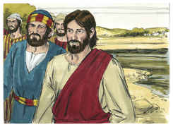

## 2
E logo se ajuntaram tantos, que nem ainda nos lugares junto à porta cabiam; e anunciava-lhes a palavra.

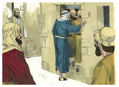

## 3
E vieram ter com ele conduzindo um paralítico, trazido por quatro.

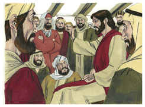

## 4
E, não podendo aproximar-se dele, por causa da multidão, descobriram o telhado onde estava, e, fazendo um buraco, baixaram o leito em que jazia o paralítico.

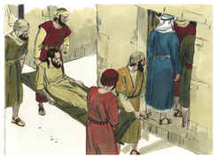

## 5
E Jesus, vendo a fé deles, disse ao paralítico: Filho, perdoados estão os teus pecados.

## 6
E estavam ali assentados alguns dos escribas, que arrazoavam em seus corações, dizendo:

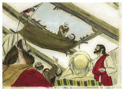

## 7
Por que diz este assim blasfêmias? Quem pode perdoar pecados, senão Deus?

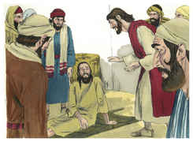

## 8
E Jesus, conhecendo logo em seu espírito que assim arrazoavam entre si, lhes disse: Por que arrazoais sobre estas coisas em vossos corações?

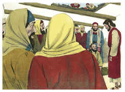

## 9
Qual é mais fácil? dizer ao paralítico: Estão perdoados os teus pecados; ou dizer-lhe: Levanta-te, e toma o teu leito, e anda?

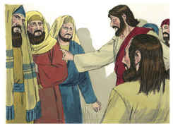

## 10
Ora, para que saibais que o Filho do homem tem na terra poder para perdoar pecados (disse ao paralítico),

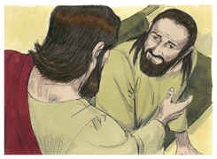

## 11
A ti te digo: Levanta-te, toma o teu leito, e vai para tua casa.

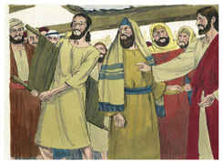

## 12
E levantou-se e, tomando logo o leito, saiu em presença de todos, de sorte que todos se admiraram e glorificaram a Deus, dizendo: Nunca tal vimos.

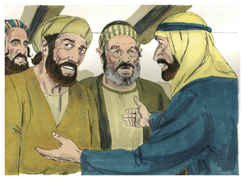

## 13
E tornou a sair para o mar, e toda a multidão ia ter com ele, e ele os ensinava.

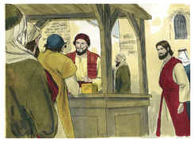

## 14
E, passando, viu Levi, filho de Alfeu, sentado na recebedoria, e disse-lhe: Segue-me. E, levantando-se, o seguiu.

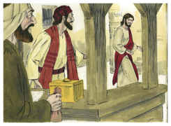

## 15
E aconteceu que, estando sentado à mesa em casa deste, também estavam sentados à mesa com Jesus e seus discípulos muitos publicanos e pecadores; porque eram muitos, e o tinham seguido.

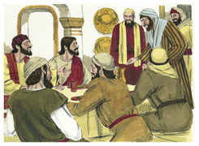

## 16
E os escribas e fariseus, vendo-o comer com os publicanos e pecadores, disseram aos seus discípulos: Por que come e bebe ele com os publicanos e pecadores?

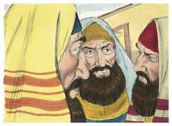

## 17
E Jesus, tendo ouvido isto, disse-lhes: Os sãos não necessitam de médico, mas, sim, os que estão doentes; eu não vim chamar os justos, mas, sim, os pecadores ao arrependimento.

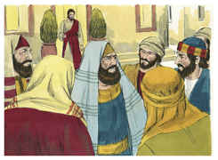

## 18
Ora, os discípulos de João e os fariseus jejuavam; e foram e disseram-lhe: Por que jejuam os discípulos de João e os dos fariseus, e não jejuam os teus discípulos?

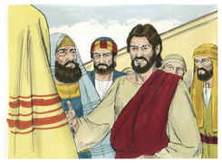

## 19
E Jesus disse-lhes: Podem porventura os filhos das bodas jejuar enquanto está com eles o esposo? Enquanto têm consigo o esposo, não podem jejuar;

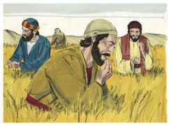

## 20
Mas dias virão em que lhes será tirado o esposo, e então jejuarão naqueles dias.

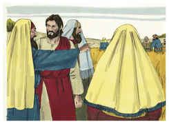

## 21
Ninguém deita remendo de pano novo em roupa velha; doutra sorte o mesmo remendo novo rompe o velho, e a rotura fica maior.

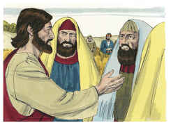

## 22
E ninguém deita vinho novo em odres velhos; doutra sorte, o vinho novo rompe os odres e entorna-se o vinho, e os odres estragam-se; o vinho novo deve ser deitado em odres novos.

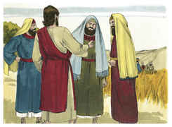

## 23
E aconteceu que, passando ele num sábado pelas searas, os seus discípulos, caminhando, começaram a colher espigas.

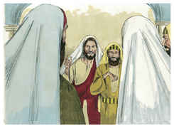

## 24
E os fariseus lhe disseram: Vês? Por que fazem no sábado o que não é lícito?

## 25
Mas ele disse-lhes: Nunca lestes o que fez Davi, quando estava em necessidade e teve fome, ele e os que com ele estavam?

## 26
Como entrou na casa de Deus, no tempo de Abiatar, sumo sacerdote, e comeu os pães da proposição, dos quais não era lícito comer senão aos sacerdotes, dando também aos que com ele estavam?

## 27
E disse-lhes: O sábado foi feito por causa do homem, e não o homem por causa do sábado.

## 28
Assim o Filho do homem até do sábado é Senhor.

