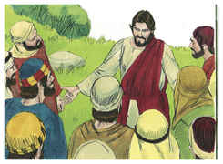
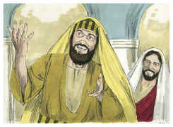
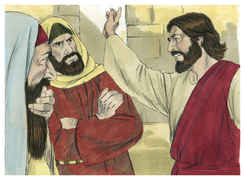

# Marcos Capítulo 3

## 1
E OUTRA vez entrou na sinagoga, e estava ali um homem que tinha uma das mãos mirrada.

## 2
E estavam observando-o se curaria no sábado, para o acusarem.

## 3
E disse ao homem que tinha a mão mirrada: Levanta-te e vem para o meio.

## 4
E perguntou-lhes: É lícito no sábado fazer bem, ou fazer mal? salvar a vida, ou matar? E eles calaram-se.

## 5
E, olhando para eles em redor com indignação, condoendo-se da dureza do seu coração, disse ao homem: Estende a tua mão. E ele a estendeu, e foi-lhe restituída a sua mão, sã como a outra.

## 6
E, tendo saído os fariseus, tomaram logo conselho com os herodianos contra ele, procurando ver como o matariam.

## 7
E retirou-se Jesus com os seus discípulos para o mar, e seguia-o uma grande multidão da Galiléia e da Judéia,

## 8
E de Jerusalém, e da Iduméia, e de além do Jordão, e de perto de Tiro e de Sidom; uma grande multidão que, ouvindo quão grandes coisas fazia, vinha ter com ele.

## 9
E ele disse aos seus discípulos que lhe tivessem sempre pronto um barquinho junto dele, por causa da multidão, para que o não oprimisse,

## 10
Porque tinha curado a muitos, de tal maneira que todos quantos tinham algum mal se arrojavam sobre ele, para lhe tocarem.

## 11
E os espíritos imundos vendo-o, prostravam-se diante dele, e clamavam, dizendo: Tu és o Filho de Deus.

## 12
E ele os ameaçava muito, para que não o manifestassem.

## 13
E subiu ao monte, e chamou para si os que ele quis; e vieram a ele.

## 14
E nomeou doze para que estivessem com ele e os mandasse a pregar,

## 15
E para que tivessem o poder de curar as enfermidades e expulsar os demônios:

## 16
A Simão, a quem pôs o nome de Pedro,

## 17
E a Tiago, filho de Zebedeu, e a João, irmão de Tiago, aos quais pôs o nome de Boanerges, que significa: Filhos do trovão;

## 18
E a André, e a Filipe, e a Bartolomeu, e a Mateus, e a Tomé, e a Tiago, filho de Alfeu, e a Tadeu, e a Simão, o Cananita,

## 19
E a Judas Iscariotes, o que o entregou.

## 20
E foram para uma casa. E afluiu outra vez a multidão, de tal maneira que nem sequer podiam comer pão.

## 21
E, quando os seus ouviram isto, saíram para o prender; porque diziam: Está fora de si.

## 22
E os escribas, que tinham descido de Jerusalém, diziam: Tem Belzebu, e pelo príncipe dos demônios expulsa os demônios.

## 23
E, chamando-os a si, disse-lhes por parábolas: Como pode Satanás expulsar Satanás?

## 24
E, se um reino se dividir contra si mesmo, tal reino não pode subsistir;

## 25
E, se uma casa se dividir contra si mesma, tal casa não pode subsistir.

## 26
E, se Satanás se levantar contra si mesmo, e for dividido, não pode subsistir; antes tem fim.

## 27
Ninguém pode roubar os bens do valente, entrando-lhe em sua casa, se primeiro não maniatar o valente; e então roubará a sua casa.

## 28
Na verdade vos digo que todos os pecados serão perdoados aos filhos dos homens, e toda a sorte de blasfêmias, com que blasfemarem;

## 29
Qualquer, porém, que blasfemar contra o Espírito Santo, nunca obterá perdão, mas será réu do eterno juízo

## 30
(Porque diziam: Tem espírito imundo).

## 31
Chegaram, então, seus irmãos e sua mãe; e, estando fora, mandaram-no chamar.

## 32
E a multidão estava assentada ao redor dele, e disseram-lhe: Eis que tua mãe e teus irmãos te procuram, e estão lá fora.

## 33
E ele lhes respondeu, dizendo: Quem é minha mãe e meus irmãos?

## 34
E, olhando em redor para os que estavam assentados junto dele, disse: Eis aqui minha mãe e meus irmãos.

## 35
Porquanto, qualquer que fizer a vontade de Deus, esse é meu irmão, e minha irmã, e minha mãe.

