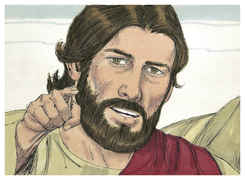
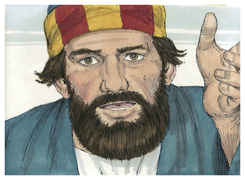
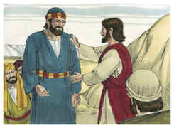
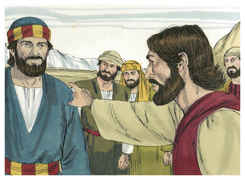
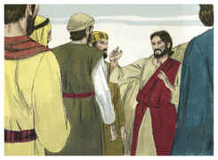
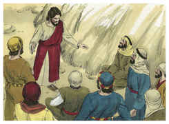

# Marcos Capítulo 8

## 1
NAQUELES dias, havendo uma grande multidão, e não tendo o que comer, Jesus chamou a si os seus discípulos, e disse-lhes:

## 2
Tenho compaixão da multidão, porque há já três dias que estão comigo, e não têm o que comer.

## 3
E, se os deixar ir em jejum, para suas casas, desfalecerão no caminho, porque alguns deles vieram de longe.

## 4
E os seus discípulos responderam-lhe: De onde poderá alguém satisfazê-los de pão aqui no deserto?

## 5
E perguntou-lhes: Quantos pães tendes? E disseram-lhe: Sete.

## 6
E ordenou à multidão que se assentasse no chão. E, tomando os sete pães, e tendo dado graças, partiu-os, e deu-os aos seus discípulos, para que os pusessem diante deles, e puseram-nos diante da multidão.

## 7
Tinham também alguns peixinhos; e, tendo dado graças, ordenou que também lhos pusessem diante.

## 8
E comeram, e saciaram-se; e dos pedaços que sobejaram levantaram sete cestos.

## 9
E os que comeram eram quase quatro mil; e despediu-os.

## 10
E, entrando logo no barco, com os seus discípulos, foi para as partes de Dalmanuta.

## 11
E saíram os fariseus, e começaram a disputar com ele, pedindo-lhe, para o tentarem, um sinal do céu.

## 12
E, suspirando profundamente em seu espírito, disse: Por que pede esta geração um sinal? Em verdade vos digo que a esta geração não se dará sinal algum.

## 13
E, deixando-os, tornou a entrar no barco, e foi para o outro lado.

## 14
E eles se esqueceram de levar pão e, no barco, não tinham consigo senão um pão.

## 15
E ordenou-lhes, dizendo: Olhai, guardai-vos do fermento dos fariseus e do fermento de Herodes.

## 16
E arrazoavam entre si, dizendo: É porque não temos pão.

## 17
E Jesus, conhecendo isto, disse-lhes: Para que arrazoais, que não tendes pão? não considerastes, nem compreendestes ainda? tendes ainda o vosso coração endurecido?

## 18
Tendo olhos, não vedes? e tendo ouvidos, não ouvis? e não vos lembrais,

## 19
Quando parti os cinco pães entre os cinco mil, quantas alcofas cheias de pedaços levantastes? Disseram-lhe: Doze.

## 20
E, quando parti os sete entre os quatro mil, quantos cestos cheios de pedaços levantastes? E disseram-lhe: Sete.

## 21
E ele lhes disse: Como não entendeis ainda?

## 22
E chegou a Betsaida; e trouxeram-lhe um cego, e rogaram-lhe que o tocasse.

## 23
E, tomando o cego pela mão, levou-o para fora da aldeia; e, cuspindo-lhe nos olhos, e impondo-lhe as mãos, perguntou-lhe se via alguma coisa.

## 24
E, levantando ele os olhos, disse: Vejo os homens; pois os vejo como árvores que andam.

## 25
Depois disto, tornou a pôr-lhe as mãos sobre os olhos, e o fez olhar para cima: e ele ficou restaurado, e viu a todos claramente.

## 26
E mandou-o para sua casa, dizendo: Nem entres na aldeia, nem o digas a ninguém na aldeia.

## 27
E saiu Jesus, e os seus discípulos, para as aldeias de Cesaréia de Filipe; e no caminho perguntou aos seus discípulos, dizendo: Quem dizem os homens que eu sou?

## 28
E eles responderam: João o Batista; e outros: Elias; mas outros: Um dos profetas.

## 29
E ele lhes disse: Mas vós, quem dizeis que eu sou? E, respondendo Pedro, lhe disse: Tu és o Cristo.

## 30
E admoestou-os, para que a ninguém dissessem aquilo dele.

## 31
E começou a ensinar-lhes que importava que o Filho do homem padecesse muito, e que fosse rejeitado pelos anciãos e príncipes dos sacerdotes, e pelos escribas, e que fosse morto, mas que depois de três dias ressuscitaria.

## 32
E dizia abertamente estas palavras. E Pedro o tomou à parte, e começou a repreendê-lo.

## 33
Mas ele, virando-se, e olhando para os seus discípulos, repreendeu a Pedro, dizendo: Retira-te de diante de mim, Satanás; porque não compreendes as coisas que são de Deus, mas as que são dos homens.

## 34
E chamando a si a multidão, com os seus discípulos, disse-lhes: Se alguém quiser vir após mim, negue-se a si mesmo, e tome a sua cruz, e siga-me.

## 35
Porque qualquer que quiser salvar a sua vida, perdê-la-á, mas, qualquer que perder a sua vida por amor de mim e do evangelho, esse a salvará.

## 36
Pois, que aproveitaria ao homem ganhar todo o mundo e perder a sua alma?

## 37
Ou, que daria o homem pelo resgate da sua alma?

## 38
Porquanto, qualquer que, entre esta geração adúltera e pecadora, se envergonhar de mim e das minhas palavras, também o Filho do homem se envergonhará dele, quando vier na glória de seu Pai, com os santos anjos.

