# Marcos Capítulo 9

## 1
DIZIA-LHES também: Em verdade vos digo que, dos que aqui estão, alguns há que não provarão a morte sem que vejam chegado o reino de Deus com poder.

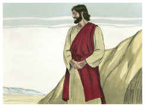

## 2
E seis dias depois Jesus tomou consigo a Pedro, a Tiago, e a João, e os levou sós, em particular, a um alto monte; e transfigurou-se diante deles;

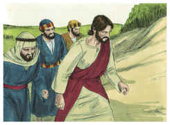

## 3
E as suas vestes tornaram-se resplandecentes, extremamente brancas como a neve, tais como nenhum lavadeiro sobre a terra as poderia branquear.

## 4
E apareceu-lhes Elias, com Moisés, e falavam com Jesus.

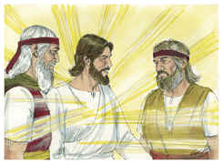

## 5
E Pedro, tomando a palavra, disse a Jesus: Mestre, é bom que estejamos aqui; e façamos três cabanas, uma para ti, outra para Moisés, e outra para Elias.

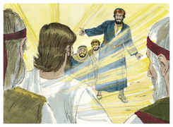

## 6
Pois não sabia o que dizia, porque estavam assombrados.

## 7
E desceu uma nuvem que os cobriu com a sua sombra, e saiu da nuvem uma voz que dizia: Este é o meu filho amado; a ele ouvi.

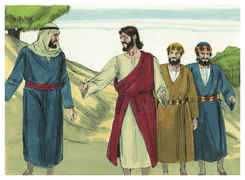

## 8
E, tendo olhado em redor, ninguém mais viram, senão só Jesus com eles.

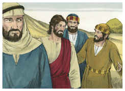

## 9
E, descendo eles do monte, ordenou-lhes que a ninguém contassem o que tinham visto, até que o Filho do homem ressuscitasse dentre os mortos.

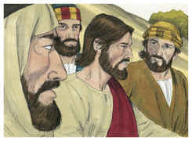

## 10
E eles retiveram o caso entre si, perguntando uns aos outros que seria aquilo, ressuscitar dentre os mortos.

## 11
E interrogaram-no, dizendo: Por que dizem os escribas que é necessário que Elias venha primeiro?

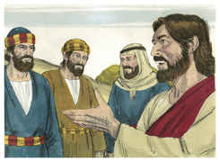

## 12
E, respondendo ele, disse-lhes: Em verdade Elias virá primeiro, e todas as coisas restaurará; e, como está escrito do Filho do homem, que ele deva padecer muito e ser aviltado.

## 13
Digo-vos, porém, que Elias já veio, e fizeram-lhe tudo o que quiseram, como dele está escrito.

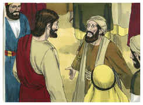

## 14
E, quando se aproximou dos discípulos, viu ao redor deles grande multidão, e alguns escribas que disputavam com eles.

## 15
E logo toda a multidão, vendo-o, ficou espantada e, correndo para ele, o saudaram.

## 16
E perguntou aos escribas: Que é que discutis com eles?

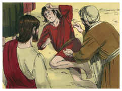

## 17
E um da multidão, respondendo, disse: Mestre, trouxe-te o meu filho, que tem um espírito mudo;

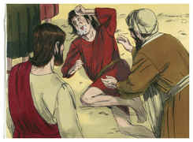

## 18
E este, onde quer que o apanhe, despedaça-o, e ele espuma, e range os dentes, e vai definhando; e eu disse aos teus discípulos que o expulsassem, e não puderam.

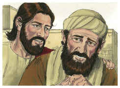

## 19
E ele, respondendo-lhes, disse: Ó geração incrédula! até quando estarei convosco? até quando vos sofrerei ainda? Trazei-mo.

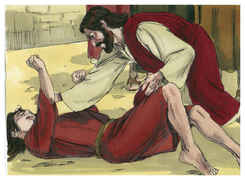

## 20
E trouxeram-lho; e quando ele o viu, logo o espírito o agitou com violência, e, caindo o endemoninhado por terra, revolvia-se, escumando.

## 21
E perguntou ao pai dele: Quanto tempo há que lhe sucede isto? E ele disse-lhe: Desde a infância.

## 22
E muitas vezes o tem lançado no fogo, e na água, para o destruir; mas, se tu podes fazer alguma coisa, tem compaixão de nós, e ajuda-nos.

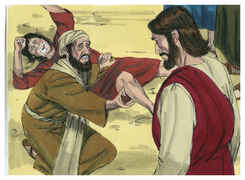

## 23
E Jesus disse-lhe: Se tu podes crer, tudo é possível ao que crê.

## 24
E logo o pai do menino, clamando, com lágrimas, disse: Eu creio, Senhor! ajuda a minha incredulidade.

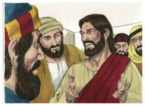

## 25
E Jesus, vendo que a multidão concorria, repreendeu o espírito imundo, dizendo-lhe: Espírito mudo e surdo, eu te ordeno: Sai dele, e não entres mais nele.

## 26
E ele, clamando, e agitando-o com violência, saiu; e ficou o menino como morto, de tal maneira que muitos diziam que estava morto.

## 27
Mas Jesus, tomando-o pela mão, o ergueu, e ele se levantou.

## 28
E, quando entrou em casa, os seus discípulos lhe perguntaram à parte: Por que o não pudemos nós expulsar?

## 29
E disse-lhes: Esta casta não pode sair com coisa alguma, a não ser com oração e jejum.

## 30
E, tendo partido dali, caminharam pela Galiléia, e não queria que alguém o soubesse;

## 31
Porque ensinava os seus discípulos, e lhes dizia: O Filho do homem será entregue nas mãos dos homens, e matá-lo-ão; e, morto ele, ressuscitará ao terceiro dia.

## 32
Mas eles não entendiam esta palavra, e receavam interrogá-lo.

## 33
E chegou a Cafarnaum e, entrando em casa, perguntou-lhes: Que estáveis vós discutindo pelo caminho?

## 34
Mas eles calaram-se; porque pelo caminho tinham disputado entre si qual era o maior.

## 35
E ele, assentando-se, chamou os doze, e disse-lhes: Se alguém quiser ser o primeiro, será o derradeiro de todos e o servo de todos.

## 36
E, lançando mão de um menino, pô-lo no meio deles e, tomando-o nos seus braços, disse-lhes:

## 37
Qualquer que receber um destes meninos em meu nome, a mim me recebe; e qualquer que a mim me receber, recebe, não a mim, mas ao que me enviou.

## 38
E João lhe respondeu, dizendo: Mestre, vimos um que em teu nome expulsava demônios, o qual não nos segue; e nós lho proibimos, porque não nos segue.

## 39
Jesus, porém, disse: Não lho proibais; porque ninguém há que faça milagre em meu nome e possa logo falar mal de mim.

## 40
Porque quem não é contra nós, é por nós.

## 41
Porquanto, qualquer que vos der a beber um copo de água em meu nome, porque sois discípulos de Cristo, em verdade vos digo que não perderá o seu galardão.

## 42
E qualquer que escandalizar um destes pequeninos que crêem em mim, melhor lhe fora que lhe pusessem ao pescoço uma mó de atafona, e que fosse lançado no mar.

## 43
E, se a tua mão te escandalizar, corta-a; melhor é para ti entrares na vida aleijado do que, tendo duas mãos, ires para o inferno, para o fogo que nunca se apaga,

## 44
Onde o seu bicho não morre, e o fogo nunca se apaga.

## 45
E, se o teu pé te escandalizar, corta-o; melhor é para ti entrares coxo na vida do que, tendo dois pés, seres lançado no inferno, no fogo que nunca se apaga,

## 46
Onde o seu bicho não morre, e o fogo nunca se apaga.

## 47
E, se o teu olho te escandalizar, lança-o fora; melhor é para ti entrares no reino de Deus com um só olho do que, tendo dois olhos, seres lançado no fogo do inferno,

## 48
Onde o seu bicho não morre, e o fogo nunca se apaga.

## 49
Porque cada um será salgado com fogo, e cada sacrifício será salgado com sal.

## 50
Bom é o sal; mas, se o sal se tornar insípido, com que o temperareis? Tende sal em vós mesmos, e paz uns com os outros.

