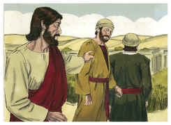
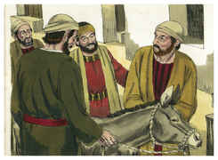
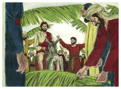
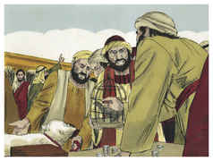
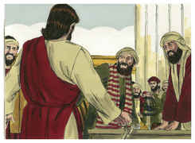
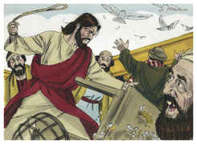
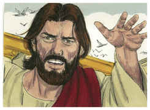

# Mateus Capítulo 21

## 1
E, QUANDO se aproximaram de Jerusalém, e chegaram a Betfagé, ao Monte das Oliveiras, enviou, então, Jesus dois discípulos, dizendo-lhes:

## 2
Ide à aldeia que está defronte de vós, e logo encontrareis uma jumenta presa, e um jumentinho com ela; desprendei-a, e trazei-mos.

## 3
E, se alguém vos disser alguma coisa, direis que o Senhor os há de mister; e logo os enviará.

## 4
Ora, tudo isto aconteceu para que se cumprisse o que foi dito pelo profeta, que diz:

## 5
Dizei à filha de Sião: Eis que o teu Rei aí te vem, Manso, e assentado sobre uma jumenta, E sobre um jumentinho, filho de animal de carga.

## 6
E, indo os discípulos, e fazendo como Jesus lhes ordenara,

## 7
Trouxeram a jumenta e o jumentinho, e sobre eles puseram as suas vestes, e fizeram-no assentar em cima.

## 8
E muitíssima gente estendia as suas vestes pelo caminho, e outros cortavam ramos de árvores, e os espalhavam pelo caminho.

## 9
E a multidão que ia adiante, e a que seguia, clamava, dizendo: Hosana ao Filho de Davi; bendito o que vem em nome do Senhor. Hosana nas alturas!

## 10
E, entrando ele em Jerusalém, toda a cidade se alvoroçou, dizendo: Quem é este?

## 11
E a multidão dizia: Este é Jesus, o profeta de Nazaré da Galiléia.

## 12
E entrou Jesus no templo de Deus, e expulsou todos os que vendiam e compravam no templo, e derribou as mesas dos cambistas e as cadeiras dos que vendiam pombas;

## 13
E disse-lhes: Está escrito: A minha casa será chamada casa de oração; mas vós a tendes convertido em covil de ladrões.

## 14
E foram ter com ele no templo cegos e coxos, e curou-os.

## 15
Vendo, então, os principais dos sacerdotes e os escribas as maravilhas que fazia, e os meninos clamando no templo: Hosana ao Filho de Davi, indignaram-se,

## 16
E disseram-lhe: Ouves o que estes dizem? E Jesus lhes disse: Sim; nunca lestes: Pela boca dos meninos e das criancinhas de peito tiraste o perfeito louvor?

## 17
E, deixando-os, saiu da cidade para Betânia, e ali passou a noite.

## 18
E, de manhã, voltando para a cidade, teve fome;

## 19
E, avistando uma figueira perto do caminho, dirigiu-se a ela, e não achou nela senão folhas. E disse-lhe: Nunca mais nasça fruto de ti! E a figueira secou imediatamente.

## 20
E os discípulos, vendo isto, maravilharam-se, dizendo: Como secou imediatamente a figueira?

## 21
Jesus, porém, respondendo, disse-lhes: Em verdade vos digo que, se tiverdes fé e não duvidardes, não só fareis o que foi feito à figueira, mas até se a este monte disserdes: Ergue-te, e precipita-te no mar, assim será feito;

## 22
E, tudo o que pedirdes em oração, crendo, o recebereis.

## 23
E, chegando ao templo, acercaram-se dele, estando já ensinando, os príncipes dos sacerdotes e os anciãos do povo, dizendo: Com que autoridade fazes isto? e quem te deu tal autoridade?

## 24
E Jesus, respondendo, disse-lhes: Eu também vos perguntarei uma coisa; se ma disserdes, também eu vos direi com que autoridade faço isto.

## 25
O batismo de João, de onde era? Do céu, ou dos homens? E pensavam entre si, dizendo: Se dissermos: Do céu, ele nos dirá: Então por que não o crestes?

## 26
E, se dissermos: Dos homens, tememos o povo, porque todos consideram João como profeta.

## 27
E, respondendo a Jesus, disseram: Não sabemos. Ele disse-lhes: Nem eu vos digo com que autoridade faço isto.

## 28
Mas, que vos parece? Um homem tinha dois filhos, e, dirigindo-se ao primeiro, disse: Filho, vai trabalhar hoje na minha vinha.

## 29
Ele, porém, respondendo, disse: Não quero. Mas depois, arrependendo-se, foi.

## 30
E, dirigindo-se ao segundo, falou-lhe de igual modo; e, respondendo ele, disse: Eu vou, senhor; e não foi.

## 31
Qual dos dois fez a vontade do pai? Disseram-lhe eles: O primeiro. Disse-lhes Jesus: Em verdade vos digo que os publicanos e as meretrizes entram adiante de vós no reino de Deus.

## 32
Porque João veio a vós no caminho da justiça, e não o crestes, mas os publicanos e as meretrizes o creram; vós, porém, vendo isto, nem depois vos arrependestes para o crer.

## 33
Ouvi, ainda, outra parábola: Houve um homem, pai de família, que plantou uma vinha, e circundou-a de um valado, e construiu nela um lagar, e edificou uma torre, e arrendou-a a uns lavradores, e ausentou-se para longe.

## 34
E, chegando o tempo dos frutos, enviou os seus servos aos lavradores, para receber os seus frutos.

## 35
E os lavradores, apoderando-se dos servos, feriram um, mataram outro, e apedrejaram outro.

## 36
Depois enviou outros servos, em maior número do que os primeiros; e eles fizeram-lhes o mesmo.

## 37
E, por último, enviou-lhes seu filho, dizendo: Terão respeito a meu filho.

## 38
Mas os lavradores, vendo o filho, disseram entre si: Este é o herdeiro; vinde, matemo-lo, e apoderemo-nos da sua herança.

## 39
E, lançando mão dele, o arrastaram para fora da vinha, e o mataram.

## 40
Quando, pois, vier o senhor da vinha, que fará àqueles lavradores?

## 41
Dizem-lhe eles: Dará afrontosa morte aos maus, e arrendará a vinha a outros lavradores, que a seu tempo lhe dêem os frutos.

## 42
Diz-lhes Jesus: Nunca lestes nas Escrituras: A pedra, que os edificadores rejeitaram, Essa foi posta por cabeça do ângulo; Pelo Senhor foi feito isto, E é maravilhoso aos nossos olhos?

## 43
Portanto, eu vos digo que o reino de Deus vos será tirado, e será dado a uma nação que dê os seus frutos.

## 44
E, quem cair sobre esta pedra, despedaçar-se-á; e aquele sobre quem ela cair ficará reduzido a pó.

## 45
E os príncipes dos sacerdotes e os fariseus, ouvindo estas palavras, entenderam que falava deles;

## 46
E, pretendendo prendê-lo, recearam o povo, porquanto o tinham por profeta.

