# Mateus Capítulo 26

## 1
E ACONTECEU que, quando Jesus concluiu todos estes discursos, disse aos seus discípulos:

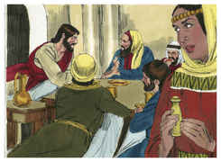

## 2
Bem sabeis que daqui a dois dias é a páscoa; e o Filho do homem será entregue para ser crucificado.

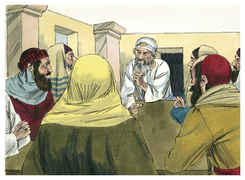

## 3
Depois os príncipes dos sacerdotes, e os escribas, e os anciãos do povo reuniram-se na sala do sumo sacerdote, o qual se chamava Caifás.

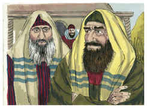

## 4
E consultaram-se mutuamente para prenderem Jesus com dolo e o matarem.

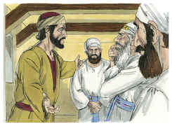

## 5
Mas diziam: Não durante a festa, para que não haja alvoroço entre o povo.

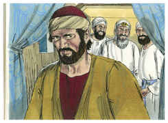

## 6
E, estando Jesus em Betânia, em casa de Simão, o leproso,

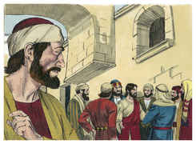

## 7
Aproximou-se dele uma mulher com um vaso de alabastro, com ungüento de grande valor, e derramou-lho sobre a cabeça, quando ele estava assentado à mesa.

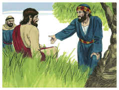

## 8
E os seus discípulos, vendo isto, indignaram-se, dizendo: Por que é este desperdício?

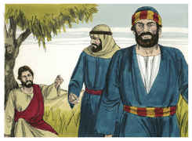

## 9
Pois este ungüento podia vender-se por grande preço, e dar-se o dinheiro aos pobres.

## 10
Jesus, porém, conhecendo isto, disse-lhes: Por que afligis esta mulher? pois praticou uma boa ação para comigo.

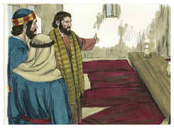

## 11
Porquanto sempre tendes convosco os pobres, mas a mim não me haveis de ter sempre.

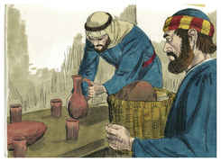

## 12
Ora, derramando ela este ungüento sobre o meu corpo, fê-lo preparando-me para o meu sepultamento.

## 13
Em verdade vos digo que, onde quer que este evangelho for pregado em todo o mundo, também será referido o que ela fez, para memória sua.

## 14
Então um dos doze, chamado Judas Iscariotes, foi ter com os príncipes dos sacerdotes,

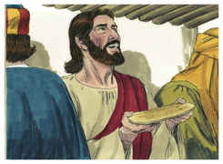

## 15
E disse: Que me quereis dar, e eu vo-lo entregarei? E eles lhe pesaram trinta moedas de prata,

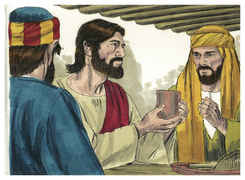

## 16
E desde então buscava oportunidade para o entregar.

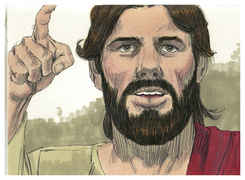

## 17
E, no primeiro dia da festa dos pães ázimos, chegaram os discípulos junto de Jesus, dizendo: Onde queres que façamos os preparativos para comeres a páscoa?

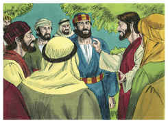

## 18
E ele disse: Ide à cidade, a um certo homem, e dizei-lhe: O Mestre diz: O meu tempo está próximo; em tua casa celebrarei a páscoa com os meus discípulos.

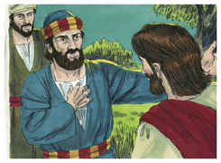

## 19
E os discípulos fizeram como Jesus lhes ordenara, e prepararam a páscoa.

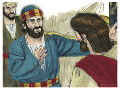

## 20
E, chegada a tarde, assentou-se à mesa com os doze.

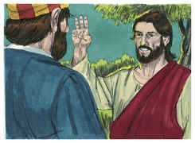

## 21
E, comendo eles, disse: Em verdade vos digo que um de vós me há de trair.

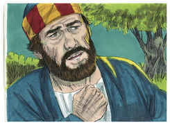

## 22
E eles, entristecendo-se muito, começaram cada um a dizer-lhe: Porventura sou eu, Senhor?

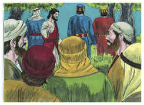

## 23
E ele, respondendo, disse: O que põe comigo a mão no prato, esse me há de trair.

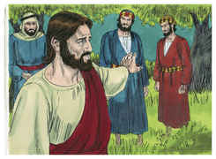

## 24
Em verdade o Filho do homem vai, como acerca dele está escrito, mas ai daquele homem por quem o Filho do homem é traído! Bom seria para esse homem se não houvera nascido.

## 25
E, respondendo Judas, o que o traía, disse: Porventura sou eu, Rabi? Ele disse: Tu o disseste.

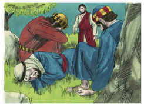

## 26
E, quando comiam, Jesus tomou o pão, e abençoando-o, o partiu, e o deu aos discípulos, e disse: Tomai, comei, isto é o meu corpo.

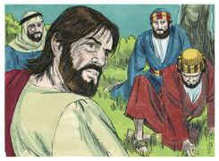

## 27
E, tomando o cálice, e dando graças, deu-lho, dizendo: Bebei dele todos;

## 28
Porque isto é o meu sangue, o sangue do novo testamento, que é derramado por muitos, para remissão dos pecados.

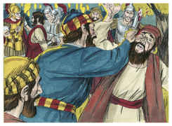

## 29
E digo-vos que, desde agora, não beberei deste fruto da vide, até aquele dia em que o beba novo convosco no reino de meu Pai.

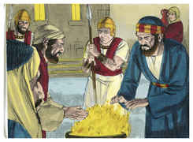

## 30
E, tendo cantado o hino, saíram para o Monte das Oliveiras.

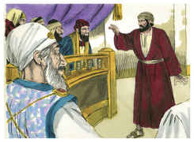

## 31
Então Jesus lhes disse: Todos vós esta noite vos escandalizareis em mim; porque está escrito: Ferirei o pastor, e as ovelhas do rebanho se dispersarão.

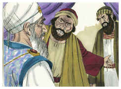

## 32
Mas, depois de eu ressuscitar, irei adiante de vós para a Galiléia.

## 33
Mas Pedro, respondendo, disse-lhe: Ainda que todos se escandalizem em ti, eu nunca me escandalizarei.

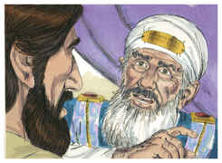

## 34
Disse-lhe Jesus: Em verdade te digo que, nesta mesma noite, antes que o galo cante, três vezes me negarás.

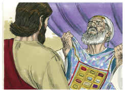

## 35
Disse-lhe Pedro: Ainda que me seja mister morrer contigo, não te negarei. E todos os discípulos disseram o mesmo.

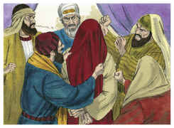

## 36
Então chegou Jesus com eles a um lugar chamado Getsêmani, e disse a seus discípulos: Assentai-vos aqui, enquanto vou além orar.

## 37
E, levando consigo Pedro e os dois filhos de Zebedeu, começou a entristecer-se e a angustiar-se muito.

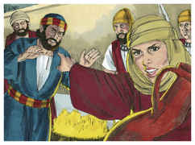

## 38
Então lhes disse: A minha alma está cheia de tristeza até a morte; ficai aqui, e velai comigo.

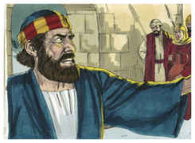

## 39
E, indo um pouco mais para diante, prostrou-se sobre o seu rosto, orando e dizendo: Meu Pai, se é possível, passe de mim este cálice; todavia, não seja como eu quero, mas como tu queres.

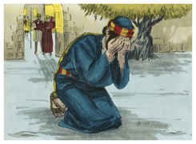

## 40
E, voltando para os seus discípulos, achou-os adormecidos; e disse a Pedro: Então nem uma hora pudeste velar comigo?

## 41
Vigiai e orai, para que não entreis em tentação; na verdade, o espírito está pronto, mas a carne é fraca.

## 42
E, indo segunda vez, orou, dizendo: Pai meu, se este cálice não pode passar de mim sem eu o beber, faça-se a tua vontade.

## 43
E, voltando, achou-os outra vez adormecidos; porque os seus olhos estavam pesados.

## 44
E, deixando-os de novo, foi orar pela terceira vez, dizendo as mesmas palavras.

## 45
Então chegou junto dos seus discípulos, e disse-lhes: Dormi agora, e repousai; eis que é chegada a hora, e o Filho do homem será entregue nas mãos dos pecadores.

## 46
Levantai-vos, partamos; eis que é chegado o que me trai.

## 47
E, estando ele ainda a falar, eis que chegou Judas, um dos doze, e com ele grande multidão com espadas e varapaus, enviada pelos príncipes dos sacerdotes e pelos anciãos do povo.

## 48
E o que o traía tinha-lhes dado um sinal, dizendo: O que eu beijar é esse; prendei-o.

## 49
E logo, aproximando-se de Jesus, disse: Eu te saúdo, Rabi; e beijou-o.

## 50
Jesus, porém, lhe disse: Amigo, a que vieste? Então, aproximando-se eles, lançaram mão de Jesus, e o prenderam.

## 51
E eis que um dos que estavam com Jesus, estendendo a mão, puxou da espada e, ferindo o servo do sumo sacerdote, cortou-lhe uma orelha.

## 52
Então Jesus disse-lhe: Embainha a tua espada; porque todos os que lançarem mão da espada, à espada morrerão.

## 53
Ou pensas tu que eu não poderia agora orar a meu Pai, e que ele não me daria mais de doze legiões de anjos?

## 54
Como, pois, se cumpririam as Escrituras, que dizem que assim convém que aconteça?

## 55
Então disse Jesus à multidão: Saístes, como para um salteador, com espadas e varapaus para me prender? Todos os dias me assentava junto de vós, ensinando no templo, e não me prendestes.

## 56
Mas tudo isto aconteceu para que se cumpram as escrituras dos profetas. Então, todos os discípulos, deixando-o, fugiram.

## 57
E os que prenderam a Jesus o conduziram à casa do sumo sacerdote Caifás, onde os escribas e os anciãos estavam reunidos.

## 58
E Pedro o seguiu de longe, até ao pátio do sumo sacerdote e, entrando, assentou-se entre os criados, para ver o fim.

## 59
Ora, os príncipes dos sacerdotes, e os anciãos, e todo o conselho, buscavam falso testemunho contra Jesus, para poderem dar-lhe a morte;

## 60
E não o achavam; apesar de se apresentarem muitas testemunhas falsas, não o achavam. Mas, por fim chegaram duas testemunhas falsas,

## 61
E disseram: Este disse: Eu posso derrubar o templo de Deus, e reedificá-lo em três dias.

## 62
E, levantando-se o sumo sacerdote, disse-lhe: Não respondes coisa alguma ao que estes depõem contra ti?

## 63
Jesus, porém, guardava silêncio. E, insistindo o sumo sacerdote, disse-lhe: Conjuro-te pelo Deus vivo que nos digas se tu és o Cristo, o Filho de Deus.

## 64
Disse-lhe Jesus: Tu o disseste; digo-vos, porém, que vereis em breve o Filho do homem assentado à direita do Poder, e vindo sobre as nuvens do céu.

## 65
Então o sumo sacerdote rasgou as suas vestes, dizendo: Blasfemou; para que precisamos ainda de testemunhas? Eis que bem ouvistes agora a sua blasfêmia.

## 66
Que vos parece? E eles, respondendo, disseram: É réu de morte.

## 67
Então cuspiram-lhe no rosto e lhe davam punhadas, e outros o esbofeteavam,

## 68
Dizendo: Profetiza-nos, Cristo, quem é o que te bateu?

## 69
Ora, Pedro estava assentado fora, no pátio; e, aproximando-se dele uma criada, disse: Tu também estavas com Jesus, o galileu.

## 70
Mas ele negou diante de todos, dizendo: Não sei o que dizes.

## 71
E, saindo para o vestíbulo, outra criada o viu, e disse aos que ali estavam: Este também estava com Jesus, o Nazareno.

## 72
E ele negou outra vez com juramento: Não conheço tal homem.

## 73
E, daí a pouco, aproximando-se os que ali estavam, disseram a Pedro: Verdadeiramente também tu és deles, pois a tua fala te denuncia.

## 74
Então começou ele a praguejar e a jurar, dizendo: Não conheço esse homem. E imediatamente o galo cantou.

## 75
E lembrou-se Pedro das palavras de Jesus, que lhe dissera: Antes que o galo cante, três vezes me negarás. E, saindo dali, chorou amargamente.

