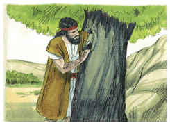

# Mateus Capítulo 3

## 1
E, NAQUELES dias, apareceu João o Batista pregando no deserto da Judéia,

## 2
E dizendo: Arrependei-vos, porque é chegado o reino dos céus.

## 3
Porque este é o anunciado pelo profeta Isaías, que disse: Voz do que clama no deserto: Preparai o caminho do Senhor, Endireitai as suas veredas.

## 4
E este João tinha as suas vestes de pelos de camelo, e um cinto de couro em torno de seus lombos; e alimentava-se de gafanhotos e de mel silvestre.

## 5
Então ia ter com ele Jerusalém, e toda a Judéia, e toda a província adjacente ao Jordão;

## 6
E eram por ele batizados no rio Jordão, confessando os seus pecados.

## 7
E, vendo ele muitos dos fariseus e dos saduceus, que vinham ao seu batismo, dizia-lhes: Raça de víboras, quem vos ensinou a fugir da ira futura?

## 8
Produzi, pois, frutos dignos de arrependimento;

## 9
E não presumais, de vós mesmos, dizendo: Temos por pai a Abraão; porque eu vos digo que, mesmo destas pedras, Deus pode suscitar filhos a Abraão.

## 10
E também agora está posto o machado à raiz das árvores; toda a árvore, pois, que não produz bom fruto, é cortada e lançada no fogo.

## 11
E eu, em verdade, vos batizo com água, para o arrependimento; mas aquele que vem após mim é mais poderoso do que eu; cujas alparcas não sou digno de levar; ele vos batizará com o Espírito Santo, e com fogo.

## 12
Em sua mão tem a pá, e limpará a sua eira, e recolherá no celeiro o seu trigo, e queimará a palha com fogo que nunca se apagará.

## 13
Então veio Jesus da Galiléia ter com João, junto do Jordão, para ser batizado por ele.

## 14
Mas João opunha-se-lhe, dizendo: Eu careço de ser batizado por ti, e vens tu a mim?

## 15
Jesus, porém, respondendo, disse-lhe: Deixa por agora, porque assim nos convém cumprir toda a justiça. Então ele o permitiu.

## 16
E, sendo Jesus batizado, saiu logo da água, e eis que se lhe abriram os céus, e viu o Espírito de Deus descendo como pomba e vindo sobre ele.

## 17
E eis que uma voz dos céus dizia: Este é o meu Filho amado, em quem me comprazo.

