# Mateus Capítulo 8

## 1
E, DESCENDO ele do monte, seguiu-o uma grande multidão.

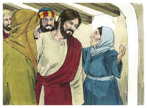

## 2
E, eis que veio um leproso, e o adorou, dizendo: Senhor, se quiseres, podes tornar-me limpo.

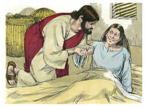

## 3
E Jesus, estendendo a mão, tocou-o, dizendo: Quero; sê limpo. E logo ficou purificado da lepra.

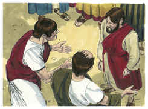

## 4
Disse-lhe então Jesus: Olha, não o digas a alguém, mas vai, mostra-te ao sacerdote, e apresenta a oferta que Moisés determinou, para lhes servir de testemunho.

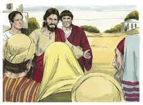

## 5
E, entrando Jesus em Cafarnaum, chegou junto dele um centurião, rogando-lhe,

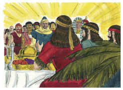

## 6
E dizendo: Senhor, o meu criado jaz em casa, paralítico, e violentamente atormentado.

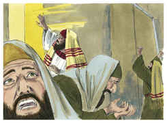

## 7
E Jesus lhe disse: Eu irei, e lhe darei saúde.

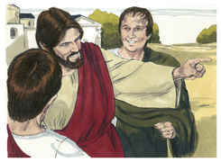

## 8
E o centurião, respondendo, disse: Senhor, não sou digno de que entres debaixo do meu telhado, mas dize somente uma palavra, e o meu criado há de sarar.

## 9
Pois também eu sou homem sob autoridade, e tenho soldados às minhas ordens; e digo a este: Vai, e ele vai; e a outro: Vem, e ele vem; e ao meu criado: Faze isto, e ele o faz.

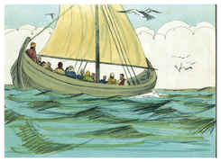

## 10
E maravilhou-se Jesus, ouvindo isto, e disse aos que o seguiam: Em verdade vos digo que nem mesmo em Israel encontrei tanta fé.

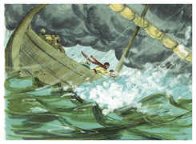

## 11
Mas eu vos digo que muitos virão do oriente e do ocidente, e assentar-se-ão à mesa com Abraão, e Isaque, e Jacó, no reino dos céus;

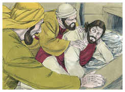

## 12
E os filhos do reino serão lançados nas trevas exteriores; ali haverá pranto e ranger de dentes.

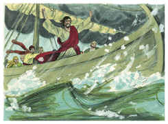

## 13
Então disse Jesus ao centurião: Vai, e como creste te seja feito. E naquela mesma hora o seu criado sarou.

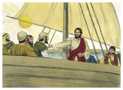

## 14
E Jesus, entrando em casa de Pedro, viu a sogra deste acamada, e com febre.

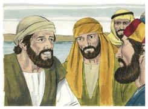

## 15
E tocou-lhe na mão, e a febre a deixou; e levantou-se, e serviu-os.

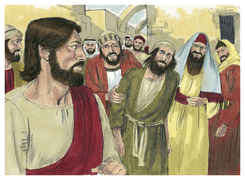

## 16
E, chegada a tarde, trouxeram-lhe muitos endemoninhados, e ele com a sua palavra expulsou deles os espíritos, e curou todos os que estavam enfermos;

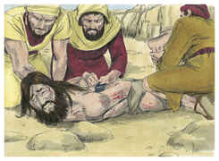

## 17
Para que se cumprisse o que fora dito pelo profeta Isaías, que diz: Ele tomou sobre si as nossas enfermidades, e levou as nossas doenças.

## 18
E Jesus, vendo em torno de si uma grande multidão, ordenou que passassem para o outro lado;

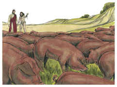

## 19
E, aproximando-se dele um escriba, disse-lhe: Mestre, aonde quer que fores, eu te seguirei.

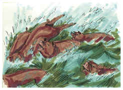

## 20
E disse Jesus: As raposas têm covis, e as aves do céu têm ninhos, mas o Filho do homem não tem onde reclinar a cabeça.

## 21
E outro de seus discípulos lhe disse: Senhor, permite-me que primeiramente vá sepultar meu pai.

## 22
Jesus, porém, disse-lhe: Segue-me, e deixa os mortos sepultar os seus mortos.

## 23
E, entrando ele no barco, seus discípulos o seguiram;

## 24
E eis que no mar se levantou uma tempestade, tão grande que o barco era coberto pelas ondas; ele, porém, estava dormindo.

## 25
E os seus discípulos, aproximando-se, o despertaram, dizendo: Senhor, salva-nos! que perecemos.

## 26
E ele disse-lhes: Por que temeis, homens de pouca fé? Então, levantando-se, repreendeu os ventos e o mar, e seguiu-se uma grande bonança.

## 27
E aqueles homens se maravilharam, dizendo: Que homem é este, que até os ventos e o mar lhe obedecem?

## 28
E, tendo chegado ao outro lado, à província dos gergesenos, saíram-lhe ao encontro dois endemoninhados, vindos dos sepulcros; tão ferozes eram que ninguém podia passar por aquele caminho.

## 29
E eis que clamaram, dizendo: Que temos nós contigo, Jesus, Filho de Deus? Vieste aqui atormentar-nos antes do tempo?

## 30
E andava pastando distante deles uma manada de muitos porcos.

## 31
E os demônios rogaram-lhe, dizendo: Se nos expulsas, permite-nos que entremos naquela manada de porcos.

## 32
E ele lhes disse: Ide. E, saindo eles, se introduziram na manada dos porcos; e eis que toda aquela manada de porcos se precipitou no mar por um despenhadeiro, e morreram nas águas.

## 33
Os porqueiros fugiram e, chegando à cidade, divulgaram tudo o que acontecera aos endemoninhados.

## 34
E eis que toda aquela cidade saiu ao encontro de Jesus e, vendo-o, rogaram-lhe que se retirasse dos seus termos.

