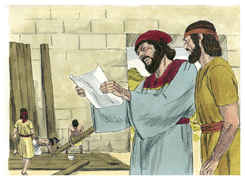
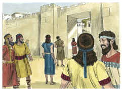

# Neemias Capítulo 6

## 1
SUCEDEU que, ouvindo Sambalate, Tobias, Gesém, o árabe, e o resto dos nossos inimigos, que eu tinha edificado o muro, e que nele já não havia brecha alguma, ainda que até este tempo não tinha posto as portas nos portais,

## 2
Sambalate e Gesém mandaram dizer-me: Vem, e congreguemo-nos juntamente nas aldeias, no vale de Ono. Porém intentavam fazer-me mal.

## 3
E enviei-lhes mensageiros a dizer: Faço uma grande obra, de modo que não poderei descer; por que cessaria esta obra, enquanto eu a deixasse, e fosse ter convosco?

## 4
E do mesmo modo enviaram a mim quatro vezes; e da mesma forma lhes respondi.

## 5
Então Sambalate ainda pela quinta vez me enviou seu servo com uma carta aberta na sua mão;

## 6
E na qual estava escrito: Entre os gentios se ouviu, e Gasmu diz: Tu e os judeus intentais rebelar-vos, então edificas o muro; e tu te farás rei deles segundo estas palavras;

## 7
E que puseste profetas, para pregarem de ti em Jerusalém, dizendo: Este é rei em Judá; de modo que o rei o ouvirá, segundo estas palavras; vem, pois, agora, e consultemos juntamente.

## 8
Porém eu mandei dizer-lhe: De tudo o que dizes coisa nenhuma sucedeu; mas tu, do teu coração, o inventas.

## 9
Porque todos eles procuravam atemorizar-nos, dizendo: As suas mãos largarão a obra, e não se efetuará. Agora, pois, ó Deus, fortalece as minhas mãos.

## 10
E, entrando eu em casa de Semaías, filho de Delaías, o filho de Meetabel (que estava encerrado), disse ele: Vamos juntamente à casa de Deus, ao meio do templo, e fechemos as portas do templo; porque virão matar-te; sim, de noite virão matar-te.

## 11
Porém eu disse: Um homem como eu fugiria? E quem há, como eu, que entre no templo para que viva? De maneira nenhuma entrarei.

## 12
E percebi que não era Deus quem o enviara; mas esta profecia falou contra mim, porquanto Tobias e Sambalate o subornaram.

## 13
Para isto o subornaram, para me atemorizar, e para que assim fizesse, e pecasse, para que tivessem alguma causa para me infamarem, e assim me vituperarem.

## 14
Lembra-te, meu Deus, de Tobias e de Sambalate, conforme a estas suas obras, e também da profetisa Noadia, e dos mais profetas que procuraram atemorizar-me.

## 15
Acabou-se, pois, o muro aos vinte e cinco do mês de Elul; em cinqüenta e dois dias.

## 16
E sucedeu que, ouvindo-o todos os nossos inimigos, todos os povos que havia em redor de nós temeram, e abateram-se muito a seus próprios olhos; porque reconheceram que o nosso Deus fizera esta obra.

## 17
Também naqueles dias alguns nobres de Judá escreveram muitas cartas que iam para Tobias; e as cartas de Tobias vinham para eles.

## 18
Porque muitos em Judá lhe eram ajuramentados, porque era genro de Secanias filho de Ará; e seu filho Joanã se casara com a filha de Mesulão, filho de Berequias.

## 19
Também as suas boas ações contavam perante mim, e as minhas palavras transmitiam a ele; portanto Tobias escrevia cartas para me atemorizar.

