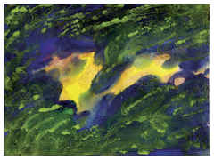

# BibleMarkdown
Bíblia em formato Markdown com imagens de SweetPublishing.

Esta versão da Bíblia foi criada a partir de uma versão baixada do projeto The Sword da CrossBible Society. Utilizamos a versão João Ferreira de Almeida Corrigida Fiel de 2007, a versão considerada por muitos como a mais fiel na língua portuguesa.

Faça o Download da versão completa na seção Releases, navegue pela bíblia completa diretamente pelo diretório [acf2007-sweet](acf2007-sweet) deste repositório, ou, melhor, faça o Download deste repositório com a versão mais atual. Olhe o exemplo do Livro de Gênesis no diretório Gn deste repositório.

## Motivação
- Após incansáveis pesquisas, esse é o único formato digital realmente livre de uma Bíblia que permita anotações.
- Uma única Bíblia que você pode ler, fazer anotações, inserir figuras, etc, em QUALQUER dispositivo, iPhone, iPad, Android, Mac, BSD, Linux, etc... basta ter um editor de textos!
- Sincronize com todos seus dispositivos em tempo real, sem complicações, usando a nuvem que preferir.
- Use a bíblia mais FIEL ao texto original em português (Almeida Corrigida Fiel), mas se quiser usar outra, basta executar o script criar_biblia, com o arquivo de entrada adequado e algumas pequenas modificações vc pode ter qualquer Bíblia nesse formato.
- Se quiser pode retirar todas as imagens, ou ainda, adicionar outras facilmente, basta um simples script bash ou na linguagem que preferir.

## Como criar sua própria Bíblia em Markdown
Os arquivos de suporte estão no diretório "original".
- Use o software Simple Bible Reader, que é um conversor. Abra um formato qualquer (MySword, e-Sword, etc).
- Converta para o formato que tenha um versículo por linha e nr de capítulo e versículo separados por tabulação (se não me engano é unnamed USV, algo assim)
- coloque o arquivo no mesmo diretório do script cria biblia.
- As Imagens podem ser baixadas de SweetPublishing, depois coloque em um Diretório chamado Imagens.
- Execute o script e crie sua bíblia markdown com imagens.

## Atenção
- Fique atento com bíblias em formato texto, pdf, etc, sem procedência, podem estar alteradas, incompletas, etc.

## Exemplo

### Gênesis Capítulo 1

1   No princípio criou Deus os céus e a terra.

> **Criou Deus.** O verbo “criar” vem do hebraico ‘bara, que na forma aqui usada descreve uma atividade de Deus, nunca do ser humano. … As primeiríssimas palavras da Bíblia apontam para o fato de que a criação traz a marca da atividade do próprio Deus.

> Minhas anotações sobre o versículo

> Posso colocar versiculos relacionados como links [Gn 2:3](acf2007-sweet/Gn/2.md#3)

2   E a terra era sem forma e vazia; e havia trevas sobre a face do abismo; e o Espírito de Deus se movia sobre a face das águas.

3   E disse Deus: Haja luz; e houve luz.

4   E viu Deus que era boa a luz; e fez Deus separação entre a luz e as trevas.

5   E Deus chamou à luz Dia; e às trevas chamou Noite. E foi a tarde e a manhã, o dia primeiro.
