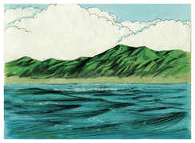

# BibleMarkdown
Bíblia em formato Markdown com imagens de SweetPublishing.

Esta versão da Bíblia foi criada a partir de uma versão baixada do projeto The Sword da CrossBible Society. Utilizamos a versão João Ferreira de Almeida Corrigida Fiel de 2007, a versão considerada por muitos como a mais fiel na língua portuguesa.

Faça o Download da versão completa na seção Releases e extraia em seu computador ou celular. É importante ter um leitor de arquivos .md para ter uma melhor experiência, mas caso não tenha, use o editor de textos simples mesmo. Você pode navegar pela bíblia completa online no diretório [versão online](versoes_online) deste repositório.

## Motivação
- Após incansáveis pesquisas, esse é o único formato digital realmente livre de uma Bíblia que permita anotações.
- Uma única Bíblia que você pode ler, fazer anotações, inserir figuras, etc, em QUALQUER dispositivo, iPhone, iPad, Android, Mac, BSD, Linux, etc... basta ter um editor de textos!
- Sincronize com todos seus dispositivos em tempo real, sem complicações, usando a nuvem que preferir.
- Use a bíblia mais FIEL ao texto original em português (Almeida Corrigida Fiel), mas se quiser usar outra, basta executar o script criar_biblia, com o arquivo de entrada adequado e algumas pequenas modificações vc pode ter qualquer Bíblia nesse formato.
- Se quiser pode retirar todas as imagens, ou ainda, adicionar outras facilmente, basta um simples script bash ou na linguagem que preferir.

## Como criar sua própria Bíblia em Markdown
Os arquivos de suporte estão no diretório "original".
- Use o conversor Simple Bible Reader (selecione o idioma espanhol),para windows. Abra um formato qualquer (MySword, e-Sword, etc). Ou abra os arquivos do mysword em um app para abrir arquivos sqlite e extraia a bíblia.
- Converta para o formato que tenha um versículo por linha e nr de capítulo e versículo separados por tabulação (The Unbound bible - Unnamed BCSV)
- Se for converter um comentário, use o formato de exportação 
- coloque o arquivo no mesmo diretório do script cria biblia.
- As Imagens podem ser baixadas de SweetPublishing, depois coloque em um Diretório chamado Imagens.
- Execute o script e crie sua bíblia markdown com imagens.

## Aplicativos recomendados
- Linux - [Formiko](https://github.com/ondratu/formiko) ou [Abricotine](http://abricotine.brrd.fr/)-> tenho uma versão para x86_64 do formiko em formato AppImage disponível caso não consiga instalar via python ou apt.
- Android - [Markor](https://play.google.com/store/apps/details?id=net.gsantner.markor&hl=en_US)
- iPhone iPad iOS - [Blockquote](https://apps.apple.com/us/app/blockquote-markdown-editor/id1396620426) -> atualmente nenhum app de iOS permite visualizar as imagens. Isso ocorreu após o lançamento do iOS 13.
- Windows - [Abricotine](http://abricotine.brrd.fr/)
- Mac - [Abricotine](http://abricotine.brrd.fr/) ou [MacDown](https://macdown.uranusjr.com/)

## Atenção
- Fique atento com bíblias em formatos digitais (oriundas de aplicativos ou por download) e sem procedência  (como essa), podem estar alteradas, incompletas, etc.

## Gênesis Capítulo 1

**1**   No princípio criou Deus os céus e a terra.
> **Comentários NVI**: O verbo “criar” vem do hebraico ‘bara, que na forma aqui usada descreve uma atividade de Deus, nunca do ser humano. … As primeiríssimas palavras da Bíblia apontam para o fato de que a criação traz a marca da atividade do próprio Deus.

**2**   E a terra era sem forma e vazia; e havia trevas sobre a face do abismo; e o Espírito de Deus se movia sobre a face das águas.

**3**   E disse Deus: Haja luz; e houve luz.
> **Comentário do Usuário**: meus comentários pessoais
> Posso colocar versiculos relacionados como links [Gn 2:3](acf2007-sweet/Gn/2.md#3)

**4**   E viu Deus que era boa a luz; e fez Deus separação entre a luz e as trevas.

**5**   E Deus chamou à luz Dia; e às trevas chamou Noite. E foi a tarde e a manhã, o dia primeiro.
