# Gênesis Cap 01

**1** 	No princípio criou Deus os céus e a terra.

> **Cmt MHenry**: *Versículos 1-2* O primeiro versículo da Bíblia nos dá um relato satisfatório e útil da origem da terra e dos céus. A fé do cristão simples entende isto melhor que a fantasia dos homens mais cultos. Do que vemos do céu e da terra, aprendemos o poder do grande Criador. Que o fato de sermos criados como homens, nos lembre nosso dever cristão de manter sempre o olhar no céu e a terra sob nossos pés. O Filho de Deus, um com o Pai, estava com Ele quando este fez o mundo; melhor falando, amiúde se nos diz que o mundo foi feito por Ele e que sem Ele nada foi feito. Oh, que elevados pensamentos deveria haver em nossa mente para o grande Deus que adoramos, e para o grande Mediador em cujo nome oramos! Aqui, no princípio mesmo do texto sagrado, lemos desse mesmo Espírito Divino cuja obra no coração do homem se menciona tão freqüentemente em outras partes da Bíblia. Observe que, no princípio, nada desejável havia para ver, pois o mundo era informe e vazio; era confusão e desolação. De forma similar, a obra da graça na alma é uma nova criação: e numa alma sem graça, que não tem nascido de novo, há desordem, confusão e toda má obra; está vazia de todo bem porque está sem Deus; é escura, é as próprias trevas: este é o nosso estado por natureza, até que a graça do Todo Poderoso efetua em nós uma mudança.

> **Cmt MHenry**: *CAPÍTULO 10A-2Sm 11A-1Rs 12A-2Rs 13A-1Cr 14A-2Cr 15A-Es 16A-Ne 17A-Et 18A-Jo 19A-Sl

**2** 	E a terra era sem forma e vazia; e havia trevas sobre a face do abismo; e o Espírito de Deus se movia sobre a face das águas.

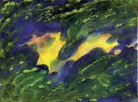 

**3** 	E disse Deus: Haja luz; e houve luz.

> **Cmt MHenry**: *Versículos 3-5* Disse Deus: Seja a luz. Ele a quis, e imediatamente houve luz. Que poder o da palavra de Deus! na nova criação, o primeiro que é levado à alma é a luz: o bendito Espírito opera na vontade e nos afetos, iluminando o entendimento. Os que pelo pecado eram trevas, por graça se convertem em luz no Senhor. As trevas teriam estado sempre sobre o homem caído se o Filho de Deus não tiver vindo para dar-nos entendimento ([1 João 5.20](../62N-1Jo/05.md#20)). A luz que Deus quis, foi aprovada. Deus separou a luz das trevas, pois, que comunhão tem a luz com as trevas? Nos céus há perfeita luz e não há trevas; no inferno, a escuridão é absoluta e não existe um raio de luz. O dia e a noite são do Senhor; usemos ambos para sua honra: cada dia no trabalho para Ele e descansando nEle cada noite. Meditando dia e noite em sua lei.

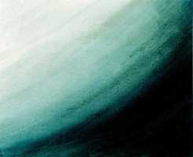 

**4** 	E viu Deus que era boa a luz; e fez Deus separação entre a luz e as trevas.

**5** 	E Deus chamou à luz Dia; e às trevas chamou Noite. E foi a tarde e a manhã, o dia primeiro.

**6** 	E disse Deus: Haja uma expansão no meio das águas, e haja separação entre águas e águas.

> **Cmt MHenry**: *Versículos 6-13* A terra estava desolada, mas por uma palavra se encheu das riquezas de Deus, que ainda são suas. Embora se permite ao homem seu uso, são de Deus e para seu serviço e honra devem usar-se. A terra, a seu mandado, produz ervas, grãos e frutos. Deus deve ter a glória de todo o proveito que recebemos do produto da terra. Se tivermos interesse nEle, que é a Fonte, pela graça, nos regozijaríamos nEle quando secam os riachos temporais da misericórdia.

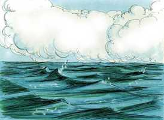 

**7** 	E fez Deus a expansão, e fez separação entre as águas que estavam debaixo da expansão e as águas que estavam sobre a expansão; e assim foi.

**8** 	E chamou Deus à expansão Céus, e foi a tarde e a manhã, o dia segundo.

**9** 	E disse Deus: Ajuntem-se as águas debaixo dos céus num lugar; e apareça a porção seca; e assim foi.

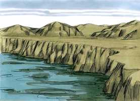 

**10** 	E chamou Deus à porção seca Terra; e ao ajuntamento das águas chamou Mares; e viu Deus que era bom.

**11** 	E disse Deus: Produza a terra erva verde, erva que dê semente, árvore frutífera que dê fruto segundo a sua espécie, cuja semente está nela sobre a terra; e assim foi.

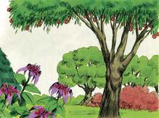 

**12** 	E a terra produziu erva, erva dando semente conforme a sua espécie, e a árvore frutífera, cuja semente está nela conforme a sua espécie; e viu Deus que era bom.

**13** 	E foi a tarde e a manhã, o dia terceiro.

**14** 	E disse Deus: Haja luminares na expansão dos céus, para haver separação entre o dia e a noite; e sejam eles para sinais e para tempos determinados e para dias e anos.

> **Cmt MHenry**: *Versículos 14-19* O quarto dia do trabalho dá conta da criação do sol, a lua e as estrelas. Todo é obra de Deus. Fala-se das estrelas tal como aparecem ante os nossos olhos, sem dizer sua quantidade, natureza, lugar, tamanho ou movimentos; as Escrituras não foram feitas para satisfazer a curiosidade nem para fazer-nos astrônomos, senão para conduzir-nos a Deus e fazer-nos santos. As luzes do céu foram feitas para servi-lo a l.; o fazem fielmente e brilham a seu tempo sem faltar. Nós estamos como luzes neste mundo para servirmos a Deus; porém, respondemos de forma similar à finalidade para a qual fomos criados? Não, nossa luz não resplandece ante Deus como suas luzes brilham ante nós. Fazemos uso da criação de nosso Amo, todavia, nos importa muito pouco da obra de nosso Amo.

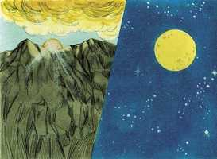 

**15** 	E sejam para luminares na expansão dos céus, para iluminar a terra; e assim foi.

**16** 	E fez Deus os dois grandes luminares: o luminar maior para governar o dia, e o luminar menor para governar a noite; e fez as estrelas.

**17** 	E Deus os pôs na expansão dos céus para iluminar a terra,

**18** 	E para governar o dia e a noite, e para fazer separação entre a luz e as trevas; e viu Deus que era bom.

**19** 	E foi a tarde e a manhã, o dia quarto.

**20** 	E disse Deus: Produzam as águas abundantemente répteis de alma vivente; e voem as aves sobre a face da expansão dos céus.

> **Cmt MHenry**: *Versículos 20-25* Deus mandou que se fizessem os peixes e as aves. Ele mesmo executou esta ordem. Os insetos, que são mais numerosos que as aves e as bestas, e tão curiosos, parecem ter sido parte da obra deste dia. A sabedoria e o poder do Criador são admiráveis tanto numa formiga como num elefante. O poder da providência de Deus preserva todas as coisas e a fertilidade é o efeito de sua bênção.

**21** 	E Deus criou as grandes baleias, e todo o réptil de alma vivente que as águas abundantemente produziram conforme as suas espécies; e toda a ave de asas conforme a sua espécie; e viu Deus que era bom.

**22** 	E Deus os abençoou, dizendo: Frutificai e multiplicai-vos, e enchei as águas nos mares; e as aves se multipliquem na terra.

**23** 	E foi a tarde e a manhã, o dia quinto.

**24** 	E disse Deus: Produza a terra alma vivente conforme a sua espécie; gado, e répteis e feras da terra conforme a sua espécie; e assim foi.

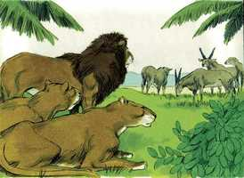 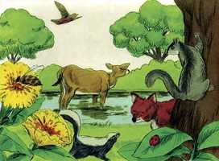 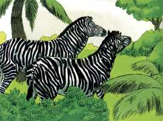 

**25** 	E fez Deus as feras da terra conforme a sua espécie, e o gado conforme a sua espécie, e todo o réptil da terra conforme a sua espécie; e viu Deus que era bom.

**26** 	E disse Deus: Façamos o homem à nossa imagem, conforme a nossa semelhança; e domine sobre os peixes do mar, e sobre as aves dos céus, e sobre o gado, e sobre toda a terra, e sobre todo o réptil que se move sobre a terra.

> **Cmt MHenry**: *Versículos 26-28* O homem foi feito depois de todas as criaturas: isto era tanto uma honra como um favor para ele. contudo, o homem foi feito o mesmo dia que as bestas; seu corpo foi feito da mesma terra que o delas; e enquanto ele estiver no corpo, habita na mesma terra com elas. Não permita Deus que, dando-lhe o gosto ao corpo e a seus desejos, nos façamos como as bestas que perecem! O homem foi feito para ser uma criatura diferente de todas as que tinham sido feitas até então. Nele deviam unir-se a carne e o espírito, o céu e a terra. Deus disse: "Façamos o homem". O homem, quando foi feito, foi criado para glorificar o Pai, o Filho e o Espírito Santo. Nesse grande homem somos batizados, pois a este grande homem devemos o ser. É a alma do homem a que leva especialmente à imagem de Deus. O homem foi feito reto ([Ec 7.29](../21A-Ec/07.md#29)). Seu entendimento via clara e verdadeiramente as coisas divinas; não havia erros nem equívocos em seu conhecimento; sua vontade consentia de imediato com a vontade de Deus em todas as coisas; seus afetos eram normais e não tinha maus desejos nem paixões desordenadas. Seus pensamentos eram facilmente levados a temas sublimes e permaneciam fixos neles. Assim de santos, assim de felizes, eram os nossos primeiros pais quando tinham a imagem de Deus neles. Porém, quão desfigurada está a imagem de Deus no homem! Queira o senhor renová-la em nossa alma por sua graça!

 

**27** 	E criou Deus o homem à sua imagem; à imagem de Deus o criou; homem e mulher os criou.

**28** 	E Deus os abençoou, e Deus lhes disse: Frutificai e multiplicai-vos, e enchei a terra, e sujeitai-a; e dominai sobre os peixes do mar e sobre as aves dos céus, e sobre todo o animal que se move sobre a terra.

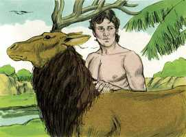  

**29** 	E disse Deus: Eis que vos tenho dado toda a erva que dê semente, que está sobre a face de toda a terra; e toda a árvore, em que há fruto que dê semente, ser-vos-á para mantimento.

> **Cmt MHenry**: *Versículos 29-30* As ervas e as frutas devem ser a comida do homem, incluindo o grão e todos os produtos da terra. Que o povo de Deus coloque sobre Ele sua carga e não se afane por que comerão nem que beberão. O que alimenta as aves do céu não permitirá que seus filhinhos passem fome.

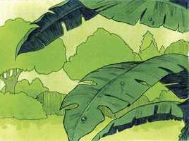 

**30** 	E a todo o animal da terra, e a toda a ave dos céus, e a todo o réptil da terra, em que há alma vivente, toda a erva verde será para mantimento; e assim foi.

**31** 	E viu Deus tudo quanto tinha feito, e eis que era muito bom; e foi a tarde e a manhã, o dia sexto.

> **Cmt MHenry**: *Versículo 31A-Ob Quando começamos a pensar em nossas obras achamos, para vergonha nossa, que em grande parte têm sido muito más; todavia, quando Deus viu sua obra, tudo era muito bom. Bom, pois tudo era cabalmente como o Criador queria que fosse. Todas suas obras, em todos os lugares de seu senhorio, o abençoam, e portanto, bendize, alma minha, ao Senhor. abençoemos a Deus pelo evangelho de Cristo e, ao considerar sua onipotente, fujamos nós, os pecadores, da ira vindoura. Se formos criados de novo conforme à imagem de Deus em santidade, finalmente entraremos nos "novos céus e nova terra, nos quais mora a justiça". "

> **Cmt MHenry** Intro: *• Versículos 1-2*> *Deus cria os céus e a terra*> *• Versículos 3-5*> *A criação da luz*> *• Versículos 6-13*> *Deus separa a terra das águas – Faz frutífera a terra*> *• Versículos 14-19*> *Deus forma o sol, a lua e as estrelas*> *• Versículos 20-25*> *Deus cria os animais*> *• Versículos 26-28*> *O homem, criado a imagem de Deus*> *• Versículos 29-30*> *Designação dos alimentos*> *• Versículos 31A-Ob> *Finalização e aprovação da obra da criação*