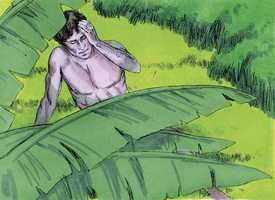
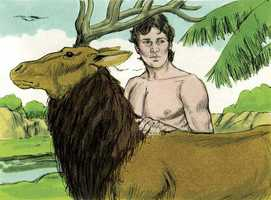

# Gênesis Cap 02

**1** 	ASSIM os céus, a terra e todo o seu exército foram acabados.

> **Cmt MHenry**: *Versículos 1-3* Depois de seis dias Deus cessou todas as obras de criação. Nos milagres tem utilizado leis superiores da natureza, mas nunca foi mudado seu curso estabelecido, nem lhe foi agregado. Deus não descansou como se estiver cansado, senão como alguém que está muito comprazido. Note-se o começo mesmo do reino de graça, a santificação ou a observância sagrada do dia de repouso. A observância solene de um dia a cada sete como dia sagrado de descanso e de santo trabalho, para a honra de Deus, é dever de toda pessoa a quem Deus tem dado a conhecer seus santos dias de repouso. Neste momento, ninguém da raça humana tinha ser, senão os nossos primeiros pais. Para eles foi instituído o dia de repouso e, é claro, também para todas as gerações sucessivas. O repouso cristão que observamos é um dia sétimo e nele celebramos o repouso de Deus Filho e a consumação da obra de nossa redenção.

**2** 	E havendo Deus acabado no dia sétimo a obra que fizera, descansou no sétimo dia de toda a sua obra, que tinha feito.

> **Cmt MHenry**: *CAPÍTULO 20A-Pv 21A-Ec 22A-Ct 23A-Is 24A-Jr 25A-Lm 26A-Ez 27A-Dn 28A-Os 29A-Jl

**3** 	E abençoou Deus o dia sétimo, e o santificou; porque nele descansou de toda a sua obra que Deus criara e fizera.

**4** 	Estas são as origens dos céus e da terra, quando foram criados; no dia em que o Senhor Deus fez a terra e os céus,

> **Cmt MHenry**: *Versículos 4-7* Aqui se dá um nome ao Criador: "Jeová". Jeová é o nome de Deus que denota que somente Ele tem seu ser de si mesmo, e que Ele dá o ser a todas as criaturas e coisas. Também se destacam as plantas e as ervas porque foram feitas e indicadas como alimento para o homem. A terra não produziu seus frutos pelo seu próprio poder: isto foi feito pelo poder do Onipotente. Da mesma forma, a graça da alma não cresce por si mesma no terreno da natureza; é a obra de Deus. a chuva é também dádiva de Deus; não choveu senão até que Deus fez chover. Embora Deus opera usando médios, quando se agrada pode, não obstante, fazer sua obra sem médios; e embora nós não devemos tentar a Deus descuidando os médios, devemos confiar nEle tanto no uso como na falta de médios. De uma ou de outra forma, Deus regará as plantas de seu jardim. A graça divina desce como o orvalho e silenciosamente rega a igreja, sem fazer barulho. O homem foi feito do pó miúdo, como o que existe na superfície da terra. A alma não foi feita da terra como o corpo: pena então que deva agregar-se à terra e preocupar-se pelas coisas terrenas. Em breve daremos conta a Deus pela forma em que temos empregado estas almas; e se achar que as temos perdido, ainda que tenha sido para ganhar o mundo, estamos perdidos para sempre! Os néscios desprezam suas próprias almas ao preocupar-se de seus corpos antes que de suas almas.

**5** 	E toda a planta do campo que ainda não estava na terra, e toda a erva do campo que ainda não brotava; porque ainda o Senhor Deus não tinha feito chover sobre a terra, e não havia homem para lavrar a terra.

**6** 	Um vapor, porém, subia da terra, e regava toda a face da terra.

**7** 	E formou o Senhor Deus o homem do pó da terra, e soprou em suas narinas o fôlego da vida; e o homem foi feito alma vivente.

 

**8** 	E plantou o Senhor Deus um jardim no Éden, do lado oriental; e pôs ali o homem que tinha formado.

> **Cmt MHenry**: *Versículos 8-14* O lugar fixado para que Adão habitasse não era um palácio, senão um jardim. Quanto melhor nos viremos com coisas simples e menos procuremos as coisas que comprazem o orgulho e a luxúria, mais perto estaremos da inocência. A natureza se contenta com um *pouco* e aquilo que for mais natural; a graça, com *menos*; porém a luxúria o deseja *todo* e não se contenta com *nada*. Nenhum prazer pode satisfazer a alma senão aquilo que Deus mesmo tem provido e indicado para isso. Éden significa deleite e prazer. Não importa qual tenha sido sua localização, tinha todas as comodidades desejáveis, sem nenhuma desvantagem, como nunca jamais existiu nenhuma outra casa ou jardim na terra. Estava ornado com toda árvore agradável à vista e enriquecido com toda árvore que der fruto agradável ao paladar e bom para comer. Como Pai doce, Deus desejava não só o proveito de Adão, senão seu prazer; porque há prazer com inocência, melhor ainda, há verdadeiro prazer somente na inocência. Quando a Providência nos coloca num lugar de abundância e prazer, deveríamos servir a Deus com alegria de coração pelas coisas boas que nos dá. Éden tinha duas árvores exclusivas. 1) *No meio do jardim estava a árvore da vida*. O homem podia comer desta e viver. Cristo é agora a Árvore da vida para nós ([Ap 2.7](../66N-Ap/02.md#7); [22.2](../66N-Ap/22.md#2)) e o Pão de vida ([Jo 6. 48](../43N-Joa/06.md#48),[51](../43N-Joa/06.md#51)). 2) *Estava a árvore do conhecimento do bem e do mal*, assim chamada porque havia uma revelação positiva da vontade de Deus acerca desta árvore, de modo que por ele o homem poderia chegar a conhecer o bem e o mal moral. Que é bom? Bom é não comer desta árvore. Que é mau? Mau é comer desta árvore. Nestas duas árvores Deus colocou diante de Adão o bem e o mal, a bênção e a maldição.

 

**9** 	E o Senhor Deus fez brotar da terra toda a árvore agradável à vista, e boa para comida; e a árvore da vida no meio do jardim, e a árvore do conhecimento do bem e do mal.

 

**10** 	E saía um rio do Éden para regar o jardim; e dali se dividia e se tornava em quatro braços.

**11** 	O nome do primeiro é Pisom; este é o que rodeia toda a terra de Havilá, onde há ouro.

**12** 	E o ouro dessa terra é bom; ali há o bdélio, e a pedra sardônica.

**13** 	E o nome do segundo rio é Giom; este é o que rodeia toda a terra de Cuxe.

**14** 	E o nome do terceiro rio é Tigre; este é o que vai para o lado oriental da Assíria; e o quarto rio é o Eufrates.

**15** 	E tomou o Senhor Deus o homem, e o pôs no jardim do Éden para o lavrar e o guardar.

> **Cmt MHenry**: *Versículo 15A-Es Depois que Deus houve formado a Adão, o colocou no jardim. Assim toda jactância ficou excluída. Somente o que nos fez pode fazer-nos felizes; quem é o Fornecedor de nossos corpos, e o Pai de nossos espíritos, e ninguém senão Ele pode prover plenamente para a felicidade do corpo e da alma. ainda no mesmo paraíso o homem devia trabalhar. Nenhum de nós foi enviado ao mundo para estar ocioso. O que fez nossas almas e corpos, nos tem dado algo com que trabalhar; e o que nos deu esta terra por habitação, nos tem dado algo sobre que trabalhar. Os filhos e herdeiros do céu, enquanto estão no mundo, têm algo que fazer por esta terra, a qual deve ter sua quota de tempo e preocupação de parte deles; e se o fizerem olhando para Deus, estarão servindo-o tão verdadeiramente nisso como quando estão de joelhos. Observe que o chamamento do agricultor é um chamado antigo e honorável; era necessário até no paraíso. Além disso, há verdadeiro prazer nas tarefas as quais Deus nos chama e nas que nos emprega. Adão não teria podido ser feliz se tiver estado ocioso: continua sendo a lei de Deus que aquele que não trabalha não tem direito de comer ([2 Ts 3.10](../47N-2Co/03.md#10)).

**16** 	E ordenou o Senhor Deus ao homem, dizendo: De toda a árvore do jardim comerás livremente,

> **Cmt MHenry**: *Versículos 16-17* Não coloquemos nunca nossa própria vontade contra a santa vontade de Deus. Não só se outorgou liberdade ao homem para tomar os frutos do paraíso, senão que lhe foi assegurada a vida eterna por sua obediência. Tinha-se estabelecido uma prova para sua obediência. Pela transgressão ele perderia o favor de seu Criador e se faria merecedor de seu desagrado, com todos seus espantosos efeitos; deste modo ele ficaria propenso à dor, a doença e à morte. Pior do que isso, ele perderia a santa imagem de Deus e todo o consolo de sua aprovação; e sentindo o tormento das paixões pecaminosas e o terror da vingança de seu Criador, a qual deveria suportar para sempre com sua alma que nunca morre. A proibição de comer do fruto de uma árvore em particular era sabiamente adequada para o estado de nossos primeiros pais. Em seu estado de inocência e separados dos outros, que ocasião ou que tentação tinham para romper algum dos dez mandamentos? O desenvolvimento dos acontecimentos prova que toda a raça humana estava comprometida na prova e queda dos nossos primeiros pais. Argumentar contra estas coisas é lutar contra fatos irrebatíveis, e contra a revelação divina; porque o homem é pecador e mostra por seus primeiros atos e por sua conduta posterior que está sempre disposto a fazer o mal. Está submetido ao desagrado divino, exposto aos sofrimentos e à morte. As Escrituras sempre falam do homem como que tem um caráter pecador e está nesse estado de miséria; e estas coisas valem para os homens de todas as épocas e de todas as nações.

**17** 	Mas da árvore do conhecimento do bem e do mal, dela não comerás; porque no dia em que dela comeres, certamente morrerás.

 

**18** 	E disse o Senhor Deus: Não é bom que o homem esteja só; far-lhe-ei uma ajudadora idônea para ele.

> **Cmt MHenry**: *Versículos 18-25* O homem recebeu o poder sobre as criaturas e, como prova disso, lhes deu nome a todas elas. Este fato mostra também seu discernimento em quanto às obras de Deus. embora era senhor das criaturas, nada deste mundo era uma ajuda idônea para o homem. De Deus são todas nossas ajudas. Se descansarmos em Deus, Ele operará todo para bem. Deus fez que um sono profundo caísse sobre Adão; porquanto não conhece o pecado, Deus cuida que o homem não sinta dor. Deus, como Pai dela, trouxe à mulher ao homem, como seu segundo ser e como sua ajuda idônea. Essa esposa, feitura de Deus por graça especial, e produto de Deus por providência especial, provavelmente demonstre ser a ajuda idônea para o homem. Veja-se que necessidade há, tanto de prudência como de oração, ao escolher esta relação que é tão próxima e tão duradoura. Havia necessidade de fazer bem isto que se faz para toda a vida. Nossos primeiros pais não necessitavam roupa para cobrir-se do frio ou do calor, pois não podiam prejudicá-los: tampouco a necessitavam para vestir-se. Assim de livre, assim de feliz era a vida do homem em seu estado de inocência. Quão bom era Deus pol ele! com quantos favores Ele o carregou! Quão leves eram as leis que lhe foram dadas! Contudo, o homem, em meio de toda essa honra, não entendeu seu próprio interesse, senão que logo se tornou como as bestas que perecem. "

 

**19** 	Havendo, pois, o Senhor Deus formado da terra todo o animal do campo, e toda a ave dos céus, os trouxe a Adão, para este ver como lhes chamaria; e tudo o que Adão chamou a toda a alma vivente, isso foi o seu nome.

**20** 	E Adão pôs os nomes a todo o gado, e às aves dos céus, e a todo o animal do campo; mas para o homem não se achava ajudadora idônea.

 

**21** 	Então o Senhor Deus fez cair um sono pesado sobre Adão, e este adormeceu; e tomou uma das suas costelas, e cerrou a carne em seu lugar;

 

**22** 	E da costela que o Senhor Deus tomou do homem, formou uma mulher, e trouxe-a a Adão.

**23** 	E disse Adão: Esta é agora osso dos meus ossos, e carne da minha carne; esta será chamada mulher, porquanto do homem foi tomada.

 

**24** 	Portanto deixará o homem o seu pai e a sua mãe, e apegar-se-á à sua mulher, e serão ambos uma carne.

 

**25** 	E ambos estavam nus, o homem e a sua mulher; e não se envergonhavam.

 

> **Cmt MHenry** Intro: *• Versículos 1-3*> *O primeiro dia de repouso*> *• Versículos 4-7*> *Detalhes da criação*> *• Versículos 8-14*> *Plantação do jardim do Éden*> *• Versículo 15A-Es> *O homem colocado no Éden*> *• Versículos 16-17*> *O mandamento de Deus*> *• Versículos 18-25*> *Dar nome aos animais – A criação da mulher – A instituição*> *divina do matrimônio*> 00-Pref 01A-Gn 02A-Ex 03A-Lv 04A-Nm 05A-Dt 06A-Js 07A-Jz 08A-Rt 09A-1Sm 10A-2Sm 11A-1Rs 12A-2Rs 13A-1Cr 14A-2Cr 15A-Es 16A-Ne 17A-Et 18A-Jo 19A-Sl 20A-Pv 21A-Ec 22A-Ct 23A-Is 24A-Jr 25A-Lm 26A-Ez 27A-Dn 28A-Os 29A-Jl 30A-Am 31A-Ob 32A-Jn 33A-Mq 34A-Na 35A-Hc 36A-Sf 37A-Ag 38A-Zc 39A-Ml 40N-Mt 41N-Mc 42N-Lc 43N-Joa 44N-At 45N-Rm 46N-1Co 47N-2Co 48N-Gl 49N-Ef 50N-Fp 51N-Cl 52N-1Ts 53N-2Ts 54N-1Tm 55N-2Tm 56N-Tt 57N-Fm 58N-Hb 59N-Tg 60N-1Pe 61N-2Pe 62N-1Jo 63N-2Jo 64N-3Jo 65N-Jd 66N-Ap bible-acf2007.csv bible-ara_strongs.csv bible_markdown.sh biblia-sagrada-almeida-corrigida-fiel.pdf comment-AdamOT.csv comment-McArthur.csv comment-MHenry.csv comment-NVI.csv Images images-catalog.csv images-old_bible_pictures.csv Images.zip markdown2html.sh Notas Bíblia de Estudo NVI-out_images.txt Simple_Bible_Reader_v2.9-bible_converter.exe working-comment-nvi.csv working.csv working-imgs.txt