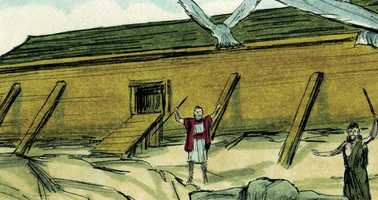
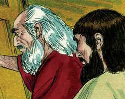
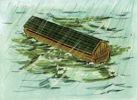
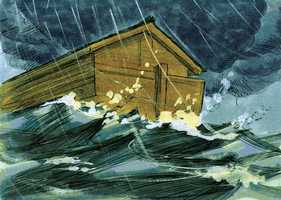

# Gênesis Cap 07

**1** 	DEPOIS disse o Senhor a Noé: Entra tu e toda a tua casa na arca, porque tenho visto que és justo diante de mim nesta geração.

> **Cmt MHenry**: *Versículos 1-12* O chamamento a Noé é muito bondoso, como o de um pai doce a seus filhos para que entrem em casa quando vê que se aproxima a noite ou uma tormenta. Noé não entrou na arca até que Deus o ordenou, embora sabia que seria seu lugar de refúgio. É muito consolador ver que Deus vai adiante de nós em cada passo que damos. Noé passou muito trabalho para construir a arca e, agora, ele mesmo se conservaria vivo nela. O que fazemos em obediência ao mandamento de Deus, e com fé, certamente nos trará consolo, cedo ou tarde. O chamamento a Noé nos faz lembrar do chamado que faz o Evangelho aos pobres pecadores. Cristo é uma arca e somente nEle podemos estar a salvo quando cheguem a morte e o juízo. A palavra diz "Vem"; os ministros dizem "Vem"; o Espírito diz "Vem, entra na Arca". Noé foi considerado justo, não por sua justiça própria, senão como herdeiro da justiça que é pela fé ([Hb 11.7](../58N-Hb/11.md#7)). Ele acreditou na revelação de um Salvador, e buscou e esperou a salvação somente através dEle. Assim foi justificado pela fé e recebeu esse Espírito cujo fruto é em toda bondade; porém, se algum homem não tem o Espírito de Cristo, não é dos seus. Depois de cento e vinte anos, Deus deu um espaço de sete dias a mais para o arrependimento. Mas estes sete dias foram desperdiçados, como todo o resto. Serão *tão somente* sete dias. Tinham somente uma semana a mais, um dia de descanso a mais para melhorar e considerar as coisas que correspondem a sua paz. Mas é comum que os que têm sido descuidados com suas almas durante os anos de sua saúde, sejam igualmente negligentes durante esses poucos dias de sua doença, nos que se vislumbra a morte na distância, em que se vê aproximar-se a morte, estando endurecidos seus corações pelo engano do pecado. como Noé preparou a arca pela fé na advertência dada de que viria o dilúvio, assim entrou nela, por fé na advertência de que aconteceria logo. E no dia em que Noé esteve seguro, dentro da arca, se romperam as frontes do grande abismo. A terra tinha em si essas águas que, à ordem de Deus, brotaram e a alagaram; assim, nossos corpos têm em si mesmos esses humores que, quando Deus se apraz, tornam-se semente e fonte de doenças mortais. As janelas do céu foram abertas e as águas que estavam o acima do firmamento, isto é, na atmosfera, foram derramadas sobre a terra. A chuva cai em gotas; porém então caíram chuvaradas tão grandes como nunca tinha havido antes, nem depois. Choveu sem parar nem abrir o céu por quarenta dias com suas quarenta noites, sobre toda a terra de uma só vez. Assim como houve um exercício especial da onipotência de Deus ao causar o dilúvio, seria vão e presunçoso tratar de explicar por meio da sabedoria humana o método que usou.

**2** 	De todos os animais limpos tomarás para ti sete e sete, o macho e sua fêmea; mas dos animais que não são limpos, dois, o macho e sua fêmea.

  

**3** 	Também das aves dos céus sete e sete, macho e fêmea, para conservar em vida sua espécie sobre a face de toda a terra.

**4** 	Porque, passados ainda sete dias, farei chover sobre a terra quarenta dias e quarenta noites; e desfarei de sobre a face da terra toda a substância que fiz.

**5** 	E fez Noé conforme a tudo o que o Senhor lhe ordenara.

**6** 	E era Noé da idade de seiscentos anos, quando o dilúvio das águas veio sobre a terra.

 

**7** 	Noé entrou na arca, e com ele seus filhos, sua mulher e as mulheres de seus filhos, por causa das águas do dilúvio.

> **Cmt MHenry**: *CAPÍTULO 7*

**8** 	Dos animais limpos e dos animais que não são limpos, e das aves, e de todo o réptil sobre a terra,

**9** 	Entraram de dois em dois para junto de Noé na arca, macho e fêmea, como Deus ordenara a Noé.

**10** 	E aconteceu que passados sete dias, vieram sobre a terra as águas do dilúvio.

 

**11** 	No ano seiscentos da vida de Noé, no mês segundo, aos dezessete dias do mês, naquele mesmo dia se romperam todas as fontes do grande abismo, e as janelas dos céus se abriram,

**12** 	E houve chuva sobre a terra quarenta dias e quarenta noites.

**13** 	E no mesmo dia entraram na arca Noé, seus filhos Sem, Cão e Jafé, sua mulher e as mulheres de seus filhos.

> **Cmt MHenry**: *Versículos 13-16* As criaturas vorazes foram feitas mansas e manejáveis; contudo, quando a circunstância terminou, foram as mesmas de antes, pois a arca não modificou sua natureza. Os hipócritas da igreja se conformam exteriormente com as leis dessa arca, continuam sem mudar e, antes ou depois, mostrarão de que classe são. Deus continuou cuidando de Noé. Deus fechou a porta para assegurá-lo e mantê-lo a salvo na arca; também deixou fora para sempre a todos os outros. Em que forma foi feito isto, é algo que não aprouve a Deus dar a conhecer. Há muito a ver de nossos deveres e privilégios no evangelho na certeza de Noé na arca. O apóstolo o faz tipo do batismo cristão ([1 Pe 3.20-21](../60N-1Pe/03.md#20)). Observe-se, então, que é nosso grande dever, em obediência ao chamado do evangelho, mediante uma fé viva em Cristo, ir pelo caminho e salvação que Deus tem provido para os pobres pecadores. Os que entram na arca devem trazer a quantos possam com eles, mediante boas instruções, convencendo-os e através de um bom exemplo. Deus colocou a Adão no paraíso, porém não fechou a porta; depois, ele mesmo o expulsou; mas quando Deus coloca a Noé na arca, e quando leva uma alma a Cristo, a salvação é segura: não é segurança nossa, senão da mão do Mediador. Todavia, a porta da misericórdia logo será fechada para aqueles que agora a tomam levianamente. Chame agora, e lhe será aberto ([Lc 13.25](../42N-Lc/13.md#25)).

**14** 	Eles, e todo o animal conforme a sua espécie, e todo o gado conforme a sua espécie, e todo o réptil que se arrasta sobre a terra conforme a sua espécie, e toda a ave conforme a sua espécie, pássaros de toda qualidade.

**15** 	E de toda a carne, em que havia espírito de vida, entraram de dois em dois para junto de Noé na arca.

**16** 	E os que entraram eram macho e fêmea de toda a carne, como Deus lhe tinha ordenado; e o Senhor o fechou dentro.

**17** 	E durou o dilúvio quarenta dias sobre a terra, e cresceram as águas e levantaram a arca, e ela se elevou sobre a terra.

> **Cmt MHenry**: *Versículos 17-20* O dilúvio foi crescendo durante quarenta dias. As águas subiram tão alto que os cumes dos montes mais elevados foram cobertos por mais de vinte pés (pouco mais de 6m). Na terra não há um lugar tão elevado que coloque os homens fora do alcance dos juízos de Deus. a mão de Deus alcançará a todos seus inimigos ([Sl 21.8](../19A-Sl/21.md#8)). Quando cresceu o dilúvio, a arca de Noé foi levantada e as águas, que rompiam todo o resto, sustentaram-na. Isso que para os incrédulos é sinal de morte para a morte, para os fiéis é sinal de vida para a vida.

**18** 	E prevaleceram as águas e cresceram grandemente sobre a terra; e a arca andava sobre as águas.

   

**19** 	E as águas prevaleceram excessivamente sobre a terra; e todos os altos montes que havia debaixo de todo o céu, foram cobertos.

**20** 	Quinze côvados acima prevaleceram as águas; e os montes foram cobertos.

**21** 	E expirou toda a carne que se movia sobre a terra, tanto de ave como de gado e de feras, e de todo o réptil que se arrasta sobre a terra, e todo o homem.

> **Cmt MHenry**: *Versículos 21-24* Morreram todos os homens, mulheres e crianças que havia no mundo, exceto os que estavam na arca. Podemos imaginar facilmente o terror que os embargou. Nosso Salvador nos diz que até o mesmo dia em que chegou o dilúvio, eles estavam comendo e bebendo ([Lc 17.26-27](../42N-Lc/17.md#26)). Eles se convenceram de sua idiotice quando já era demasiado tarde. Podemos supor que tentaram todos os médios possíveis para salvar-se, mas todo foi em vão. Os que não se encontram *em* Cristo, a Arca, certamente serão destruídos, destruídos para sempre. Façamos uma pausa e consideremos este tremendo juízo! Que pode prevalecer diante do Senhor quando Ele está irado? O pecado dos pecadores será sua ruína, cedo ou tarde, se não se arrependem. O Deus justo sabe levar a ruína ao mundo dos ímpios ([2 Pe 3.5](../61N-2Pe/03.md#5)). Que terrível será o dia do juízo e da perdição dos homens ímpios! Felizes os que são parte da família de Cristo e que como tais estão a salvo com Ele; eles podem esperar sem desmaio e regozijar-se de que triunfarão quando o fogo queimar a terra e todo o que nela há. Podemos supor algumas distinções favoráveis em nosso próprio caráter, porém, se descuidarmos, rejeitarmos ou abusarmos da salvação de Cristo, apesar das imaginadas vantagens, seremos destruídos na ruína comum de um mundo incrédulo. "

**22** 	Tudo o que tinha fôlego de espírito de vida em suas narinas, tudo o que havia em terra seca, morreu.

**23** 	Assim foi destruído todo o ser vivente que havia sobre a face da terra, desde o homem até ao animal, até ao réptil, e até à ave dos céus; e foram extintos da terra; e ficou somente Noé, e os que com ele estavam na arca.

**24** 	E prevaleceram as águas sobre a terra cento e cinqüenta dias.

> **Cmt MHenry** Intro: *• Versículos 1-12*> *Noé, sua família e as criaturas vivas entram na arca e*> *começa o dilúvio*> *• Versículos 13-16*> *Noé encerra-se na arca*> *• Versículos 17-20*> *O desenvolvimento do dilúvio durante quarenta dias*> *• Versículos 21-24*> *Toda carne destruída pelo dilúvio*