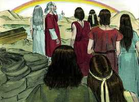

# Gênesis Cap 09

**1** 	E ABENÇOOU Deus a Noé e a seus filhos, e disse-lhes: Frutificai e multiplicai-vos e enchei a terra.

> **Cmt MHenry**: *Versículos 1-3* A bênção de Deus é a causa de nosso bem-estar. Dependemos dEle, devemos estar agradecidos a Ele. não esqueçamos a vantagem e o prazer que temos do trabalho das bestas, e o que sua carne subministra. Tampouco devemos ser menos agradecidos pela seguridade de que desfrutamos em quanto as bestas selvagens e daninhas, pelo temor do homem que Deus tem colocado no profundo delas. Vemos o cumprimento desta promessa todos os dias e em todas partes. Este obséquio dos animais para comida garante plenamente o uso deles, mas não o abuso por glutonaria, e menos por crueldade. Não devemos causar dor desnecessária enquanto vivam, nem quando lhes tiramos a vida.

**2** 	E o temor de vós e o pavor de vós virão sobre todo o animal da terra, e sobre toda a ave dos céus; tudo o que se move sobre a terra, e todos os peixes do mar, nas vossas mãos são entregues.

**3** 	Tudo quanto se move, que é vivente, será para vosso mantimento; tudo vos tenho dado como a erva verde.

**4** 	A carne, porém, com sua vida, isto é, com seu sangue, não comereis.

> **Cmt MHenry**: *Versículos 4-7* A razão principal de proibir comer o sangue, sem dúvida, deveu-se a que o derramamento de sangue nos sacrifícios tinha por objeto que os adoradores tivessem seu pensamento colocado na grande expiação; embora também parece ter o propósito de controlar a crueldade, para que os homens, costumando-se a derramar o sangue dos animais e alimentar-se dele, virassem insensíveis frente a isso e os afetasse em pouco a idéia de derramar sangue humano. O homem não deve tomar sua própria vida. Nossa vida é de Deus e devemos dá-la somente quando a Ele aprouver. Se precipitarmos de alguma forma nossa própria morte, deveremos responder a Deus por isso. Quando Deus pede a um homem que responda por uma vida que tirou injustamente, o homicida não pode responder e, portanto, deve entregar a própria vida em troca. Em um ou em outro momento, neste mundo ou no vindouro, Deus descobrirá os crimes e castigará aqueles homicídios cujo castigo ficou fora do alcance do poder do homem. Porém há os que são ministros de Deus para proteger o inocente, para infundir temor nos malfeitores, e que não devem esgrimir em vão a espada ([Rm 13.4](../45N-Rm/13.md#4)). O homicídio deliberado deve ser sempre punido com a morte. A esta lei se agrega uma razão. Ainda há remanescentes da imagem de Deus no homem caído, de modo que quem matar injustamente a um homem, desfigura a imagem de Deus e o desonra.

**5** 	Certamente requererei o vosso sangue, o sangue das vossas vidas; da mão de todo o animal o requererei; como também da mão do homem, e da mão do irmão de cada um requererei a vida do homem.

 

**6** 	Quem derramar o sangue do homem, pelo homem o seu sangue será derramado; porque Deus fez o homem conforme a sua imagem.

**7** 	Mas vós frutificai e multiplicai-vos; povoai abundantemente a terra, e multiplicai-vos nela.

**8** 	E falou Deus a Noé e a seus filhos com ele, dizendo:

> **Cmt MHenry**: *Versículos 8-17* Como o mundo antigo foi destruído para ser um monumento de justiça, assim este mundo permanece até agora como um monumento de misericórdia. Mas o pecado, que afogou o mundo antigo, queimará este. Entre os homens se selam acordos, para que o prometido possa ser mais solene e para fazer que o pactuado seja mais seguro para mútua satisfação. Esta aliança foi selada com o arco-íris que, provavelmente, tenha sido visto antes nas nuvens, mas nunca como sinal da aliança, até então. O arco-íris aparece quando há maior razão para temer que a chuva prevaleça; então Deus mostra este selo da promessa, de que não prevalecerá. Quanto mais densa a nuvem, mais brilhante o arco nela. Assim, como abundam as aflições ameaçadoras, abundam muito mais os consolos alentadores. O arco-íris é o reflexo dos raios do sol que brilham sobre ou através das gotas da chuva: toda a glória dos selos da aliança deriva de Cristo, o Sol de Justiça. E Ele derramará glória sobre as lágrimas de seus santos. Um arco fala de terror, mas está dirigido para acima, não para a terra; pois os selos da aliança têm a intenção de consolar, não de aterrar. Como Deus olha o arco para lembrar esta aliança, assim nós devemos ter presente a aliança com fé e gratidão. Sem *revelação* não poderia ser conhecida esta bondosa seguridade; e sem fé não seria útil para nós; e assim é no que diz respeito aos perigos ainda maiores a que todos estão expostos, e em quanto à nova aliança com suas bênçãos.

**9** 	E eu, eis que estabeleço a minha aliança convosco e com a vossa descendência depois de vós.

> **Cmt MHenry**: *CAPÍTULO 9*

**10** 	E com toda a alma vivente, que convosco está, de aves, de gado, e de todo o animal da terra convosco; com todos que saíram da arca, até todo o animal da terra.

**11** 	E eu convosco estabeleço a minha aliança, que não será mais destruída toda a carne pelas águas do dilúvio, e que não haverá mais dilúvio, para destruir a terra.

**12** 	E disse Deus: Este é o sinal da aliança que ponho entre mim e vós, e entre toda a alma vivente, que está convosco, por gerações eternas.

 

**13** 	O meu arco tenho posto nas nuvens; este será por sinal da aliança entre mim e a terra.

**14** 	E acontecerá que, quando eu trouxer nuvens sobre a terra, aparecerá o arco nas nuvens.

**15** 	Então me lembrarei da minha aliança, que está entre mim e vós, e entre toda a alma vivente de toda a carne; e as águas não se tornarão mais em dilúvio para destruir toda a carne.

**16** 	E estará o arco nas nuvens, e eu o verei, para me lembrar da aliança eterna entre Deus e toda a alma vivente de toda a carne, que está sobre a terra.

**17** 	E disse Deus a Noé: Este é o sinal da aliança que tenho estabelecido entre mim e entre toda a carne, que está sobre a terra.

 

**18** 	E os filhos de Noé, que da arca saíram, foram Sem, Cão e Jafé; e Cão é o pai de Canaã.

> **Cmt MHenry**: *Versículos 18-23* A embriaguez de Noé está registrada na Bíblia, com essa transparência que somente se encontra na Escritura, como caso e prova da fraqueza e imperfeição humana, embora tenha sido tomado por surpresa pelo pecado, e para mostrar que o melhor dos homens não pode permanecer em pé se não depender da graça divina e é sustentado por ela. Cão parece ter sido um homem malvado e, provavelmente, se alegrou de encontrar seu pai numa situação imprópria. De Noé se diz que era perfeito em suas gerações (capítulo 6.9); mas isto se refere à sinceridade, não à perfeição sem pecado. Noé, que se manteve sóbrio em companhia de bêbados, agora está bêbado em companhia de sóbrios. O que pense estar firme, olhe que não caia. Devemos pôr muito cuidado quando usamos abundantemente as boas coisas criadas por Deus, para não usá-las em excesso ([Lc 21.34](../42N-Lc/21.md#34)). A conseqüência do pecado de Noé foi a vergonha. Observe-se aqui o grande mal do pecado na embriaguez. Descobre aos homens; quando estão ébrios delatam os males que têm e, então, deixam escapar facilmente os secretos. Os porteiros bêbados mantêm as portas abertas. Traz desgraça aos homens e os expõe ao desprezo. Na medida em que os delata, os envergonha. Quando estão embriagados, os homens dizem e fazem coisas que, estando sóbrios, os fariam corar só de pensá-lo. Atentem para o cuidado que põem Sem e Jafé para cobrir a vergonha de seu pai. Há um manto de amor que se pode lançar sobre as faltas de todos ([1 Pe 4.8](../60N-1Pe/04.md#8)). Além disso, há um manto de reverência que se pode colocar sobre as faltas dos pais e de outros superiores. A bênção de Deus espera aos que honram a seus pais, e sua maldição se acende especialmente contra os que os desonram.

**19** 	Estes três foram os filhos de Noé; e destes se povoou toda a terra.

**20** 	E começou Noé a ser lavrador da terra, e plantou uma vinha.

**21** 	E bebeu do vinho, e embebedou-se; e descobriu-se no meio de sua tenda.

**22** 	E viu Cão, o pai de Canaã, a nudez do seu pai, e fê-lo saber a ambos seus irmãos no lado de fora.

**23** 	Então tomaram Sem e Jafé uma capa, e puseram-na sobre ambos os seus ombros, e indo virados para trás, cobriram a nudez do seu pai, e os seus rostos estavam virados, de maneira que não viram a nudez do seu pai.

**24** 	E despertou Noé do seu vinho, e soube o que seu filho menor lhe fizera.

> **Cmt MHenry**: *Versículos 24-29* Noé pronuncia uma maldição sobre Canaã, o filho de Cão; talvez este neto seu fosse mais culpável que os outros. Ainda entre seus irmãos seria um escravo de servos, isto é, o menor e mais desprezível dos servos. Isto certamente aponta às vitórias obtidas por Israel em épocas posteriores, sobre os cananeus, nas quais foram passados a espada ou levados cativos para pagarem tributo. Todo o continente da África estava povoado principalmente pelos descendentes de Cão; que por quantas épocas tem estado as melhores partes desse território sob o domínio dos romanos, depois dos sarracenos, e agora, dos turcos! Em meio e quanta maldade, ignorância, barbárie, escravidão e miséria vive a maioria de seus habitantes! E dos pobres negros, quantos são vendidos e comprados anualmente como bestas no mercado e levados de um a outro canto do mundo a realizar o trabalho das bestas! Porém, isto de jeito nenhum é escusa para a cobiça e a barbárie dos que se enriquecem com o produto do suor e o sangue deles. Deus *não* nos mandou escravizar os negros e, sem dúvida, castigará severamente todas estas cruéis ruindades. O cumprimento desta profecia, que contém quase a história do mundo, libera Noé da suspeita de tê-la pronunciado por raiva pessoal. Prova plenamente que o Espírito Santo usou como ocasião a ofensa de Cão para revelar seus propósitos secretos. "Bendito seja o Senhor Deus de Sem". A igreja seria edificada e continuaria na posteridade de Sem; dele vieram os judeus, que foram, durante longo tempo, o único povo professante que teve Deus no mundo. Cristo, que era Jeová Deus, em sua natureza humana descenderia de Sem; pois dele, no que concerne a carne, veio Cristo. Noé também abençoa a Jafé, e nele as ilhas dos gentios que foram povoadas por sua semente. Fala da conversão dos gentios e a entrada deles na igreja. Podemos lê-lo "Engrandeça Deus a Jafé, e habite nas tendas de Sem". Judeus e gentios serão unidos no aprisco do Evangelho; ambos serão um em Cristo. Noé viveu para ver dois mundos; porém, sendo herdeiro da justiça que é pela fé, agora repousa em esperança, para ver um mundo melhor que esses dois. "

**25** 	E disse: Maldito seja Canaã; servo dos servos seja aos seus irmãos.

**26** 	E disse: Bendito seja o Senhor Deus de Sem; e seja-lhe Canaã por servo.

**27** 	Alargue Deus a Jafé, e habite nas tendas de Sem; e seja-lhe Canaã por servo.

**28** 	E viveu Noé, depois do dilúvio, trezentos e cinqüenta anos.

**29** 	E foram todos os dias de Noé novecentos e cinqüenta anos, e morreu.

> **Cmt MHenry** Intro: *• Versículos 1-3*> *Deus abençoa Noé e lhe concede a carne como alimento*> *• Versículos 4-7*> *Proibição do derramamento de sangue e do homicídio*> *• Versículos 8-17*> *A aliança de Deus e o arco-íris*> *• Versículos 18-23*> *Noé planta um vinhedo – Fica bêbado e é escarnecido por*> *• Versículos 24-29*> *Noé amaldiçoa Canaã, abençoa sem, ora por Jafé – Sua*