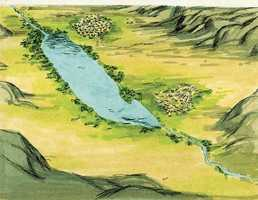
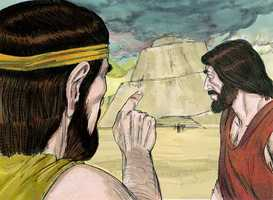
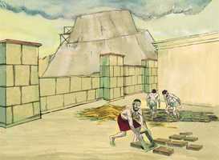
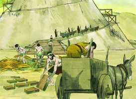
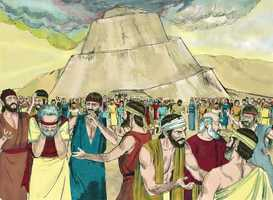
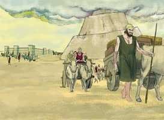
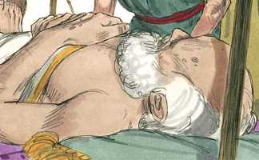

# Gênesis Cap 11

**1** 	E ERA toda a terra de uma mesma língua e de uma mesma fala.

> **Cmt MHenry**: *Versículos 1-4* Com quanta prontidão se esquecem os homens dos juízos mais graves e voltam a seus crimes anteriores! Embora a devastação do dilúvio estava diante de seus olhos, embora surgiram da semente do justo Noé, ainda durante sua vida, a maldade aumenta em forma excessiva. Nada senão a graça santificadora do Espírito Santo pode tirar a luxúria pecaminosa da vontade humana e a depravação do coração do homem. O propósito de Deus era que a humanidade formasse muitas nações e povoasse toda a terra. Desprezando a vontade divina e contrariando o conselho de Noé, o grosso da humanidade se uniu para edificar uma cidade e uma torre que lhes impedisse serem separados. Começou a idolatria e Babel chegou a ser uma de suas principais sedes. Eles se fizeram mutuamente mais ousados e resolutos. Aprendamos a estimular-nos mutuamente no amor e nas boas obras, assim como os pecadores se incitam e alentam uns a outros nas más obras.

 

**2** 	E aconteceu que, partindo eles do oriente, acharam um vale na terra de Sinar; e habitaram ali.

 

**3** 	E disseram uns aos outros: Eia, façamos tijolos e queimemo-los bem. E foi-lhes o tijolo por pedra, e o betume por cal.

   

**4** 	E disseram: Eia, edifiquemos nós uma cidade e uma torre cujo cume toque nos céus, e façamo-nos um nome, para que não sejamos espalhados sobre a face de toda a terra.

**5** 	Então desceu o Senhor para ver a cidade e a torre que os filhos dos homens edificavam;

> **Cmt MHenry**: *Versículos 5-9* Eis aqui uma expressão à maneira dos homens: "Desceu Jeová para ver a cidade". Deus é justo e bom em todo o que faz contra o pecado e os pecadores e não condena a ninguém sem ouvi-lo. O pio Éber não se encontra neste grupo ímpio; pois ele e os seus são chamados filhos de Deus; suas almas não se uniram à assembléia destes filhos dos homens. Deus permitiu que eles chegassem a certo ponto para que as obras de suas mãos, das quais se prometiam honra perdurável para si mesmos, resultassem uma censura eterna. Deus tem fins sábios e santos ao permitir que os inimigos de sua glória executem em grande medida seus maus projetos e prosperem por longo tempo. Observe a sabedoria e misericórdia de Deus nos métodos usados para derrotar esta empresa. E a *misericórdia* de Deus ao não fazer o castigo igual à ofensa; pois Ele não nos trata conforme aos nossos pecados. A *sabedoria* de Deus, ao estabelecer uma forma segura de deter seus procedimentos. Se não podiam entender-se uns aos outros, não poderiam ajudar-se um ao outro; isto os afastaria da edificação. Deus tem diversos métodos, e eficazes, para frustrar e derrotar os projetos de homens orgulhosos que se colocam em Sua contra e, em particular, os divide entre eles mesmos. Apesar de sua unidade e obstinação, Deus estava acima deles; pois quem tem endurecido seu coração contra Ele e tem prosperado? Sua linguagem foi confundida. Por eles todos sofremos até hoje todas as dores e problemas necessários para aprender idiomas, tudo isso pela rebeldia de nossos antepassados de Babel. E, olha só!, quantas infelizes brigas de palavras surgem por alguém entender errado as palavras de outros e, por todo o que sabemos, deve-se a esta confusão de línguas. Eles deixaram de edificar a cidade. a confusão de línguas não somente os incapacitou para ajudar-se uns a outros, senão que viram a mão do Senhor contra eles. É sabedoria deixar algo assim que percebemos que Deus se opõe a isso. Deus pode destruir e reduzir a nada todas as artes e desígnios dos construtores de Babel: não há sabedoria nem conselho que possa levantar-se contra o Senhor. Os construtores se separaram conforme as suas famílias e as línguas que falavam, aos países e lugares designados para eles. Os filhos dos homens nunca tornaram a se ajuntar, nem jamais se reunirão novamente, até o grande dia em que o Filho do homem se sentar no trono de sua glória e todas as nações se reúnam diante dEle.

**6** 	E o Senhor disse: Eis que o povo é um, e todos têm uma mesma língua; e isto é o que começam a fazer; e agora, não haverá restrição para tudo o que eles intentarem fazer.

**7** 	Eia, desçamos e confundamos ali a sua língua, para que não entenda um a língua do outro.

 

**8** 	Assim o Senhor os espalhou dali sobre a face de toda a terra; e cessaram de edificar a cidade.

 

**9** 	Por isso se chamou o seu nome Babel, porquanto ali confundiu o Senhor a língua de toda a terra, e dali os espalhou o Senhor sobre a face de toda a terra.

**10** 	Estas são as gerações de Sem: Sem era da idade de cem anos e gerou a Arfaxade, dois anos depois do dilúvio.

> **Cmt MHenry**: *Versículos 10-26* Aqui há uma genealogia, ou lista de nomes, que termina em Abrão, o amigo de d., e assim conduz a Cristo, a Semente prometida, que era o filho de Abrão. Nada fica no registro senão seus nomes e idades; pareceria que o Espírito Santo se apressasse a passar por eles rumo a história de Abrão. Quão pouco sabemos daqueles que passaram antes que nós neste mundo, ainda daqueles que viveram nos mesmos lugares em que nós vivemos, como, igualmente, sabemos pouco daqueles que viveram em lugares distantes! Temos bastante que fazer para dirigir nossa própria obra. Quando começou a povoar-se a terra, as vidas dos homens começaram a encurtar-se; isto foi sábia disposição da Providência.

**11** 	E viveu Sem, depois que gerou a Arfaxade, quinhentos anos, e gerou filhos e filhas.

> **Cmt MHenry**: *CAPÍTULO 11A-1Rs

**12** 	E viveu Arfaxade trinta e cinco anos, e gerou a Selá.

**13** 	E viveu Arfaxade depois que gerou a Selá, quatrocentos e três anos, e gerou filhos e filhas.

**14** 	E viveu Selá trinta anos, e gerou a Éber;

**15** 	E viveu Selá, depois que gerou a Éber, quatrocentos e três anos, e gerou filhos e filhas.

**16** 	E viveu Éber trinta e quatro anos, e gerou a Pelegue.

**17** 	E viveu Éber, depois que gerou a Pelegue, quatrocentos e trinta anos, e gerou filhos e filhas.

**18** 	E viveu Pelegue trinta anos, e gerou a Reú.

**19** 	E viveu Pelegue, depois que gerou a Reú, duzentos e nove anos, e gerou filhos e filhas.

**20** 	E viveu Reú trinta e dois anos, e gerou a Serugue.

**21** 	E viveu Reú, depois que gerou a Serugue, duzentos e sete anos, e gerou filhos e filhas.

**22** 	E viveu Serugue trinta anos, e gerou a Naor.

**23** 	E viveu Serugue, depois que gerou a Naor, duzentos anos, e gerou filhos e filhas.

**24** 	E viveu Naor vinte e nove anos, e gerou a Terá.

**25** 	E viveu Naor, depois que gerou a Terá, cento e dezenove anos, e gerou filhos e filhas.

**26** 	E viveu Terá setenta anos, e gerou a Abrão, a Naor, e a Harã.

**27** 	E estas são as gerações de Terá: Terá gerou a Abrão, a Naor, e a Harã; e Harã gerou a Ló.

> **Cmt MHenry**: *Versículos 27-32* Aqui começa a história de Abrão, cujo nome é famoso em ambos os Testamentos. Até os filhos de Éber tinham-se tornado adoradores de falsos deuses. Os que pela graça são herdeiros da terra prometida, deviam lembrar qual era a terra de seu nascimento, isto é, qual era seu estado corrupto e pecador por natureza. Os irmãos de Abrão era Naor, de cuja família tiveram suas esposas Isaque e Jacó, e Harã, o pai de Ló, que morreu antes que seu pai. Os filhos não podem estar seguros de sobreviverem a seus pais. Harã morreu em Ur, antes da feliz saída da família desse país idólatra. Nos concerne apressar-nos a sairmos de nosso estado natural, não seja que a morte nos surpreenda nele. Aqui lemos da saída de Abrão desde Ur dos caldeus, com seus pai Taré, seu sobrinho Ló e o resto de sua família, obedecendo ao chamado de Deus. Este capítulo os deixa a metade do caminho entre Ur a Canaã, onde habitaram até a morte de Taré. Muitos chegam a Harã e, contudo, não chegam a Canaã; não estão longe do Reino de Deus, e, não obstante, nunca chegam ali. "

**28** 	E morreu Harã estando seu pai Terá ainda vivo, na terra do seu nascimento, em Ur dos caldeus.

**29** 	E tomaram Abrão e Naor mulheres para si: o nome da mulher de Abrão era Sarai, e o nome da mulher de Naor era Milca, filha de Harã, pai de Milca e pai de Iscá.

**30** 	E Sarai foi estéril, não tinha filhos.

**31** 	E tomou Terá a Abrão seu filho, e a Ló, filho de Harã, filho de seu filho, e a Sarai sua nora, mulher de seu filho Abrão, e saiu com eles de Ur dos caldeus, para ir à terra de Canaã; e vieram até Harã, e habitaram ali.

**32** 	E foram os dias de Terá duzentos e cinco anos, e morreu Terá em Harã.

 

> **Cmt MHenry** Intro: *• Versículos 1-4*> *Uma linguagem no mundo – A construção de Babel*> *• Versículos 5-9*> *A confusão das línguas – Dispersão dos construtores de*> *• Versículos 10-26*> 28A-Os descendentes de Sem*> *• Versículos 27-32*> *Taré, o pai de Abrão, avô de Ló – Viagem a Harã*