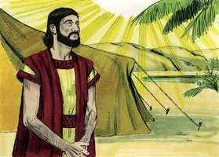
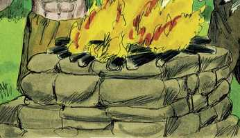
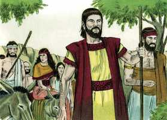
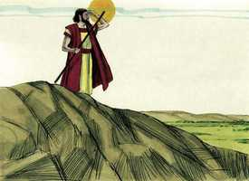
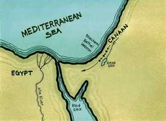
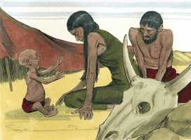
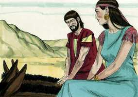
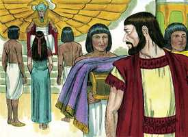
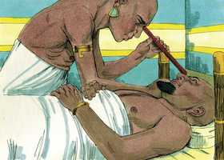
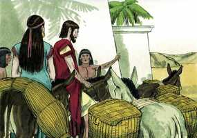

# Gênesis Cap 12

**1** 	ORA, o Senhor disse a Abrão: Sai-te da tua terra, da tua parentela e da casa de teu pai, para a terra que eu te mostrarei.

> **Cmt MHenry**: *Versículos 1-3* Deus escolheu a Abrão e o separou dentre seus congêneres idólatras para reservar um povo para sim, entre os quais se mantivesse a verdadeira adoração até a vinda de Cristo. Daqui em diante, Abrão e sua semente são quase o único tema da história da Bíblia. Abrão foi provado, se amava a Deus mais que tudo, e se podia deixar voluntariamente todo para ir com Deus. seus parentes e a casa de seu pai eram uma constante tentação para ele; não podia seguir entre eles sem o risco de ser contaminado por eles. Os que deixam seus pecados e se voltam a Deus ganharão o indizível com a mudança. A ordem que Deus deu a Abrão é em grande medida igual ao chamamento do evangelho, porque os afetos naturais devem ceder passo à graça divina. O pecado e todas suas oportunidades devem abandonar-se, em particular as más companhias. Eis aqui muitas promessas grandes e preciosas. Todos os preceitos de Deus vão acompanhados de promessas para o obediente: 1) *Farei de ti uma grande nação*. Quando Deus tirou a Abrão de seu povo, prometeu fazê-lo cabeça de outro povo. 2) *Te abençoarei*. Os crentes obedientes estarão seguros de herdarem a bênção, 3) *Engrandecerei teu nome*. O nome dos crentes obedientes certamente será engrandecido. 4) *Serás uma bênção*. Os homens bons são bênção para seus países. 5) *Abençoarei os que te abençoarem, e amaldiçoarei os que te amaldiçoem*. Deus se ocupará de que nenhum seja perdedor por algum serviço feito em favor de seu povo. 6) *Em ti serão benditas todas as famílias da terra*. Jesus Cristo é a grande bênção do mundo, a maior que o mundo tenha possuído jamais. Toda verdadeira bem-aventurança no mundo agora ou que alguma vez chegue a ter, deve-se a Abrão e sua descendência. Por meio deles temos uma Bíblia, um Salvador e um evangelho. Eles são a cepa sobre a qual tem sido enxertada a igreja cristã. Abrão acreditou que a bênção do Todo Poderoso supriria todo o que ele pudesse perder ou deixar atrás, satisfaria todas suas carências e responderia, e ainda mais, ultrapassaria todos seus desejos, e sabia que nada senão a desgraça seguiria à desobediência. Este tipo de crentes, justificados pela fé em Cristo, têm paz com Deus. Eles seguem em seu caminho a Canaã. Não desanimam pelas dificuldades do caminho nem são arrastados fora dele pelos deleites que encontram. Os que se dirigem ao céu devem perseverar até o fim. Os que empreendamos o caminho em obediência à ordem de Deus e atendendo humildemente a sua providência, certamente triunfaremos e finalmente teremos consolo. Canaã não era, como outras terras, uma simples possessão externa, senão um tipo do céu e, neste sentido, os patriarcas a apreciavam fervorosamente.

**2** 	E far-te-ei uma grande nação, e abençoar-te-ei e engrandecerei o teu nome; e tu serás uma bênção.

 

**3** 	E abençoarei os que te abençoarem, e amaldiçoarei os que te amaldiçoarem; e em ti serão benditas todas as famílias da terra.

**4** 	Assim partiu Abrão como o Senhor lhe tinha dito, e foi Ló com ele; e era Abrão da idade de setenta e cinco anos quando saiu de Harã.

 

**5** 	E tomou Abrão a Sarai, sua mulher, e a Ló, filho de seu irmão, e todos os bens que haviam adquirido, e as almas que lhe acresceram em Harã; e saíram para irem à terra de Canaã; e chegaram à terra de Canaã.

**6** 	E passou Abrão por aquela terra até ao lugar de Siquém, até ao carvalho de Moré; e estavam então os cananeus na terra.

> **Cmt MHenry**: *Versículos 6-9* Abrão achou a terra povoada por cananeus que eram maus vizinhos. Ele viajou, e continuou avançando. Às vezes a sorte dos homens bons é não estarem estabelecidos e, freqüentemente, mudar a diversos estados. Os crentes devem considerar-se como peregrinos e estrangeiros neste mundo ([Hb 11.8](../58N-Hb/11.md#8),[13-14](../58N-Hb/11.md#13)). Porém, observe quanto consolo tinha Abrão em Deus. quando teve escassa satisfação em seus contatos com os cananeus que ali encontrou, teve abundante prazer na comunhão com aquele Deus que o havia conduzido até ali, e que não o desamparou. A comunhão com Deus se mantém pela palavra e a oração. Deus se revela Ele mesmo e seus favores em forma gradual a seu povo; antes havia prometido mostrar a Abrão a terra; agora promete dá-la: a medida que cresce a graça, cresce o consolo. Pareceria que Abrão o entendeu também como a concessão de uma terra melhor, da qual esta era tipo, porque esperava uma pátria celestial ([Hb 11.16](../58N-Hb/11.md#16)). Abrão se estabeleceu tão logo como chegou a Canaã, e embora não era senão estrangeiro e peregrino ali, manteve a adoração de Deus em sua família. Não só se preocupou da parte cerimonial da religião, a apresentação de sacrifícios, senão que cobrou consciência de buscar a Deus e invocar seu nome, o sacrifício espiritual com o qual se agrada Deus. predicava sobre o nome do Senhor; ensinou a sua família e a seus vizinhos o conhecimento do Deus verdadeiro e de sua santa religião. A adoração familiar é um bom caminho antigo, nada novo, senão o antigo costume dos santos. Abrão era rico e teve uma família numerosa, embora não estava estabelecido e estava rodeado de inimigos; contudo, onde quer que levantava acampamento, edificava um altar: onde quer a vamos, não deixemos de levar nossa religião conosco.

**7** 	E apareceu o Senhor a Abrão, e disse: À tua descendência darei esta terra. E edificou ali um altar ao Senhor, que lhe aparecera.

  

**8** 	E moveu-se dali para a montanha do lado oriental de Betel, e armou a sua tenda, tendo Betel ao ocidente, e Ai ao oriente; e edificou ali um altar ao Senhor, e invocou o nome do Senhor.

 

**9** 	Depois caminhou Abrão dali, seguindo ainda para o lado do sul.

 

**10** 	E havia fome naquela terra; e desceu Abrão ao Egito, para peregrinar ali, porquanto a fome era grande na terra.

> **Cmt MHenry**: *Versículos 10-20* Não há na terra uma situação livre de provações, nem personagem livre de defeitos. Houve grande fome em Canaã, a mais gloriosa de todas as terras, como houve incredulidade em Abrão, o pais dos fiéis, com ao males que sempre implica. A felicidade perfeita e a pureza perda estão somente no céu. Abrão, quando deve deixar Canaã durante um tempo, vai para o Egito, com a intenção de demorar-se ali não mais do necessário, para que não parecesse que olha para trás. Ali Abrão oculta sua relação com Sarai, errado, e pede a sua esposa e a seus servos que façam o mesmo. Ele ocultou uma verdade como um modo de negá-la efetivamente, e por isso, expõe ao pecado tanto a sua esposa como aos egípcios. A graça pela qual mais se destacava Abrão era a fé; contudo, assim caiu pela incredulidade e desconfiança na providência divina, ainda depois de que Deus tinha-se aparecido duas vezes. Ai, que será de uma fé fraca quando a fé firme se vê assim remexida! Muitas vezes, se Deus não nos livrasse das angústias e inquietações em que nos metemos nós mesmos, por nosso próprio pecado e tolice, estaríamos destruídos. Ele não nos trata conforme ao que merecemos. São castigos felizes aqueles que nos impedem ir pelo caminho do pecado e nos levam a cumprir nosso dever, particularmente o dever de fazer reparação pelo que temos tomado ou conservado indevidamente. A repreensão do Faraó para Abrão foi muito justa: "Que é isto que fizeste comigo?" Quão inapropriado de um homem sábio e bom! Se os que professam a fé fazem o injusto e enganoso, especialmente se dizem o que está na borda da mentira, devem estar dispostos a ouvir uma repreensão, e têm razão para agradecer aos que lhes falem desse modo. A despedida foi bondosa. O Faraó estava tão longe de toda intenção de matar a Abrão, como este temia, que teve um particular cuidado dele. Freqüentemente, ficamos confundidos com temores que não têm absolutamente nenhum fundamento. Muitas vezes tememos quando não há nada que temer. O Faraó encarregou a seus homens que não fizessem nenhum mal a Abrão. Não basta que os que têm autoridade não firam por si mesmos; eles devem impedir que seus servos e os que o rodeiam façam dano. "

  

**11** 	E aconteceu que, chegando ele para entrar no Egito, disse a Sarai, sua mulher: Ora, bem sei que és mulher formosa à vista;

 

**12** 	E será que, quando os egípcios te virem, dirão: Esta é sua mulher. E matar-me-ão a mim, e a ti te guardarão em vida.

> **Cmt MHenry**: *CAPÍTULO 12A-2Rs

**13** 	Dize, peço-te, que és minha irmã, para que me vá bem por tua causa, e que viva a minha alma por amor de ti.

**14** 	E aconteceu que, entrando Abrão no Egito, viram os egípcios a mulher, que era mui formosa.

 

**15** 	E viram-na os príncipes de Faraó, e gabaram-na diante de Faraó; e foi a mulher tomada para a casa de Faraó.

**16** 	E fez bem a Abrão por amor dela; e ele teve ovelhas, vacas, jumentos, servos e servas, jumentas e camelos.

**17** 	Feriu, porém, o Senhor a Faraó e a sua casa, com grandes pragas, por causa de Sarai, mulher de Abrão.

 

**18** 	Então chamou Faraó a Abrão, e disse: Que é isto que me fizeste? Por que não me disseste que ela era tua mulher?

**19** 	Por que disseste: É minha irmã? Por isso a tomei por minha mulher; agora, pois, eis aqui tua mulher; toma-a e vai-te.

**20** 	E Faraó deu ordens aos seus homens a respeito dele; e acompanharam-no, a ele, e a sua mulher, e a tudo o que tinha.

 

> **Cmt MHenry** Intro: *• Versículos 1-3*> *Deus chama a Abrão e o abençoa com a promessa de Cristo*> *• Versículos 4-5*> *Abrão sai de Harã*> *• Versículos 6-9*> *Viaja por Canaã e adora a Deus nessa terra*> *• Versículos 10-20*> *Abrão é levado ao Egito por uma grande fome – Finge que*> *sua esposa é sua irmã*