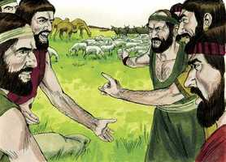
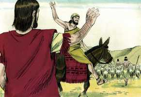
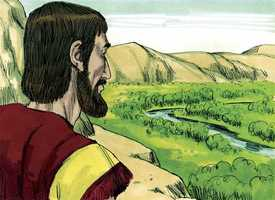

# Gênesis Cap 13

**1** 	SUBIU, pois, Abrão do Egito para o lado do sul, ele e sua mulher, e tudo o que tinha, e com ele Ló.

> **Cmt MHenry**: *Versículos 1-4* Abrão era muito rico: ele estava muito pesado, assim é a palavra hebraica; pois as riquezas são uma carga, e os que serão ricos somente se carregam com barro espesso ([Hq 2.6](../35A-Hc/02.md#6)). há uma carga de cuidado ao obter riquezas, medo de perdê-las, tentação de usá-las, culpa por abusar delas, pena por perdê-las, e um peso da rendição de contas que, por último, deve ser dada por elas. Não obstante, Deus em sua providência às vezes faz ricos aos homens bons, e deste modo a bênção de Deus fez rico a Abrão sem penas ([Pv 10.22](../20A-Pv/10.md#22)). Embora seja difícil que um rico entre no céu, em alguns casos pode ser ([Mc 10.23-24](../41N-Mc/10.md#23)). Vamos, a prosperidade externa, se for bem administrada, é um ornamento da piedade e uma oportunidade para fazer mais bem. Abrão partiu para Betel. Seu altar não estava, então não pôde oferecer sacrifício; porém invocou o nome do Senhor. É mais fácil encontrar-se um homem vivo sem respirar que um do povo de Deus sem orar.

**2** 	E era Abrão muito rico em gado, em prata e em ouro.

**3** 	E fez as suas jornadas do sul até Betel, até ao lugar onde a princípio estivera a sua tenda, entre Betel e Ai;

**4** 	Até ao lugar do altar que outrora ali tinha feito; e Abrão invocou ali o nome do Senhor.

**5** 	E também Ló, que ia com Abrão, tinha rebanhos, gado e tendas.

> **Cmt MHenry**: *Versículos 5-9* As riquezas não só dão espaço à discórdia, sendo as coisas pelas que mais corriqueiramente briga; senão que também podem incitar um espírito contencioso, fazendo que a gente se orgulhe e fique cobiçosa. *Meu* e *teu* são os grandes produtores da raiva do mundo. A pobreza e o trabalho, as carências e as vagabundagens não puderam separar Abrão e Ló, porém sim as riquezas. Os maus servos amiúde têm feito muito mal nas famílias e entre os vizinhos, por seu orgulho e paixão, mentindo, caluniando e levando fofocas. Aqueles que assim agem são os agentes do diabo e os piores inimigos de seus amos. O que piorou a briga foi que os cananeus e os perizeus habitavam a terra. As pelejas dos professantes são a repreensão da religião e dão ocasião de blasfemar aos inimigos do Senhor. Melhor é conservar a paz, que não seja rompida, porém a melhor coisa é, quando se apresentam diferenças, sufocar com toda velocidade o fogo que está começando. O intento de apaziguar esta discórdia foi feito por Abrão, embora ele era um homem ancião e maior. Abrão demonstra-se como homem de espírito *sereno*, que mandava em sua paixão e que sabia como acalmar a ira com uma resposta branda. Aqueles que mantêm a paz nunca devem devolver mal por mal. De espírito condescendente, Abrão esteve disposto a implorar ainda a seu inferior para estar em paz. O povo de Deus deve ser pela paz, seja o que for o que os outros apóiem. O rogo de Abrão pela paz foi muito poderoso. Que a gente da terra contenda por ninharias; porém, não caiamos nós, que conhecemos coisas melhores, e que esperamos um país melhor. Os professantes da fé devem ter sumo cuidado para evitarem contendas. Muitos professam estar pela paz sem fazer nada por ela: não assim Abrão. Quando Deus condescende a rogar-nos que nos reconciliemos, bem podemos rogar-nos uma aos outros. embora Deus tinha prometido a Abrão dar esta terra a sua semente, contudo, ofereceu uma parte igual ou melhor a Ló, que não tinha um direito igual; e ele, sob a proteção da promessa de Deus, não agiria com dureza com seu parente. Nobre é estar disposto a renunciar em aras da paz.

**6** 	E não tinha capacidade a terra para poderem habitar juntos; porque os seus bens eram muitos; de maneira que não podiam habitar juntos.

**7** 	E houve contenda entre os pastores do gado de Abrão e os pastores do gado de Ló; e os cananeus e os perizeus habitavam então na terra.

 

**8** 	E disse Abrão a Ló: Ora, não haja contenda entre mim e ti, e entre os meus pastores e os teus pastores, porque somos irmãos.

**9** 	Não está toda a terra diante de ti? Eia, pois, aparta-te de mim; e se escolheres a esquerda, irei para a direita; e se a direita escolheres, eu irei para a esquerda.

**10** 	E levantou Ló os seus olhos, e viu toda a campina do Jordão, que era toda bem regada, antes do Senhor ter destruído Sodoma e Gomorra, e era como o jardim do Senhor, como a terra do Egito, quando se entra em Zoar.

> **Cmt MHenry**: *Versículos 10-13* Tendo Abrão oferecido a opção a Ló, este a aceitou logo. A paixão e o egoísmo tornam mal-educados os homens. Ló olhou a *bondade da terra*; portanto, não duvidou que floresceria certamente num solo tão fértil. Mas, que saiu disso? Aqueles que, ao escolher relações, chamamentos, habitações ou estabelecimentos, são guiados e governados pela luxúria da carne, a luxúria do olho ou o orgulhoso da vida, não podem esperar a presença ou a bênção de Deus. Correntemente se desiludem até daqueles aos que principalmente apontam. Este princípio deve dirigir todas as nossas opções. Que o ótimo para nós seja o que for ótimo para as nossas almas. Ló considerou em pouco a maldade dos habitantes. Os homens de Sodoma eram pecadores ousados e impudicos. Esta era a iniqüidade de Sodoma: o orgulho, a fartura de pão e a abundância do ócio ([Ez 16.49](../26A-Ez/16.md#49)). Deus dá amiúde uma grande abundância aos grandes pecadores. Com freqüência tem sido a sorte vexadora dos homens bons o viver entre maus vizinhos; e deve ser mais doloroso se, como Ló aqui, são eles mesmos os que se acarretaram isso, por sua má eleição.

 

**11** 	Então Ló escolheu para si toda a campina do Jordão, e partiu Ló para o oriente, e apartaram-se um do outro.

**12** 	Habitou Abrão na terra de Canaã e Ló habitou nas cidades da campina, e armou as suas tendas até Sodoma.

**13** 	Ora, eram maus os homens de Sodoma, e grandes pecadores contra o Senhor.

> **Cmt MHenry**: *CAPÍTULO 13A-1Cr

**14** 	E disse o Senhor a Abrão, depois que Ló se apartou dele: Levanta agora os teus olhos, e olha desde o lugar onde estás, para o lado do norte, e do sul, e do oriente, e do ocidente;

> **Cmt MHenry**: *Versículos 14-18* Os melhor preparados para as visitas da graça divina são aqueles cujos espíritos estão calmos e não alterados pela paixão. Deus compensará abundantemente com paz espiritual o que perdemos por conservar a paz do próximo. Quando nossas relações se afastam de nós, Deus não. Observe também as promessas com que Deus consolou e enriqueceu agora a Abrão. Ele lhe assegurou duas coisas: uma boa terra e uma progênie numerosa para desfrutá-la. As perspectivas vistas por fé são mais ricas e belas que aquelas que vemos ao nosso redor. Deus o fez caminhar pela terra, não para pensar em estabelecer-se nela, senão para estar sempre sem instalar-se e caminhar por ela em pós de uma Canaã melhor. Ele edificou um altar como prenda e seu agradecimento a Deus. quando Deus nos satisfaz com promessas bondosas, espera que lhe obedeçamos com louvores humildes. Nas dificuldades externas é muito proveitoso para o crente verdadeiro que medite na herança gloriosa que o Senhor tem para ele no final.

 

**15** 	Porque toda esta terra que vês, te hei de dar a ti, e à tua descendência, para sempre.

**16** 	E farei a tua descendência como o pó da terra; de maneira que se alguém puder contar o pó da terra, também a tua descendência será contada.

**17** 	Levanta-te, percorre essa terra, no seu comprimento e na sua largura; porque a ti a darei.

**18** 	E Abrão mudou as suas tendas, e foi, e habitou nos carvalhais de Manre, que estão junto a Hebrom; e edificou ali um altar ao Senhor.

> **Cmt MHenry** Intro: *• Versículos 1-4*> *Abrão volta desde o Egito com grandes riquezas*> *• Versículos 5-9*> *Briga dos pastores de Abrão e os de Ló – Abrão dá a eleição*> *de país a Ló*> *• Versículos 10-13*> *Ló escolhe morar em Sodoma*> *• Versículos 14-18*> *Deus renova sua promessa a bem, que parte para o Hebrom*