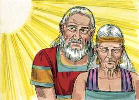
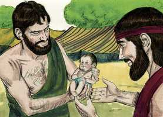
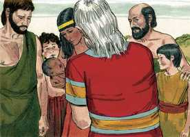

# Gênesis Cap 17

**1** 	SENDO, pois, Abrão da idade de noventa e nove anos, apareceu o Senhor a Abrão, e disse-lhe: Eu sou o Deus Todo-Poderoso, anda em minha presença e sê perfeito.

> **Cmt MHenry**: *Versículos 1-6* A aliança era para que se cumprisse no momento oportuno. A Semente prometida era Cristo e os cristãos nEle. Todos os que são da fé são abençoados no crente Abrão, sendo partícipes das mesmas bênçãos da aliança. Como prenda desta aliança, seu nome é mudado de Abrão "pai excelso" para Abraão, "pai de uma multidão". Todo o que desfruta o mundo cristão é devido a Abraão e sua Semente.

**2** 	E porei a minha aliança entre mim e ti, e te multiplicarei grandissimamente.

**3** 	Então caiu Abrão sobre o seu rosto, e falou Deus com ele, dizendo:

**4** 	Quanto a mim, eis a minha aliança contigo: serás o pai de muitas nações;

**5** 	E não se chamará mais o teu nome Abrão, mas Abraão será o teu nome; porque por pai de muitas nações te tenho posto;

**6** 	E te farei frutificar grandissimamente, e de ti farei nações, e reis sairão de ti;

**7** 	E estabelecerei a minha aliança entre mim e ti e a tua descendência depois de ti em suas gerações, por aliança perpétua, para te ser a ti por Deus, e à tua descendência depois de ti.

> **Cmt MHenry**: *Versículos 7-14* A aliança de graça é *desde* a eternidade em seus conselhos, e *até* a eternidade em suas conseqüências. O sinal da aliança era a circuncisão. Aqui se diz qual é a aliança que Abraão e sua semente devem guardar. Os que desejam ter o Senhor como seu Deus, devem resolver-se a ser um povo para Ele. não só Abraão e Isaque e sua posteridade por Isaque seriam circuncidados, senão também Ismael e os escravos. Sela-se a da terra de Canaã não só para a posteridade de Isaque, senão a do céu por meio de Cristo para toda a igreja de Deus. o sinal exterior é para a igreja visível; o selo interno do Espírito é em particular para os que Deus sabe que são crentes e somente Ele pode conhecê-los. A observância religiosa desta instituição é requerida sob pena de um severo castigo. Perigoso é tomar levianamente as instituições divinas e viver descuidando-as. A aliança em questão era uma que compreendia grandes bênçãos para o mundo de todas as épocas futuras. Até a bênção do próprio Abraão e todas as recompensas conferidas a ele eram por amor a Cristo. Abraão foi justificado, como vimos, não por sua própria justiça, senão pela fé no Messias prometido.

**8** 	E te darei a ti e à tua descendência depois de ti, a terra de tuas peregrinações, toda a terra de Canaã em perpétua possessão e ser-lhes-ei o seu Deus.

**9** 	Disse mais Deus a Abraão: Tu, porém, guardarás a minha aliança, tu, e a tua descendência depois de ti, nas suas gerações.

**10** 	Esta é a minha aliança, que guardareis entre mim e vós, e a tua descendência depois de ti: Que todo o homem entre vós será circuncidado.

**11** 	E circuncidareis a carne do vosso prepúcio; e isto será por sinal da aliança entre mim e vós.

**12** 	O filho de oito dias, pois, será circuncidado, todo o homem nas vossas gerações; o nascido na casa, e o comprado por dinheiro a qualquer estrangeiro, que não for da tua descendência.

**13** 	Com efeito será circuncidado o nascido em tua casa, e o comprado por teu dinheiro; e estará a minha aliança na vossa carne por aliança perpétua.

**14** 	E o homem incircunciso, cuja carne do prepúcio não estiver circuncidada, aquela alma será extirpada do seu povo; quebrou a minha aliança.

**15** 	Disse Deus mais a Abraão: A Sarai tua mulher não chamarás mais pelo nome de Sarai, mas Sara será o seu nome.

> **Cmt MHenry**: *Versículos 15-22* Aqui se faz a Abraão a promessa de um filho de Sarai, no qual se cumpriria a promessa realizada. A prenda desta promessa foi a troca do nome de Sarai para Sara. Sarai significa "minha princesa", como se sua honra estivesse limitada a uma só família; Sara significa "uma princesa". Quantos mais favores Deus nos outorgue, mais devemos rebaixar-nos aos nossos próprios olhos. Abraão demonstrou grande gozo; riu-se, era um riso de alegria, não de desconfiança. Agora era que Abraão se gozou de que haveria de ver o dia de Cristo; agora o viu e se gozou ([Jo 8.56](../43N-Joa/08.md#56)). Temendo que Ismael fosse abandonado e deixado de Deus, Abraão fez uma petição a seu favor. Deus nos dá permissão para que quando oremos sejamos específicos em nossas petições. Quaisquer sejam nossas preocupações e temores, devem ser expostos ante Deus em oração. Os pais têm o dever de orarem por seus filhos, e o maior que deveríamos desejar é que eles sejam guardados em sua aliança, e que possam ter a graça de andar com ele em justiça. A Ismael foram-lhe garantidas as bênçãos *comuns*. Os filhos de pais piedosos nascidos na carne costumam receber boas coisas exteriores, por amor a seus pais. As bênçãos da aliança estão reservadas para Isaque e ele toma posse delas.

 

**16** 	Porque eu a hei de abençoar, e te darei dela um filho; e a abençoarei, e será mãe das nações; reis de povos sairão dela.

**17** 	Então caiu Abraão sobre o seu rosto, e riu-se, e disse no seu coração: A um homem de cem anos há de nascer um filho? E dará à luz Sara da idade de noventa anos?

> **Cmt MHenry**: *CAPÍTULO 17A-Et

**18** 	E disse Abraão a Deus: Quem dera que viva Ismael diante de teu rosto!

**19** 	E disse Deus: Na verdade, Sara, tua mulher, te dará um filho, e chamarás o seu nome Isaque, e com ele estabelecerei a minha aliança, por aliança perpétua para a sua descendência depois dele.

**20** 	E quanto a Ismael, também te tenho ouvido; eis aqui o tenho abençoado, e fá-lo-ei frutificar, e fá-lo-ei multiplicar grandissimamente; doze príncipes gerará, e dele farei uma grande nação.

**21** 	A minha aliança, porém, estabelecerei com Isaque, o qual Sara dará à luz neste tempo determinado, no ano seguinte.

**22** 	Ao acabar de falar com Abraão, subiu Deus de diante dele.

  

**23** 	Então tomou Abraão a seu filho Ismael, e a todos os nascidos na sua casa, e a todos os comprados por seu dinheiro, todo o homem entre os da casa de Abraão; e circuncidou a carne do seu prepúcio, naquele mesmo dia, como Deus falara com ele.

> **Cmt MHenry**: *Versículos 23-27* Abraão e toda sua família foram circuncidados recebendo assim o sinal da aliança e se distinguiram de outras famílias que não tinham arte nem parte no assunto. Foi obediência *implícita*; ele fez como Deus lhe ordenou sem perguntar por quê nem para quê. O fez porque Deus o ordenara. Foi obediência *pronta*; no mesmo dia. A obediência sincera não demora. Não só as doutrinas da revelação senão os selos da aliança de Deus nos lembram que somos pecadores culpáveis corruptos. Nos mostram a necessidade do sangue da expiação; apontam ao Salvador prometido e nos ensinam a exercer a fé nEle. Nos mostram que sem a regeneração, a santificação por seu Espírito e a mortificação de nossas inclinações carnais e corruptas, não podemos estar em aliança com Deus. porém, lembremo-nos que a circuncisão verdadeira é a do coração, pelo Espírito ([Rm 2.28-29](../45N-Rm/02.md#28)). Sob ambas dispensações, a antiga e a nova, muitos têm feito a profissão externa e têm recebido o selo sem terem sido selados nunca pelo Espírito Santo da promessa. "

**24** 	E era Abraão da idade de noventa e nove anos, quando lhe foi circuncidada a carne do seu prepúcio.

**25** 	E Ismael, seu filho, era da idade de treze anos, quando lhe foi circuncidada a carne do seu prepúcio.

**26** 	Naquele mesmo dia foram circuncidados Abraão e Ismael seu filho,

**27** 	E todos os homens da sua casa, os nascidos em casa, e os comprados por dinheiro ao estrangeiro, foram circuncidados com ele.

> **Cmt MHenry** Intro: *• Versículos 1-6*> *Deus renova a aliança com Abrão*> *• Versículos 7-14*> *Instituição da circuncisão*> *• Versículos 15-22*> *Mudança do nome de Sarai – Isaque é prometido*> *• Versículos 23-27*> *Circuncisão de Abraão e sua família*