# Gênesis Cap 18

**1** 	DEPOIS apareceu-lhe o Senhor nos carvalhais de Manre, estando ele assentado à porta da tenda, no calor do dia.

> **Cmt MHenry**: *Versículos 1-8* Abraão estava esperando atender a qualquer viajante cansado, pois não havia hospedarias como as há entre nós. Enquanto Abraão estava sentado nesta atitude, viu vir três homens. Eram três seres celestiais em corpos humanos. Alguns pensam que todos eram anjos criados; outros, que um deles era o Filho de Deus, o Anjo da aliança. Lavar os pés é costume naqueles climas cálidos onde somente se usam sandálias. Não devemos esquecer a hospitalidade pois, por ela, sem percebermos podemos atender anjos ([Hb 13.2](../58N-Hb/13.md#2)); mais ainda, ao próprio Senhor dos anjos; como sempre devemos fazer quando por amor a Ele hospedamos o menor de seus irmãos. As maneiras alegres e amáveis ao mostrar bondade, são adornos grandiosos da piedade. Embora nosso condescendente Senhor não nos faça visitas pessoais, contudo, por seu Espírito, está à porta e bate; quando nos inclinados a abrir, Ele se digna entrar; e por seus consolos bondosos dá uma rica festa da qual participamos com Ele ([Ap 3.20](../66N-Ap/03.md#20)).

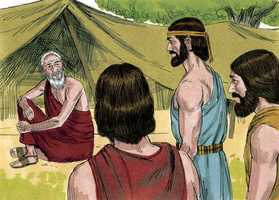 

**2** 	E levantou os seus olhos, e olhou, e eis três homens em pé junto a ele. E vendo-os, correu da porta da tenda ao seu encontro e inclinou-se à terra,

**3** 	E disse: Meu Senhor, se agora tenho achado graça aos teus olhos, rogo-te que não passes de teu servo.

**4** 	Que se traga já um pouco de água, e lavai os vossos pés, e recostai-vos debaixo desta árvore;

**5** 	E trarei um bocado de pão, para que esforceis o vosso coração; depois passareis adiante, porquanto por isso chegastes até vosso servo. E disseram: Assim faze como disseste.

**6** 	E Abraão apressou-se em ir ter com Sara à tenda, e disse-lhe: Amassa depressa três medidas de flor de farinha, e faze bolos.

**7** 	E correu Abraão às vacas, e tomou uma vitela tenra e boa, e deu-a ao moço, que se apressou em prepará-la.

**8** 	E tomou manteiga e leite, e a vitela que tinha preparado, e pôs tudo diante deles, e ele estava em pé junto a eles debaixo da árvore; e comeram.

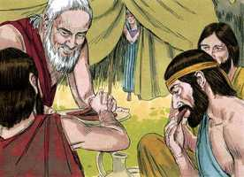 

**9** 	E disseram-lhe: Onde está Sara, tua mulher? E ele disse: Ei-la aí na tenda.

> **Cmt MHenry**: *Versículos 9-15* "Onde está Sara, tua mulher?", foi-lhe perguntado. Preste atenção à resposta: "Aqui na tenda". A mão, em seu lugar adequado, ocupada em seus afazeres domésticos. Nada se consegue com a ociosidade. Aqueles que mais provavelmente recebam consolo de Deus e suas promessas são as que estão em seu lugar apropriado e atendendo a seus deveres ([Lc 2.8](../42N-Lc/02.md#8)). Nós somos de lento coração para crer e necessitamos línea sobre línea para lográ-lo. As bênçãos que os outros têm de parte da providência comum, os crentes a tem da promessa divina, que os faz muito doces e muito seguros. A semente espiritual de Abraão deve sua vida, e gozo, e esperança e todo, à promessa. Sara pensa que isto é uma notícia demasiado boa para ser verdade; ri, e portanto, não pode ainda fazer-se à idéia para acreditar nela. Sara riu. Nós podemos não pensar que tenha havido diferença entre o riso de Sara e o de Abraão (capítulo 17.17). Porém Aquele que esquadrinha o coração viu que um surgia da incredulidade e o outro, da fé. Sara negou ter-se rido. Um pecado costuma levar a outro e é provável que não mantenhamos estritamente a verdade quando questionamos a verdade divina. Contudo, o Senhor repreende, acusa, silencia e leva ao arrependimento aos que ama quando pecam ante Ele.

**10** 	E disse: Certamente tornarei a ti por este tempo da vida; e eis que Sara tua mulher terá um filho. E Sara escutava à porta da tenda, que estava atrás dele.

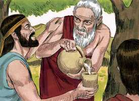 

**11** 	E eram Abraão e Sara já velhos, e adiantados em idade; já a Sara havia cessado o costume das mulheres.

**12** 	Assim, pois, riu-se Sara consigo, dizendo: Terei ainda deleite depois de haver envelhecido, sendo também o meu senhor já velho?

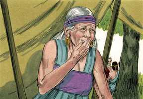 

**13** 	E disse o Senhor a Abraão: Por que se riu Sara, dizendo: Na verdade darei eu à luz ainda, havendo já envelhecido?

**14** 	Haveria coisa alguma difícil ao Senhor? Ao tempo determinado tornarei a ti por este tempo da vida, e Sara terá um filho.

**15** 	E Sara negou, dizendo: Não me ri; porquanto temeu. E ele disse: Não digas isso, porque te riste.

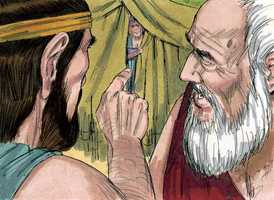 

**16** 	E levantaram-se aqueles homens dali, e olharam para o lado de Sodoma; e Abraão ia com eles, acompanhando-os.

> **Cmt MHenry**: *Versículos 16-22* Os dois que se supõe eram anjos criados continuaram a Sodoma. Aquele que foi chamado Jeová em todo o capítulo, continuou com Abraão e não ocultou o que se propunha realizar. Apesar de que Deus suporta muito aos pecadores, pelo qual imaginam que o Senhor não vê e que não se importa, quando chegar o dia de Sua ira, Ele os olhará. O Senhor dará a Abraão uma oportunidade para interceder ante Ele, e lhe mostra a razão de sua conduta. Considere-se, como parte muito brilhante do caráter e exemplo de Abraão, que ele não só orava com sua família, senão que punha muito cuidado em ensiná-los e dirigi-los bem. Os que esperam bênçãos familiares devem tomar consciência do dever familiar. Abraão não lhes encheu a cabeça com assuntos de duvidoso debate; os ensinou a serem sérios e devotos para adorarem a Deus, e a ser honestos em seus tratamentos com todos os homens. quão poucas são as pessoas nas quais tal caráter se dá em nossa época! Quão pouco cuidado têm oração chefes de família em fundamentar nos princípios da religião aos que estão a seu cuidado! Vigiamos de dia de repouso em dia de repouso se adiantam ou retrocedem?

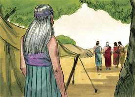 

**17** 	E disse o Senhor: Ocultarei eu a Abraão o que faço,

**18** 	Visto que Abraão certamente virá a ser uma grande e poderosa nação, e nele serão benditas todas as nações da terra?

> **Cmt MHenry**: *Capítulo 18A-Jo

**19** 	Porque eu o tenho conhecido, e sei que ele há de ordenar a seus filhos e à sua casa depois dele, para que guardem o caminho do Senhor, para agir com justiça e juízo; para que o Senhor faça vir sobre Abraão o que acerca dele tem falado.

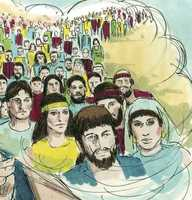 

**20** 	Disse mais o Senhor: Porquanto o clamor de Sodoma e Gomorra se tem multiplicado, e porquanto o seu pecado se tem agravado muito,

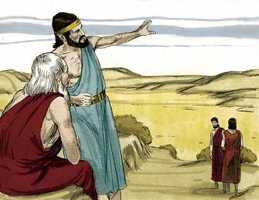 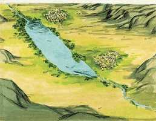 

**21** 	Descerei agora, e verei se com efeito têm praticado segundo o seu clamor, que é vindo até mim; e se não, sabê-lo-ei.

**22** 	Então viraram aqueles homens os rostos dali, e foram-se para Sodoma; mas Abraão ficou ainda em pé diante da face do Senhor.

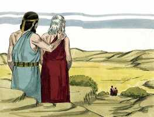 

**23** 	E chegou-se Abraão, dizendo: Destruirás também o justo com o ímpio?

> **Cmt MHenry**: *Versículos 23-33* Eis aqui a primeira oração solene registrada na Bíblia; é uma oração para salvar a Sodoma. Abraão orou fervorosamente para que Sodoma fosse poupada, se tão só se achassem nela uns poucos justos. Venham e aprendam de Abraão quanta compaixão devemos sentir pelos pecadores e quão fervorosamente devemos orar por eles. Aqui vemos que a oração eficaz do justo pode muito. Sem dúvida que Abraão fracassou em seus pedidos por todo o lugar, porém Ló foi miraculosamente livrado. Então, animem-se a esperar, por meio da oração fervorosa, da bênção de Deus para sua família, suas amizades, sua vizinhança. Com tal fim não somente devem orar, senão viver como Abraão. Ele sabia que o Juiz de toda a terra faria o justo. não pede que se salve o malvado por si mesmo nem porque seja cruel destruí-lo, senão por amor do justo que possa ser achado entre eles. Somente a justiça pode ser argumento diante de Deus. então, como intercedeu Cristo pelos transgressores? Não culpando a lei divina nem alegando a extenuação ou escusando a culpa humana, senão oferecendo SUA PRÓPRIA OBEDIÊNCIA até a morte. "

**24** 	Se porventura houver cinqüenta justos na cidade, destruirás também, e não pouparás o lugar por causa dos cinqüenta justos que estão dentro dela?

**25** 	Longe de ti que faças tal coisa, que mates o justo com o ímpio; que o justo seja como o ímpio, longe de ti. Não faria justiça o Juiz de toda a terra?

**26** 	Então disse o Senhor: Se eu em Sodoma achar cinqüenta justos dentro da cidade, pouparei a todo o lugar por amor deles.

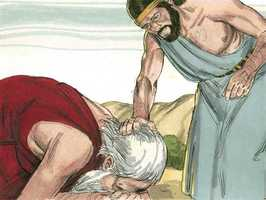 

**27** 	E respondeu Abraão dizendo: Eis que agora me atrevi a falar ao Senhor, ainda que sou pó e cinza.

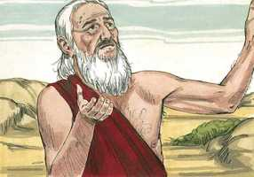 

**28** 	Se porventura de cinqüenta justos faltarem cinco, destruirás por aqueles cinco toda a cidade? E disse: Não a destruirei, se eu achar ali quarenta e cinco.

**29** 	E continuou ainda a falar-lhe, e disse: Se porventura se acharem ali quarenta? E disse: Não o farei por amor dos quarenta.

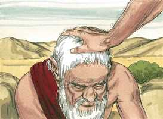 

**30** 	Disse mais: Ora, não se ire o Senhor, se eu ainda falar: Se porventura se acharem ali trinta? E disse: Não o farei se achar ali trinta.

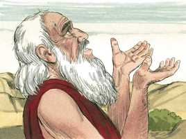 

**31** 	E disse: Eis que agora me atrevi a falar ao Senhor: Se porventura se acharem ali vinte? E disse: Não a destruirei por amor dos vinte.

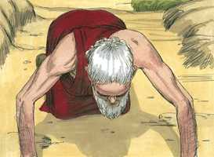 

**32** 	Disse mais: Ora, não se ire o Senhor, que ainda só mais esta vez falo: Se porventura se acharem ali dez? E disse: Não a destruirei por amor dos dez.

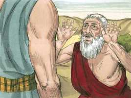 

**33** 	E retirou-se o Senhor, quando acabou de falar a Abraão; e Abraão tornou-se ao seu lugar.

 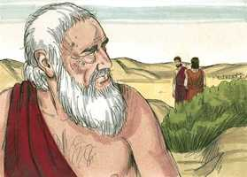 

> **Cmt MHenry** Intro: *• Versículos 1-8*> *O Senhor se aparece a Abraão*> *• Versículos 9-15*> *Repreensão da incredulidade de Sara*> *• Versículos 16-22*> *Deus revela a Abraão a destruição de Sodoma*> *• Versículos 23-33*> *A intercessão de Abraão por Sodoma*