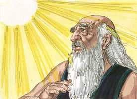
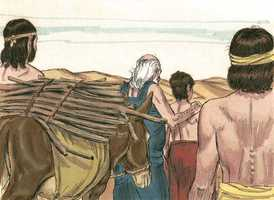
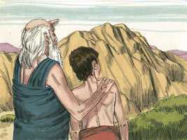
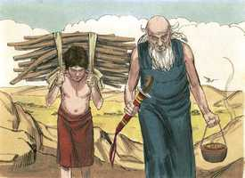
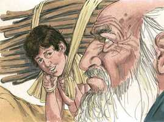
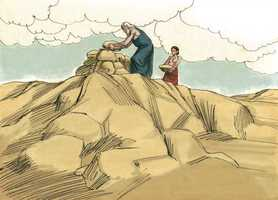
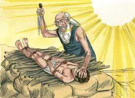
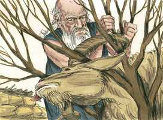
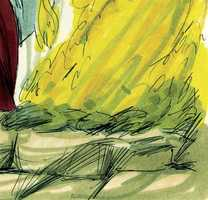
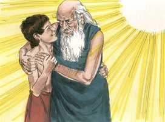

# Gênesis Cap 22

**1** 	E ACONTECEU depois destas coisas, que provou Deus a Abraão, e disse-lhe: Abraão! E ele disse: Eis-me aqui.

> **Cmt MHenry**: *Versículos 1-2* Nunca estamos a salvo das provações. *Tentar* e *provar,* em hebraico, se expressam com a mesma palavra. Toda prova é, sem dúvida, uma tentação, e tende a mostrar as disposições do coração, se são santas ou ímpias. Porém Deus provou a Abraão, não para conduzi-lo ao pecado, como tenta Satanás. A fé firme costuma exercitar-se com as grandes provas e quando lhe pedem serviços difíceis de serem cumpridos. O mandamento de oferecer a seu filho se dá numa linguagem que faz a prova mais penosa ainda; aqui cada palavra é uma espada. Observe-se: 1) *A pessoa do sacrifício:* toma a teu filho; não teus touros nem teus cordeiros. Com quanta vontade teria partido Abraão com todos eles para remir a Isaque! Teu filho; não teu servo. Teu uno filho; o filho único com Sara. Toma a Isaque, o filho que amas. 2) *O lugar:* a três dias de viagem; de modo que Abraão tivesse tempo de meditar e obedecesse deliberadamente. 3) *A forma:* oferece-o em holocausto; não somente mata teu filho, teu Isaque, senão mata-o como um sacrifício; matá-lo com toda aquela solene pompa e cerimônia, com que costumava oferecer seus holocaustos.

 

**2** 	E disse: Toma agora o teu filho, o teu único filho, Isaque, a quem amas, e vai-te à terra de Moriá, e oferece-o ali em holocausto sobre uma das montanhas, que eu te direi.

**3** 	Então se levantou Abraão pela manhã de madrugada, e albardou o seu jumento, e tomou consigo dois de seus moços e Isaque seu filho; e cortou lenha para o holocausto, e levantou-se, e foi ao lugar que Deus lhe dissera.

> **Cmt MHenry**: *Versículos 3-10* Nunca foi o ouro provado em fogo mais ardente. Quem, salvo Abraão, não teria discutido com? Tal teria sido o pensamento de um coração fraco, porém Abraão sabia que tratava com um Deus, com Jeová. A fé tinha-lhe ensinado a não discutir, senão a obedecer. Tem a certeza de que o mandamento de Deus é bom; que o que Ele tem prometido não pode ser quebrantado. Nas coisas de Deus, quem consulte com carne e sangue nunca oferecerá seu Isaque a Jeová. O bom patriarca se levanta cedo e começa sua triste viagem. Agora viaja três dias, e Isaque continua perto dele! A desgraça se faz mais difícil quando dura muito. A expressão "voltemos a vocês", indica que Abraão esperava que Isaque, sendo ressuscitado dentre os mortos, regressaria com ele. Foi uma pergunta muito sensível a que lhe fez Isaque, enquanto iam juntos: "Meu pai", disse Isaque; era uma palavra que derreteria, uma palavra que, alguém pensaria, fincaria fundo no coração de Abraão, mais que seu cutelo no coração de Isaque. Contudo, esperava a pergunta de seu filho. Então Abraão, sem ter a intenção, profetiza: "Deus se proverá de cordeiro para o holocausto, meu filho". O Espírito Santo, por boca de Abraão, parece anunciar o Cordeiro de Deus, que Jeová tem provido e que tira o pecado do mundo. Abraão dispõe a lenha para a pira funerária de seu Isaque e, agora, lhe dá a surpreendente notícia: Isaque, você é o cordeiro que Deus proveu! Sem dúvida, Abraão o consola com as mesmas esperanças com que ele mesmo foi consolado pela fé. não obstante é necessário que o sacrifício seja amarrado. O grande Sacrifício que, no cumprimento dos tempos, seria oferecido, devia ser amarrado e assim também Isaque. Feito isto, Abraão toma seu cutelo e estende sua mão para dar o golpe fatal. Eis aqui um ato de fé e obediência que merece ser um espetáculo para Deus, os anjos e os homens. Deus, em sua providência, às vezes nos chama a separar-nos de um Isaque e devemos fazê-lo com alegre submissão a sua santa vontade ([1 Sm 3.18](../09A-1Sm/03.md#18)).

 

**4** 	Ao terceiro dia levantou Abraão os seus olhos, e viu o lugar de longe.

 

**5** 	E disse Abraão a seus moços: Ficai-vos aqui com o jumento, e eu e o moço iremos até ali; e havendo adorado, tornaremos a vós.

**6** 	E tomou Abraão a lenha do holocausto, e pô-la sobre Isaque seu filho; e ele tomou o fogo e o cutelo na sua mão, e foram ambos juntos.

 

**7** 	Então falou Isaque a Abraão seu pai, e disse: Meu pai! E ele disse: Eis-me aqui, meu filho! E ele disse: Eis aqui o fogo e a lenha, mas onde está o cordeiro para o holocausto?

 

**8** 	E disse Abraão: Deus proverá para si o cordeiro para o holocausto, meu filho. Assim caminharam ambos juntos.

**9** 	E chegaram ao lugar que Deus lhe dissera, e edificou Abraão ali um altar e pôs em ordem a lenha, e amarrou a Isaque seu filho, e deitou-o sobre o altar em cima da lenha.

 

**10** 	E estendeu Abraão a sua mão, e tomou o cutelo para imolar o seu filho;

 

**11** 	Mas o anjo do Senhor lhe bradou desde os céus, e disse: Abraão, Abraão! E ele disse: Eis-me aqui.

> **Cmt MHenry**: *Versículos 11-14* Não era intenção de Deus que Isaque fosse realmente sacrificado, conquanto, no tempo oportuno, seria derramado pelo pecado um sangue mais nobre que o dos animais, o sangue do unigênito Filho de Deus. contudo, ainda assim Deus não teria aceitado, em caso nenhum, os sacrifícios humanos. Foi provido outro sacrifício. Devia ter referência ao Messias prometido, à Semente bendita. Cristo foi sacrificado em nosso lugar, como este cordeiro em lugar de Isaque, e sua morte foi a nossa expiação. Observe-se que o templo, o lugar do sacrifício, foi construído depois neste mesmo monte Moriá; e estava perto do Calvário onde Cristo foi crucificado. Foi dado um novo nome a esse lugar, para ânimo de todos os crentes, até o fim do mundo, para que alegremente confiem em Deus e o obedeçam. Jeová-Jiré, Jeová proverá, aludindo provavelmente ao que tinha dito Abraão: Deus se proveria de um cordeiro. O Senhor sempre terá seu olho sobre seu povo, em suas angústias e inquietudes, para dar-lhe ajuda oportuna.

**12** 	Então disse: Não estendas a tua mão sobre o moço, e não lhe faças nada; porquanto agora sei que temes a Deus, e não me negaste o teu filho, o teu único filho.

**13** 	Então levantou Abraão os seus olhos e olhou; e eis um carneiro detrás dele, travado pelos seus chifres, num mato; e foi Abraão, e tomou o carneiro, e ofereceu-o em holocausto, em lugar de seu filho.

  

**14** 	E chamou Abraão o nome daquele lugar: O Senhor PROVERÁ; donde se diz até ao dia de hoje: No monte do Senhor se proverá.

**15** 	Então o anjo do Senhor bradou a Abraão pela segunda vez desde os céus,

> **Cmt MHenry**: *Versículos 15-19* Há elevadas afirmações do favor de Deus para com Abraão nesta confirmação da aliança com ele, que excedem tudo aquilo com o qual ele tinha já sido abençoado. Os que estão dispostos a separar-se de qualquer coisa por Deus, se verão recompensados com indizível vantagem. A promessa (versículo 18), aponta sem dúvida ao Messias e à graça do Evangelho. Por isso, conhecemos a amorosa bondade de Deus nosso Salvador para com o homem pecador, em que Ele não poupou seu Filho, seu Filho unigênito, e o deu por nós. Nisto percebemos o amor de Cristo, em que se deu como sacrifício por nossos pecados. Contudo, Ele vive e chama aos pecadores para que vão a Ele e participem de sua salvação comprada com sangue. Ele chama a seu povo remido a regozijar-se nEle e a glorificá-lo. então, que lhe daremos por todos seus benefícios? Que seu amor nos constranja a viver, não para nós mesmos, senão para Aquele que morreu por nós e ressuscitou. Admirando e adorando Sua graça, consagremos nosso todo ao serviço dAquele que deu sua vida por nossa salvação. Todo o mais querido nesta terra é nosso Isaque. A única maneira que temos de achar consolo em algo terreno é colocá-lo pela fé nas mãos de Deus. todavia, lembremos que Abraão não foi justificado por sua prontidão para obedecer, senão pela obediência infinitamente mais nobre de Jesus Cristo; sua fé ao receber isto, ao confiar nisso, ao regozijar-se nisso, lhe deu a disposição e o fez capaz de tão admirável abnegação e dever.

 

**16** 	E disse: Por mim mesmo jurei, diz o Senhor: Porquanto fizeste esta ação, e não me negaste o teu filho, o teu único filho,

**17** 	Que deveras te abençoarei, e grandissimamente multiplicarei a tua descendência como as estrelas dos céus, e como a areia que está na praia do mar; e a tua descendência possuirá a porta dos seus inimigos;

**18** 	E em tua descendência serão benditas todas as nações da terra; porquanto obedeceste à minha voz.

 

**19** 	Então Abraão tornou aos seus moços, e levantaram-se, e foram juntos para Berseba; e Abraão habitou em Berseba.

**20** 	E sucedeu depois destas coisas, que anunciaram a Abraão, dizendo: Eis que também Milca deu filhos a Naor teu irmão.

> **Cmt MHenry**: *Versículos 20-24* Este capítulo termina com um relato da família de Naor que tinha-se estabelecido em Harã. Parece ter sido incluído pela relação que tinha com a igreja de Deus. De lá tomaram esposas Isaque e Jacó; e antes desta lista registra-se o relato destes acontecimentos. Mostra que apesar de que Abraão viu a sua própria família honrada com privilégios, admitida na aliança e abençoada com a certeza da promessa, ele não olhou com desdém a seus parentes, senão que se alegrou de ouvir da prosperidade e bem-estar de suas famílias. "

**21** 	Uz o seu primogênito, e Buz seu irmão, e Quemuel, pai de Arã,

**22** 	E Quésede, e Hazo, e Pildas, e Jidlafe, e Betuel.

> **Cmt MHenry**: *CAPÍTULO 22A-Ct

**23** 	E Betuel gerou Rebeca. Estes oito deu à luz Milca a Naor, irmão de Abraão.

**24** 	E a sua concubina, cujo nome era Reumá, ela lhe deu também a Tebá, Gaã, Taás e Maaca.

> **Cmt MHenry** Intro: *• Versículos 1-2*> *Deus manda Abraão a sacrificar a Isaque*> *• Versículos 2-10*> *Fé e obediência de Abraão ante o mandamento divino*> *• Versículos 11-14*> *Provisão de outro sacrifício como substituto de Isaque*> *• Versículos 15-19*> *Renovação da aliança com Abraão*> *• Versículos 20-24*> *A família de Naor*