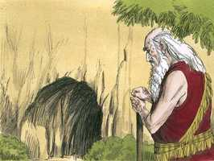

# Gênesis Cap 23

**1** 	E FOI a vida de Sara cento e vinte e sete anos; estes foram os anos da vida de Sara.

> **Cmt MHenry**: *Versículos 1-13* A vida mais prolongada deve cedo chegar a seu fim. Bendito seja Deus que há um mundo onde o pecado, a morte, a vaidade e a vexação não podem entrar. Bendito seja seu nome, que nem sequer a morte pode separar os crentes da união com Cristo. aqueles aos que mais amamos, sim, até nossos corpos, que tanto cuidamos, devem logo tornar-se asquerosos montões de pó e ser enterrados fora da vista. Então, quão soltos estarmos de todas as ataduras e enfeites terrenos! Procuremos antes que nossas almas estejam ornadas com graças celestiais. Abraão rendeu honra e respeito aos príncipes de Hete, embora eram ímpios cananeus. A religião da Bíblia nos insta a respeitar devidamente a todos os que estão na autoridade, sem bajular suas pessoas nem alentar seus delitos se são pessoas indignas. A nobre generosidade destes cananeus envergonha e condena o caráter fechado, egoísta e áspero de muitos que se qualificam de israelitas. Não foi por orgulho que Abraão rejeitou a dádiva, ou porque detestasse ficar obrigado a Efrom, senão por justiça e prudência. Abraão podia pagar o terreno e, portanto, não quis aproveitar-se da generosidade de Efrom. A honestidade, assim como a honra, nos proíbem aproveitar-nos da generosidade de nosso próximo e impor-nos sobre os que dão livremente.

**2** 	E morreu Sara em Quiriate-Arba, que é Hebrom, na terra de Canaã; e veio Abraão lamentar Sara e chorar por ela.

**3** 	Depois se levantou Abraão de diante de sua morta, e falou aos filhos de Hete, dizendo:

**4** 	Estrangeiro e peregrino sou entre vós; dai-me possessão de sepultura convosco, para que eu sepulte a minha morta de diante da minha face.

**5** 	E responderam os filhos de Hete a Abraão, dizendo-lhe:

**6** 	Ouve-nos, meu senhor; príncipe poderoso és no meio de nós; enterra a tua morta na mais escolhida de nossas sepulturas; nenhum de nós te vedará a sua sepultura, para enterrar a tua morta.

**7** 	Então se levantou Abraão, inclinou-se diante do povo da terra, diante dos filhos de Hete,

**8** 	E falou com eles, dizendo: Se é de vossa vontade que eu sepulte a minha morta de diante de minha face, ouvi-me e falai por mim a Efrom, filho de Zoar,

**9** 	Que ele me dê a cova de Macpela, que ele tem no fim do seu campo; que ma dê pelo devido preço em herança de sepulcro no meio de vós.

**10** 	Ora Efrom habitava no meio dos filhos de Hete; e respondeu Efrom, heteu, a Abraão, aos ouvidos dos filhos de Hete, de todos os que entravam pela porta da sua cidade, dizendo:

**11** 	Não, meu senhor, ouve-me: O campo te dou, também te dou a cova que nele está, diante dos olhos dos filhos do meu povo ta dou; sepulta a tua morta.

**12** 	Então Abraão se inclinou diante da face do povo da terra,

**13** 	E falou a Efrom, aos ouvidos do povo da terra, dizendo: Mas se tu estás por isto, ouve-me, peço-te. O preço do campo o darei; toma-o de mim e sepultarei ali a minha morta.

**14** 	E respondeu Efrom a Abraão, dizendo-lhe:

> **Cmt MHenry**: *Versículos 14-20* A prudência e a justiça nos mandam ser eqüitativos e francos em nossos tratos; os negócios enganosos não iluminam. Abraão paga o dinheiro sem fraude nem demora. Paga todo de imediato sem deixar nada; e bem pesado, de boa lei entre mercadores, sem engano. Veja-se como se usava antigamente o dinheiro, para facilidade do comércio, e com quanta honestidade devia pagar-se uma dívida. Embora toda a terra de Canaã era de Abraão pela promessa, ainda não tinha chegado o tempo de possuí-la, e ele teve a ocasião de comprar e pagar. O domínio não se fundamenta na graça. O direito dos santos a uma herança eterna não lhes dá o direito às possessões deste mundo, nem os justifica para fazer o mal. Honesta e eqüitativamente, Efrom faz um título válido da terra. Assim como aquilo que se compra, deve ser pago com honestidade, assim o que se vende deve ser entregue e assegurado honestamente. Manejemos nossas preocupações com pontualidade e exatidão para evitar discórdias. Abraão enterrou a Sara na cova ou abóbada que havia no campo comprado. Isso lhe faria querida a terra a sua descendência. Vale a pena perceber que um lugar para sepultar era o único pedaço de terra que Abraão possui em Canaã. Os que menos têm nesta terra, encontram um túmulo nela. Este sepulcro estava no extremo do campo; quaisquer que sejam nossas possessões, há um lugar para sepultura no final delas. Era um sinal de sua fé e esperança de ressurreição. Abraão se contenta com continuar sendo um peregrino enquanto viver, porém se assegura de um lugar aonde, quando mortifica, sua carne possa repousar com esperança. Depois de tudo, a principal preocupação é com quem ressuscitaremos.

**15** 	Meu senhor, ouve-me, a terra é de quatrocentos siclos de prata; que é isto entre mim e ti? Sepulta a tua morta.

**16** 	E Abraão deu ouvidos a Efrom, e Abraão pesou a Efrom a prata de que tinha falado aos ouvidos dos filhos de Hete, quatrocentos siclos de prata, corrente entre mercadores.

**17** 	Assim o campo de Efrom, que estava em Macpela, em frente de Manre, o campo e a cova que nele estava, e todo o arvoredo que no campo havia, que estava em todo o seu contorno ao redor,

**18** 	Se confirmou a Abraão em possessão diante dos olhos dos filhos de Hete, de todos os que entravam pela porta da cidade.

**19** 	E depois sepultou Abraão a Sara sua mulher na cova do campo de Macpela, em frente de Manre, que é Hebrom, na terra de Canaã.

 

**20** 	Assim o campo e a cova que nele estava foram confirmados a Abraão, pelos filhos de Hete, em possessão de sepultura.

> **Cmt MHenry** Intro: *CAPÍTULO 23A-Is> *• Versículos 1-13*> *A morte de Sara – Abraão solicita um lugar para sepultura*> *• Versículos 14-20*> *O sepulcro de Sara*