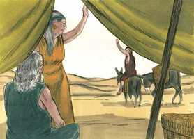
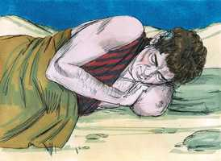
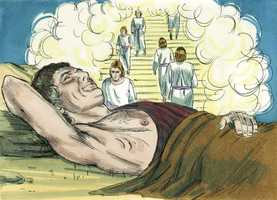
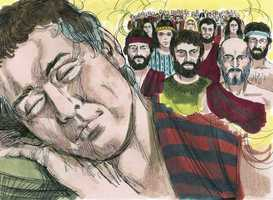
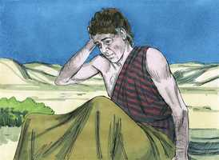
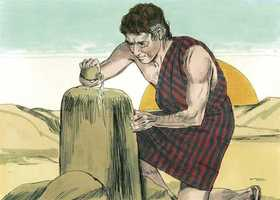
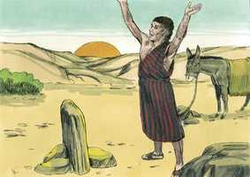
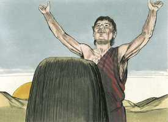

# Gênesis Cap 28

**1** 	E ISAQUE chamou a Jacó, e abençoou-o, e ordenou-lhe, e disse-lhe: Não tomes mulher de entre as filhas de Canaã;

> **Cmt MHenry**: *Versículos 1-5* Jacó tinha promessas de bênçãos para este mundo e para o vindouro, mas sai para trabalhar em forma árdua. Isto o ajudou a corrigir-se pela fraude perpetrado a seu pai. A bênção lhe será conferida, mas terá aguda dor pelo curso indireto tomado para obtê-la. Jacó é despedido por seu pai com um solene encargo. Ele não deve tomar esposa das filhas de Canaã: os que professam a religião não devem casar com os que não se preocupam por sua fé. além disso, lhe dá uma bênção solene. Isaque tinha-o abençoado antes sem querer; agora o faz deliberadamente. Esta bondade é mais completa que a anterior; é uma bênção evangélica. Esta promessa aponta tão alto como o céu, do qual Canaã era um tipo. Essa era a pátria melhor que Jacó e os outros patriarcas tinham em vista.

**2** 	Levanta-te, vai a Padã-Arã, à casa de Betuel, pai de tua mãe, e toma de lá uma mulher das filhas de Labão, irmão de tua mãe;

**3** 	E Deus Todo-Poderoso te abençoe, e te faça frutificar, e te multiplique, para que sejas uma multidão de povos;

**4** 	E te dê a bênção de Abraão, a ti e à tua descendência contigo, para que em herança possuas a terra de tuas peregrinações, que Deus deu a Abraão.

**5** 	Assim despediu Isaque a Jacó, o qual se foi a Padã-Arã, a Labão, filho de Betuel, arameu, irmão de Rebeca, mãe de Jacó e de Esaú.

 

**6** 	Vendo, pois, Esaú que Isaque abençoara a Jacó, e o enviara a Padã-Arã, para tomar mulher dali para si, e que, abençoando-o, lhe ordenara, dizendo: Não tomes mulher das filhas de Canaã;

> **Cmt MHenry**: *Versículos 6-9* Os bons exemplos impressionam até o profano e perverso. Contudo, Esaú pensou em comprazer seus pais em uma coisa a fim de expiar os outros males cometidos. Os corações carnais são dados a crer-se tão bons como deveriam ser porque em algum aspecto não são tão maus como poderiam ter sido.

**7** 	E que Jacó obedecera a seu pai e a sua mãe, e se fora a Padã-Arã;

**8** 	Vendo também Esaú que as filhas de Canaã eram más aos olhos de Isaque seu pai,

**9** 	Foi Esaú a Ismael, e tomou para si por mulher, além das suas mulheres, a Maalate filha de Ismael, filho de Abraão, irmã de Nebaiote.

**10** 	Partiu, pois, Jacó de Berseba, e foi a Harã;

> **Cmt MHenry**: *Versículos 10-15* A conduta de Jacó até agora, segundo o relato, não era a que alguém que simplesmente tem temor de Deus e confia nEle. Mas agora, com problemas, obrigado a fugir, somente buscou a Deus para que lhe permitisse estar a salvo e poder deitar a dormir à intempérie com sua cabeça sobre uma pedra. Todo crente verdadeiro deve estar disposto a virar-se com o travesseiro de Jacó, supondo que possa ter a visão de Jacó. O tempo de Deus para visitar sua gente com suas consolações é quando estão completamente privados de outros consolos e de outros consoladores. Jacó viu uma escada que ia da terra ao céu, os anjos subindo e descendo por ela, e o próprio Deus no alto dela. Isto representa: 1) *A providência de Deus, pela qual se mantém um intercâmbio constante entre o céu e a terra*. Isto faz saber a Jacó que ele tinha ao mesmo tempo um bom guia e um bom guardião. 2) *A mediação de Cristo*. Ele é a escada; o pé na terra é sua natureza humana; o topo no céu, sua natureza divina. Cristo é o Caminho ([Jo 1.51](../43N-Joa/01.md#51)). Por este caminho os pecadores se aproximam do trono da graça com aceitação. Pela fé vemos este caminho e, em oração, nos aproximamos a ele. em resposta à oração recebemos todas as necessárias bênçãos da providência e da graça. Não temos caminho para chegar ao céu a não ser por meio de Cristo. quando a alma, pela fé, pode ver estas coisas, então todo lugar se tornará agradável e toda perspectiva, gozosa. Ele nunca nos deixará até que sua última promessa seja cumprida para nossa felicidade eterna. Deus falou consoladoramente a Jacó. Falou-lhe desde o alto da escada. Todas as felizes novas que recebemos do céu vêm por meio de Jesus Cristo. o Messias devia vir de Jacó. Cristo é a grande bênção do mundo. Todos os que são abençoados, são abençoados nEle, e ninguém, de nenhuma família, fica fora da bênção nEle senão aqueles que se auto-excluem. Jacó tinha uma longa viagem pela frente a um país desconhecido, todavia, "Eis aqui, eu estou contigo", e Deus promete trazê-lo de volta a esta terra. Parecia abandonado de todos seus amigos, porém Deus lhe deu esta certeza, "Eu não te deixarei". Deus nunca abandona ao que ama.

**11** 	E chegou a um lugar onde passou a noite, porque já o sol era posto; e tomou uma das pedras daquele lugar, e a pôs por seu travesseiro, e deitou-se naquele lugar.

 

**12** 	E sonhou: e eis uma escada posta na terra, cujo topo tocava nos céus; e eis que os anjos de Deus subiam e desciam por ela;

 

**13** 	E eis que o Senhor estava em cima dela, e disse: Eu sou o Senhor Deus de Abraão teu pai, e o Deus de Isaque; esta terra, em que estás deitado, darei a ti e à tua descendência;

**14** 	E a tua descendência será como o pó da terra, e estender-se-á ao ocidente, e ao oriente, e ao norte, e ao sul, e em ti e na tua descendência serão benditas todas as famílias da terra;

 

**15** 	E eis que estou contigo, e te guardarei por onde quer que fores, e te farei tornar a esta terra; porque não te deixarei, até que haja cumprido o que te tenho falado.

**16** 	Acordando, pois, Jacó do seu sono, disse: Na verdade o Senhor está neste lugar; e eu não o sabia.

> **Cmt MHenry**: *Versículos 16-19* Deus se manifestou Ele mesmo e seu favor a Jacó enquanto este dormia. O Espírito, como o vento, sopra quando e onde quer, e a graça de Deus, como o orvalho, não se retrasa para os filhos dos homens. Jacó procurou superar-se a partir da visita que Deus lhe fez. Onde quer que estejamos, na cidade ou no deserto, na casa ou no campo, na tenda ou na rua, podemos manter nossa relação com o Céu; se não for assim, é a nossa própria falta. Porém, quanto mais vejamos de Deus, mais causa teremos para um santo tremor diante dEle.

 

**17** 	E temeu, e disse: Quão terrível é este lugar! Este não é outro lugar senão a casa de Deus; e esta é a porta dos céus.

**18** 	Então levantou-se Jacó pela manhã de madrugada, e tomou a pedra que tinha posto por seu travesseiro, e a pôs por coluna, e derramou azeite em cima dela.

 

**19** 	E chamou o nome daquele lugar Betel; o nome porém daquela cidade antes era Luz.

**20** 	E Jacó fez um voto, dizendo: Se Deus for comigo, e me guardar nesta viagem que faço, e me der pão para comer, e vestes para vestir;

> **Cmt MHenry**: *Versículos 20-22* Nesta ocasião Jacó formulou um solene voto. Observe-se o seguinte: 1) *A fé de Jacó.* Ele confia que Deus estará com ele e que o guardará; ele confia nisso. 2) *A moderação de Jacó em seus desejos.* Não pede roupa suave nem carne gostosa. Se Deus nos dá muito, devemos estar agradecidos e usá-lo para Ele; se nos der pouco, devemos estar contentes e desfrutar alegremente dEle no pouco. 3) *A piedade de Jacó e sua consideração de Deus, que são vistas no que desejou, que Deus estivesse com ele e o guardasse.* Não devemos desejar mais para ficarmos cômodos e felizes. Também sua resolução é aferrar-se ao Senhor como seu Deus da aliança. Quando recebemos mais que a graça comum de Deus, devemos abundar em gratidão para Ele. O dízimo é uma proporção adequada para consagrar a Deus e empregá-la para Ele, embora pode ser mais ou menos, segundo Deus nos prospere ([1 Co 16.2](../46N-1Co/16.md#2)). Então, lembremo-nos de nossos Beteles, como estamos comprometidos por votos solenes a render-nos ao Senhor, para tomá-lo por nosso Deus e consagrar todo o que temos e somos para Sua glória! "

 

**21** 	E eu em paz tornar à casa de meu pai, o Senhor me será por Deus;

**22** 	E esta pedra que tenho posto por coluna será casa de Deus; e de tudo quanto me deres, certamente te darei o dízimo.

 

> **Cmt MHenry** Intro: *CAPÍTULO 28A-Os> *• Versículos 1-5*> *Isaque manda a Jacó a Padã-Harã*> *• Versículos 6-9*> *Esaú casa com a filha de Ismael*> *• Versículos 10-15*> *A visão de Jacó*> *• Versículos 16-19*> *A pedra de Betel*> *• Versículos 20-22*> *O voto de Jacó*