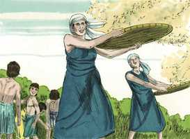

# Gênesis Cap 29

**1** 	ENTÃO pôs-se Jacó a caminho e foi à terra do povo do oriente;

> **Cmt MHenry**: *Versículos 1-8* Jacó prosseguiu alegre sua viagem depois da doce comunhão que teve com Deus em Betel. A providência o levou ao campo onde deviam beber os animais de seu tio. O que se diz do cuidado dos pastores por suas ovelhas pode lembrar-nos a tenra preocupação que nosso Senhor Jesus, o grande Pastor das ovelhas, tem por seu rebanho, a igreja; por Ele é o bom portanto que conhece suas ovelhas, e a quem elas conhecem. A pedra da boca do poço era para fechá-lo; a água era escassa, não estava ali para que qualquer um a usasse: mas os interesses particulares não nos devem impedir que nos ajudemos uns a outros. quando se juntavam todos os pastores com seus rebanhos, então, juntos, como bons vizinhos, davam de beber a seus animais. A lei da clemência ao falar tem um poder obrigatório ([Pv 31.26](../20A-Pv/31.md#26)). Jacó foi bem educado com estes estrangeiros e achou que eles eram bem educados para com ele.

**2** 	E olhou, e eis um poço no campo, e eis três rebanhos de ovelhas que estavam deitados junto a ele; porque daquele poço davam de beber aos rebanhos; e havia uma grande pedra sobre a boca do poço.

 

**3** 	E ajuntavam ali todos os rebanhos, e removiam a pedra de sobre a boca do poço, e davam de beber às ovelhas; e tornavam a pôr a pedra sobre a boca do poço, no seu lugar.

**4** 	E disse-lhes Jacó: Meus irmãos, donde sois? E disseram: Somos de Harã.

 

**5** 	E ele lhes disse: Conheceis a Labão, filho de Naor? E disseram: Conhecemos.

**6** 	Disse-lhes mais: Está ele bem? E disseram: Está bem, e eis aqui Raquel sua filha, que vem com as ovelhas.

**7** 	E ele disse: Eis que ainda é pleno dia, não é tempo de ajuntar o gado; dai de beber às ovelhas, e ide apascentá-las.

**8** 	E disseram: Não podemos, até que todos os rebanhos se ajuntem, e removam a pedra de sobre a boca do poço, para que demos de beber às ovelhas.

**9** 	Estando ele ainda falando com eles, veio Raquel com as ovelhas de seu pai; porque ela era pastora.

> **Cmt MHenry**: *Versículos 9-14* Veja aqui a humildade e a laboriosidade de Raquel. Ninguém tem de envergonhar-se do trabalho honesto e útil, nem deve ser impedido pela preferência de alguém. Quando Jacó compreendeu que esta era sua parenta, esteve muito disposto a servi-la. Labão, embora não do melhor humor, deu-lhe as boas-vindas e se deu por satisfeito com o relato que Jacó lhe fez de si mesmo. Embora evitemos estarmos tolamente dispostos a acreditar em tudo o que nos seja dito, devemos ter cuidado de sermos suspicazes em forma pouco caridosa.

**10** 	E aconteceu que, vendo Jacó a Raquel, filha de Labão, irmão de sua mãe, e as ovelhas de Labão, irmão de sua mãe, chegou Jacó, e revolveu a pedra de sobre a boca do poço e deu de beber às ovelhas de Labão, irmão de sua mãe.

**11** 	E Jacó beijou a Raquel, e levantou a sua voz e chorou.

 

**12** 	E Jacó anunciou a Raquel que era irmão de seu pai, e que era filho de Rebeca; então ela correu, e o anunciou a seu pai.

**13** 	E aconteceu que, ouvindo Labão as novas de Jacó, filho de sua irmã, correu-lhe ao encontro, e abraçou-o, e beijou-o, e levou-o à sua casa; e ele contou a Labão todas estas coisas.

 

**14** 	Então Labão disse-lhe: Verdadeiramente és tu o meu osso e a minha carne. E ficou com ele um mês inteiro.

**15** 	Depois disse Labão a Jacó: Porque tu és meu irmão, hás de servir-me de graça? Declara-me qual será o teu salário.

> **Cmt MHenry**: *Versículos 15-30* No mês que Jacó se passou como hóspede, não esteve ocioso. Onde quer que estejamos é bom ocupar-nos em algo útil. Labão estava desejoso de que Jacó ficasse com ele. Não se deve obter vantagem das relações com os subordinados; é nosso dever recompensá-los. Jacó fez saber a Labão o afeto que tinha por sua filha Raquel. Carecendo de bens mundanos com os quais dotá-la, promete sete anos de serviços. O amor faz curtos e fáceis os serviços longos e difíceis; daí que lemos de trabalho com amor ([Hb 6.10](../58N-Hb/06.md#10)). Se soubermos valorizar a felicidade do céu, os sofrimentos deste tempo presente serão como nada para nós. Uma era de trabalho não será senão uns poucos dias para os que amam a Deus e anelam a vinda de Cristo. Jacó, que tinha-se aproveitado de seu pai, agora é utilizado por Labão, seu sogro, com um engano parecido. Daqui, que por injusto que tenha sido Labão, o Senhor foi justo: ver [Juízes 1.7](../07A-Jz/01.md#7)). Ainda aos justos, se derem um passo em falso, assim Deus lhes paga na terra. Muitos que como Jacó não são desenganados pela pessoa, em seus matrimônios, logo se encontram, para sua grande dor, desencantados pelo caráter. A eleição desta relação deve fazer-se com bom conselho e pensamento por ambas as partes. Há razões para acreditar que a escusa de Labão não era verdadeira. Seu modo de resolver a questão piorou o mal. Jacó se viu levado ao problema das muitas esposas. Ele não podia rejeitar a Raquel porque a havia desposado; muito menos podia rejeitar a Lia. Ainda não havia um mandamento expresso contra casar com mais de uma esposa. Era pecado de ignorância nos patriarcas, porém não justifica o mesmo costume atual quando a vontade de Deus está claramente dada a conhecer pela lei divina ([Lv 18.18](../03A-Lv/18.md#18)), e mais plenamente desde que, por nosso Salvador, podem unir-se somente um homem e uma mulher ([1 Co 7.2](../46N-1Co/07.md#2)).

**16** 	E Labão tinha duas filhas; o nome da mais velha era Lia, e o nome da menor Raquel.

 

**17** 	Lia tinha olhos tenros, mas Raquel era de formoso semblante e formosa à vista.

**18** 	E Jacó amava a Raquel, e disse: Sete anos te servirei por Raquel, tua filha menor.

 

**19** 	Então disse Labão: Melhor é que eu a dê a ti, do que eu a dê a outro homem; fica comigo.

**20** 	Assim serviu Jacó sete anos por Raquel; e estes lhe pareceram como poucos dias, pelo muito que a amava.

 

**21** 	E disse Jacó a Labão: Dá-me minha mulher, porque meus dias são cumpridos, para que eu me case com ela.

**22** 	Então reuniu Labão a todos os homens daquele lugar, e fez um banquete.

**23** 	E aconteceu, à tarde, que tomou Lia, sua filha, e trouxe-a a Jacó que a possuiu.

**24** 	E Labão deu sua serva Zilpa a Lia, sua filha, por serva.

**25** 	E aconteceu que pela manhã, viu que era Lia; pelo que disse a Labão: Por que me fizeste isso? Não te tenho servido por Raquel? Por que então me enganaste?

 

**26** 	E disse Labão: Não se faz assim no nosso lugar, que a menor se dê antes da primogênita.

 

**27** 	Cumpre a semana desta; então te daremos também a outra, pelo serviço que ainda outros sete anos comigo servires.

**28** 	E Jacó fez assim, e cumpriu a semana de Lia; então lhe deu por mulher Raquel sua filha.

 

**29** 	E Labão deu sua serva Bila por serva a Raquel, sua filha.

> **Cmt MHenry**: *CAPÍTULO 29A-Jl

**30** 	E possuiu também a Raquel, e amou também a Raquel mais do que a Lia e serviu com ele ainda outros sete anos.

**31** 	Vendo, pois, o Senhor que Lia era desprezada, abriu a sua madre; porém Raquel era estéril.

> **Cmt MHenry**: *Versículos 31-35* Os nomes que Lia dá a seus filhos expressavam seu respeito e consideração tanto para Deus como para seu esposo. Rubem, ou *olha um filho*, com este pensamento: "Agora meu marido me amará"; Levi, ou *unido*, com a expectativa de que "Esta vez meu marido se unirá comigo". O afeto mútuo é ao mesmo tempo um dever e o consolo da relação conjugal; e os companheiros de jugo devem considerar o agradar-se um ao outro ([1 Co 7.33-34](../46N-1Co/07.md#33)). Ela reconhece, agradecida, a bondosa providência de Deus ao ouvi-la. Em tudo o que nos sustente e console nas aflições ou se ocupe de nossa liberação delas, é Deus quem deve ser reconhecido nisso. Chamou Judá seu quarto filho, ou *louvor*, dizendo: "Esta vez louvarei a Jeová". Deste, segundo a carne, é que veio Cristo. qualquer seja a razão de nosso regozijo deve ser tema de nossa ação de graças. Os favores frescos devem apressar-nos a louvar a Deus pelos favores anteriores. Desta vez louvarei a Jeová mais e melhor do que tenho feito antes. Todos nossos louvores devem centrar-se em Cristo, como objeto deles e como Mediador deles. Ele desceu, segundo a carne, daquele cujo nome era *Louvor*, e Ele é o nosso louvor. Está Cristo formado em meu coração? Desta vez louvarei a Jeová. "

**32** 	E concebeu Lia, e deu à luz um filho, e chamou-o Rúben; pois disse: Porque o Senhor atendeu à minha aflição, por isso agora me amará o meu marido.

**33** 	E concebeu outra vez, e deu à luz um filho, dizendo: Porquanto o Senhor ouviu que eu era desprezada, e deu-me também este. E chamou-o Simeão.

**34** 	E concebeu outra vez, e deu à luz um filho, dizendo: Agora esta vez se unirá meu marido a mim, porque três filhos lhe tenho dado. Por isso chamou-o Levi.

**35** 	E concebeu outra vez e deu à luz um filho, dizendo: Esta vez louvarei ao Senhor. Por isso chamou-o Judá; e cessou de dar à luz.

 

> **Cmt MHenry** Intro: *• Versículos 1-8*> *Jacó chega ao poço de Harã*> *• Versículos 9-14*> *Seu encontro com Raquel – Labão o atende*> *• Versículos 15-30*> *O contrato de Jacó por Raquel – O engano de Labão*> *• Versículos 31-35*> 28A-Os filhos de Lia*