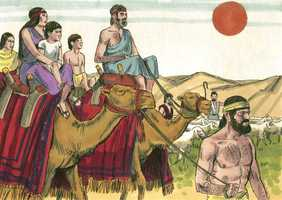
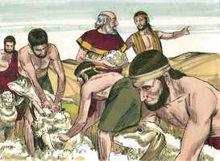
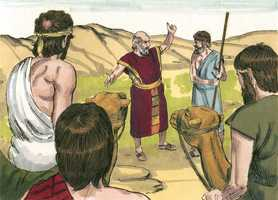
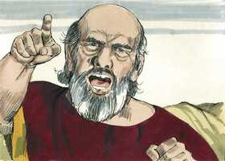
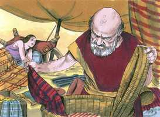
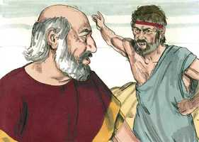
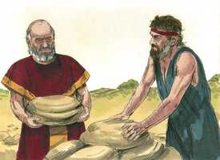
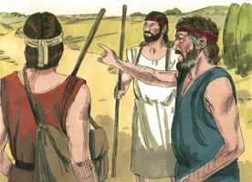
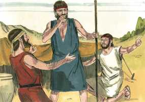

# Gênesis Cap 31

**1** 	ENTÃO ouvia as palavras dos filhos de Labão, que diziam: Jacó tem tomado tudo o que era de nosso pai, e do que era de nosso pai fez ele toda esta glória.

> **Cmt MHenry**: *Versículos 1-21* Os assuntos destas famílias se relatam com muito detalhe embora não se mencionam os assim chamados grandes acontecimentos dos estados e reinos deste período. A Bíblia ensina à gente os deveres corriqueiros da vida, como servir a Deus, como desfrutar as bênçãos que Ele outorga, e a fazer o bem nas variadas situações e deveres da vida. Os homens egoístas se consideram despojados de tudo o que fica fora de seu alcance, e a cobiça se engole até o afeto natural. A sobrevalorização da riqueza mundana que os homens fazem é um erro que é a raiz da cobiça, a inveja e de todo mal. Os homens do mundo entremetem-se no caminho alheio e cada um parece estar tirando dos outros; dali surgem o descontentamento, a inveja e a discórdia. Porém, há certas possessões que bastam por tudo; feliz aquele que as busca em primeiro lugar. Em todas nossas mudanças devemos respeitar o mandamento e a promessa de Deus. Se Ele está conosco, não temos nada a temer. Os perigos que nos rodeiam são tantos que, em verdade, nada mais pode dar ânimo a nossos corações. Lembrar as temporadas favorecidas pela comunhão com Deus é muito refrescante quando alguém está em dificuldades; e amiúde deveríamos lembrar nossos votos, para que não deixemos de cumpri-los.

**2** 	Viu também Jacó o rosto de Labão, e eis que não era para com ele como anteriormente.

**3** 	E disse o Senhor a Jacó: Torna-te à terra dos teus pais, e à tua parentela, e eu serei contigo.

**4** 	Então mandou Jacó chamar a Raquel e a Lia ao campo, para junto do seu rebanho,

**5** 	E disse-lhes: Vejo que o rosto de vosso pai não é para comigo como anteriormente; porém o Deus de meu pai tem estado comigo;

**6** 	E vós mesmas sabeis que com todo o meu esforço tenho servido a vosso pai;

**7** 	Mas vosso pai me enganou e mudou o salário dez vezes; porém Deus não lhe permitiu que me fizesse mal.

**8** 	Quando ele dizia assim: Os salpicados serão o teu salário; então todos os rebanhos davam salpicados. E quando ele dizia assim: Os listrados serão o teu salário, então todos os rebanhos davam listrados.

**9** 	Assim Deus tirou o gado de vosso pai, e deu-o a mim.

**10** 	E sucedeu que, ao tempo em que o rebanho concebia, eu levantei os meus olhos e vi em sonhos, e eis que os bodes, que cobriam as ovelhas, eram listrados, salpicados e malhados.

**11** 	E disse-me o anjo de Deus em sonhos: Jacó! E eu disse: Eis-me aqui.

**12** 	E disse ele: Levanta agora os teus olhos e vê todos os bodes que cobrem o rebanho, que são listrados, salpicados e malhados; porque tenho visto tudo o que Labão te fez.

**13** 	Eu sou o Deus de Betel, onde tens ungido uma coluna, onde me fizeste um voto; levanta-te agora, sai-te desta terra e torna-te à terra da tua parentela.

**14** 	Então responderam Raquel e Lia e disseram-lhe: Há ainda para nós parte ou herança na casa de nosso pai?

**15** 	Não nos considera ele como estranhas? Pois vendeu-nos, e comeu de todo o nosso dinheiro.

**16** 	Porque toda a riqueza, que Deus tirou de nosso pai, é nossa e de nossos filhos; agora, pois, faze tudo o que Deus te mandou.

**17** 	Então se levantou Jacó, pondo os seus filhos e as suas mulheres sobre os camelos;

 

**18** 	E levou todo o seu gado, e todos os seus bens, que havia adquirido, o gado que possuía, que alcançara em Padã-Arã, para ir a Isaque, seu pai, à terra de Canaã.

**19** 	E havendo Labão ido a tosquiar as suas ovelhas, furtou Raquel os ídolos que seu pai tinha.

**20** 	E Jacó logrou a Labão, o arameu, porque não lhe fez saber que fugia.

**21** 	E fugiu ele com tudo o que tinha, e levantou-se e passou o rio; e se dirigiu para a montanha de Gileade.

**22** 	E no terceiro dia foi anunciado a Labão que Jacó tinha fugido.

> **Cmt MHenry**: *Versículos 22-35* Deus pode pôr freio na boca dos homens maus para restringir sua maldade, embora não mude seus corações. Embora não amem o povo de Deus, o fingirão e tratarão de fazer méritos por necessidade. Néscio Labão! Chamar deuses todas essas coisas que podiam ser roubadas! Os inimigos podem roubar todos nossos bens, mas não nosso Deus. aqui Labão culpa a Jacó de coisas que não sabia. Os que encomendam sua causa a Deus não têm a proibição de rogar por ela com mansidão e temor. Quando lemos que Raquel rouba as imagens de seu pai, que cena de iniqüidade se abre! A família de Naor, que deixou os caldeus idólatras, esta mesma família se torna idólatra? É assim. Parece que a verdade é que eram como alguns de tempos posteriores, que juraram por Jeová e juraram por Milcom ([Sf 1.5](../36A-Sf/01.md#5)); e como outros de nossos tempos que desejam servir simultaneamente a Deus e a Mamom. Grandes multidões reconhecerão da palavra ao Deus verdadeiro, mas seus corações e casas são albergues da idolatria espiritual. Quando um homem se entrega à cobiça, como Labão, o mundo é seu deus; e somente tem de residir entre idólatras grosseiros para tornar-se um com eles, ou pelo menos, um favorecedor de suas abominações.

 

**23** 	Então tomou consigo os seus irmãos, e atrás dele seguiu o seu caminho por sete dias; e alcançou-o na montanha de Gileade.

**24** 	Veio, porém, Deus a Labão, o arameu, em sonhos, de noite, e disse-lhe: Guarda-te, que não fales com Jacó nem bem nem mal.

**25** 	Alcançou, pois, Labão a Jacó, e armara Jacó a sua tenda naquela montanha; armou também Labão com os seus irmãos a sua, na montanha de Gileade.

 

**26** 	Então disse Labão a Jacó: Que fizeste, que me lograste e levaste as minhas filhas como cativas pela espada?

**27** 	Por que fugiste ocultamente, e lograste-me, e não me fizeste saber, para que eu te enviasse com alegria, e com cânticos, e com tamboril e com harpa?

**28** 	Também não me permitiste beijar os meus filhos e as minhas filhas. Loucamente agiste, agora, fazendo assim.

**29** 	Poder havia em minha mão para vos fazer mal, mas o Deus de vosso pai me falou ontem à noite, dizendo: Guarda-te, que não fales com Jacó nem bem nem mal.

**30** 	E agora se querias ir embora, porquanto tinhas saudades de voltar à casa de teu pai, por que furtaste os meus deuses?

 

**31** 	Então respondeu Jacó, e disse a Labão: Porque temia; pois que dizia comigo, se porventura não me arrebatarias as tuas filhas.

> **Cmt MHenry**: *CAPÍTULO 31A-Ob

**32** 	Com quem achares os teus deuses, esse não viva; reconhece diante de nossos irmãos o que é teu do que está comigo, e toma-o para ti. Pois Jacó não sabia que Raquel os tinha furtado.

**33** 	Então entrou Labão na tenda de Jacó, e na tenda de Lia, e na tenda de ambas as servas, e não os achou; e saindo da tenda de Lia, entrou na tenda de Raquel.

 

**34** 	Mas tinha tomado Raquel os ídolos e os tinha posto na albarda de um camelo, e assentara-se sobre eles; e apalpou Labão toda a tenda, e não os achou.

**35** 	E ela disse a seu pai: Não se acenda a ira aos olhos de meu senhor, que não posso levantar-me diante da tua face; porquanto tenho o costume das mulheres. E ele procurou, mas não achou os ídolos.

**36** 	Então irou-se Jacó e contendeu com Labão; e respondeu Jacó, e disse a Labão: Qual é a minha transgressão? Qual é o meu pecado, que tão furiosamente me tens perseguido?

> **Cmt MHenry**: *Versículos 36-42* Se Jacó tinha-se deixado consumir voluntariamente pelo calor do dia e a geada da noite, para chegar a ser o genro de Labão, que teríamos que negar-nos a suportar para chegarmos a ser filhos de Deus? Jacó fala de Deus como do Deus de seu pai; ele se tinha por indigno de ser considerado em si mesmo, mas era amado por amor de seu pai. Ele o chama o Deus de Abraão e o temor de Isaque, pois Abraão estava morto e tinha partido a esse mundo onde o perfeito amor deita fora todo temor, porém Isaque estava vivo ainda, santificando por Senhor em seu coração com tremor e temor.

 

**37** 	Havendo apalpado todos os meus móveis, que achaste de todos os móveis de tua casa? Põe-no aqui diante dos meus irmãos e de teus irmãos; e que julguem entre nós ambos.

**38** 	Estes vinte anos eu estive contigo; as tuas ovelhas e as tuas cabras nunca abortaram, e não comi os carneiros do teu rebanho.

**39** 	Não te trouxe eu o despedaçado; eu o pagava; o furtado de dia e o furtado de noite da minha mão o requerias.

**40** 	Estava eu assim: De dia me consumia o calor, e de noite a geada; e o meu sono fugiu dos meus olhos.

**41** 	Tenho estado agora vinte anos na tua casa; catorze anos te servi por tuas duas filhas, e seis anos por teu rebanho; mas o meu salário tens mudado dez vezes.

**42** 	Se o Deus de meu pai, o Deus de Abraão e o temor de Isaque não fora comigo, por certo me despedirias agora vazio. Deus atendeu à minha aflição, e ao trabalho das minhas mãos, e repreendeu-te ontem à noite.

**43** 	Então respondeu Labão, e disse a Jacó: Estas filhas são minhas filhas, e estes filhos são meus filhos, e este rebanho é o meu rebanho, e tudo o que vês, é meu; e que farei hoje a estas minhas filhas, ou a seus filhos, que deram à luz?

> **Cmt MHenry**: *Versículos 43-55* Labão não podia justificar a si mesmo nem condenar a Jacó, portanto, deseja não saber mais do assunto. Não está disposto a reconhecer sua falta como deveria ter feito. Propõe uma aliança de amizade entre eles, com o qual concorda rapidamente Jacó. É levantado um montão de pedras, para conservar a lembrança do fato, pois então não se sabia ler e escrever, ou se usava pouco. Foi oferecido um sacrifício como oferta de paz. A paz com Deus coloca um verdadeiro consolo na paz com nossas amizades. Eles comeram juntos o pão, e participaram da festa pelo sacrifício. Nas épocas antigas, as partes ratificavam a aliança de amizade comendo e bebendo juntos. Deus é o juiz das partes litigantes e Ele julgará com Jesus Cristo; que faz o mal, o faz por sua própria conta e risco. Eles deram um novo nome ao lugar, Marco do Testemunho ou Monte do Testemunho. Depois da irada discussão das condições, separaram-se amigos. Deus costuma ser melhor para nós que nossos temores, e dirige a favor nosso os espíritos dos homens, além do que poderíamos esperar; porque não é em vão confiar nEle.

**44** 	Agora pois vem, e façamos aliança eu e tu, que seja por testemunho entre mim e ti.

**45** 	Então tomou Jacó uma pedra, e erigiu-a por coluna.

    

**46** 	E disse Jacó a seus irmãos: Ajuntai pedras. E tomaram pedras, e fizeram um montão, e comeram ali sobre aquele montão.

**47** 	E chamou-o Labão Jegar-Saaduta; porém Jacó chamou-o Galeede.

**48** 	Então disse Labão: Este montão seja hoje por testemunha entre mim e ti. Por isso se lhe chamou Galeede,

**49** 	E Mispá, porquanto disse: Atente o Senhor entre mim e ti, quando nós estivermos apartados um do outro.

**50** 	Se afligires as minhas filhas, e se tomares mulheres além das minhas filhas, ninguém está conosco; atenta que Deus é testemunha entre mim e ti.

**51** 	Disse mais Labão a Jacó: Eis aqui este mesmo montão, e eis aqui essa coluna que levantei entre mim e ti.

**52** 	Este montão seja testemunha, e esta coluna seja testemunha, que eu não passarei este montão a ti, e que tu não passarás este montão e esta coluna a mim, para mal.

**53** 	O Deus de Abraão e o Deus de Naor, o Deus de seu pai, julgue entre nós. E jurou Jacó pelo temor de seu pai Isaque.

**54** 	E ofereceu Jacó um sacrifício na montanha, e convidou seus irmãos, para comer pão; e comeram pão e passaram a noite na montanha.

**55** 	E levantou-se Labão pela manhã de madrugada, e beijou seus filhos e suas filhas e abençoou-os e partiu; e voltou Labão ao seu lugar.

 

> **Cmt MHenry** Intro: *• Versículos 1-21*> *Jacó parte em secreto*> *• Versículos 22-35*> *Labão persegue a Jacó*> *• Versículos 36-42*> *Jacó se queixa da conduta de Labão*> *• Versículos 43-55*> *A aliança deles em Gileade*