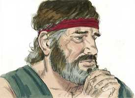
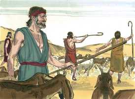
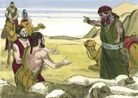
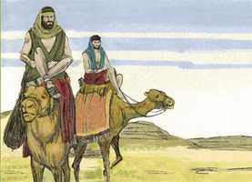
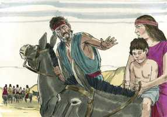
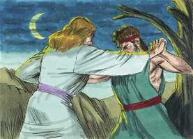

# Gênesis Cap 32

**1** 	JACÓ também seguiu o seu caminho, e encontraram-no os anjos de Deus.

> **Cmt MHenry**: *Versículos 1-8* Os anjos de Deus se apareceram a Jacó para dar-lhe ânimo com a certeza da proteção divina. Quando Deus submete a seu povo a grandes provas, os prepara por meio de grandes consolações. Enquanto Jacó, a quem pertencia a promessa, esteve trabalhando com ardor, Esaú tinha chegado a ser um príncipe. Jacó enviou uma mensagem demonstrando que não insistia na primogenitura. A mansidão fará cessar as grandes ofensas ([Ec 10.4](../21A-Ec/10.md#4)). não devemos negar-nos a falar com respeito ainda aos que estejam irados injustamente conosco. Jacó recebeu um informe dos preparativos bélicos de Esaú contra ele, e teve muito medo. O sentido vívido do perigo e o medo vivificador que dele surge, podem achar-se unidos com a humilde confiança no poder e na promessa de Deus.

 

**2** 	E Jacó disse, quando os viu: Este é o exército de Deus. E chamou aquele lugar Maanaim.

**3** 	E enviou Jacó mensageiros adiante de si a Esaú, seu irmão, à terra de Seir, território de Edom.

 

**4** 	E ordenou-lhes, dizendo: Assim direis a meu senhor Esaú: Assim diz Jacó, teu servo: Como peregrino morei com Labão, e me detive lá até agora;

**5** 	E tenho bois e jumentos, ovelhas, e servos e servas; e enviei para o anunciar a meu senhor, para que ache graça em teus olhos.

**6** 	E os mensageiros voltaram a Jacó, dizendo: Fomos a teu irmão Esaú; e também ele vem para encontrar-te, e quatrocentos homens com ele.

 

**7** 	Então Jacó temeu muito e angustiou-se; e repartiu o povo que com ele estava, e as ovelhas, e as vacas, e os camelos, em dois bandos.

**8** 	Porque dizia: Se Esaú vier a um bando e o ferir, o outro bando escapará.

**9** 	Disse mais Jacó: Deus de meu pai Abraão, e Deus de meu pai Isaque, o Senhor, que me disseste: Torna-te à tua terra, e a tua parentela, e far-te-ei bem;

> **Cmt MHenry**: *Versículos 9-23* Os tempos de terror devem ser épocas de oração: seja o que for que cause o temor, deve deixar-nos de joelhos ante o nosso Deus. Jacó tinha visto recentemente a seus anjos guardiões porém, em seu mal-estar, recorreu a Deus, não a eles; ele sabia que eles eram seus conservos ([Ap 22.9](../66N-Ap/22.md#9)). Não pode Haber uma pauta melhor que esta para a verdadeira oração. Aqui há um reconhecimento agradecido de favores anteriores imerecidos; uma humilde confissão de indignidade; uma simples declaração de seus temores e inquietudes; uma referência plena de todo o assunto ao Senhor e o descanso de todas suas esperanças nEle. O melhor que podemos dizer que Deus em oração é o que Ele nos tem falado. Assim, Ele fez do nome do Senhor sua torre forte e não pôde senão estar a salvo. O temor de Jacó não o fez afundar no desespero, nem sua oração o fez pressupor a misericórdia de Deus, sem o uso de médios. Deus responde as orações ensinando-nos a ordenar corretamente nossos assuntos. Jacó enviou um presente para apaziguar Esaú. Não devemos desesperar de reconciliar-nos com outros, por muito irados que estejam conosco.

**10** 	Menor sou eu que todas as beneficências, e que toda a fidelidade que fizeste ao teu servo; porque com meu cajado passei este Jordão, e agora me tornei em dois bandos.

**11** 	Livra-me, peço-te, da mão de meu irmão, da mão de Esaú; porque eu o temo; porventura não venha, e me fira, e a mãe com os filhos.

**12** 	E tu o disseste: Certamente te farei bem, e farei a tua descendência como a areia do mar, que pela multidão não se pode contar.

**13** 	E passou ali aquela noite; e tomou do que lhe veio à sua mão, um presente para seu irmão Esaú:

 

**14** 	Duzentas cabras e vinte bodes; duzentas ovelhas e vinte carneiros;

**15** 	Trinta camelas de leite com suas crias, quarenta vacas e dez novilhos; vinte jumentas e dez jumentinhos;

**16** 	E deu-os na mão dos seus servos, cada rebanho à parte, e disse a seus servos: Passai adiante de mim e ponde espaço entre rebanho e rebanho.

**17** 	E ordenou ao primeiro, dizendo: Quando Esaú, meu irmão, te encontrar, e te perguntar, dizendo: De quem és, e para onde vais, e de quem são estes diante de ti?

**18** 	Então dirás: São de teu servo Jacó, presente que envia a meu senhor, a Esaú; e eis que ele mesmo vem também atrás de nós.

**19** 	E ordenou também ao segundo, e ao terceiro, e a todos os que vinham atrás dos rebanhos, dizendo: Conforme a esta mesma palavra falareis a Esaú, quando o achardes.

**20** 	E direis também: Eis que o teu servo Jacó vem atrás de nós. Porque dizia: Eu o aplacarei com o presente, que vai adiante de mim, e depois verei a sua face; porventura ele me aceitará.

**21** 	Assim, passou o presente adiante dele; ele, porém, passou aquela noite no arraial.

**22** 	E levantou-se aquela mesma noite, e tomou as suas duas mulheres, e as suas duas servas, e os seus onze filhos, e passou o vau de Jaboque.

 

**23** 	E tomou-os e fê-los passar o ribeiro; e fez passar tudo o que tinha.

**24** 	Jacó, porém, ficou só; e lutou com ele um homem, até que a alva subiu.

> **Cmt MHenry**: *Versículos 24-32* Um bom tempo antes da saída do sol, estando sozinho, Jacó expressou mais plenamente seus temores orando a Deus. enquanto estava assim ocupado, Um semelhante a um homem lutou com ele. quando o Espírito nos ajuda em nossas bondades e quase não achamos palavras para expressar nossos desejos mais vastos e fervores, e queremos dizer mais do que podemos expressar, então, a oração luta, sem dúvida, com Deus. por atribulados ou desencorajados que estejamos, prevaleceremos e, ao prevalecer com Ele em oração, prevaleceremos contra todos os inimigos que lutam em contra nossa. Nada requer de mais vigor e esforço incessante que lutar. É um emblema do verdadeiro espírito de fé e oração. Jacó manteve seu terreno; embora a luta continuou longo tempo, isto não sacudiu sua fé, nem silenciou sua oração. Ele terá uma bênção, e preferia que todos seus ossos fossem deslocados antes de partir sem uma. Os que desejam ter a bênção de Cristo devem decidir-se a não aceitar uma negativa. A oração fervorosa é a oração eficaz. O Anjo lhe pôs uma marca de honra perdurável, trocando-lhe o nome. Jacó significa *usurpador*. Daqui em diante será celebrado não pela sua esperteza e hábil manipulação, senão pelo valor verdadeiro. "Serás chamado Israel", *príncipe de Deus*, um nome maior que o dos grandes homens da terra. Sem dúvida ele é um príncipe, isto é, um príncipe de Deus; são verdadeiramente honoráveis aqueles que são poderosos em oração. Ao ter poder com , também terão poder com os homens; ele prevalecerá e ganhará o favor de Esaú. Jacó dá um nome novo ao lugar. o chama Peniel, o rosto de Deus, porque ali tinha visto aparecer a Deus e obteve Seu favor. Aos que Deus honra, corresponde admirar sua graça para com eles. O Anjo que lutou com Jacó era a segunda Pessoa da sagrada Trindade que, depois, foi Deus manifestado na carne e que, em sua natureza humana, é chamado Emanuel ([os 12.4-5](../28A-Os/12.md#4)). Jacó foi ferido em sua coxa. Isso poderia servir para evitar que se sentiria superior com a abundância das revelações. O sol sal para Jacó; amanhece para aquela alma que teve comunhão com Deus. "

 

**25** 	E vendo este que não prevalecia contra ele, tocou a juntura de sua coxa, e se deslocou a juntura da coxa de Jacó, lutando com ele.

**26** 	E disse: Deixa-me ir, porque já a alva subiu. Porém ele disse: Não te deixarei ir, se não me abençoares.

**27** 	E disse-lhe: Qual é o teu nome? E ele disse: Jacó.

**28** 	Então disse: Não te chamarás mais Jacó, mas Israel; pois como príncipe lutaste com Deus e com os homens, e prevaleceste.

**29** 	E Jacó lhe perguntou, e disse: Dá-me, peço-te, a saber o teu nome. E disse: Por que perguntas pelo meu nome? E abençoou-o ali.

**30** 	E chamou Jacó o nome daquele lugar Peniel, porque dizia: Tenho visto a Deus face a face, e a minha alma foi salva.

**31** 	E saiu-lhe o sol, quando passou a Peniel; e manquejava da sua coxa.

**32** 	Por isso os filhos de Israel não comem o nervo encolhido, que está sobre a juntura da coxa, até o dia de hoje; porquanto tocara a juntura da coxa de Jacó no nervo encolhido.

> **Cmt MHenry**: *CAPÍTULO 32A-Jn

> **Cmt MHenry** Intro: *• Versículos 1-8*> *A visão de Jacó em Maanaim – Seu medo de Esaú*> *• Versículos 9-23*> *A fervorosa oração de Jacó por liberação – Prepara um*> *presente para Esaú*> *• Versículos 24-32*> *Luta com o Anjo*