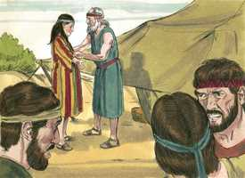
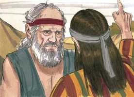
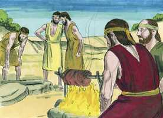
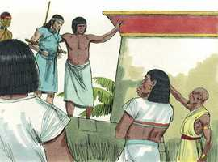

# Gênesis Cap 37

**1** 	E JACÓ habitou na terra das peregrinações de seu pai, na terra de Canaã.

> **Cmt MHenry**: *Versículos 1-4* Na história de José vemos algo de Cristo, que primeiro foi humilhado e depois exaltado. Também mostra a sorte dos crentes que devem passar por muitas tribulações para entrar no reino. É uma história que não tem igual, em que se exibem variadas formas de operar da mente humana, tanto para o bem como para o mal, e a providência singular de Deus ao fazer uso delas para cumprir seus propósitos. Embora José era o favorito de seu pai, não foi criado ocioso. Não amam verdadeiramente a seus filhos aqueles que não os ocupam nos negócios e trabalhos, e coisas que requerem esforço. Com boa razão se diz que mimar os filhos e estragá-los. Os que têm sido educados para não fazer nada é provável que sejam bons para nada. Porém Jacó deu a conhecer seu amor vestindo a José mais finamente que ao resto de seus filhos. É mau que os pais façam diferenças entre um e outro filho, a menos que exista uma poderosa razão para isso, pela obediência ou desobediência deles. Quando os pais fazem diferenças, as crianças logo as captam e isso conduz a conflitos familiares. Que estiveram fora do alcance de sua vista, os filhos de Jacó fizeram o que não teriam feito na casa com ele; porém José falava a seu pai da má conduta deles para que os repreendesse. Não como fofoqueiro, para semear discórdia, mas como irmão leal.

**2** 	Estas são as gerações de Jacó. Sendo José de dezessete anos, apascentava as ovelhas com seus irmãos; sendo ainda jovem, andava com os filhos de Bila, e com os filhos de Zilpa, mulheres de seu pai; e José trazia más notícias deles a seu pai.

 

**3** 	E Israel amava a José mais do que a todos os seus filhos, porque era filho da sua velhice; e fez-lhe uma túnica de várias cores.

 

**4** 	Vendo, pois, seus irmãos que seu pai o amava mais do que a todos eles, odiaram-no, e não podiam falar com ele pacificamente.

**5** 	Teve José um sonho, que contou a seus irmãos; por isso o odiaram ainda mais.

> **Cmt MHenry**: *Versículos 5-11* Deus deu muito cedo a José a perspectiva de seu progresso, para sustentá-lo e consolá-lo em seus longos e dolorosos problemas. Observe-se que José sonhou sua exaltação, mas não sonhou seu encarceramento. Assim, muitos jovens, quando saem ao mundo, não pensam em outra coisa que não seja a prosperidade e o prazer, e nunca sonham com os problemas. Seus irmãos interpretaram o sonho corretamente, embora aborreceram a interpretação. Ainda que cometeram delitos para derrotar o sonho, foram os instrumentos para cumpri-lo. assim os judeus entenderam o que Cristo disse de seu reino. Decididos a que Ele não reinasse sobre eles, tiveram conselho para matá-lo, porém por sua crucifixão abriram o caminho para a exaltação que pensaram impedir.

 

**6** 	E disse-lhes: Ouvi, peço-vos, este sonho, que tenho sonhado:

**7** 	Eis que estávamos atando molhos no meio do campo, e eis que o meu molho se levantava, e também ficava em pé, e eis que os vossos molhos o rodeavam, e se inclinavam ao meu molho.

**8** 	Então lhe disseram seus irmãos: Tu, pois, deveras reinarás sobre nós? Tu deveras terás domínio sobre nós? Por isso ainda mais o odiavam por seus sonhos e por suas palavras.

 

**9** 	E teve José outro sonho, e o contou a seus irmãos, e disse: Eis que tive ainda outro sonho; e eis que o sol, e a lua, e onze estrelas se inclinavam a mim.

 

**10** 	E contando-o a seu pai e a seus irmãos, repreendeu-o seu pai, e disse-lhe: Que sonho é este que tiveste? Porventura viremos, eu e tua mãe, e teus irmãos, a inclinar-nos perante ti em terra?

 

**11** 	Seus irmãos, pois, o invejavam; seu pai porém guardava este negócio no seu coração.

 

**12** 	E seus irmãos foram apascentar o rebanho de seu pai, junto de Siquém.

> **Cmt MHenry**: *Versículos 12-22* Com quanta atenção espera José as ordens de seus pai! Os meninos que são mais amados por seus pais devem ser os mais dispostos a obedecê-los. Veja-se quão deliberadamente estavam os irmãos de José em sua contra. Eles pensavam matá-lo com maldade premeditada e a sangue frio. Quem odeia a seu irmão é um homicida ([1 João 3,15](../62N-1Jo/03.md#15)). Os filhos de Jacó odiavam a seu irmão porque seu pai o amava. Novas ocasiões como seus sonhos e coisas semelhantes, deram-lhes maior impulso, e produziram um ressentimento constante em seus corações, até que resolveram matá-lo. Deus tem todos os corações em sua mão. Rubem tinha maior razão para estar ciumento de José, já que era o primogênito, embora resulta ser seu melhor amigo. Deus operou para que todo servisse a Seu propósito: o fazer de José um instrumento para salvar a vida de muita gente. José era um tipo de Cristo; pois apesar de ser o Filho amado de seu Pai, e de ter sido odiado por um mundo malvado, o Pai o enviou, não obstante, desde seu seio, a visitar-nos com grande humildade e amor. Veio do céu à terra a buscar-nos e salvar-nos; contudo, contra Ele fizeram malignas conspirações. Os seus não só não o receberam; o crucificaram. Ele se submeteu a isto como parte de seu desígnio para redimir-nos e salvar-nos.

 

**13** 	Disse, pois, Israel a José: Não apascentam os teus irmãos junto de Siquém? Vem, e enviar-te-ei a eles. E ele respondeu: Eis-me aqui.

**14** 	E ele lhe disse: Ora vai, vê como estão teus irmãos, e como está o rebanho, e traze-me resposta. Assim o enviou do vale de Hebrom, e foi a Siquém.

 

**15** 	E achou-o um homem, porque eis que andava errante pelo campo, e perguntou-lhe o homem, dizendo: Que procuras?

**16** 	E ele disse: Procuro meus irmãos; dize-me, peço-te, onde eles apascentam.

 

**17** 	E disse aquele homem: Foram-se daqui; porque ouvi-os dizer: Vamos a Dotã. José, pois, seguiu atrás de seus irmãos, e achou-os em Dotã.

 

**18** 	E viram-no de longe e, antes que chegasse a eles, conspiraram contra ele para o matarem.

 

**19** 	E disseram um ao outro: Eis lá vem o sonhador-mor!

 

**20** 	Vinde, pois, agora, e matemo-lo, e lancemo-lo numa destas covas, e diremos: Uma fera o comeu; e veremos que será dos seus sonhos.

**21** 	E ouvindo-o Rúben, livrou-o das suas mãos, e disse: Não lhe tiremos a vida.

 

**22** 	Também lhes disse Rúben: Não derrameis sangue; lançai-o nesta cova, que está no deserto, e não lanceis mãos nele; isto disse para livrá-lo das mãos deles e para torná-lo a seu pai.

 

**23** 	E aconteceu que, chegando José a seus irmãos, tiraram de José a sua túnica, a túnica de várias cores, que trazia.

> **Cmt MHenry**: *Versículos 23-30* Lançaram a José num poço para que morresse de fome e frio; tão cruéis eram suas tenras misericórdias. Não tiveram consideração porque estava sofrendo e não se condoeram pelo quebrantamento de José, veja-se [Amós 6.6](../30A-Am/06.md#6), pois quando estava no fundo do poço, sentaram-se a comer pão. Não tiveram remorso de consciência pelo pecado. mas a ira do homem louvará a Deus e reprimirá o resto da ira ([Sl 76.10](../19A-Sl/76.md#10)). Os irmãos de José foram miraculosamente impedidos de matá-lo e sua venda resultou em forma igualmente maravilhosa em louvor para Deus.

 

**24** 	E tomaram-no, e lançaram-no na cova; porém a cova estava vazia, não havia água nela.

**25** 	Depois assentaram-se a comer pão; e levantaram os seus olhos, e olharam, e eis que uma companhia de ismaelitas vinha de Gileade; e seus camelos traziam especiarias e bálsamo e mirra, e iam levá-los ao Egito.

 

**26** 	Então Judá disse aos seus irmãos: Que proveito haverá que matemos a nosso irmão e escondamos o seu sangue?

**27** 	Vinde e vendamo-lo a estes ismaelitas, e não seja nossa mão sobre ele; porque ele é nosso irmão, nossa carne. E seus irmãos obedeceram.

 

**28** 	Passando, pois, os mercadores midianitas, tiraram e alçaram a José da cova, e venderam José por vinte moedas de prata, aos ismaelitas, os quais levaram José ao Egito.

**29** 	Voltando, pois, Rúben à cova, eis que José não estava na cova; então rasgou as suas vestes.

 

**30** 	E voltou a seus irmãos e disse: O menino não está; e eu aonde irei?

**31** 	Então tomaram a túnica de José, e mataram um cabrito, e tingiram a túnica no sangue.

> **Cmt MHenry**: *Versículos 31-36* Quando Satanás tem ensinado aos homens a cometer um pecado, os ensina a tratar de ocultá-lo com um outro, a esconder o roubo e o homicídio com mentiras e juramentos falsos: todavia, o que encobre seu pecado não prosperará. Os irmãos de José ocultaram o seu e o fizeram mutuamente por um tempo, porém sua vileza saiu à luz finalmente, e aqui ficou publicada para o mundo. Para entristecer a seu pai lhe mandaram a túnica de cores de José, e ao ver a túnica ensangüentada, ele pensou imediatamente que José tinha sido despedaçado. Que os que conhecem o coração de um pai imaginem a agonia do coitado Jacó. Com toda baixeza seus filhos fingiram consolá-lo, mas todos eram consoladores miseráveis e hipócritas. Sem realmente tivessem desejado consolá-lo, poderiam tê-lo feito de uma vez dizendo-lhe a verdade. o coração é estranhamente endurecido pelo engano do pecado. Jacó se negou a ser consolado. O grande afeto para uma criatura prepara para uma grande aflição ou nos amarga quando nos é tirada: o amor indevido termina correntemente em dor indevida. Sabedoria dos pais é não criar seus filhos com delicadeza, pois não sabem que dificuldades podem encontrar antes de morrer. Em todo este capítulo vemos com assombros os caminhos da Providência. Pareceria que os malvados irmãos se deram bem; os mercadores, aos que nada importa com que comerciam com tal de obter lucro, também conseguiram sua parte; e Potifar também logrou sua boa parte, conseguindo um excelente e jovem escravo! Porém os desígnios de Deus, por estes médios, estão prestes a serem executados. Este acontecimento terminará com a descida de Israel ao Egito; e isso acaba nos que são liberados por Moisés; isso, em estabelecer a religião verdadeira no mundo e em sua difusão a todas as nações por meio do Evangelho. Assim, pois, a ira do homem louvará o Senhor e Ele reprimirá o resto da ira.

**32** 	E enviaram a túnica de várias cores, mandando levá-la a seu pai, e disseram: Temos achado esta túnica; conhece agora se esta será ou não a túnica de teu filho.

**33** 	E conheceu-a, e disse: É a túnica de meu filho; uma fera o comeu; certamente José foi despedaçado.

 

**34** 	Então Jacó rasgou as suas vestes, pôs saco sobre os seus lombos e lamentou a seu filho muitos dias.

 

**35** 	E levantaram-se todos os seus filhos e todas as suas filhas, para o consolarem; recusou porém ser consolado, e disse: Porquanto com choro hei de descer ao meu filho até à sepultura. Assim o chorou seu pai.

**36** 	E os midianitas venderam-no no Egito a Potifar, oficial de Faraó, capitão da guarda.

 

> **Cmt MHenry** Intro: *CAPÍTULO 37A-Ag> *• Versículos 1-4*> *José, amado por Jacó, odiado por seus irmãos*> *• Versículos 5-11*> 28A-Os sonhos de José*> *• Versículos 12-22*> *Jacó manda José a buscar seus irmãos – Conspiração para*> *• Versículos 23-30*> 28A-Os irmãos de José o vendem*> *• Versículos 31-36*> *Jacó enganado – José vendido a Potifar*