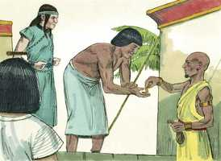
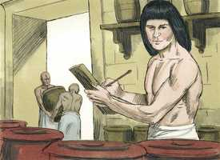
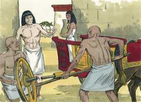
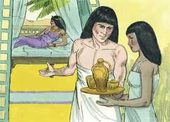
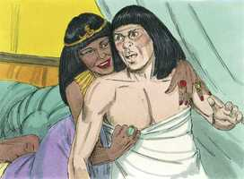
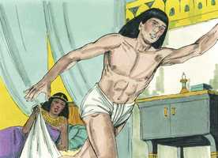
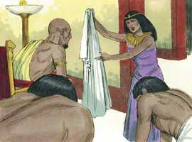
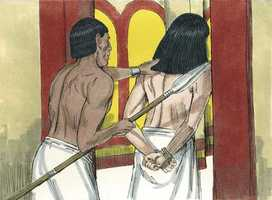

# Gênesis Cap 39

**1** 	E JOSÉ foi levado ao Egito, e Potifar, oficial de Faraó, capitão da guarda, homem egípcio, comprou-o da mão dos ismaelitas que o tinham levado lá.

> **Cmt MHenry**: *Versículos 1-6* Nossos inimigos podem despojar-nos das distinções e adornos externos, mas a sabedoria e a graça não podem ser-nos tiradas. Eles podem separar-nos dos amigos, os parentes e da pátria, mas não podem afastar-nos da presença do Senhor. põem isolar-nos das bênçãos externas, roubar-nos a liberdade e confinar-nos em calabouços, porém não podem impedir-nos a comunhão com Deus, do trono da graça, ou arrebatar-nos as bênçãos da salvação. José foi abençoado, maravilhosamente abençoado, até na casa onde era escravo. A presença de Deus conosco faz que prospere todo quanto fazemos. Os homens bons são bênção no lugar onde moram; os bons servos podem sê-lo embora sejam mal ou pouco estimados. A prosperidade do ímpio é, de uma ou outra forma, por causa do piedoso. Aqui, uma família malvada foi abençoada por amor do bom servo dela.

  

**2** 	E o Senhor estava com José, e foi homem próspero; e estava na casa de seu senhor egípcio.

 

**3** 	Vendo, pois, o seu senhor que o Senhor estava com ele, e tudo o que fazia o Senhor prosperava em sua mão,

 

**4** 	José achou graça em seus olhos, e servia-o; e ele o pôs sobre a sua casa, e entregou na sua mão tudo o que tinha.

 

**5** 	E aconteceu que, desde que o pusera sobre a sua casa e sobre tudo o que tinha, o Senhor abençoou a casa do egípcio por amor de José; e a bênção do Senhor foi sobre tudo o que tinha, na casa e no campo.

**6** 	E deixou tudo o que tinha na mão de José, de maneira que nada sabia do que estava com ele, a não ser do pão que comia. E José era formoso de porte, e de semblante.

**7** 	E aconteceu depois destas coisas que a mulher do seu senhor pôs os seus olhos em José, e disse: Deita-te comigo.

> **Cmt MHenry**: *Versículos 7-12* A beleza de homens e mulheres freqüentemente resulta ser uma armadilha, tanto para eles mesmos como para os outros. Isto proíbe o orgulho por ela e exige uma constante vigilância contra a tentação que a espreita. Temos muita necessidade de fazer aliança com nossos olhos, não seja que os olhos infectem o coração. Quando a luxúria conseguiu o poder, se sacrificam a decência, a fama e a consciência. A esposa de Potifar demonstrou que seu coração estava totalmente dedicado ao mal. Quando compreendeu que não poderia vencer a José com os problemas e tribulações do mundo, pois em meio delas ele ainda se aferrava a seus princípios, Satanás o assaltou com prazeres que têm provocado mais destruição que o anterior. Porém José, pela graça de Deus, foi capacitado para resistir e superar a tentação; e seu escape foi um exemplo tão grande do poder divino como a liberação dos três rapazes da fornalha de fogo. Este pecado era o que mais facilmente poderia tê-lo perturbado. A tentadora era sua ama, uma cujo favor o teria feito progredir; seu máximo perigo era rejeitá-la e que se convertesse em sua inimiga. O tempo e o lugar favoreciam a tentação. A todo isso devia agregar-se a instigação constante e freqüente. A todo-poderosa graça de Deus capacitou a José para vencer este ataque do inimigo. Apresenta como argumento o que devia, tanto a Deus como a seu amo. Estamos obrigados por honra como por justiça e gratidão, a não fazer mal em nada aos que confiam em nós, por muito secreto que isto possa ser feito. Ele não ofenderia a seu Deus. José aduz três argumentos: 1) *Considera quem era tentado.* Um que está na aliança de Deus, que professa a religião e a relação com Ele. 2) *Qual era o pecado que o tentava*. Outros poderiam vê-lo como pouca coisa; porém José não pensou assim. Deve-se chamar o pecado por seu nome, sem rebaixar sua importância. Que os pecados desta natureza sempre sejam vistos como grande maldade, como excessivamente pecaminosos. 3) *Contra quem foi tentado a pecar: contra Deus.* O pecado é contra Deus, contra sua natureza e seu domínio, contra seu amor e seu propósito. Os que amam a Deus, por esta razão odeiam o pecado. A graça de Deus capacitou a José para vencer a tentação esquivando a tentadora. Não quis ficar a conversar com a tentação, senão que fugiu dela como quem escapa para salvar a vida. Se tivermos a intenção de não cometer iniqüidade, fujamos como uma ave do laço, e como um cervo do caçador.

 

**8** 	Porém ele recusou, e disse à mulher do seu senhor: Eis que o meu senhor não sabe do que há em casa comigo, e entregou em minha mão tudo o que tem;

**9** 	Ninguém há maior do que eu nesta casa, e nenhuma coisa me vedou, senão a ti, porquanto tu és sua mulher; como pois faria eu tamanha maldade, e pecaria contra Deus?

**10** 	E aconteceu que, falando ela cada dia a José, e não lhe dando ele ouvidos, para deitar-se com ela, e estar com ela,

**11** 	Sucedeu num certo dia que ele veio à casa para fazer seu serviço; e nenhum dos da casa estava ali;

 

**12** 	E ela lhe pegou pela sua roupa, dizendo: Deita-te comigo. E ele deixou a sua roupa na mão dela, e fugiu, e saiu para fora.

  

**13** 	E aconteceu que, vendo ela que deixara a sua roupa em sua mão, e fugira para fora,

> **Cmt MHenry**: *Versículos 13-18* A ama de José, tendo tentado em vão de fazê-lo culpável, tratou de vingar-se dele. Os que quebraram as amarras da prudência, nunca serão justos pelos laços da verdade. não é coisa nova que o melhor dos homens tenha sido acusado falsamente do pior dos delitos por os que são os piores delinqüentes. Bom é que haja no futuro um ia de revelação em que todos aparecerão com seu verdadeiro caráter.

 

**14** 	Chamou aos homens de sua casa, e falou-lhes, dizendo: Vede, meu marido trouxe-nos um homem hebreu para escarnecer de nós; veio a mim para deitar-se comigo, e eu gritei com grande voz;

**15** 	E aconteceu que, ouvindo ele que eu levantava a minha voz e gritava, deixou a sua roupa comigo, e fugiu, e saiu para fora.

**16** 	E ela pôs a sua roupa perto de si, até que o seu senhor voltou à sua casa.

**17** 	Então falou-lhe conforme as mesmas palavras, dizendo: Veio a mim o servo hebreu, que nos trouxeste, para escarnecer de mim;

 

**18** 	E aconteceu que, levantando eu a minha voz e gritando, ele deixou a sua roupa comigo, e fugiu para fora.

**19** 	E aconteceu que, ouvindo o seu senhor as palavras de sua mulher, que lhe falava, dizendo: Conforme a estas mesmas palavras me fez teu servo, a sua ira se acendeu.

> **Cmt MHenry**: *Versículos 19-23* O amo de José acreditou na acusação. Provavelmente Potifar tenha escolhido o cárcere porque era o pior, mas Deus tinha o propósito de abrir caminho para que José recebesse honra. José era propriedade de seu Deus e por Ele foi honrado. Estava longe de todos seus amigos e parentes; não tinha ninguém que o ajudasse o consolasse, mas o Senhor estava com José e lhe mostrou misericórdia. Os que têm boa consciência estando presos, ali têm um bom Deus. Deus o favoreceu ante o guarda da prisão; confiou nele para que administrasse os assuntos da prisão. Um homem bom fará o bem onde estiver, e será uma bênção ainda estando acorrentado e prisioneiro. Não esqueçamos olhar a Jesus através de José, pois Ele sofreu sendo tentado, porém sem pecado; foi caluniado e perseguido e aprisionado, mas sem causa; aquele que pela cruz ascendeu ao trono. Que nós sejamos capacitados para ir, submetendo-nos e sofrendo, pela mesma senda ao mesmo lugar de glória.

**20** 	E o senhor de José o tomou, e o entregou na casa do cárcere, no lugar onde os presos do rei estavam encarcerados; assim esteve ali na casa do cárcere.

 

**21** 	O Senhor, porém, estava com José, e estendeu sobre ele a sua benignidade, e deu-lhe graça aos olhos do carcereiro-mor.

**22** 	E o carcereiro-mor entregou na mão de José todos os presos que estavam na casa do cárcere, e ele ordenava tudo o que se fazia ali.

**23** 	E o carcereiro-mor não teve cuidado de nenhuma coisa que estava na mão dele, porquanto o Senhor estava com ele, e tudo o que fazia o Senhor prosperava.

> **Cmt MHenry** Intro: *CAPÍTULO 39A-Ml> *• Versículos 1-6*> *José, preferido por Potifar*> *• Versículos 7-12*> *José resiste a tentação*> *• Versículos 13-18*> *José é acusado falsamente por sua ama*> *• Versículos 19-23*> *Encarcerado – Deus está com ele*