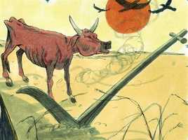
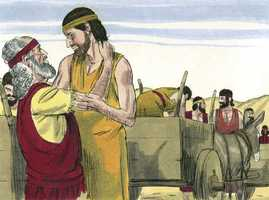
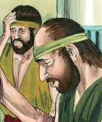
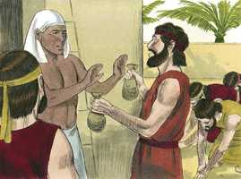
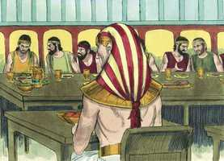

# Gênesis Cap 43

**1** 	E A FOME era gravíssima na terra.

> **Cmt MHenry**: *Versículos 1-14* Jacó insta a seus filhos para que vão e comprem *um pouco* de comida; agora, em tempo de escassez, um pouco deve bastar. Judá insta a que Benjamim vá com eles. Não é contra a honra nem o dever dos filhos para com os pais aconselhá-los humildemente e, quando estejam em necessidade, arrazoar com eles. Jacó viu a necessidade do caso e se rendeu. Sua prudência e justiça se observam em três coisas. 1) *Devolveu o dinheiro que tinham encontrado na bolsa.* A honestidade nos obriga a devolver não só o que nos chega por nossa própria falta, senão aquilo que nos chega por erro do próximo. Embora o obtenhamos por descuido, se o retivermos quando descobrimos o erro, o reteremos por meio de engano. 2) *Enviou outro tanto como o que tinha levado na viagem anterior.* O preço do trigo poderia ter subido, ou talvez tivessem de pagar o resgate de Simeão. 3) *Ele manou um presente de coisas que permitia a terra, que eram escassas no Egito, como bálsamo, mel, etc.* A Providência nos dispensa suas dádivas a todos por igual. Mas o mel e as especiarias nunca satisfarão a carência de pão de trigo. A fome era aguda em Canaã, mas tinham bálsamo e mirra, e outras coisas assim. Podemos viver bem com comida simples, sem iguarias, mas não podemos viver com iguarias, sem comida simples. Demos graças a Deus que o mais necessário e útil, em geral, é o mais barato e abundante. Embora os homens valorizam mais o ouro e a prata, e considerem os produtos de luxo como os melhores frutos de toda terra, em tempo de fome de boa vontade os trocam por pão. Quão pouco nos sustentarão as boas coisas terrenas no dia da ira! Quão preparados deveríamos estar para renunciarmos a todas elas, como perda, pela excelência do conhecimento de Jesus Cristo! nossa forma de prevalecer com o homem é prevalecer primeiro com o Senhor em fervorosa oração. Mas cada oração pelas misericórdias desta vida ou para sermos livrados das aflições desta vida, deve concluir com o "seja feita a Tua vontade".

 

**2** 	E aconteceu que, como acabaram de comer o mantimento que trouxeram do Egito, disse-lhes seu pai: Voltai, comprai-nos um pouco de alimento.

**3** 	Mas Judá respondeu-lhe, dizendo: Fortemente nos protestou aquele homem, dizendo: Não vereis a minha face, se o vosso irmão não vier convosco.

**4** 	Se enviares conosco o nosso irmão, desceremos e te compraremos alimento;

**5** 	Mas se não o enviares, não desceremos; porquanto aquele homem nos disse: Não vereis a minha face, se o vosso irmão não vier convosco.

**6** 	E disse Israel: Por que me fizeste tal mal, fazendo saber àquele homem que tínheis ainda outro irmão?

**7** 	E eles disseram: Aquele homem particularmente nos perguntou por nós, e pela nossa parentela, dizendo: Vive ainda vosso pai? Tendes mais um irmão? E respondemos-lhe conforme as mesmas palavras. Podíamos nós saber que diria: Trazei vosso irmão?

**8** 	Então disse Judá a Israel, seu pai: Envia o jovem comigo, e levantar-nos-emos, e iremos, para que vivamos e não morramos, nem nós, nem tu, nem os nossos filhos.

**9** 	Eu serei fiador por ele, da minha mão o requererás; se eu não o trouxer, e não o puser perante a tua face, serei réu de crime para contigo para sempre.

**10** 	E se não nos tivéssemos detido, certamente já estaríamos segunda vez de volta.

**11** 	Então disse-lhes Israel, seu pai: Pois que assim é, fazei isso; tomai do mais precioso desta terra em vossos vasos, e levai ao homem um presente: um pouco do bálsamo e um pouco de mel, especiarias e mirra, terebinto e amêndoas;

 

**12** 	E tomai em vossas mãos dinheiro em dobro, e o dinheiro que voltou na boca dos vossos sacos tornai a levar em vossas mãos; bem pode ser que fosse erro.

**13** 	Tomai também a vosso irmão, e levantai-vos e voltai àquele homem;

**14** 	E Deus Todo-Poderoso vos dê misericórdia diante do homem, para que deixe vir convosco vosso outro irmão, e Benjamim; e eu, se for desfilhado, desfilhado ficarei.

**15** 	E os homens tomaram aquele presente, e dinheiro em dobro em suas mãos, e a Benjamim; e levantaram-se, e desceram ao Egito, e apresentaram-se diante de José.

> **Cmt MHenry**: *Versículos 15-25* Os filhos de Jacó desceram por segunda vez ao Egito para comprar trigo. Se alguma vez entendemos o que significa a fome da palavra, não pensemos que é muito viajar tão longe espiritualmente, como eles fizeram pelo alimento corporal. O mordomo de José tinha ordens de seu amo para levá-los a sua casa. Até isso os assustou. Aqueles que são culpáveis, pensam sempre no pior. Porém o mordomo lhes deu ânimo. Pelo que disse, parecia que seu bom amo tinha-o levado ao conhecimento do Deus verdadeiro, o Deus dos hebreus. Os servos religiosos devem aproveitar toda ocasião para falar com revolução e seriedade de Deus e sua providência.

**16** 	Vendo, pois, José a Benjamim com eles, disse ao que estava sobre a sua casa: Leva estes homens à casa, e mata reses, e prepara tudo; porque estes homens comerão comigo ao meio-dia.

**17** 	E o homem fez como José dissera, e levou-os à casa de José.

**18** 	Então temeram aqueles homens, porquanto foram levados à casa de José, e diziam: Por causa do dinheiro que dantes voltou nos nossos sacos, fomos trazidos aqui, para nos incriminar e cair sobre nós, para que nos tome por servos, e a nossos jumentos.

 

**19** 	Por isso chegaram-se ao homem que estava sobre a casa de José, e falaram com ele à porta da casa,

**20** 	E disseram: Ai! senhor meu, certamente descemos dantes a comprar mantimento;

**21** 	E aconteceu que, chegando à estalagem, e abrindo os nossos sacos, eis que o dinheiro de cada um estava na boca do seu saco, nosso dinheiro por seu peso; e tornamos a trazê-lo em nossas mãos;

**22** 	Também trouxemos outro dinheiro em nossas mãos, para comprar mantimento; não sabemos quem tenha posto o nosso dinheiro nos nossos sacos.

**23** 	E ele disse: Paz seja convosco, não temais; o vosso Deus, e o Deus de vosso pai, vos tem dado um tesouro nos vossos sacos; o vosso dinheiro me chegou a mim. E trouxe-lhes fora a Simeão.

 

**24** 	Depois levou os homens à casa de José, e deu-lhes água, e lavaram os seus pés; também deu pasto aos seus jumentos.

**25** 	E prepararam o presente, para quando José viesse ao meio-dia; porque tinham ouvido que ali haviam de comer pão.

**26** 	Vindo, pois, José à casa, trouxeram-lhe ali o presente que tinham em suas mãos; e inclinaram-se a ele até à terra.

> **Cmt MHenry**: *Versículos 26-34* Observe o grande respeito que os irmãos de José lhe brindaram. Assim se cumpriram cabalmente os sonhos de José. Ele lhes mostrou grande bondade. Os tratou com nobreza, porém perceba aqui, bem cedo, a distância entre judeus e gentios. No dia da fome basta com receber algo de comida, mas eles foram festejados. Agora estavam terminados seus esforços e temores, e comeram seu pão com gozo, reconhecendo que estavam em boa posição ante o senhor da terra. Se Deus aceita nossas obras, nosso presente, temos razão para regozijar-nos. José mostrou especial afeto por Benjamim, para provar se seus irmãos o invejariam. Deve ser nossa regra estar contentes com o que temos, e não ofender-nos pelo que tem o próximo. Assim, Jesus mostra cada vez mais aos que ama que necessitam dEle. Faz-lhes ver que Ele é o único refúgio que têm contra a destruição. Ele vence a falta de disposição e os atrai a si mesmo. Então, quando lhe parece bem, lhes dá a provar seu amor, e lhes dá as boas-vindas às provisões de sua casa, como prenda do que Ele tem preparado para eles. "

**27** 	E ele lhes perguntou como estavam, e disse: Vosso pai, o ancião de quem falastes, está bem? Ainda vive?

**28** 	E eles disseram: Bem está o teu servo, nosso pai vive ainda. E abaixaram a cabeça, e inclinaram-se.

**29** 	E ele levantou os seus olhos, e viu a Benjamim, seu irmão, filho de sua mãe, e disse: Este é vosso irmão mais novo de quem falastes? Depois ele disse: Deus te dê a sua graça, meu filho.

**30** 	E José apressou-se, porque as suas entranhas comoveram-se por causa do seu irmão, e procurou onde chorar; e entrou na câmara, e chorou ali.

**31** 	Depois lavou o seu rosto, e saiu; e conteve-se, e disse: Ponde pão.

**32** 	E serviram-lhe à parte, e a eles também à parte, e aos egípcios, que comiam com ele, à parte; porque os egípcios não podem comer pão com os hebreus, porquanto é abominação para os egípcios.

**33** 	E assentaram-se diante dele, o primogênito segundo a sua primogenitura, e o menor segundo a sua menoridade; do que os homens se maravilhavam entre si.

 

**34** 	E apresentou-lhes as porções que estavam diante dele; porém a porção de Benjamim era cinco vezes maior do que as porções deles todos. E eles beberam, e se regalaram com ele.

> **Cmt MHenry** Intro: *CAPÍTULO 43N-Joa> *• Versículos 1-14*> *Jacó é convencido de enviar Benjamim ao Egito*> *• Versículos 15-25*> *Recebimento de José para seus irmãos – Seus temores*> *• Versículos 26-34*> *José dá uma festa para seus irmãos*