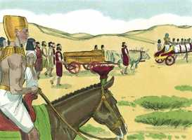

# Gênesis Cap 50

**1** 	ENTÃO José se lançou sobre o rosto de seu pai e chorou sobre ele, e o beijou.

> **Cmt MHenry**: *Versículos 1-6* Embora os parentes e amizades piedosas tenham vivido até uma idade bem avançada e estejamos confiados de que partiram rumo à glória, podemos sentir a perda e respeitar sua lembrança chorando-os. A graça não destrói, senão que purifica, modera e regula o afeto natural. A alma que partiu está fora do alcance de toda mostra do nosso afeto, porém é apropriado mostrar respeito pelo corpo, do qual esperamos uma ressurreição gloriosa e gozosa, seja o que for que aconteça com seus restos neste mundo. Assim, pois, José mostrou sua fé em Deus e seu amor por seu pai. Mandou que o corpo fosse embalsamado ou envolvido com especiarias para preservá-lo. Veja quão vis são nossos corpos quando a alma os têm abandonado: viram em muito curto tempo fétidos e desagradáveis.

**2** 	E José ordenou aos seus servos, os médicos, que embalsamassem a seu pai; e os médicos embalsamaram a Israel.

**3** 	E cumpriram-se-lhe quarenta dias; porque assim se cumprem os dias daqueles que se embalsamam; e os egípcios o choraram setenta dias.

**4** 	Passados, pois, os dias de seu choro, falou José à casa de Faraó, dizendo: Se agora tenho achado graça aos vossos olhos, rogo-vos que faleis aos ouvidos de Faraó, dizendo:

**5** 	Meu pai me fez jurar, dizendo: Eis que eu morro; em meu sepulcro, que cavei para mim na terra de Canaã, ali me sepultarás. Agora, pois, te peço, que eu suba, para que sepulte a meu pai; então voltarei.

**6** 	E Faraó disse: Sobe, e sepulta a teu pai como ele te fez jurar.

**7** 	E José subiu para sepultar a seu pai; e subiram com ele todos os servos de Faraó, os anciãos da sua casa, e todos os anciãos da terra do Egito.

> **Cmt MHenry**: *Versículos 7-14* O corpo de Jacó foi velado não só por sua família, senão pelos grandes do Egito. Agora que conheciam melhor aos hebreus, começaram a respeitá-los. Os que professam a religião devem propor-se eliminar, por sabedoria e amor, os prejuízos que muitos têm contra eles. Os espectadores viram isso como um grande choro. A morte dos bons homens é uma perda em qualquer parte e deve ser grandemente lamentada.

 

**8** 	Como também toda a casa de José, e seus irmãos, e a casa de seu pai; somente deixaram na terra de Gósen os seus meninos, e as suas ovelhas e as suas vacas.

**9** 	E subiram também com ele, tanto carros como gente a cavalo; e o cortejo foi grandíssimo.

**10** 	Chegando eles, pois, à eira de Atade, que está além do Jordão, fizeram um grande e dolorido pranto; e fez a seu pai uma grande lamentação por sete dias.

**11** 	E vendo os moradores da terra, os cananeus, o luto na eira de Atade, disseram: É este o pranto grande dos egípcios. Por isso chamou-se-lhe Abel-Mizraim, que está além do Jordão.

**12** 	E fizeram-lhe os seus filhos assim como ele lhes ordenara.

**13** 	Pois os seus filhos o levaram à terra de Canaã, e o sepultaram na cova do campo de Macpela, que Abraão tinha comprado com o campo, por herança de sepultura de Efrom, o heteu, em frente de Manre.

**14** 	Depois de haver sepultado seu pai, voltou José para o Egito, ele e seus irmãos, e todos os que com ele subiram a sepultar seu pai.

**15** 	Vendo então os irmãos de José que seu pai já estava morto, disseram: Porventura nos odiará José e certamente nos retribuirá todo o mal que lhe fizemos.

> **Cmt MHenry**: *Versículos 15-21* Diversos são os motivos que puderam fazer que os filhos de Jacó continuassem no Egito, apesar da visão profética que Abraão teve de sua escravidão lá. Julgando a José com o temperamento geral da natureza humana, pensaram que agora ele se vingaria dos que o haviam odiado e danificado sem causa. Não sendo capazes de resistir nem de fugir, tentaram abrandá-lo humilhando-se. Lhe suplicaram como servos do Deus de Jacó. José sentiu-se muito afetado ao ver o cumprimento total de seus sonhos. Lhes manda que não o temam a ele, senão a Deus; que se humilhem ante o Senhor e busquem o perdão divino. Lhes garante sua própria bondade para com eles. Veja-se que espírito excelente era José, e aprendamos dele a devolver bem por mal. Ele os consolou e, para dissipar todos seus temores, lhes falou amavelmente. Os espíritos alquebrados devem ser curados e animados. Não só devemos fazer o bem aos que amamos e perdoamos; também devemos falar-lhes bondosamente.

**16** 	Portanto mandaram dizer a José: Teu pai ordenou, antes da sua morte, dizendo:

**17** 	Assim direis a José: Perdoa, rogo-te, a transgressão de teus irmãos, e o seu pecado, porque te fizeram mal; agora, pois, rogamos-te que perdoes a transgressão dos servos do Deus de teu pai. E José chorou quando eles lhe falavam.

**18** 	Depois vieram também seus irmãos, e prostraram-se diante dele, e disseram: Eis-nos aqui por teus servos.

**19** 	E José lhes disse: Não temais; porventura estou eu em lugar de Deus?

**20** 	Vós bem intentastes mal contra mim; porém Deus o intentou para bem, para fazer como se vê neste dia, para conservar muita gente com vida.

**21** 	Agora, pois, não temais; eu vos sustentarei a vós e a vossos filhos. Assim os consolou, e falou segundo o coração deles.

**22** 	José, pois, habitou no Egito, ele e a casa de seu pai; e viveu José cento e dez anos.

> **Cmt MHenry**: *Versículos 22-26* Ao honrar a seu pai, José teve longos dias na terra que, pelo presente, Deus tinha-lhe dado. Quando viu que se aproximava sua morte, consolou a seus irmãos com a certeza do regresso deles a Canaã em seu devido momento. Devemos consolar-nos uns aos outros com as mesmas consolações com que fomos consolados por Deus, e animá-los a descansar nas promessas que são nosso apoio. Como uma confissão de sua própria fé e uma conferência da deles, os encarrega que deixem sem enterrar seus restos até o dia glorioso em que eles se estabeleçam na terra prometida. Assim, pois, José, por fé na doutrina da ressurreição e na promessa de Canaã, deu mandamento acerca de seus ossos. Isto manteria viva a expectativa deles em quanto a uma breve saída do Egito e a ter Canaã presente de forma contínua. Além disso, uniria a posteridade de José com seus irmãos. A morte, como também a vida deste eminente santo, foi verdadeiramente excelente; ambas nos dão uma firme exortação de perseverança no serviço de Deus. Quão ditoso começar cedo uma carreira celestial, continuar firme e terminar a carreira com gozo! isto que fez José, nós também podemos fazê-lo. Até no momento em que as dores da morte estejam sobre nós, não temamos dizer: "minha carne e meu coração desfalecem, mas a rocha de meu coração e minha porção é Deus para sempre". "

**23** 	E viu José os filhos de Efraim, da terceira geração; também os filhos de Maquir, filho de Manassés, nasceram sobre os joelhos de José.

**24** 	E disse José a seus irmãos: Eu morro; mas Deus certamente vos visitará, e vos fará subir desta terra à terra que jurou a Abraão, a Isaque e a Jacó.

**25** 	E José fez jurar os filhos de Israel, dizendo: Certamente vos visitará Deus, e fareis transportar os meus ossos daqui.

**26** 	E morreu José da idade de cento e dez anos, e o embalsamaram e o puseram num caixão no Egito.

> **Cmt MHenry** Intro: *CAPÍTULO 50N-Fp> *• Versículos 1-6*> *O luto por Jacó*> *• Versículos 7-14*> *Seu funeral*> *• Versículos 15-21*> 28A-Os irmãos de José suplicam seu perdão – Ele os consola*> *• Versículos 22-26*> *A instrução de José a respeito de seus ossos – Sua morte*