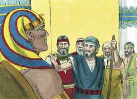
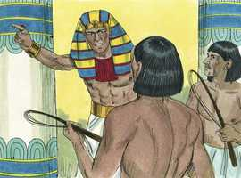
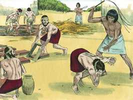
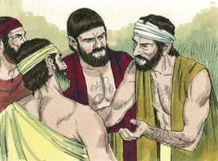
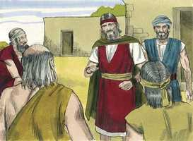
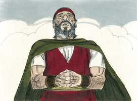

# Êxodo Cap 05

**1** 	E DEPOIS foram Moisés e Arão e disseram a Faraó: Assim diz o Senhor Deus de Israel: Deixa ir o meu povo, para que me celebre uma festa no deserto.

> **Cmt MHenry**: *Versículos 1-9* Deus reconhecerá a seu povo embora pobres e desprezados, e encontrará um tempo para defender sua causa. Faraó tratou com desprezo todo o que ouviu. Ele não tinha conhecimento de Jeová, nem temor dEle, nem amor por ele e, portanto, se negou a obedecê-lo. assim, pois, o orgulho, a ambição, a cobiça e o conhecimento político de Faraó o endureceram para sua própria destruição. O que pediram Moisés e Arão era muito razoável, somente ir a três dias de viagem pelo deserto e isso para uma boa diligência. Sacrificaremos ao Senhor nosso Deus. Faraó foi muito irracional ao dizer que a gente falava em ir a sacrificar porque estava ociosa. Assim, tergiversou suas palavras para ter um pretexto para aumentar suas cargas. No presente encontramos a muitos que estão mais dispostos a culpar o próximo por passar umas poucas horas no serviço de Deus, afastados de seus negócios mundanos, que em culpar os que dedicam o duplo de seu tempo a prazeres pecaminosos. A ordem de Faraó foi bárbara. Até Moisés e Arão deviam irar-se. Os perseguidores se comprazem em desprezar os ministros e pôr-lhes dificuldades. Deviam fazer a quantidade habitual de tijolos sem a provisão acostumada de palha para misturar com o barro. Deste modo os homens foram carregados com tanto trabalho que, se o fizessem, o esforço os quebrantaria, e se não o fizessem, seriam castigados.

 

**2** 	Mas Faraó disse: Quem é o Senhor, cuja voz eu ouvirei, para deixar ir Israel? Não conheço o Senhor, nem tampouco deixarei ir Israel.

 

**3** 	E eles disseram: O Deus dos hebreus nos encontrou; portanto deixa-nos agora ir caminho de três dias ao deserto, para que ofereçamos sacrifícios ao Senhor nosso Deus, e ele não venha sobre nós com pestilência ou com espada.

**4** 	Então disse-lhes o rei do Egito: Moisés e Arão, por que fazeis cessar o povo das suas obras? Ide às vossas cargas.

 

**5** 	E disse também Faraó: Eis que o povo da terra já é muito, e vós os fazeis abandonar as suas cargas.

> **Cmt MHenry**: *CAPÍTULO 50N-Fp 51N-Cl 52N-1Ts 53N-2Ts 54N-1Tm 55N-2Tm 56N-Tt 57N-Fm 58N-Hb 59N-Tg

**6** 	Portanto deu ordem Faraó, naquele mesmo dia, aos exatores do povo, e aos seus oficiais, dizendo:

 

**7** 	Daqui em diante não torneis a dar palha ao povo, para fazer tijolos, como fizestes antes: vão eles mesmos, e colham palha para si.

**8** 	E lhes imporeis a conta dos tijolos que fizeram antes; nada diminuireis dela, porque eles estão ociosos; por isso clamam, dizendo: Vamos, sacrifiquemos ao nosso Deus.

**9** 	Agrave-se o serviço sobre estes homens, para que se ocupem nele e não confiem em palavras mentirosas.

**10** 	Então saíram os exatores do povo, e seus oficiais, e falaram ao povo, dizendo: Assim diz Faraó: Eu não vos darei palha;

> **Cmt MHenry**: *Versículos 10-23* Os capatazes egípcios eram muito severos. Veja quanta necessidade temos de orar para sermos livrados dos homens maus. Os chefes dos trabalhadores se queixaram justamente ao Faraó mas este zombou deles. A maldade de Satanás freqüentemente apresenta o serviço e a adoração de Deus como tarefa adequada somente para os que nada têm a fazer e atividade somente para ociosos, embora seja dever ainda dos mais ocupados deste mundo. Os que são diligentes em oferecer seus sacrifícios ao Senhor escaparão, ante Deus, do destino do servo preguiçoso, mesmo que não escapem dos homens. Os israelitas deveriam ter-se humilhado ante Deus e ter assumido sobre si mesmos a vergonha de seu pecado mas, em vez disso, brigaram contra os que seriam seus libertadores. Moisés voltou ao Senhor. Sabia que o que tinha dito e feito era por ordem de Deus e, portanto, apela ao Senhor. Quando nos encontramos em qualquer momento confundidos no caminho de nosso dever, devemos ir a Deus e expor nosso caso ante Ele por meio da oração fervorosa. Os desenganos de nosso trabalho não devem afastar-nos de nosso Deus; antes deveríamos refletir no motivo pelo qual nos foram enviados.

**11** 	Ide vós mesmos, e tomai vós palha onde a achardes; porque nada se diminuirá de vosso serviço.

**12** 	Então o povo se espalhou por toda a terra do Egito, a colher restolho em lugar de palha.

**13** 	E os exatores os apertavam, dizendo: Acabai vossa obra, a tarefa de cada dia, como quando havia palha.

**14** 	E foram açoitados os oficiais dos filhos de Israel, que os exatores de Faraó tinham posto sobre eles, dizendo estes: Por que não acabastes vossa tarefa, fazendo tijolos como antes, assim também ontem e hoje?

**15** 	Por isso, os oficiais dos filhos de Israel, foram e clamaram a Faraó, dizendo: Por que fazes assim a teus servos?

**16** 	Palha não se dá a teus servos, e nos dizem: Fazei tijolos; e eis que teus servos são açoitados; porém o teu povo tem a culpa.

**17** 	Mas ele disse: Vós sois ociosos; vós sois ociosos; por isso dizeis: Vamos, sacrifiquemos ao Senhor.

**18** 	Ide, pois, agora, trabalhai; palha porém não se vos dará; contudo, dareis a conta dos tijolos.

**19** 	Então os oficiais dos filhos de Israel viram-se em aflição, porquanto se dizia: Nada diminuireis de vossos tijolos, da tarefa do dia no seu dia.

 

**20** 	E encontraram a Moisés e a Arão, que estavam defronte deles, quando saíram de Faraó.

 

**21** 	E disseram-lhes: O Senhor atente sobre vós, e julgue isso, porquanto fizestes o nosso caso repelente diante de Faraó, e diante de seus servos, dando-lhes a espada nas mãos, para nos matar.

**22** 	Então, tornando-se Moisés ao Senhor, disse: Senhor! por que fizeste mal a este povo? por que me enviaste?

  

**23** 	Porque desde que me apresentei a Faraó para falar em teu nome, ele maltratou a este povo; e de nenhuma sorte livraste o teu povo.

> **Cmt MHenry** Intro: *• Versículos 1-9*> *O desagrado do Faraó – Ele aumenta as tarefas dos israelitas*> *• Versículos 10-23*> 28A-Os sofrimentos dos israelitas – A queixa de Moisés a Deus*