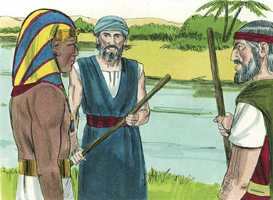

# Êxodo Cap 07

**1** 	ENTÃO disse o Senhor a Moisés: Eis que te tenho posto por deus sobre Faraó, e Arão, teu irmão, será o teu profeta.

> **Cmt MHenry**: *Versículos 1-7* De glorifica a Si mesmo. Dá a conhecer a seu povo que Ele é Jeová. Israel o chega a saber pelo cumprimento das promessas dadas a eles e aos egípcios, derramando sua ira sobre estes. Moisés, como embaixador de Jeová, falando em Seu nome, deu ordens ao Faraó, lhe notificou ameaças e invocou um juízo em sua contra. Faraó, orgulhoso e grande como era, não pôde resistir. Moisés não se sentiu assustado ante Faraó; antes o fez tremer. Isto é o que parecem querer significar as palavras: Tu serás deus para Faraó. Afinal Moisés é liberado de seus temores. Já não apresenta objeções; fortalecido na fé, realiza sua tarefa com valor e continua adiante com perseverança.

**2** 	Tu falarás tudo o que eu te mandar; e Arão, teu irmão, falará a Faraó, que deixe ir os filhos de Israel da sua terra.

**3** 	Eu, porém, endurecerei o coração de Faraó, e multiplicarei na terra do Egito os meus sinais e as minhas maravilhas.

**4** 	Faraó, pois, não vos ouvirá; e eu porei minha mão sobre o Egito, e tirarei meus exércitos, meu povo, os filhos de Israel, da terra do Egito, com grandes juízos.

**5** 	Então os egípcios saberão que eu sou o Senhor, quando estender a minha mão sobre o Egito, e tirar os filhos de Israel do meio deles.

**6** 	Assim fizeram Moisés e Arão; como o Senhor lhes ordenara, assim fizeram.

**7** 	E Moisés era da idade de oitenta anos, e Arão da idade de oitenta e três anos quando falaram a Faraó.

> **Cmt MHenry**: *CAPÍTULO 7*

**8** 	E o Senhor falou a Moisés e a Arão, dizendo:

> **Cmt MHenry**: *Versículos 8-13* Nada que possa desgostar aos homens, quando se opõe a seu orgulho e luxúria, chegará a convencê-los. Todavia, é fácil fazê-los acreditarem que são verdadeiras as coisas que desejam. Deus manda sempre com sua palavra provas conclusivas de sua autoridade divina, porém quando os homens se inclinam à desobediência, e querem pôr objeções, Ele permite repetidas vezes que seja colocada diante deles uma armadilha, na qual eles mesmos sejam capturados. Os mágicos eram enganadores que, o meio de tretas e truques secretos, tentaram copiar os milagres verdadeiros de Moisés, coisa que lograram fazer em pequena medida, como para enganar os observadores; porém, finalmente, viram-se obrigados a confessar que não podiam imitar os efeitos do poder divino. Ninguém ajuda mais a destruir pecadores que aqueles que resistem a verdade distraindo os homens com algo parecido com a verdade, porém falso. Satanás deve ser temido com maior razão quando se transforma em anjo de luz.

**9** 	Quando Faraó vos falar, dizendo: Fazei vós um milagre, dirás a Arão: Toma a tua vara, e lança-a diante de Faraó; e se tornará em serpente.

**10** 	Então Moisés e Arão foram a Faraó, e fizeram assim como o Senhor ordenara; e lançou Arão a sua vara diante de Faraó, e diante dos seus servos, e tornou-se em serpente.

 

**11** 	E Faraó também chamou os sábios e encantadores; e os magos do Egito fizeram também o mesmo com os seus encantamentos.

**12** 	Porque cada um lançou sua vara, e tornaram-se em serpentes; mas a vara de Arão tragou as varas deles.

 

**13** 	Porém o coração de Faraó se endureceu, e não os ouviu, como o Senhor tinha falado.

**14** 	Então disse o Senhor a Moisés: O coração de Faraó está endurecido, recusa deixar ir o povo.

> **Cmt MHenry**: *Versículos 14-25* Eis aqui a primeira das dez pragas: Conversão das águas em sangue. Foi uma praga *espantosa*. A visão de tão vastas torrentes de sangue não podia senão inspirar horror. Nada é mais comum que a água; tão sabia e tão bondosamente a Providência tem ordenado que o que é tão necessário e útil para o bem-estar da vida humana seja barato e esteja disponível quase em todo lugar; contudo, agora os egípcios deviam beber sangue ou morrer de sede. Egito era uma terra agradável, mas os peixes mortos e o sangue devem tê-la deixado muito desagradável. Era uma praga *justa*, enviada com justiça sobre os egípcios, porque o Nilo, o rio do Egito, era seu ídolo. Essa criatura que idolatramos é o que Deus nos tira justamente ou faz que nos resulte amarga. Tinham maculado o rio com o sangue dos meninos dos hebreus e, agora, Deus convertera seu rio em sangue. Nunca tiveram sede de sangue, porém, cedo ou tarde, se fartaram. Era uma praga *significativa*; Egito dependia muito de seu rio ([Zc 14.18](../38A-Zc/14.md#18)); de modo que o atacar o rio para eles era uma advertência da destruição de toda a produção de seu país. O amor de Cristo a seus discípulos muda todas suas misericórdias comuns em bênçãos espirituais; a ira de Deus contra seus inimigos converte em maldição e miséria para eles as vantagens mais apreciadas. Arão deve convocar a praga batendo o rio com sua vara. Foi feito à vista do Faraó e seus ajudantes, pois os verdadeiros milagres de Deus não se realizam como os prodígios mentirosos de Satanás; a verdade não se esconde nos cantos. Veja-se o poder onipotente de Deus. cada criatura é para nós o que Ele a faz ser: água ou sangue. Note-se com que mudanças podemos encontrar-nos nas coisas deste mundo; o que sempre é vão, logo pode converter-se em tribulação. Perceba-se que má obra realiza o pecado. se as coisas que têm sido nossa consolação resultam ser nossa cruz, é graças a nós mesmos. O pecado é o que converte nossas águas em sangue. A praga durou sete dias; e em todo esse tempo o orgulhoso coração de Faraó não o deixou desejar que Moisés orasse para terminar a praga. Assim os hipócritas de coração acumulam ira sobre si. Não é de assombrar-se que a ira de Deus não se tenha acalmado, senão que sua mão ainda continue estendida.

**15** 	Vai pela manhã a Faraó; eis que ele sairá às águas; põe-te em frente dele na beira do rio, e tomarás em tua mão a vara que se tornou em cobra.

**16** 	E lhe dirás: O Senhor Deus dos hebreus me tem enviado a ti, dizendo: Deixa ir o meu povo, para que me sirva no deserto; porém eis que até agora não tens ouvido.

**17** 	Assim diz o Senhor: Nisto saberás que eu sou o Senhor: Eis que eu com esta vara, que tenho em minha mão, ferirei as águas que estão no rio, e tornar-se-ão em sangue.

**18** 	E os peixes, que estão no rio, morrerão, e o rio cheirará mal; e os egípcios terão nojo de beber da água do rio.

**19** 	Disse mais o Senhor a Moisés: Dize a Arão: Toma tua vara, e estende a tua mão sobre as águas do Egito, sobre as suas correntes, sobre os seus rios, e sobre os seus tanques, e sobre todo o ajuntamento das suas águas, para que se tornem em sangue; e haja sangue em toda a terra do Egito, assim nos vasos de madeira como nos de pedra.

**20** 	E Moisés e Arão fizeram assim como o Senhor tinha mandado; e Arão levantou a vara, e feriu as águas que estavam no rio, diante dos olhos de Faraó, e diante dos olhos de seus servos; e todas as águas do rio se tornaram em sangue,

  

**21** 	E os peixes, que estavam no rio, morreram, e o rio cheirou mal, e os egípcios não podiam beber a água do rio; e houve sangue por toda a terra do Egito.

**22** 	Porém os magos do Egito também fizeram o mesmo com os seus encantamentos; de modo que o coração de Faraó se endureceu, e não os ouviu, como o Senhor tinha dito.

 

**23** 	E virou-se Faraó, e foi para sua casa; nem ainda nisto pôs seu coração.

**24** 	E todos os egípcios cavaram poços junto ao rio, para beberem água; porquanto não podiam beber da água do rio.

**25** 	Assim se cumpriram sete dias, depois que o Senhor ferira o rio.

> **Cmt MHenry** Intro: *• Versículos 1-7*> *Moisés e Arão animados*> *• Versículos 8-13*> *As varas convertidas em serpente – Endurecimento do*> *coração de Faraó*> *• Versículos 14-25*> *O rio convertido em sangue – Angústia dos egípcios*