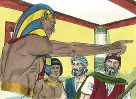
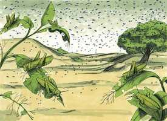
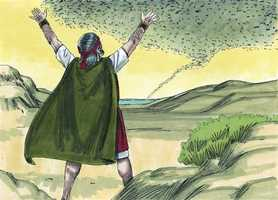
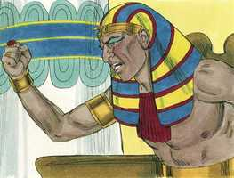
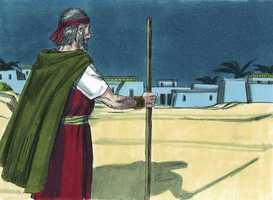
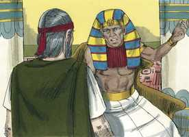
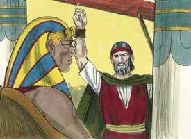

# Êxodo Cap 10

**1** 	DEPOIS disse o Senhor a Moisés: Vai a Faraó, porque tenho endurecido o seu coração, e o coração de seus servos, para fazer estes meus sinais no meio deles,

> **Cmt MHenry**: *Versículos 1-11* As pragas do Egito mostram a gravidade do pecado. Advertem aos filhos dos homens que não devem lutar co seu Fazedor. Faraó pretendera humilhar-se, porém não lhe foi levado em conta porque não foi sincero. Se anuncia a praga de gafanhotos. Esta devia ser muito pior que qualquer dessa classe que tivessem conhecido. Os servos de Faraó o persuadiram para que ficasse de acordo com Moisés. Nesse momento Faraó quer deixar que partam os varões, pretendendo falsamente que isto era todo o que eles desejavam. Jura que não se levarão as crianças. Satanás faz tudo o que pode para impedir que os que servem a Deus levianamente a seus filhos com eles. É o inimigo juramentado da piedade precoce. Temos razão para suspeitar que Satanás está metido em tudo o que nos impeça comprometer a nossos filhos no serviço de Deus. Tampouco deve o jovem esquecer que o conselho do Senhor é: Lembra-te de teu Criador nos dias de tua juventude; mas o conselho de Satanás é que se mantenha as crianças como escravos do pecado e do mundo. Atentem que o grande inimigo do homem deseja retê-lo com os laços do afeto, como se Faraó tiver tomado reféns dos israelitas para garantir seu retorno, retendo em cativeiro as esposas e filhos. Satanás está disposto a partilhar nosso dever e nosso serviço com o Salvador, porque o Salvador não aceitará suas condições.

**2** 	E para que contes aos ouvidos de teus filhos, e dos filhos de teus filhos, as coisas que fiz no Egito, e os meus sinais, que tenho feito entre eles; para que saibais que eu sou o Senhor.

**3** 	Assim foram Moisés e Arão a Faraó, e disseram-lhe: Assim diz o Senhor Deus dos hebreus: Até quando recusarás humilhar-te diante de mim? Deixa ir o meu povo para que me sirva;

**4** 	Porque se ainda recusares deixar ir o meu povo, eis que trarei amanhã gafanhotos aos teus termos.

**5** 	E cobrirão a face da terra, de modo que não se poderá ver a terra; e eles comerão o restante que escapou, o que vos ficou da saraiva; também comerão toda a árvore que vos cresce no campo;

**6** 	E encherão as tuas casas, e as casas de todos os teus servos e as casas de todos os egípcios, quais nunca viram teus pais, nem os pais de teus pais, desde o dia em que se acharam na terra até o dia de hoje. E virou-se, e saiu da presença de Faraó.

**7** 	E os servos de Faraó disseram-lhe: Até quando este homem nos há de ser por laço? Deixa ir os homens, para que sirvam ao Senhor seu Deus; ainda não sabes que o Egito está destruído?

**8** 	Então Moisés e Arão foram levados outra vez a Faraó, e ele disse-lhes: Ide, servi ao Senhor vosso Deus. Quais são os que hão de ir?

**9** 	E Moisés disse: Havemos de ir com os nossos jovens, e com os nossos velhos; com os nossos filhos, e com as nossas filhas, com as nossas ovelhas, e com os nossos bois havemos de ir; porque temos de celebrar uma festa ao Senhor.

 

**10** 	Então ele lhes disse: Seja o Senhor assim convosco, como eu vos deixarei ir a vós e a vossos filhos; olhai que há mal diante da vossa face.

> **Cmt MHenry**: *CAPÍTULO 10A-2Sm

 

**11** 	Não será assim; agora ide vós, homens, e servi ao Senhor; pois isso é o que pedistes. E os expulsaram da presença de Faraó.

**12** 	Então disse o Senhor a Moisés: Estende a tua mão sobre a terra do Egito para que os gafanhotos venham sobre a terra do Egito, e comam toda a erva da terra, tudo o que deixou a saraiva.

> **Cmt MHenry**: *Versículos 12-20* Deus faz que Moisés estique sua mão; os gafanhotos vêm ao seu chamado. Teria sido mais fácil resistir a um exército que a esta hoste de insetos. Então, quem é capaz de enfrentar o grande Deus? cobriram a face da terra e comeram seu produto. As ervas crescem para servir ao homem, porém, quando agrada a Deus, os insetos a saqueiam e comem o pão da boca deles. Que nosso trabalho não seja pela habitação e a comida que assim ficam expostos, senão para o que perdura para a vida eterna. Faraó pede a Moisés e Arão que orem por ele. Há alguns que, em seu mal-estar, buscam a ajuda das orações de outras pessoas, mas não têm a intenção de orar eles mesmos. Com isso demonstram que não têm um amor verdadeiro a Deus nem se deleitam na comunhão com Ele. faraó deseja somente que *esta morte* seja afastada, não *este pecado*. deseja livrar-se da praga de gafanhotos, não da praga de um coração duro que era mais perigoso. Um vento oriental trouxe os gafanhotos, um vento ocidental os leva embora. Onde quer que esteja o vento, obedece a palavra de Deus e gira por Seu conselho. O vento sopra de onde quer, em relação a nós, mas não é assim em quanto a Deus, pois o respeita. Também foi um argumento para o arrependimento deles, porque por isto parecia que Deus estava disposto a perdoar e a mostrar misericórdia. Se o faz ante os sinais externos da humilhação, que não fará se formos sinceros! Oh, que esta bondade de Deus possa levar-nos ao arrependimento! Faraó regressou novamente a sua resolução de não deixar partir o povo. os que freqüentemente são detidos em suas convicções, é porque estão justamente entregues às concupiscências de seu coração.

 

**13** 	Então estendeu Moisés sua vara sobre a terra do Egito, e o Senhor trouxe sobre a terra um vento oriental todo aquele dia e toda aquela noite; e aconteceu que pela manhã o vento oriental trouxe os gafanhotos.

**14** 	E vieram os gafanhotos sobre toda a terra do Egito, e assentaram-se sobre todos os termos do Egito; tão numerosos foram que, antes destes nunca houve tantos, nem depois deles haverá.

**15** 	Porque cobriram a face de toda a terra, de modo que a terra se escureceu; e comeram toda a erva da terra, e todo o fruto das árvores, que deixara a saraiva; e não ficou verde algum nas árvores, nem na erva do campo, em toda a terra do Egito.

**16** 	Então Faraó se apressou a chamar a Moisés e a Arão, e disse: Pequei contra o Senhor vosso Deus, e contra vós.

**17** 	Agora, pois, peço-vos que perdoeis o meu pecado somente desta vez, e que oreis ao Senhor vosso Deus que tire de mim somente esta morte.

**18** 	E saiu da presença de Faraó, e orou ao Senhor.

 

**19** 	Então o Senhor trouxe um vento ocidental fortíssimo, o qual levantou os gafanhotos e os lançou no Mar Vermelho; não ficou um só gafanhoto em todos os termos do Egito.

**20** 	O Senhor, porém, endureceu o coração de Faraó, e este não deixou ir os filhos de Israel.

 

**21** 	Então disse o Senhor a Moisés: Estende a tua mão para o céu, e virão trevas sobre a terra do Egito, trevas que se apalpem.

> **Cmt MHenry**: *Versículos 21-29* A praga das trevas trazida sobre o Egito foi uma praga espantosa. Era escuridão que podia apalpar-se, tão espessa era a névoa. Assombrava e aterrava. Continuou por três dias: seis noites de uma só vez; até os palácios mais iluminados eram como masmorras. Agora Faraó teve tempo para considerar se ele o teria feito melhor. As trevas espirituais são escravidão espiritual; enquanto Satanás cega os olhos dos homens para que não enxerguem, lhes amarra de pés e mãos para que não trabalhem para Deus nem se movam rumo ao céu. Eles se sentam nas trevas. Era justo que Deus os castigasse assim. A cegueira de sua mente lhes acarretou a escuridão do ar; nunca esteve tão cegada a mente como a do Faraó; nunca o ar esteve tão abaçanado como no Egito. Devem temer-se as conseqüências do pecado; se três dias de trevas foram tão espantosos, como serão as trevas eternas? Os filhos de Israel tinham, ao mesmo tempo, luz em suas casas. Não devemos pensar que participamos das misericórdias comuns como algo que se dá por sentado e, portanto, que não devemos gratidão a Deus por elas. Elas demonstram o favor particular que Ele demonstra a seu povo. sem dúvida que há luz onde há um israelita, onde há um filho da luz, embora seja neste mundo de trevas. Quando Deus fez esta diferença entre os israelitas e os egípcios, quem não teria preferido a pobre choça de um israelita ao formoso palácio de um egípcio? Há uma diferença real entre a casa do ímpio que está sob a maldição e a vivenda do justo que é abençoado. Faraó renovou seu tratado com Moisés e Arão e consentiu em que levassem a seus filhos, porém deixando o gado. É comum que os pecadores regateiem com Deus Todo Poderoso; assim tratam de zombar dEle, porém se enganam a si mesmos. As condições da reconciliação com Deus têm sido fixadas de modo que, embora os homens as discutam por longo tempo, não podem alterá-las nem rebaixá-las. Devemos cumprir as exigências da vontade de Deus; não podemos esperar que Ele condescenda com os termos que dite nossa luxúria. Devemos consagrar todos nossos pertences mundanos, com nós mesmos e nossos filhos, ao serviço de Deus; nós não sabemos que uso fará Ele de alguma parte do que temos. Faraó se retirou abruptamente da conferência e resolveu não fazer mais tratos. Tinha-se esquecido da freqüência com que manava trazer a Moisés para que o aliviasse das pragas? Agora deveriam dizê-lhe para não voltar mais? Vã maldade! Ameaçar com a morte a quem estava armado com semelhante poder! A que ponto levará aos homens a dureza de seu coração e o desprezo pela Palavra de Deus e seus mandamentos! Depois disto, Moisés não tornou a voltar até que o mandaram chamar. Quando os homens lançam de si a palavra de Deus, Ele os entrega justamente a seus próprios enganos.

 

**22** 	E Moisés estendeu a sua mão para o céu, e houve trevas espessas em toda a terra do Egito por três dias.

**23** 	Não viu um ao outro, e ninguém se levantou do seu lugar por três dias; mas todos os filhos de Israel tinham luz em suas habitações.

**24** 	Então Faraó chamou a Moisés, e disse: Ide, servi ao Senhor; somente fiquem vossas ovelhas e vossas vacas; vão também convosco as vossas crianças.

 

**25** 	Moisés, porém, disse: Tu também darás em nossas mãos sacrifícios e holocaustos, que ofereçamos ao Senhor nosso Deus.

 

**26** 	E também o nosso gado há de ir conosco, nem uma unha ficará; porque daquele havemos de tomar, para servir ao Senhor nosso Deus; porque não sabemos com que havemos de servir ao Senhor, até que cheguemos lá.

**27** 	O Senhor, porém, endureceu o coração de Faraó, e este não os quis deixar ir.

**28** 	E disse-lhe Faraó: Vai-te de mim, guarda-te que não mais vejas o meu rosto; porque no dia em que vires o meu rosto, morrerás.

 

**29** 	E disse Moisés: Bem disseste; eu nunca mais verei o teu rosto.

> **Cmt MHenry** Intro: *• Versículos 1-11*> *Anúncio da praga de gafanhotos – Faraó, aconselhado por*> *seus servos, se inclina a permitir que os israelitas partam*> *• Versículos 12-20*> *A praga de gafanhotos*> *• Versículos 21-29*> *A praga das trevas*