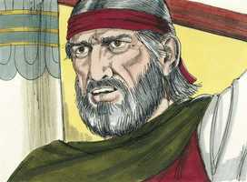

# Êxodo Cap 11

**1** 	E O Senhor disse a Moisés: Ainda uma praga trarei sobre Faraó, e sobre o Egito; depois vos deixará ir daqui; e, quando vos deixar ir totalmente, a toda a pressa vos lançará daqui.

> **Cmt MHenry**: *Versículos 1-3* Uma revelação secreta foi feita a Moisés enquanto ainda estava na presença de Faraó, para que lhe der advertência do último espantoso juízo antes de ir embora. Este foi o último dia da servidão de Israel; estavam para partir. Seus amos, que tinham abusado deles em seu trabalho, os teriam enviado com as mãos vazias, porém Deus fez provisão para que os trabalhadores não perdessem o que lhes correspondia por seu trabalho e lhes ordenou *pedir* agora, em sua partida, e lhes foi dado. Deus curará o ferido que, em humilde silêncio, lhe encomendou sua causa; e no final nenhum dos que sofrem com paciência sae perdendo. Também mudou o espírito dos egípcios para com eles, e os fez obter a compaixão de seus opressores. Os que honram a Deus serão honrados por Ele.

 

**2** 	Fala agora aos ouvidos do povo, que cada homem peça ao seu vizinho, e cada mulher à sua vizinha, jóias de prata e jóias de ouro.

**3** 	E o Senhor deu ao povo graça aos olhos dos egípcios; também o homem Moisés era mui grande na terra do Egito, aos olhos dos servos de Faraó e aos olhos do povo.

**4** 	Disse mais Moisés: Assim o Senhor tem dito: À meia-noite eu sairei pelo meio do Egito;

> **Cmt MHenry**: *Versículos 4-10* A morte de todos os primogênitos do Egito de uma só vez; esta praga tinha sido a primeira em anunciar-se, mas foi a última em executar-se. Percebam quão lento é Deus para a ira. A praga se anuncia e se afixa o tempo; todos seus primogênitos dormiriam o sono da morte, não silenciosamente, senão como para despertar às famílias à meia-noite. O príncipe não estava tão alto como para não ser alcançado por isso, nem os escravos do moinho estavam demasiado baixo para passas desapercebidos. Enquanto os anjos matavam os egípcios, nem sequer um cachorro latiria entre os filhos de Israel. Isto é uma antecipação da diferença que haverá no grande dia entre o povo de Deus e seus inimigos. Se os homens soubessem qual é a diferença que marca Deus, e marcará para toda a eternidade, entre os que o servem e os que não lhe servem, a religião não lhes pareceria coisa indiferente; nem tampouco agiriam nisto com tanta negligência como o fazem. Quando Moisés houve assim entregado sua mensagem, saiu da presença de Faraó com grande ira por sua obstinação, embora ele era o homem mais manso da terra. A Escritura tem anunciado a incredulidade de muitos que ouvem o evangelho, para que não seja uma surpresa ou uma pedra de tropeço para nós ([Rm 10.16](../45N-Rm/10.md#16)). não pensemos nunca o pior do Evangelho de Cristo pela marcada negligência que país homens lhe assinam. Faraó se endureceu, apesar de que foi convencido para que depusesse suas severas e altivas exigências para que os israelitas obtivessem a plena liberdade. Em forma semelhante, o povo de Deus achará que cada luta contra seu adversário espiritual, feita no poder de Jesus Cristo, cada tentativa de vencê-lo pelo sangue do Cordeiro, e todo desejo de alcançar crescente semelhança e amor ao Cordeiro, serão recompensados com crescente liberdade do poder do inimigo das almas.

 

**5** 	E todo o primogênito na terra do Egito morrerá, desde o primogênito de Faraó, que haveria de assentar-se sobre o seu trono, até ao primogênito da serva que está detrás da mó, e todo o primogênito dos animais.

**6** 	E haverá grande clamor em toda a terra do Egito, como nunca houve semelhante e nunca haverá;

**7** 	Mas entre todos os filhos de Israel nem mesmo um cão moverá a sua língua, desde os homens até aos animais, para que saibais que o Senhor fez diferença entre os egípcios e os israelitas.

**8** 	Então todos estes teus servos descerão a mim, e se inclinarão diante de mim, dizendo: Sai tu, e todo o povo que te segue as pisadas; e depois eu sairei. E saiu da presença de Faraó ardendo em ira.

 

**9** 	O Senhor dissera a Moisés: Faraó não vos ouvirá, para que as minhas maravilhas se multipliquem na terra do Egito.

**10** 	E Moisés e Arão fizeram todas estas maravilhas diante de Faraó; mas o Senhor endureceu o coração de Faraó, que não deixou ir os filhos de Israel da sua terra.

> **Cmt MHenry** Intro: *CAPÍTULO 11A-1Rs> *• Versículos 1-3*> *As últimas instruções de Deus a Moisés a respeito de Faraó e*> *dos egípcios*> *• Versículos 4-10*> *Anúncio da morte dos primogênitos*