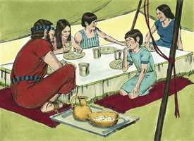

# Êxodo Cap 16

**1** 	E PARTINDO de Elim, toda a congregação dos filhos de Israel veio ao deserto de Sim, que está entre Elim e Sinai, aos quinze dias do mês segundo, depois de sua saída da terra do Egito.

> **Cmt MHenry**: *Versículos 1-12* As provisões de Israel, trazidas do Egito, acabaram-se a meados do segundo mês e eles murmuraram. Não é novidade que as maiores bondades se representem com baixeza como os prejuízos maiores. Sua apreciação da libertação era tão baixa, que desejaram ter morrido no Egito, e pela mão do Senhor, isto é, pelas pragas que mataram aos egípcios. Não podemos supor que tinham abundância no Egito, nem que lhes for possível sentir medo de morrer de fome no deserto enquanto tivessem rebanhos e manadas: ninguém diz coisas mas absurdas que os que murmuram. Quando começamos a agitar-nos, devemos considerar que Deus ouve todas nossas queixas. Deus promete uma provisão oportuna e constante. Provou se eles confiariam nEle e se estariam satisfeitos tendo o pão de cada dia a tempo. Deste modo, provou se eles o serviriam, e viu-se claramente quão ingratos eram. Quando Deus *mandou as pragas* aos egípcios, foi para fazê-lhes saber que Ele era o Senhor; quando *proveu* para os israelitas, foi para fazê-lhes saber que Ele era seu Deus.

**2** 	E toda a congregação dos filhos de Israel murmurou contra Moisés e contra Arão no deserto.

 

**3** 	E os filhos de Israel disseram-lhes: Quem dera tivéssemos morrido por mão do Senhor na terra do Egito, quando estávamos sentados junto às panelas de carne, quando comíamos pão até fartar! Porque nos tendes trazido a este deserto, para matardes de fome a toda esta multidão.

**4** 	Então disse o Senhor a Moisés: Eis que vos farei chover pão dos céus, e o povo sairá, e colherá diariamente a porção para cada dia, para que eu o prove se anda em minha lei ou não.

 

**5** 	E acontecerá, no sexto dia, que prepararão o que colherem; e será o dobro do que colhem cada dia.

**6** 	Então disseram Moisés e Arão a todos os filhos de Israel: À tarde sabereis que o Senhor vos tirou da terra do Egito,

**7** 	E amanhã vereis a glória do Senhor, porquanto ouviu as vossas murmurações contra o Senhor. E quem somos nós, para que murmureis contra nós?

**8** 	Disse mais Moisés: Isso será quando o Senhor à tarde vos der carne para comer, e pela manhã pão a fartar, porquanto o Senhor ouviu as vossas murmurações, com que murmurais contra ele. E quem somos nós? As vossas murmurações não são contra nós, mas sim contra o Senhor.

**9** 	Depois disse Moisés a Arão: Dize a toda a congregação dos filhos de Israel: Chegai-vos à presença do Senhor, porque ouviu as vossas murmurações.

**10** 	E aconteceu que, quando falou Arão a toda a congregação dos filhos de Israel, e eles se viraram para o deserto, eis que a glória do Senhor apareceu na nuvem.

**11** 	E o Senhor falou a Moisés, dizendo:

**12** 	Tenho ouvido as murmurações dos filhos de Israel. Fala-lhes, dizendo: Entre as duas tardes comereis carne, e pela manhã vos fartareis de pão; e sabereis que eu sou o Senhor vosso Deus.

**13** 	E aconteceu que à tarde subiram codornizes, e cobriram o arraial; e pela manhã jazia o orvalho ao redor do arraial.

> **Cmt MHenry**: *Versículos 13-21* No anoitecer chegaram as codornas, e a gente capturou facilmente quantas necessitavam. O maná chegou com o orvalho. Eles o chamaram maná, *man hu*, que significa "O que é isso?". É uma porção; é o que o nosso Deus nos designou e o tomaremos, e estaremos agradecidos. era uma comida desejável; era alimento saudável. O maná chovia do céu; quando o orvalho cessava de descer, aparecia como uma coisa pequena, redonda, miúda como a geada que cobre a terra como a semente do coentro, de uma cor semelhante à das pérolas. O maná cais somente seis dias na semana, e em quantidade dupla no sexto dia; bichava e apodrecia se era guardado por mais de um dia, exceto no dia de repouso. A gente nunca o tinha visto antes. Podiam moê-lo no moinho, ou amassá-lo num morteiro, e depois fazer tortas e cozê-las. Durou os quarenta anos que os israelitas estiveram no deserto, por onde foram, e cessou quando entraram no Canaã. Tudo isto mostra quão diferente era de qualquer coisa encontrada antes ou agora. Eles deviam recolher o maná cada manhã. Aqui nos é ensinado: 1) *A sermos prudentes e diligentes para prover comida para nós e nossos lares*; trabalhar tranqüilos e comer nosso próprio pão, não o pão do ócio ou do engano. A abundância de parte de Deus dá lugar ao dever do h.; assim era ainda quando chovia maná; eles não deviam comer senão até terem recolhido. 2*) A estarmos contentes com o suficiente*. Os que mais têm, têm somente alimento e vestimenta para si mesmos; os que têm menos, em geral têm essas coisas, de modo que quem recolhe muito nada tem que sobre, e ao que ajunta pouco, nada lhe falta. Não há desproporção entre um e o outro no *desfrute* das coisas desta vida, como a há na simples *possessão* delas. 3) *A confiarmos na Providência:* que durmam em paz mesmo que não tenham pão em suas tendas, nem em todo o acampamento, confiando em que Deus, no dia seguinte, lhes trará o pão cotidiano. Estava mais seguro e a salvo no armazém de Deus que em poder deles, e daí viria mais doce e fresco. Veja-se aqui quão néscio é acumular. O maná acumulado por alguns, que se acharam mais espertos e melhores administradores que seus vizinhos, e que quiseram abastecer-se para que não lhes faltasse no dia seguinte, bichou-se e apodreceu. Resultará completamente desperdiçado o que se guarda com cobiça e sem fé. Tais riquezas são corruptas ([Tg 5.2-3](../59N-Tg/05.md#2)). A mesma sabedoria, poder e bondade que desde o alto trouxe para os israelitas alimento diário no deserto, produz o alimento anualmente desde a terra no curso constante da natureza, e nos dá todas as coisas ricamente para desfrutar. Versículos 22-31 Aqui se menciona um sétimo dia de repouso. Era conhecido, não só antes de dar-se a lei no monte Sinai, senão antes de sair Israel do Egito, até mesmo desde o princípio ([Gn 2.3](../01A-Gn/02.md#3)). separar um dia de cada sete para a obra sagrada e para o descanso santo, estava estabelecido desde que Deus criou o homem sobre a terra, e é a mais antiga das leis divinas. Ao designar o sétimo dia para o descanso, Ele se preocupou que devido a isso não fossem a sair perdendo; e nenhum nunca sairá perdendo por servir a Deus. Neste dia deviam ajuntar o suficiente para dois dias e deixá-lo preparado. Isto nos ensina a ordenar os assuntos familiares para que nos estorvem o menos possível na obra do dia de repouso. Há trabalhos necessários que inevitavelmente devem ser feitos nesse dia, porém é desejável ter o menos possível para fazer, a fim de que possamos dedicar-nos mais livremente a preparar-nos para a vida vindoura. Quando guardavam maná em contra do mandamento, apodrecia; quando o guardavam por uma ordem, era doce e bom; tudo é santificado pela palavra de Deus e a oração. Deus não enviava maná no sétimo dia, portanto eles não deviam esperá-lo nem sair a ajuntá-lo. isto mostrava que era produzido em forma miraculosa.

 

**14** 	E quando o orvalho se levantou, eis que sobre a face do deserto estava uma coisa miúda, redonda, miúda como a geada sobre a terra.

 

**15** 	E, vendo-a os filhos de Israel, disseram uns aos outros: Que é isto? Porque não sabiam o que era. Disse-lhes pois Moisés: Este é o pão que o Senhor vos deu para comer.

**16** 	Esta é a palavra que o Senhor tem mandado: Colhei dele cada um conforme ao que pode comer, um ômer por cabeça, segundo o número das vossas almas; cada um tomará para os que se acharem na sua tenda.

> **Cmt MHenry**: *CAPÍTULO 16A-Ne

 

**17** 	E os filhos de Israel fizeram assim; e colheram, uns mais e outros menos.

**18** 	Porém, medindo-o com o ômer, não sobejava ao que colhera muito, nem faltava ao que colhera pouco; cada um colheu tanto quanto podia comer.

**19** 	E disse-lhes Moisés: Ninguém deixe dele para amanhã.

**20** 	Eles, porém, não deram ouvidos a Moisés, antes alguns deles deixaram dele para o dia seguinte; e criou bichos, e cheirava mal; por isso indignou-se Moisés contra eles.

 

**21** 	Eles, pois, o colhiam cada manhã, cada um conforme ao que podia comer; porque, aquecendo o sol, derretia-se.

 

**22** 	E aconteceu que ao sexto dia colheram pão em dobro, dois ômeres para cada um; e todos os príncipes da congregação vieram, e contaram-no a Moisés.

**23** 	E ele disse-lhes: Isto é o que o Senhor tem dito: Amanhã é repouso, o santo sábado do Senhor; o que quiserdes cozer no forno, cozei-o, e o que quiserdes cozer em água, cozei-o em água; e tudo o que sobejar, guardai para vós até amanhã.

**24** 	E guardaram-no até o dia seguinte, como Moisés tinha ordenado; e não cheirou mal nem nele houve algum bicho.

**25** 	Então disse Moisés: Comei-o hoje, porquanto hoje é o sábado do Senhor; hoje não o achareis no campo.

 

**26** 	Seis dias o colhereis, mas o sétimo dia é o sábado; nele não haverá.

**27** 	E aconteceu ao sétimo dia, que alguns do povo saíram para colher, mas não o acharam.

 

**28** 	Então disse o Senhor a Moisés: Até quando recusareis guardar os meus mandamentos e as minhas leis?

**29** 	Vede, porquanto o Senhor vos deu o sábado, portanto ele no sexto dia vos dá pão para dois dias; cada um fique no seu lugar, ninguém saia do seu lugar no sétimo dia.

**30** 	Assim repousou o povo no sétimo dia.

**31** 	E chamou a casa de Israel o seu nome maná; e era como semente de coentro branco, e o seu sabor como bolos de mel.

**32** 	E disse Moisés: Esta é a palavra que o Senhor tem mandado: Encherás um ômer dele e guardá-lo-ás para as vossas gerações, para que vejam o pão que vos tenho dado a comer neste deserto, quando eu vos tirei da terra do Egito.

> **Cmt MHenry**: *Versículos 32-36* Tendo Deus provido o maná para que fosse o alimento de seu povo no deserto, deviam guardar uma quantidade como lembrança. O pão comido não deve ser esquecido. Os milagres e as misericórdias de Deus são para serem lembradas. A palavra de Deus é o maná pelo qual se nutrem as nossas almas ([Mt 4.4](../40N-Mt/04.md#4)). As consolações do Espírito são maná escondido ([Ap 2.17](../66N-Ap/02.md#17)). Estas vêm do céu, como o maná, e são o sustento e o consolo da vida divina na alma, enquanto estamos no deserto deste mundo. Cristo na palavra é para aplicá-lo a alma e os meios de graça são para serem usados. Cada um de nós deve ajuntar para si mesmo e deve fazê-lo na manhã de nossos dias, na manhã das nossas oportunidades; se o deixarmos ir embora, pode que se faça muito tarde para recolher. O maná não é para acumulá-lo, senão para comê-lo; os que têm recebido a Cristo devem viver pela fé nEle, e não receber em vão sua graça. Houve maná suficiente para todos, suficiente para cada um, e ninguém teve demasiado; assim, pois, em Cristo há suficiente, mas não mais do que necessitamos. Os que comeram maná tornaram a ter fome, finalmente morreram, e de muitos deles não se agradou Deus; enquanto que os que se alimentaram de Cristo pela fé, nunca tornarão a ter fome nem morrerão jamais, e deles se agradará Deus para sempre. Busquemos fervorosamente a graça do Espírito Santo para que converta todo nosso conhecimento da doutrina de Cristo crucificado no alimento espiritual de nossas almas por fé e amor. "

 

**33** 	Disse também Moisés a Arão: Toma um vaso, e põe nele um ômer cheio de maná, e coloca-o diante do Senhor, para guardá-lo para as vossas gerações.

**34** 	Como o Senhor tinha ordenado a Moisés, assim Arão o pôs diante do Testemunho, para ser guardado.

**35** 	E comeram os filhos de Israel maná quarenta anos, até que entraram em terra habitada; comeram maná até que chegaram aos termos da terra de Canaã.

 

**36** 	E um ômer é a décima parte do efa.

> **Cmt MHenry** Intro: *• Versículos 1-12*> 28A-Os israelitas chegam ao deserto de Sim – Murmuram pela*> *comida – Deus promete pão do céu*> *• Versículos 13-21*> *Deus manda codornas e maná*> *• Versículos 22-31*> *Detalhes sobre o maná*> *• Versículos 32-36*> *Um ômer de maná para conservar*