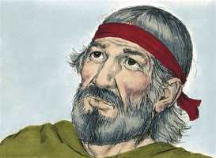

# Êxodo Cap 19

**1** 	AO terceiro mês da saída dos filhos de Israel da terra do Egito, no mesmo dia chegaram ao deserto de Sinai,

> **Cmt MHenry**: *Versículos 1-8* Moisés foi chamado para que subisse ao monte e foi empregado como mensageiro da aliança. O Fazedor e principal impulsor é o próprio Deus. este bendito estatuto foi concedido pela livre graça de Deus. a aliança aqui mencionada foi o pacto nacional pelo qual os israelitas chegaram a ser um povo governado por Jeová. Foi um tipo da nova aliança feito com os crentes verdadeiros em Cristo Jesus, mas, como outros tipos, somente era uma sombra das coisas boas que virão. Como nação quebrantaram a aliança; portanto, o Senhor declarou que Ele faria uma nova aliança com Israel escrevendo Sua lei não sobre tábuas de pedra, senão em seus corações ([Jr 31.33](../24A-Jr/31.md#33); [Hb 8.7-10](../58N-Hb/08.md#7)). A aliança aludida nestas passagens como próxima a desaparecer é a aliança nacional com Israel que eles perderam por seu pecado. se não atentarmos cuidadosamente para isto, cairemos em erros ao lermos o Antigo Testamento. Não devemos supor que a nação dos judeus, sob o pacto de obras, nada sabe do arrependimento nem da fé em um Mediador, do perdão dos pecados nem da graça; nem devemos supor, tampouco, que toda a nação de Israel teve o caráter e possuiu os privilégios dos crentes verdadeiros, como verdadeiros partícipes da aliança de graça. Todos eles estavam sob uma *dispensação de misericórdia*; tiveram privilégios externos e vantagens para a salvação; porém, como os cristãos professantes, a maioria permaneceu por ali, sem avançar mais. Israel aceitou as condições. Responderam como um só homem: "Todo o que Jeová falou, nós o faremos". Oh, que tivesse havido neles um coração assim disposto! Moisés, como mediador, transmitiu as palavras do povo a Deus. Assim, Cristo o Mediador, como Profeta, nos revela a vontade de Deus, seus preceitos e promessas e depois, como Sacerdote, oferece a Deus nossos sacrifícios espirituais, não só de oração e louvor, senão de afetos devotos e resoluções piedosas, a obra de seu próprio Espírito em nós!

 

**2** 	Porque partiram de Refidim e entraram no deserto de Sinai, onde se acamparam. Israel, pois, ali se acampou em frente ao monte.

**3** 	E subiu Moisés a Deus, e o Senhor o chamou do monte, dizendo: Assim falarás à casa de Jacó, e anunciarás aos filhos de Israel:

  

**4** 	Vós tendes visto o que fiz aos egípcios, como vos levei sobre asas de águias, e vos trouxe a mim;

**5** 	Agora, pois, se diligentemente ouvirdes a minha voz e guardardes a minha aliança, então sereis a minha propriedade peculiar dentre todos os povos, porque toda a terra é minha.

**6** 	E vós me sereis um reino sacerdotal e o povo santo. Estas são as palavras que falarás aos filhos de Israel.

**7** 	E veio Moisés, e chamou os anciãos do povo, e expôs diante deles todas estas palavras, que o Senhor lhe tinha ordenado.

 

**8** 	Então todo o povo respondeu a uma voz, e disse: Tudo o que o Senhor tem falado, faremos. E relatou Moisés ao Senhor as palavras do povo.

 

**9** 	E disse o Senhor a Moisés: Eis que eu virei a ti numa nuvem espessa, para que o povo ouça, falando eu contigo, e para que também te creiam eternamente. Porque Moisés tinha anunciado as palavras do seu povo ao Senhor.

> **Cmt MHenry**: *Versículos 9-15* A maneira solene em que a lei foi entregue era para impressionar ao povo com o sentido correto da majestade divina. Também, para convencê-lo de sua própria culpa e para mostrar que eles não podiam suportar um juízo ante Deus sobre a base de sua própria obediência. O pecador descobre na lei o que deve ser, o que é e o que lhe falta. Ali aprende a natureza, a necessidade e a glória da redenção e de ter sido feito santo. Tendo aprendido a refugiar-se em Cristo e amá-lo, a lei é a regra de sua obediência e fé.

 

**10** 	Disse também o Senhor a Moisés: Vai ao povo, e santifica-os hoje e amanhã, e lavem eles as suas roupas,

 

**11** 	E estejam prontos para o terceiro dia; porquanto no terceiro dia o Senhor descerá diante dos olhos de todo o povo sobre o monte Sinai.

**12** 	E marcarás limites ao povo em redor, dizendo: Guardai-vos, não subais ao monte, nem toqueis o seu termo; todo aquele que tocar o monte, certamente morrerá.

**13** 	Nenhuma mão tocará nele; porque certamente será apedrejado ou asseteado; quer seja animal, quer seja homem, não viverá; soando a buzina longamente, então subirão ao monte.

**14** 	Então Moisés desceu do monte ao povo, e santificou o povo; e lavaram as suas roupas.

 

**15** 	E disse ao povo: Estai prontos ao terceiro dia; e não vos chegueis a mulher.

**16** 	E aconteceu que, ao terceiro dia, ao amanhecer, houve trovões e relâmpagos sobre o monte, e uma espessa nuvem, e um sonido de buzina mui forte, de maneira que estremeceu todo o povo que estava no arraial.

> **Cmt MHenry**: *Versículos 16-25* Nunca antes, nem desde então, tem-se predicado um sermão como aquele que foi predicado à igreja no deserto. Poderia supor-se que os terrores devem ter refreado a presunção e curiosidade do povo; mas o coração endurecido do pecador ainda não vivificado pode tratar negligentemente as ameaças e os juízos mais terríveis. Ao aproximar-nos a Deus nunca devemos esquecer Sua santidade e grandeza, nem nossa baixeza e imundícia. Não podemos resistir um juízo ante Ele conforme a sua justa lei. O transgressor convicto pergunta: que devo fazer para ser salvo? E escuta a voz: Crê no Senhor Jesus Cristo e serás salvo. O Espírito Santo, que fez a lei para convencer do pecado, agora toma das coisas de Cristo e no-las mostra. No Evangelho, lemos que Cristo nos redimiu da maldição da lei, feito por nós maldição. Temos redenção por seu sangue, o perdão dos pecados. De todo aquilo de que pela lei de Moisés não pudemos ser justificados, nEle somos justificados. A lei divina é obrigatória como regra de vida. O Filho de Deus desceu do céu e sofreu a pobreza, o opróbrio, a agonia e a morte não só para redimir-nos da maldição da lei, senão para constranger-nos mais estritamente a guardar seus mandamentos. "

 

**17** 	E Moisés levou o povo fora do arraial ao encontro de Deus; e puseram-se ao pé do monte.

 

**18** 	E todo o monte Sinai fumegava, porque o Senhor descera sobre ele em fogo; e a sua fumaça subiu como fumaça de uma fornalha, e todo o monte tremia grandemente.

 

**19** 	E o sonido da buzina ia crescendo cada vez mais; Moisés falava, e Deus lhe respondia em voz alta.

> **Cmt MHenry**: *CAPÍTULO 19A-Sl

**20** 	E, descendo o Senhor sobre o monte Sinai, sobre o cume do monte, chamou o Senhor a Moisés ao cume do monte; e Moisés subiu.

**21** 	E disse o Senhor a Moisés: Desce, adverte ao povo que não traspasse o termo para ver o Senhor, para que muitos deles não pereçam.

**22** 	E também os sacerdotes, que se chegam ao Senhor, se hão de santificar, para que o Senhor não se lance sobre eles.

**23** 	Então disse Moisés ao Senhor: O povo não poderá subir ao monte Sinai, porque tu nos tens advertido, dizendo: Marca termos ao redor do monte, e santifica-o.

 

**24** 	E disse-lhe o Senhor: Vai, desce; depois subirás tu, e Arão contigo; os sacerdotes, porém, e o povo não traspassem o termo para subir ao Senhor, para que não se lance sobre eles.

**25** 	Então Moisés desceu ao povo, e disse-lhe isto.

> **Cmt MHenry** Intro: *• Versículos 1-8*> *O povo chega ao Sinai – A mensagem de Deus e sua*> *• Versículos 9-15*> *Instruções ao povo e sua preparação para ouvir a lei*> *• Versículos 16-25*> *A presença de Deus no Sinai*