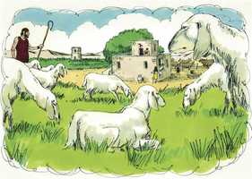

# Êxodo Cap 20

**1** 	ENTÃO falou Deus todas estas palavras, dizendo:

> **Cmt MHenry**: *Versículos 1-2* Deus fala de muitas maneiras aos filhos dos homens; pela consciência, por providências, por sua voz, a todas as quais devemos atender cuidadosamente; mas nunca falou, em momento algum, como quando deu os Dez Mandamentos. Deus tinha dado antes esta lei ao homem; estava escrita em seu coração, mas o pecado a desfigurou tanto que foi necessário reviver o conhecimento dela. A lei é espiritual, e toma conhecimento dos pensamentos, desejos e disposições secretas do coração. Sua grande exigência é o *amor*, sem o qual a obediência externa é pura hipocrisia. Requer obediência perfeita, infalível, constante; nenhuma lei do mundo admite a desobediência. Qualquer que guardar toda a lei, mas ofender um único ponto, se faz culpável de todos ([Tg 2.10](../59N-Tg/02.md#10)). omitir ou variar algo no coração ou na conduta, em pensamento, palavra ou obra, é pecado e o salário do pecado é a morte.

 

**2** 	Eu sou o Senhor teu Deus, que te tirei da terra do Egito, da casa da servidão.

**3** 	Não terás outros deuses diante de mim.

> **Cmt MHenry**: *Versículos 3-11* Os primeiros quatro dos dez mandamentos, correntemente chamados a Primeira Tábua, falam de nosso dever para com Deus. Resulta adequado que estes fossem colocados primeiro, porque o homem teve um Criador para amar antes de ter um próximo para amar. Não pode esperar-se que seja veraz com seu irmão aquele que for falso com seu Deus. O *primeiro* mandamento se refere ao objeto de adoração, Jeová, e somente a Ele. aqui se proíbe adorar criaturas, porém o mandamento vai além. Aqui se proíbe amar, desejar, deleitar-se ou esperar algo bom de qualquer complacência pecaminosa. Transgride este mandamento tudo o que não seja por amor, gratidão, reverência ou adoração perfeita. Tudo o que façam façam-no para a glória de Deus. O *segundo* mandamento se refere à adoração que devemos render ao Senhor nosso Deus. é proibido fazer imagem ou retrato da Deidade em qualquer forma ou propósito; ou adorar qualquer criatura, imagem ou quadro, mas o alcance *espiritual* deste mandamento vai muito além. Aqui se proíbe toda classe de superstição e o emprego de invenções puramente humanas para a adoração de Deus. O terceiro mandamento se refere à forma de adorar, que seja com toda reverência e seriedade possível. Proíbem-se os falsos votos. Toda alusão leviana a Deus, toda maldição profana é uma horrenda transgressão deste mandamento. Não importa se são usadas as palavras com ou sem sentido. Toda broma profana com a palavra de Deus ou com as coisas sagradas e todas as coisas semelhantes violam este mandamento e não há proveito, honra nem prazer nelas. O Senhor não terá por inocente a quem tomar seu nome em vão. A forma do quarto mandamento, "Lembra-te", demonstra que não é a primeira vez que este é dado, senão que era conhecido antes pelo povo. um dia de cada sete deve ser santificado. Seis dias são dedicados aos assuntos do mundo, mas não como para descuidar o serviço de Deus e o cuidado de nossas almas. Nestes dias devemos fazer todo nosso trabalho, sem deixar nada para fazer no dia de repouso. Cristo permitiu os trabalhos inevitáveis, e as obras de caridade e piedade; porque o dia do repouso foi feito para o homem e não o homem para o dia do repouso ([Mc 2.27](../41N-Mc/02.md#27)); mas estão proibidas todas as tarefas supérfluas, vaidosas, ou dar-se o gosto de qualquer forma. Comerciar, pagar salários, arranjar contas, escrever cartas de negócios, estudos seculares, visitas supérfluas, viagens ou conversações levianas, não guardam *santo* este dia para o Senhor. A preguiça e a indolência podem ser um repouso carnal, porém não santo. O dia de repouso para o Senhor deve ser um dia de descanso do trabalho secular, para repousar no serviço de Deus. As vantagens da devida observância deste dia santo, embora somente fossem pela saúde e a felicidade da humanidade, além do tempo que outorga para o cuidado da alma, mostram a excelência deste mandamento. O dia é *bendito*; os homens são abençoados por ele e nele. A bênção e a ordem de guardá-lo santo não se limitam a um sétimo dia, senão que se dizem do dia *de repouso*.

**4** 	Não farás para ti imagem de escultura, nem alguma semelhança do que há em cima nos céus, nem em baixo na terra, nem nas águas debaixo da terra.

**5** 	Não te encurvarás a elas nem as servirás; porque eu, o Senhor teu Deus, sou Deus zeloso, que visito a iniqüidade dos pais nos filhos, até a terceira e quarta geração daqueles que me odeiam.

**6** 	E faço misericórdia a milhares dos que me amam e aos que guardam os meus mandamentos.

**7** 	Não tomarás o nome do Senhor teu Deus em vão; porque o Senhor não terá por inocente o que tomar o seu nome em vão.

**8** 	Lembra-te do dia do sábado, para o santificar.

**9** 	Seis dias trabalharás, e farás toda a tua obra.

**10** 	Mas o sétimo dia é o sábado do Senhor teu Deus; não farás nenhuma obra, nem tu, nem teu filho, nem tua filha, nem o teu servo, nem a tua serva, nem o teu animal, nem o teu estrangeiro, que está dentro das tuas portas.

**11** 	Porque em seis dias fez o Senhor os céus e a terra, o mar e tudo que neles há, e ao sétimo dia descansou; portanto abençoou o Senhor o dia do sábado, e o santificou.

**12** 	Honra a teu pai e a tua mãe, para que se prolonguem os teus dias na terra que o Senhor teu Deus te dá.

> **Cmt MHenry**: *Versículos 12-17* As leis da Segunda Tábua, isto é, os últimos seis dos dez mandamentos, afirmam nosso dever para com nós mesmos e de uns para com outros, e explicam o grande mandamento: Amarás o próximo como a ti mesmo ([Lc 10.27](../42N-Lc/10.md#27)). A santidade e a honestidade devem ir juntas. O *quinto* mandamento se refere aos deveres para com nossos parentes. "Honra teu pai e tua mãe" inclui estimá-los, o que se demonstra em nossa conduta, na obediência a seus mandados legítimos: acudir quando sejam chamados, ir aonde sejam enviados, fazer o que lhes for pedido, refrear-se do que sejam proibidos; e isto, fazê-lo alegremente a partir de um princípio de amor. Além do mais, a submissão a seus conselhos e correções. Esforçar-se em tudo para dar comodidade aos pais e render fácil sua velhice; mantê-los se necessariamente sustento, coisa que nosso Salvador faz que esteja particularmente compreendida neste mandamento ([Mt 15.4-6](../40N-Mt/15.md#4)). Os observadores diligentes têm notado uma bênção peculiar em coisas temporais para os filhos obedientes e o inverso para os filhos desobedientes. O *sexto* mandamento requer que consideremos a vida e a seguridade dos outros assim como temos em consideração a própria. Os magistrados, seus oficiais e as testemunhas que testificam da verdade, não rompem este mandamento. A defesa própria é legítima, mas muito do que as leis do homem não consideram homicídio, o é perante Deus. As paixões furiosas suscitadas pela ira ou pela embriaguez não são escusa: muito mais culpável é o assassinato nos duelos, que são o efeito horrível de um soberbo espírito vingativo. Toda luta, seja pelo salário, por renome ou por ira e maldade, viola este mandamento, e é homicídio o derramamento de sangue resultante. Pode incluir-se ali o tentar aos homens ao vício e aos delitos que encurtam a vida. A má conduta, como a que pode quebrantar o coração de pais, esposas ou outros parentes, ou encurtá-lhes a vida, é uma transgressão deste mandamento. Proíbe toda inveja, maldade, ódio ou ira, toda linguagem provocadora ou insultante. Aqui se proíbe a destruição de nossa própria vida. Este mandamento requer um espírito de bondade, paciência e perdão. O *sétimo* mandamento se refere à castidade. Devemos temer tanto isso que *contamina* o corpo como aquilo que o *destrói*. O que tende a contaminar a imaginação ou a despertas paixões, fica embaixo desta lei, como são os retratos obscenos, livros ou conversações impuras, ou qualquer outra matéria afim. O *oitavo* mandamento é a lei do amor em quanto ao respeito da propriedade alheia. A porção de coisas deste mundo que nos tem sido assinada, em tanto se obtenha em forma honesta, é o pão que Deus nos tem dado; pelo qual devemos estar agradecidos, contentes e, no uso de médios legítimos, confiar na providência para o futuro. Aproveitar-se da ignorância, a comodidade ou a necessidade do próximo, e muitas outras coisas, quebrantam a lei de Deus, embora a sociedade não veja culpa nisso. Os saqueadores de reinos, embora estejam por acima da justiça humana, ficam incluídos nesta sentença. Defraudar o público, contrair dívidas sem pensar em pagá-las ou evadir o pagamento das justas dívidas, a extravagância, viver da caridade quando não for necessário, toda opressão do pobre em seus salários; estas e outras coisas quebrantam este mandamento, que exige o trabalho, a frugalidade e o contentamento, e tratar aos outros como gostaríamos que eles nos tratassem a nós em quanto ao patrimônio deste mundo. O *nono* mandamento se preocupa de nosso bom nome, do próprio e o do próximo. Proíbe falar falsamente de qualquer coisa, mentir, falar com equívocos e planejar ou pretender enganar de qualquer forma a nosso próximo. Falar injustamente contra nosso próximo, manchar sua reputação. Dar falso testemunho contra ele ou, na conversação corriqueira, caluniar, murmurar e andar com fofocas; tergiversar o que foi dito, exagerar e pretender de qualquer forma melhorar nossa reputação degradando a fama do próximo. Quantas vezes quebrantam a diário este mandamento pessoas de todas as categorias! O décimo mandamento golpeia na raiz: "Não cobiçarás". Os outros proíbem todo desejo de *fazer* o que resultará em dano para nosso próximo; este proíbe todo desejo ilícito de Simple_Bible_Reader_v2.9-bible_converter.exe o que nos produza prazer a nós mesmos.

**13** 	Não matarás.

**14** 	Não adulterarás.

**15** 	Não furtarás.

**16** 	Não dirás falso testemunho contra o teu próximo.

**17** 	Não cobiçarás a casa do teu próximo, não cobiçarás a mulher do teu próximo, nem o seu servo, nem a sua serva, nem o seu boi, nem o seu jumento, nem coisa alguma do teu próximo.

 

**18** 	E todo o povo viu os trovões e os relâmpagos, e o sonido da buzina, e o monte fumegando; e o povo, vendo isso retirou-se e pôs-se de longe.

> **Cmt MHenry**: *Versículos 18-21* Esta lei, tão extensa que não podemos medi-la, tão espiritual que não podemos evadi-la, e tão razoável que não podemos encontrá-lhe defeito, será a regra do futuro juízo de Deus, como é a regra para a conduta presente do homem. Se formos julgados por esta regra, encontraremos que nossa vida tem-se passado em transgressões. Com esta santa lei e um juízo espantoso que nos espera, quem pode desprezar o Evangelho de Cristo? O conhecimento da lei mostra a necessidade do arrependimento. O pecado tem sido destronado e crucificado no coração de cada crente, e nele foi escrita a lei de Deus, e se renovou a imagem de Deus. o Espírito Santo o capacita para odiar o pecado, fugir dele, amar e obedecer esta lei com sinceridade e verdade; tampouco deixará de arrepender-se.

**19** 	E disseram a Moisés: Fala tu conosco, e ouviremos: e não fale Deus conosco, para que não morramos.

**20** 	E disse Moisés ao povo: Não temais, Deus veio para vos provar, e para que o seu temor esteja diante de vós, a fim de que não pequeis.

> **Cmt MHenry**: *CAPÍTULO 20A-Pv

 

**21** 	E o povo estava em pé de longe. Moisés, porém, se chegou à escuridão, onde Deus estava.

**22** 	Então disse o Senhor a Moisés: Assim dirás aos filhos de Israel: Vós tendes visto que, dos céus, eu falei convosco.

> **Cmt MHenry**: *Versículos 22-26* Tendo entrado na densa escuridão, Deus falou a Moisés de todo o que se segue daqui até o final do capítulo 23, e é, em sua maior parte, unicamente exposição dos Dez Mandamentos. As leis destes versículos se relacionam com a adoração de Deus. os israelitas recebem a certeza da bondosa aceitação de suas devoções por parte de Deus. sob o evangelho, os homens são convidados a que orem em todo lugar, e onde quer que o povo de Deus se reúna em seu nome para adorá-lo, Ele está no meio deles; ali Ele estará com eles e os abençoará. "

**23** 	Não fareis outros deuses comigo; deuses de prata ou deuses de ouro não fareis para vós.

**24** 	Um altar de terra me farás, e sobre ele sacrificarás os teus holocaustos, e as tuas ofertas pacíficas, as tuas ovelhas, e as tuas vacas; em todo o lugar, onde eu fizer celebrar a memória do meu nome, virei a ti e te abençoarei.

**25** 	E se me fizeres um altar de pedras, não o farás de pedras lavradas; se sobre ele levantares o teu buril, profaná-lo-ás.

**26** 	Também não subirás ao meu altar por degraus, para que a tua nudez não seja descoberta diante deles.

> **Cmt MHenry** Intro: *• Versículos 1-2*> *O prefácio dos dez mandamentos*> *• Versículos 3-11*> 28A-Os mandamentos da primeira tábua*> *• Versículos 12-17*> 28A-Os da segunda tábua*> *• Versículos 18-21*> *O temor do povo*> *• Versículos 22-26*> *A idolatria proibida de novo*