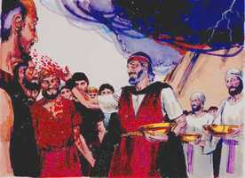

# Êxodo Cap 24

**1** 	DEPOIS disse a Moisés: Sobe ao Senhor, tu e Arão, Nadabe e Abiú, e setenta dos anciãos de Israel; e adorai de longe.

> **Cmt MHenry**: *Versículos 1-8* Deus fez uma aliança solene com Israel. Foi muito solene, tipificando a aliança de graça entre Deus e os crentes por meio de Cristo. tão logo como Deus separou para sim um povo peculiar, os governou pela palavra escrita, e assim o tem feito desde então. As alianças e os mandamentos de Deus são tão justos em si mesmos, e para nosso bem, que quanto mais pensemos neles e com maior clareza, e em forma mais completa apareçam ante nós, mais razões vemos para cumpri-los. O sangue do sacrifício se aspergia sobre o altar, sobre o livro e sobre o povo. Nem as pessoas, sua obediência moral nem seus serviços religiosos acharão aceitação de parte do Deus santo, se não for por meio do derramamento e a aspersão do sangue. Além disso, todas as bênçãos transmitidas a eles eram por misericórdia; o Senhor os trataria com bondade. Assim, pela fé no sangue de Cristo, o pecador rende obediência voluntária e aceitável.

**2** 	E só Moisés se chegará ao Senhor; mas eles não se cheguem, nem o povo suba com ele.

**3** 	Veio, pois, Moisés, e contou ao povo todas as palavras do Senhor, e todos os estatutos; então o povo respondeu a uma voz, e disse: Todas as palavras, que o Senhor tem falado, faremos.

**4** 	Moisés escreveu todas as palavras do Senhor, e levantou-se pela manhã de madrugada, e edificou um altar ao pé do monte, e doze monumentos, segundo as doze tribos de Israel;

**5** 	E enviou alguns jovens dos filhos de Israel, os quais ofereceram holocaustos e sacrificaram ao Senhor sacrifícios pacíficos de bezerros.

**6** 	E Moisés tomou a metade do sangue, e a pôs em bacias; e a outra metade do sangue espargiu sobre o altar.

**7** 	E tomou o livro da aliança e o leu aos ouvidos do povo, e eles disseram: Tudo o que o Senhor tem falado faremos, e obedeceremos.

**8** 	Então tomou Moisés aquele sangue, e espargiu-o sobre o povo, e disse: Eis aqui o sangue da aliança que o Senhor tem feito convosco sobre todas estas palavras.

 

**9** 	E subiram Moisés e Arão, Nadabe e Abiú, e setenta dos anciãos de Israel.

> **Cmt MHenry**: *Versículos 9-11* Os anciãos viram o Deus de Israel; tiveram uma olhada de Sua glória, e mesmo que o que tenham visto fosse algo do que não podiam fazer imagem nem retrato algum, bastou para satisfazê-los de que Deus estava com eles de verdade. Nada se descreve senão o que estava sob seus pés. As safiras eram o pavimento sob seus pés; coloquemos toda a riqueza deste mundo sob nossos pés e não em nosso coração. Assim, o crente descobre na faze de Jesus Cristo reflexos muito mais gloriosos da justiça e santidade de Deus com maior clareza do que jamais tivesse visto sob convicções aterradoras; e por meio do Salvador tem comunhão com o Deus santo.

**10** 	E viram o Deus de Israel, e debaixo de seus pés havia como que uma pavimentação de pedra de safira, que se parecia com o céu na sua claridade.

**11** 	Porém não estendeu a sua mão sobre os escolhidos dos filhos de Israel, mas viram a Deus, e comeram e beberam.

**12** 	Então disse o Senhor a Moisés: Sobe a mim ao monte, e fica lá; e dar-te-ei as tábuas de pedra e a lei, e os mandamentos que tenho escrito, para os ensinar.

> **Cmt MHenry**: *Versículos 12-18* Uma nuvem cobriu o monte durante seis dias; um sinal da especial presença de Deus ali. Moisés estava seguro que quem o ordenara a subir o protegeria. Até nos atributos gloriosos de Deus, que são terríveis até o máximo para o ímpio, se regozijam os santos com humilde reverência. Por meio da fé no sacrifício expiatório, esperamos maior honra que a que desfrutou Moisés na terra. Agora vemos através de um espelho, obscuramente, mas quando Ele aparecer, o veremos face a face. Esta visão de Deus continuará com o mesmo crescente resplendor de gozo, não somente por uns poucos dias, senão por toda a eternidade.

**13** 	E levantou-se Moisés com Josué seu servidor; e subiu Moisés ao monte de Deus.

**14** 	E disse aos anciãos: Esperai-nos aqui, até que tornemos a vós; e eis que Arão e Hur ficam convosco; quem tiver algum negócio, se chegará a eles.

**15** 	E, subindo Moisés ao monte, a nuvem cobriu o monte.

**16** 	E a glória do Senhor repousou sobre o monte Sinai, e a nuvem o cobriu por seis dias; e ao sétimo dia chamou a Moisés do meio da nuvem.

**17** 	E o parecer da glória do Senhor era como um fogo consumidor no cume do monte, aos olhos dos filhos de Israel.

**18** 	E Moisés entrou no meio da nuvem, depois que subiu ao monte; e Moisés esteve no monte quarenta dias e quarenta noites.

> **Cmt MHenry** Intro: *CAPÍTULO 24A-Jr> *• Versículos 1-8*> *Moisés chamado a subir ao monte – O povo promete*> *obediência*> *• Versículos 9-11*> *Aparece a glória do Senhor*> *• Versículos 12-18*> *Moisés sobe ao monte*