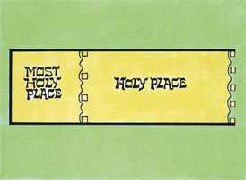

# Êxodo Cap 26

**1** 	E O TABERNÁCULO farás de dez cortinas de linho fino torcido, e azul, púrpura, e carmesim; com querubins as farás de obra esmerada.

> **Cmt MHenry**: *Versículos 1-6* Deus manifestou sua presença entre os israelitas em um tabernáculo ou tenda, devido à situação deles no deserto. Deus adapta as prendas de seu favor e os dons de sua graça ao estado e às carências de seu povo. As cortinas do tabernáculo deviam ser muito ricas. Deviam estar bordadas com querubins para significar que os anjos de Deus acampam em torno da igreja ([Sl 34.7](../19A-Sl/34.md#7)).

 

**2** 	O comprimento de uma cortina será de vinte e oito côvados, e a largura de uma cortina de quatro côvados; todas estas cortinas serão de uma medida.

**3** 	Cinco cortinas se enlaçarão uma à outra; e as outras cinco cortinas se enlaçarão uma com a outra.

**4** 	E farás laçadas de azul na orla de uma cortina, na extremidade, e na juntura; assim também farás na orla da extremidade da outra cortina, na segunda juntura.

**5** 	Cinqüenta laçadas farás numa cortina, e outras cinqüenta laçadas farás na extremidade da cortina que está na segunda juntura; as laçadas estarão presas uma com a outra.

**6** 	Farás também cinqüenta colchetes de ouro, e ajuntarás com estes colchetes as cortinas, uma com a outra, e será um tabernáculo.

**7** 	Farás também cortinas de pêlos de cabras para servirem de tenda sobre o tabernáculo; onze cortinas farás.

> **Cmt MHenry**: *Versículos 7-14* As cortinas do material mais barato, ao ser mais compridas e largas, cobriam as outras, e estavam protegidas por cobertas de couro. O total representa a pessoa e a doutrina de Cristo, e a igreja dos verdadeiros cristãos, e todas as coisas celestiais que exteriormente são baixas mas, por dentro, e ante os olhos de Deus, são gloriosas e preciosas.

**8** 	O comprimento de uma cortina será de trinta côvados, e a largura da mesma cortina de quatro côvados; estas onze cortinas serão da mesma medida.

**9** 	E juntarás cinco destas cortinas à parte, e as outras seis cortinas também à parte; e dobrarás a sexta cortina à frente da tenda.

**10** 	E farás cinqüenta laçadas na borda de uma cortina, na extremidade, na juntura, e outras cinqüenta laçadas na borda da outra cortina, na segunda juntura.

**11** 	Farás também cinqüenta colchetes de cobre, e colocarás os colchetes nas laçadas, e assim ajuntarás a tenda, para que seja uma.

**12** 	E a parte que sobejar das cortinas da tenda, a saber, a metade da cortina que sobejar, penderá de sobra às costas do tabernáculo.

**13** 	E um côvado de um lado, e outro côvado do outro, que sobejará no comprimento das cortinas da tenda, penderá de sobra aos lados do tabernáculo de um e de outro lado, para cobri-lo.

**14** 	Farás também à tenda uma coberta de peles de carneiro, tintas de vermelho, e outra coberta de peles de texugo em cima.

**15** 	Farás também as tábuas para o tabernáculo de madeira de acácia, que serão postas verticalmente.

> **Cmt MHenry**: *Versículos 15-30* Cada uma das bases de prata pesava umas 115 libras (52 kg); deviam colocar-se em fileiras no solo. Sobre cada para de bases se inseria um painel de madeira de acácia recoberto de ouro, afirmado por encaixes que deviam acomodar-se aos correspondentes orifícios. Assim seriam formadas muralhas por ambos os lados e no extremo ocidental. A muralha era também sustentada por travessas que passavam por argolas de ouro. Se despregavam as cortinas sobre tudo isso. embora era portátil, era forte e firme. Os materiais eram muito caros. Tudo isso era um tipo da igreja de Deus, edificada sobre o fundamento dos apóstolos e dos profetas, sendo a principal pedra do ângulo Jesus Cristo mesmo ([Ef 2.20-21](../49N-Ef/02.md#20)).

**16** 	O comprimento de uma tábua será de dez côvados, e a largura de cada tábua será de um côvado e meio.

**17** 	Dois encaixes terá cada tábua, travados um com o outro; assim farás com todas as tábuas do tabernáculo.

**18** 	E farás as tábuas para o tabernáculo assim: vinte tábuas para o lado meridional.

**19** 	Farás também quarenta bases de prata debaixo das vinte tábuas; duas bases debaixo de uma tábua para os seus dois encaixes e duas bases debaixo de outra tábua para os seus dois encaixes.

**20** 	Também haverá vinte tábuas ao outro lado do tabernáculo, para o lado norte,

**21** 	Com as suas quarenta bases de prata; duas bases debaixo de uma tábua, e duas bases debaixo de outra tábua,

**22** 	E ao lado do tabernáculo para o ocidente farás seis tábuas.

**23** 	Farás também duas tábuas para os cantos do tabernáculo, de ambos os lados.

**24** 	E por baixo se ajuntarão, e também em cima dele se ajuntarão numa argola. Assim se fará com as duas tábuas; ambas serão por tábuas para os dois cantos.

**25** 	Assim serão as oito tábuas com as suas bases de prata, dezesseis bases; duas bases debaixo de uma tábua, e duas bases debaixo da outra tábua.

**26** 	Farás também cinco travessas de madeira de acácia, para as tábuas de um lado do tabernáculo,

> **Cmt MHenry**: *CAPÍTULO 26A-Ez

**27** 	E cinco travessas para as tábuas do outro lado do tabernáculo; como também cinco travessas para as tábuas do outro lado do tabernáculo, de ambos os lados, para o ocidente.

**28** 	E a travessa central estará no meio das tábuas, passando de uma extremidade até à outra.

**29** 	E cobrirás de ouro as tábuas, e farás de ouro as suas argolas, para passar por elas as travessas; também as travessas as cobrirás de ouro.

**30** 	Então levantarás o tabernáculo conforme ao modelo que te foi mostrado no monte.

**31** 	Depois farás um véu de azul, e púrpura, e carmesim, e de linho fino torcido; com querubins de obra prima se fará.

> **Cmt MHenry**: * Versículos 31-37* Um véu o cortina separava o Lugar Santo do Lugar Santíssimo. Estava pendurado das colunas. O véu era para separar o Lugar Santo do Santíssimo; impedia por completo que alguém olhasse dentro do Lugar Santíssimo. O apóstolo diz qual era o significado deste véu ([Hb 9.8](../58N-Hb/09.md#8)). A lei cerimonial não podia fazer perfeitos os que ali iam, nem sua observância levaria os homens para o céu; não se havia manifestado o caminho para o Lugar Santíssimo, enquanto a primeira parte do tabernáculo estiver em pé. A vida e a imortalidade jaziam escondidas até que fossem tiradas à luz pelo Evangelho; o qual ficou representado pelo véu que se rasgou ao morrer Cristo ([Mt 27.51](../40N-Mt/27.md#51)). Agora, pelo sangue de Jesus podemos entrar confiadamente no Lugar Santíssimo em todos os atos de adoração; contudo, sendo santíssimo, nos obriga à santa reverência. Havia uma cortina para a porta exterior do tabernáculo. Este véu era toda a defesa que o tabernáculo tinha. Deus cuida de sua igreja na terra. Uma cortina, se lhe apraz a Deus fazê-lo assim, será tão forte para defesa de sua casa como se fossem portas de bronze e barras de ferro. Com esta descrição típica de Cristo e sua igreja ante nós, qual é nosso juízo nestes assuntos? Vemos algo de glória na pessoa de Cristo? Alguma excelência em seu caráter? Algo precioso em sua salvação? Ou alguma sabedoria na doutrina da cruz? Suportará um exame nossa religião? E somos mais cuidadosos para aprovar nossos corações ante Deus que nossos caracteres diante dos homens?

**32** 	E colocá-lo-ás sobre quatro colunas de madeira de acácia, cobertas de ouro; seus colchetes serão de ouro, sobre quatro bases de prata.

**33** 	Pendurarás o véu debaixo dos colchetes, e porás a arca do testemunho ali dentro do véu; e este véu vos fará separação entre o santuário e o lugar santíssimo,

 

**34** 	E porás a coberta do propiciatório sobre a arca do testemunho no lugar santíssimo,

**35** 	E a mesa porás fora do véu, e o candelabro defronte da mesa, ao lado do tabernáculo, para o sul; mas a mesa porás ao lado do norte.

**36** 	Farás também para a porta da tenda, uma cortina de azul, e púrpura, e carmesim, e de linho fino torcido, de obra de bordador.

**37** 	E farás para esta cortina cinco colunas de madeira de acácia, e as cobrirás de ouro; seus colchetes serão de ouro, e far-lhe-ás de fundição cinco bases de cobre.

> **Cmt MHenry** Intro: *• Versículos 1-6*> *As cortinas do tabernáculo*> *• Versículos 7-14*> *As cortinas de pelo de cabra*> *• Versículos 15-30*> *As tábuas, as bases, as travessas*> *• Versículos 31-37*> *O véu do Lugar Santíssimo e para a entrada*