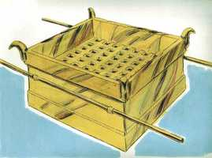
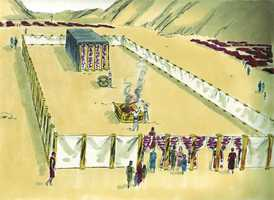

# Êxodo Cap 27

**1** 	FARÁS também o altar de madeira de acácia; cinco côvados será o comprimento, e cinco côvados a largura (será quadrado o altar), e três côvados a sua altura.

> **Cmt MHenry**: *Versículos 1-8* Diante do tabernáculo, no átrio, onde entrava a gente, havia um altar ao qual deviam levar os sacrifícios e sobre o qual os sacerdotes deviam ofertá-los a Deus. o altar era de madeira revestida com bronze. Uma grade de bronze era colocada na parte oca do altar, em meio do qual se mantinha aceso o fogo e se queimava o sacrifício. A grade era feita como uma rede de crivo, e ficava no buraco para que por ali caíssem as cinzas. O altar de bronze era tipo de Cristo que morre para expiar nossos pecados, o fogo do céu teria consumido a madeira se não tivesse estado protegida pelo bronze; tampouco a natureza humana de Cristo teria podido suportar a ira de Deus se não tivesse sido sustentada pelo poder divino.

 

**2** 	E farás as suas pontas nos seus quatro cantos; as suas pontas serão do mesmo, e o cobrirás de cobre.

**3** 	Far-lhe-ás também os seus recipientes, para recolher a sua cinza, e as suas pás, e as suas bacias, e os seus garfos e os seus braseiros; todos os seus utensílios farás de cobre.

**4** 	Far-lhe-ás também um crivo de cobre em forma de rede, e farás a esta rede quatro argolas de metal nos seus quatro cantos.

**5** 	E as porás dentro da borda do altar para baixo, de maneira que a rede chegue até ao meio do altar.

**6** 	Farás também varais para o altar, varais de madeira de acácia, e os cobrirás de cobre.

**7** 	E os varais serão postos nas argolas, de maneira que os varais estejam de ambos os lados do altar, quando for levado.

**8** 	Oco e de tábuas o farás; como se te mostrou no monte, assim o farão.

**9** 	Farás também o pátio do tabernáculo, ao lado meridional que dá para o sul; o pátio terá cortinas de linho fino torcido; o comprimento de cada lado será de cem côvados.

> **Cmt MHenry**: *Versículos 9-19* O tabernáculo estava cercado por um átrio de umas sessenta jardas (54,86 m) de comprimento por trinta (27,43 m) de largura, formado por cortinas que pendiam de colunas de bronze, de argolas de bronze. Dentro deste recinto os sacerdotes e os levitas ofereciam os sacrifícios e a esse lugar tinham acesso os judeus. Estas distinções representam a diferença que existe entre a igreja visível nominal e a igreja espiritual verdadeira, que é a única que tem entrada na presença de Deus e pode ter comunhão com Ele.

 

**10** 	Também as suas vinte colunas e as suas vinte bases serão de cobre; os colchetes das colunas e as suas faixas serão de prata.

**11** 	Assim também para o lado norte as cortinas, no comprimento, serão de cem côvados; e as suas vinte colunas e as suas vinte bases serão de cobre; os colchetes das colunas e as suas faixas serão de prata,

**12** 	E na largura do pátio para o lado do ocidente haverá cortinas de cinqüenta côvados; as suas colunas dez, e as suas bases dez.

**13** 	Semelhantemente a largura do pátio do lado oriental para o levante será de cinqüenta côvados.

**14** 	De maneira que haja quinze côvados de cortinas de um lado; suas colunas três, e as suas bases três.

**15** 	E quinze côvados das cortinas do outro lado; as suas colunas três, e as suas bases três.

**16** 	E à porta do pátio haverá uma cortina de vinte côvados, de azul, e púrpura, e carmesim, e de linho fino torcido, de obra de bordador; as suas colunas quatro, e as suas bases quatro.

**17** 	Todas as colunas do pátio ao redor serão cingidas de faixas de prata; os seus colchetes serão de prata, mas as suas bases de cobre.

**18** 	O comprimento do pátio será de cem côvados, e a largura de cada lado de cinqüenta, e a altura de cinco côvados, as cortinas serão de linho fino torcido; mas as suas bases serão de cobre.

**19** 	No tocante a todos os vasos do tabernáculo em todo o seu serviço, até todos os seus pregos, e todos os pregos do pátio, serão de cobre.

**20** 	Tu pois ordenarás aos filhos de Israel que te tragam azeite puro de oliveiras, batido, para o candeeiro, para fazer arder as lâmpadas continuamente.

> **Cmt MHenry**: *Versículos 20-21* O óleo puro representava os dons e as graças do Espírito que todos os crentes recebem de Cristo, a boa Oliveira, e sem o qual nossa luz não pode alumiar diante dos homens. os sacerdotes deviam acender as lâmpadas e cuidá-las. Obra dos ministros por meio da predicação e exposição das Escrituras, que são como uma lâmpada, é alumbrar a igreja, o tabernáculo de Deus sobre a terra. Bendito seja Deus, esta luz não está agora limitada ao tabernáculo judeu; antes é uma luz para iluminar os gentios e para salvação até os confins da terra.

**21** 	Na tenda da congregação, fora do véu que está diante do testemunho, Arão e seus filhos as porão em ordem, desde a tarde até a manhã, perante o Senhor; isto será um estatuto perpétuo para os filhos de Israel, pelas suas gerações.

> **Cmt MHenry** Intro: *CAPÍTULO 27A-Dn> *• Versículos 1-8*> *O altar do holocausto*> *• Versículos 9-19*> *O átrio do tabernáculo*> *• Versículos 20-21*> *O óleo para as lâmpadas*