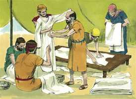
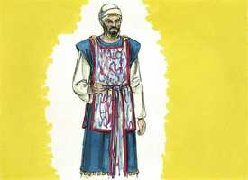
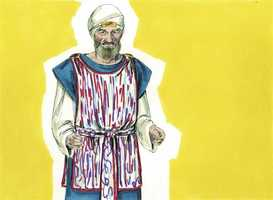
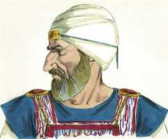
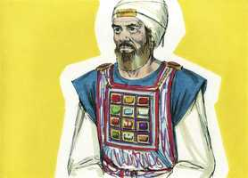
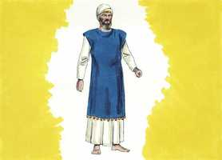

# Êxodo Cap 28

**1** 	DEPOIS tu farás chegar a ti teu irmão Arão, e seus filhos com ele, do meio dos filhos de Israel, para me administrarem o ofício sacerdotal; a saber: Arão, Nadabe, e Abiú, Eleazar e Itamar, os filhos de Arão.

> **Cmt MHenry**: *Versículos 1-5* Até aqui, os chefes das famílias faziam de sacerdotes e ofereciam os sacrifícios; porém agora este ofício ficou restringido exclusivamente a família de Arão; e assim continuou até a dispensação do evangelho. As vestiduras santas não somente distinguiam os sacerdotes do povo, eram também emblemas da conduta santa que sempre deve ser a glória e a beleza, a marca dos ministros da religião, sem a qual suas pessoas e seus ministérios seriam desprezíveis. Também tipificavam a glória da Majestade Divina, e a beleza da situação completa que realizou Jesus Cristo, o grande Sumo Sacerdote. Porém, nosso ornato no evangelho não deve ser de ouro nem custosos atavios, senão as vestes da salvação, o manto da justiça.

**2** 	E farás vestes sagradas a Arão teu irmão, para glória e ornamento.

**3** 	Falarás também a todos os que são sábios de coração, a quem eu tenho enchido do espírito da sabedoria, que façam vestes a Arão para santificá-lo; para que me administre o ofício sacerdotal.

 

**4** 	Estas pois são as vestes que farão: um peitoral, e um éfode, e um manto, e uma túnica bordada, uma mitra, e um cinto; farão, pois, santas vestes para Arão, teu irmão, e para seus filhos, para me administrarem o ofício sacerdotal.

**5** 	E tomarão o ouro, e o azul, e a púrpura, e o carmesim, e o linho fino,

**6** 	E farão o éfode de ouro, e de azul, e de púrpura, e de carmesim, e de linho fino torcido, de obra esmerada.

> **Cmt MHenry**: *Versículos 6-14* O éfode, de obra primorosa, era a vestidura exterior do sumo sacerdote; o éfode simples de linho o usavam os sacerdotes inferiores. Era uma túnica curta, sem mangas, bem amarrada ao corpo com um cinto. As ombreiras eram abotoadas com pedras preciosas engastadas em ouro, uma em cada ombro, sobre o qual estavam gravados os nomes dos filhos de Israel. Assim Cristo, nosso Sumo Sacerdote, apresenta a seu povo ante o Senhor ante o Senhor para memória. Como a túnica de Cristo não tinha costuras, senão que era tecida de cima para baixo, assim era o éfode. As campainhas de ouro do éfode, por seu som agradável e sua preciosidade, representam bem a boa profissão que fazem os santos, e as romãs, o fruto que eles levam.

 

**7** 	Terá duas ombreiras, que se unam às suas duas pontas, e assim se unirá.

**8** 	E o cinto de obra esmerada do seu éfode, que estará sobre ele, será da sua mesma obra, igualmente, de ouro, de azul, e de púrpura, e de carmesim, e de linho fino torcido.

 

**9** 	E tomarás duas pedras de ônix, e gravarás nelas os nomes dos filhos de Israel,

 

**10** 	Seis dos seus nomes numa pedra, e os outros seis nomes na outra pedra, segundo as suas gerações;

**11** 	Conforme à obra do lapidário, como o lavor de selos lavrarás estas duas pedras, com os nomes dos filhos de Israel; engastadas ao redor em ouro as farás.

**12** 	E porás as duas pedras nas ombreiras do éfode, por pedras de memória para os filhos de Israel; e Arão levará os seus nomes sobre ambos os seus ombros, para memória diante do Senhor.

**13** 	Farás também engastes de ouro,

**14** 	E duas cadeiazinhas de ouro puro; de igual medida, de obra de fieira as farás; e as cadeiazinhas de fieira porás nos engastes.

**15** 	Farás também o peitoral do juízo de obra esmerada, conforme à obra do éfode o farás; de ouro, de azul, e de púrpura, e de carmesim, e de linho fino torcido o farás.

> **Cmt MHenry**: *Versículos 15-30* O ornato principal do sumo sacerdote era o peitoral, uma rica peça de tecido, de obra primorosa. O nome de cada tribo estava gravado numa pedra preciosa, afixada no peitoral, para significar quão preciosos e honoráveis são os crentes aos olhos de Deus. por pequena e pobre que fosse uma tribo, era como uma pedra preciosa no peitoral do sumo sacerdote: assim de caros são todos os santos para Cristo, sem que importe qual seja a estimação dos homens. o sumo sacerdote tinha os nomes das tribos sobre seus ombros, assim como sobre o peito, o que nos recorda o poder e amor com que nosso Senhor Jesus intercede pelos seus. Não só os leva em seus braços com poder onipotente, senão que os leva em seu seio com terno afeto. Que consolo para nós cada vez que nos dirigimos a Deus! O Urim e o Tumim, pelo qual se dava a conhecer a vontade de Deus em casos duvidosos, estava no peitoral. Urim e Tumim significam *luz* e *integridade*. Há muitas conjecturas sobre que eram; a opinião mais provável parece ser que eram as doze pedras preciosas do peitoral do sumo sacerdote. Agora bem, Cristo é nosso Oráculo. Por Ele Deus se nos dá a conhecer Ele e sua vontade para conosco nestes tempos últimos ([Hb 1.1-2](../58N-Hb/01.md#1); [Jo 1.18](../43N-Joa/01.md#18)). Ele é a Luz verdadeira, a Testemunha fiel, a Verdade mesma, e dEle recebemos o Espírito de Verdade que nos guia a toda verdade.

 

**16** 	Quadrado e duplo, será de um palmo o seu comprimento, e de um palmo a sua largura.

**17** 	E o encherás de pedras de engaste, com quatro ordens de pedras; a ordem de um sárdio, de um topázio, e de um carbúnculo; esta será a primeira ordem;

**18** 	E a segunda ordem será de uma esmeralda, de uma safira, e de um diamante;

**19** 	E a terceira ordem será de um jacinto, de uma ágata, e de uma ametista;

**20** 	E a quarta ordem será de um berilo, e de um ônix, e de um jaspe; engastadas em ouro serão nos seus engastes.

**21** 	E serão aquelas pedras segundo os nomes dos filhos de Israel, doze segundo os seus nomes; serão esculpidas como selos, cada uma com o seu nome, para as doze tribos.

**22** 	Também farás para o peitoral cadeiazinhas de igual medida, obra trançada de ouro puro.

**23** 	Também farás para o peitoral dois anéis de ouro, e porás os dois anéis nas extremidades do peitoral.

**24** 	Então porás as duas cadeiazinhas de fieira de ouro nos dois anéis, nas extremidades do peitoral;

**25** 	E as duas pontas das duas cadeiazinhas de fieira colocarás nos dois engastes, e as porás nas ombreiras do éfode, na frente dele.

**26** 	Farás também dois anéis de ouro, e os porás nas duas extremidades do peitoral, na sua borda que estiver junto ao éfode por dentro.

**27** 	Farás também dois anéis de ouro, que porás nas duas ombreiras do éfode, abaixo, na frente dele, perto da sua juntura, sobre o cinto de obra esmerada do éfode.

**28** 	E ligarão o peitoral, com os seus anéis, aos anéis do éfode por cima, com um cordão de azul, para que esteja sobre o cinto de obra esmerada do éfode; e nunca se separará o peitoral do éfode.

> **Cmt MHenry**: *CAPÍTULO 28A-Os

**29** 	Assim Arão levará os nomes dos filhos de Israel no peitoral do juízo sobre o seu coração, quando entrar no santuário, para memória diante do Senhor continuamente.

**30** 	Também porás no peitoral do juízo Urim e Tumim, para que estejam sobre o coração de Arão, quando entrar diante do Senhor: assim Arão levará o juízo dos filhos de Israel sobre o seu coração diante do Senhor continuamente.

**31** 	Também farás o manto do éfode, todo de azul.

> **Cmt MHenry**: *Versículos 31-39* O manto do éfode ia embaixo dele e chegava até os joelhos; não tinha mangas. Arão devia ministrar vestido com as vestes designadas. Nós devemos servir ao Senhor com santo temor, como os que sabem que merecem morrer. Uma lâmina de ouro estava amarrada sobre a testa de Arão, com o gravado de "Santidade ao Senhor". Por esse médio se lembrava a Arão que Deus é santo e que seus sacerdotes devem ser santos, consagrados ao Senhor. esta devia estar na frente deles como profissão aberta da relação deles com Deus. devia ser gravada como gravura de selo, profunda e duradoura; não pintada para que desbote, senão firme e durável; tal deve ser nossa santidade ao Senhor. Cristo é nosso Sumo Sacerdote; por meio dEle nos são perdoados os pecados e não se carregam em nossa conta. Nossas pessoas, nossas obras, são agradáveis para Deus por conta de Cristo e não de outro jeito.

 

**32** 	E a abertura da cabeça estará no meio dele; esta abertura terá uma borda de obra tecida ao redor; como abertura de cota de malha será, para que não se rompa.

**33** 	E nas suas bordas farás romãs de azul, e de púrpura, e de carmesim, ao redor das suas bordas; e campainhas de ouro no meio delas ao redor.

**34** 	Uma campainha de ouro, e uma romã, outra campainha de ouro, e outra romã, haverá nas bordas do manto ao redor,

**35** 	E estará sobre Arão quando ministrar, para que se ouça o seu sonido, quando entrar no santuário diante do Senhor, e quando sair, para que não morra.

**36** 	Também farás uma lâmina de ouro puro, e nela gravarás como as gravuras de selos: SANTIDADE AO Senhor.

 

**37** 	E atá-la-ás com um cordão de azul, de modo que esteja na mitra, na frente da mitra estará;

**38** 	E estará sobre a testa de Arão, para que Arão leve a iniqüidade das coisas santas, que os filhos de Israel santificarem em todas as ofertas de suas coisas santas; e estará continuamente na sua testa, para que tenham aceitação perante o Senhor.

**39** 	Também farás túnica de linho fino; também farás uma mitra de linho fino; mas o cinto farás de obra de bordador.

**40** 	Também farás túnicas aos filhos de Arão, e far-lhes-ás cintos; também lhes farás tiaras, para glória e ornamento.

> **Cmt MHenry**: *Versículos 40-43* As vestiduras do sacerdote tipificam a justiça de Cristo. se nos apresentamos ante Deus sem elas, levaremos nossa iniqüidade e morreremos. Portanto, bem-aventurado o que vigia e guarda suas roupas ([Ap 16.15](../66N-Ap/16.md#15)). E bendito seja Deus porque temos um Sumo Sacerdote, nomeado por Deus, e separado para sua obra; enfeitado para seu elevado ofício pela glória da majestade Divina e a beleza da perfeita santidade. Felizes somos se pela lei espiritualmente entendida vemos que al Sumo Sacerdote se fez nós; que nós não podemos aproximar-nos a um Deus santo ou sermos aceitos, senão por meio dEle. Não há luz, sabedoria ou perfeição senão nEle; não há glória nem beleza senão em ser como Ele. Tenhamos valor pelo poder, amor e compaixão de nosso Sumo Sacerdote para aproximar-nos confiadamente ao trono da graça, para que possamos receber misericórdia e achar graça para o oportuno socorro em tempo de necessidade. "

**41** 	E vestirás com eles a Arão, teu irmão, e também seus filhos; e os ungirás e consagrarás, e os santificarás, para que me administrem o sacerdócio.

**42** 	Faze-lhes também calções de linho, para cobrirem a carne nua; irão dos lombos até as coxas.

**43** 	E estarão sobre Arão e sobre seus filhos, quando entrarem na tenda da congregação, ou quando chegarem ao altar para ministrar no santuário, para que não levem iniqüidade e morram; isto será estatuto perpétuo para ele e para a sua descendência depois dele.

> **Cmt MHenry** Intro: *• Versículos 1-5*> *Arão e seus filhos são separados para o ofício sacerdotal*> *Suas vestes*> *• Versículos 6-14*> *• Versículos 15-30*> *O peitoral – O Urim e o Tumim*> *• Versículos 31-39*> *O manto do éfode – A lâmina de ouro*> *• Versículos 40-43*> *As vestes para os filhos de Arão*