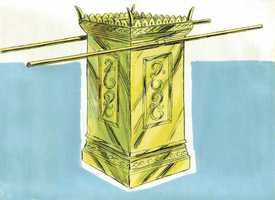
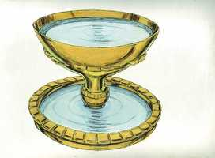

# Êxodo Cap 30

**1** 	E FARÁS um altar para queimar o incenso; de madeira de acácia o farás.

> **Cmt MHenry**: *Versículos 1-10* O altar do incenso representa o Filho de Deus em sua natureza humana e o incenso ali queimado tipifica a intercessão por seu povo. A intercessão *contínua* de Cristo está representada pela queima diária de incenso, manhã e tarde. Uma vez por ano devia-se aplicar o sangue da expiação, denotando isto que a intercessão de Cristo tem toda sua virtude a partir de seus sofrimentos na terra, e que nós não necessitamos outro sacrifício nem outro intercessor, senão somente Cristo.

 

**2** 	O seu comprimento será de um côvado, e a sua largura de um côvado; será quadrado, e dois côvados a sua altura; dele mesmo serão as suas pontas.

**3** 	E com ouro puro o forrarás, o seu teto, e as suas paredes ao redor, e as suas pontas; e lhe farás uma coroa de ouro ao redor.

**4** 	Também lhe farás duas argolas de ouro debaixo da sua coroa; nos dois cantos as farás, de ambos os lados; e serão para lugares dos varais, com que será levado.

**5** 	E os varais farás de madeira de acácia, e os forrarás com ouro.

**6** 	E o porás diante do véu que está diante da arca do testemunho, diante do propiciatório, que está sobre o testemunho, onde me ajuntarei contigo.

**7** 	E Arão sobre ele queimará o incenso das especiarias; cada manhã, quando puser em ordem as lâmpadas, o queimará.

**8** 	E, acendendo Arão as lâmpadas à tarde, o queimará; este será incenso contínuo perante o Senhor pelas vossas gerações.

**9** 	Não oferecereis sobre ele incenso estranho, nem holocausto, nem oferta; nem tampouco derramareis sobre ele libações.

**10** 	E uma vez no ano Arão fará expiação sobre as suas pontas com o sangue do sacrifício das expiações; uma vez no ano fará expiação sobre ele pelas vossas gerações; santíssimo é ao Senhor.

**11** 	Falou mais o Senhor a Moisés dizendo:

> **Cmt MHenry**: *Versículos 11-16* O tributo era meio siclo, uns quinze centavos de nossa moeda. O rico não devia dar mais, nem menos o pobre; as almas dos ricos e pobres são preciosas por igual, e Deus não faz acepção de pessoas ([Act 10.34](../44N-At/10.md#34); [Jó 34.19](../18A-Jo/34.md#19)). Em outras oferendas, os homens deviam dar conforme a suas habilidades mundanas, mas nesta, que era o resgate da alma, devia *ser igual para todos*. As almas de todos são de igual valor, estão em igual perigo e todas por igual necessitam um resgate. O dinheiro reunido era para ser usado no serviço do tabernáculo. Os que têm o benefício não devem queixar-se das cargas necessárias para o culto público de Deus, o dinheiro não pode fazer expiação pela *alma*, mas pode usar-se para honra dAquele que fez a expiação, e para a manutenção do evangelho, pelo qual se aplica a expiação.

**12** 	Quando fizeres a contagem dos filhos de Israel, conforme a sua soma, cada um deles dará ao Senhor o resgate da sua alma, quando os contares; para que não haja entre eles praga alguma, quando os contares.

**13** 	Todo aquele que passar pelo arrolamento dará isto: a metade de um siclo, segundo o siclo do santuário (este siclo é de vinte geras); a metade de um siclo é a oferta ao Senhor.

**14** 	Qualquer que passar pelo arrolamento, de vinte anos para cima, dará a oferta alçada ao Senhor.

**15** 	O rico não dará mais, e o pobre não dará menos da metade do siclo, quando derem a oferta alçada ao Senhor, para fazer expiação por vossas almas.

**16** 	E tomarás o dinheiro das expiações dos filhos de Israel, e o darás ao serviço da tenda da congregação; e será para memória aos filhos de Israel diante do Senhor, para fazer expiação por vossas almas.

**17** 	E falou o Senhor a Moisés, dizendo:

> **Cmt MHenry**: *Versículos 17-21* Devia-se instalar uma grande pia de bronze para água perto da porta do tabernáculo. Arão e seus filhos deviam lavar suas mãos e pés nela, cada vez que entrassem para ministrar. Isto era para ensiná-lhes a pureza em todos seus serviços e a temer a contaminação do pecado. Não só deviam lavar-se e ser purificados quando eram feitos sacerdotes pela primeira vez, senão que deviam lavar-se e manter-se limpos cada vez que fossem a ministrar. Nos ensina a apresentar-nos diariamente ante Deus, a renovar diariamente nosso arrependimento pelo pecado e nossa esperança no sangue de Cristo para a remissão; pois em muitas coisas ofendemos a diário.

**18** 	Farás também uma pia de cobre com a sua base de cobre, para lavar; e a porás entre a tenda da congregação e o altar; e nela deitarás água.

**19** 	E Arão e seus filhos nela lavarão as suas mãos e os seus pés.

**20** 	Quando entrarem na tenda da congregação, lavar-se-ão com água, para que não morram, ou quando se chegarem ao altar para ministrar, para acender a oferta queimada ao Senhor.

**21** 	Lavarão, pois, as suas mãos e os seus pés, para que não morram; e isto lhes será por estatuto perpétuo a ele e à sua descendência nas suas gerações.

**22** 	Falou mais o Senhor a Moisés, dizendo:

> **Cmt MHenry**: *Versículos 22-38* Aqui se dão instruções para fazer o óleo da santa unção, e o incenso para uso no serviço do tabernáculo, o qual era grato de ver e cheirar. O nome de Cristo é como ungüento derramado ([Ct 1.3](../22A-Ct/01.md#3)), e o bom nome dos cristãos é como ungüento precioso ([Ec 7.1](../21A-Ec/07.md#1)). o incenso queimado sobre o altar de ouro era preparado com especiarias doces. Quando se usava devia ser moído muito fino, pois assim aprouve a Deus moer o Redentor quando este se ofereceu como sacrifício de sabor e cheiro grato. O mesmo não deve ter nenhum uso comum. Deste modo Deus mantém a reverência na mente do povo por seu serviço, e ensina a não profanar nem abusar coisa alguma pela qual Deus se der a conhecer. Grande afronta para Deus é brincar com as coisas sagradas e chacotear sua palavra e suas ordenanças. Sumamente perigoso e fatal é usar a profissão do evangelho de Cristo para fomentar os interesses mundanos.

 

**23** 	Tu, pois, toma para ti das principais especiarias, da mais pura mirra quinhentos siclos, e de canela aromática a metade, a saber, duzentos e cinqüenta siclos, e de cálamo aromático duzentos e cinqüenta siclos,

**24** 	E de cássia quinhentos siclos, segundo o siclo do santuário, e de azeite de oliveiras um him.

**25** 	E disto farás o azeite da santa unção, o perfume composto segundo a obra do perfumista: este será o azeite da santa unção.

**26** 	E com ele ungirás a tenda da congregação, e a arca do testemunho,

**27** 	E a mesa com todos os seus utensílios, e o candelabro com os seus utensílios, e o altar do incenso.

**28** 	E o altar do holocausto com todos os seus utensílios, e a pia com a sua base.

**29** 	Assim santificarás estas coisas, para que sejam santíssimas; tudo o que tocar nelas será santo.

**30** 	Também ungirás a Arão e seus filhos, e os santificarás para me administrarem o sacerdócio.

> **Cmt MHenry**: *CAPÍTULO 30A-Am

**31** 	E falarás aos filhos de Israel, dizendo: Este me será o azeite da santa unção nas vossas gerações.

**32** 	Não se ungirá com ele a carne do homem, nem fareis outro de semelhante composição; santo é, e será santo para vós.

**33** 	O homem que compuser um perfume como este, ou dele puser sobre um estranho, será extirpado do seu povo.

**34** 	Disse mais o Senhor a Moisés: Toma especiarias aromáticas, estoraque, e onicha, e gálbano; estas especiarias aromáticas e o incenso puro, em igual proporção;

**35** 	E disto farás incenso, um perfume segundo a arte do perfumista, temperado, puro e santo;

**36** 	E uma parte dele moerás, e porás diante do testemunho, na tenda da congregação, onde eu virei a ti; coisa santíssima vos será.

**37** 	Porém o incenso que fareis conforme essa composição, não o fareis para vós mesmos; santo será para o Senhor.

**38** 	O homem que fizer tal como este para cheirar, será extirpado do seu povo.

> **Cmt MHenry** Intro: *• Versículos 1-10*> *O altar do incenso*> *• Versículos 11-16*> *Resgates de almas*> *• Versículos 17-21*> *A pia de bronze*> *• Versículos 22-38*> *O óleo da santa unção – O perfume*