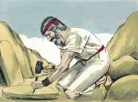

# Êxodo Cap 34

**1** 	ENTÃO disse o Senhor a Moisés: Lavra duas tábuas de pedra, como as primeiras; e eu escreverei nas tábuas as mesmas palavras que estavam nas primeiras tábuas, que tu quebraste.

> **Cmt MHenry**: *Versículos 1-4* Quando Deus fez o homem a sua imagem, a lei moral foi escrita em seu coração pelo dedo de Deus, sem médios externos. Entretanto, como a aliança feita então com o homem foi quebrantada, o Senhor tem usado o ministério dos homens, tanto para escrever a lei nas Escrituras, como para escrevê-la no coração. Quando Deus se reconciliou com os israelitas, ordenou que as tábuas fossem renovadas e escreveu sua lei nelas. Ainda embaixo do evangelho da paz por Cristo, a lei moral continua obrigando o crente. Cristo nos redimiu da maldição da lei, mas não dos mandamentos dela. A primeira e melhor prova do perdão dos pecados e da paz com Deus é que a lei fica escrita no coração.

 

**2** 	E prepara-te para amanhã, para que subas pela manhã ao monte Sinai, e ali põe-te diante de mim no cume do monte.

**3** 	E ninguém suba contigo, e também ninguém apareça em todo o monte; nem ovelhas nem bois se apascentem defronte do monte.

**4** 	Então Moisés lavrou duas tábuas de pedra, como as primeiras; e levantando-se pela manhã de madrugada, subiu ao monte Sinai, como o Senhor lhe tinha ordenado; e levou as duas tábuas de pedra nas suas mãos.

**5** 	E o Senhor desceu numa nuvem e se pôs ali junto a ele; e ele proclamou o nome do Senhor.

> **Cmt MHenry**: *Versículos 5-9* Como um sinal aberto de sua presença e manifestação de sua glória, o Senhor desceu numa nuvem e dali proclamou seu Nome; isto é, as perfeições e o caráter denotados pelo nome Jeová. O Senhor Deus é *misericordioso*: pronto para perdoar o pecador e socorrer o necessitado. *Piedoso*: bom e disposto a conceder benefícios imerecidos. *Tardio para irar-se*: é longânime, concede tempo para o arrependimento, e somente castiga quando é necessário. Ele é *grande em misericórdia e verdade*: até os pecadores recebem em abundância das riquezas de Sua magnificência apesar de que abusem dela. Todo o que Ele revela é verdade infalível, todo o que promete o realiza com fidelidade. *Que guarda misericórdia a milhares*: continuamente Ele mostra misericórdia aos pecadores até o fim do tempo, e tem tesouros que não se podem esgotar. *Que perdoa a iniqüidade, a rebelião e o pecado*: sua misericórdia e bondade chegam ao perdão pleno e gratuito do pecado. *E que de modo nenhum terá por inocente ao malvado*: a santidade e justiça de Deus são parte de sua piedade e amor para com todas suas criaturas. Nos sofrimentos de Cristo mostra-se a santidade e justiça Divina plenamente, e se dá a conhecer a maldade do pecado. a misericórdia de Deus que perdoa sempre vai acompanhada de sua graça que converte e santifica. Ninguém tem perdão senão os que se arrependem e abandonam a prática intencional de todo pecado; nenhum que abuse, descuide ou despreze esta grande salvação poderá escapar. Moisés se inclinou e adorou com reverência. O crente pode invocar qualquer perfeição do *nome* de Deus, para pedir-lhe o perdão de seus pecados, que seja feito santo seu coração, e que se estenda o reino do Redentor.

**6** 	Passando, pois, o Senhor perante ele, clamou: O Senhor, o Senhor Deus, misericordioso e piedoso, tardio em irar-se e grande em beneficência e verdade;

**7** 	Que guarda a beneficência em milhares; que perdoa a iniqüidade, e a transgressão e o pecado; que ao culpado não tem por inocente; que visita a iniqüidade dos pais sobre os filhos e sobre os filhos dos filhos até a terceira e quarta geração.

**8** 	E Moisés apressou-se, e inclinou a cabeça à terra, adorou,

**9** 	E disse: Senhor, se agora tenho achado graça aos teus olhos, vá agora o Senhor no meio de nós; porque este é povo de dura cerviz; porém perdoa a nossa iniqüidade e o nosso pecado, e toma-nos por tua herança.

**10** 	Então disse: Eis que eu faço uma aliança; farei diante de todo o teu povo maravilhas que nunca foram feitas em toda a terra, nem em nação alguma; de maneira que todo este povo, em cujo meio tu estás, veja a obra do Senhor; porque coisa terrível é o que faço contigo.

> **Cmt MHenry**: *Versículos 10-17* Manda-se aos israelitas que destruam todo monumento de idolatria, por formoso ou custoso que seja; que rejeitem a idolatria, amizade ou matrimônio com os idólatras e todas as festas idólatras; e são lembrados para que não repitam o delito de fazer-se imagens de fundição. O furor do homem é chamado de ciúmes ([Pv 6.34](../20A-Pv/06.md#34)); mas o desagrado é santo e justo em Deus. Os que não adoram somente a Deus não podem adorá-lo retamente.

**11** 	Guarda o que eu te ordeno hoje; eis que eu lançarei fora diante de ti os amorreus, e os cananeus, e os heteus, e os perizeus, e os heveus e os jebuseus.

**12** 	Guarda-te de fazeres aliança com os moradores da terra aonde hás de entrar; para que não seja por laço no meio de ti.

**13** 	Mas os seus altares derrubareis, e as suas estátuas quebrareis, e os seus bosques cortareis.

**14** 	Porque não te inclinarás diante de outro deus; pois o nome do Senhor é Zeloso; é um Deus zeloso.

**15** 	Para que não faças aliança com os moradores da terra, e quando eles se prostituírem após os seus deuses, ou sacrificarem aos seus deuses, tu, como convidado deles, comas também dos seus sacrifícios,

**16** 	E tomes mulheres das suas filhas para os teus filhos, e suas filhas, prostituindo-se com os seus deuses, façam que também teus filhos se prostituam com os seus deuses.

**17** 	Não te farás deuses de fundição.

**18** 	A festa dos pães ázimos guardarás; sete dias comerás pães ázimos, como te tenho ordenado, ao tempo apontado do mês de Abibe; porque no mês de Abibe saíste do Egito.

> **Cmt MHenry**: *Versículos 18-27* Uma vez por semana devem repousar, mesmo que seja na temporada da semeadura e da colheita. Todos os negócios do mundo devem dar lugar ao repouso santo; até a sega prosperará para melhor pela observância sagrada do dia de repouso na temporada da colheita. Devemos demonstrar que preferimos nossa comunhão com Deus e nosso dever para com Ele antes que os negócios ou a alegria da colheita. Três vezes ao ano eles deviam apresentar-se ante o Senhor Deus, o Deus de Israel. Cá era uma terra desejável e os povos vizinhos eram cobiçosos; porém Deus diz: "Ninguém cobiçará tua terra". Controlemos todos os desejos pecaminosos de nosso coração contra Deus e sua glória e então, confiemos em que Ele controle todos os desejos pecaminosos no coração de outros em contra nossa. O caminho do dever é o caminho da seguridade. Os que se aventuram por ele, nunca perdem. Aqui se mencionam três festas: 1) *A Páscoa, que lembra a liberação desde o Egito.* 2) *A festa das semanas ou festa de Pentecostes;* agregada a esta está a lei das primícias. 3) *A festa das colheitas ou festa dos Tabernáculos*. Moisés devia escrever estas palavras para que o povo as conhecesse melhor. Nunca podemos estar suficientemente agradecidos a Deus pela palavra escrita. Deus faria uma aliança com Israel com Moisés como mediador. Assim, a aliança de graça é realizada com os crentes por meio de Cristo.

**19** 	Tudo o que abre a madre meu é, até todo o teu gado, que seja macho, e que abre a madre de vacas e de ovelhas;

**20** 	O burro, porém, que abrir a madre, resgatarás com um cordeiro; mas, se o não resgatares, cortar-lhe-ás a cabeça; todo o primogênito de teus filhos resgatarás. E ninguém aparecerá vazio diante de mim.

**21** 	Seis dias trabalharás, mas ao sétimo dia descansarás: na aradura e na sega descansarás.

**22** 	Também guardarás a festa das semanas, que é a festa das primícias da sega do trigo, e a festa da colheita no fim do ano.

**23** 	Três vezes ao ano todos os homens aparecerão perante o Senhor Deus, o Deus de Israel;

**24** 	Porque eu lançarei fora as nações de diante de ti, e alargarei o teu território; ninguém cobiçará a tua terra, quando subires para aparecer três vezes no ano diante do Senhor teu Deus.

**25** 	Não sacrificarás o sangue do meu sacrifício com pão levedado, nem o sacrifício da festa da páscoa ficará da noite para a manhã.

**26** 	As primícias dos primeiros frutos da tua terra trarás à casa do Senhor teu Deus; não cozerás o cabrito no leite de sua mãe.

**27** 	Disse mais o Senhor a Moisés: Escreve estas palavras; porque conforme ao teor destas palavras tenho feito aliança contigo e com Israel.

**28** 	E esteve ali com o Senhor quarenta dias e quarenta noites; não comeu pão, nem bebeu água, e escreveu nas tábuas as palavras da aliança, os dez mandamentos.

> **Cmt MHenry**: *Versículos 28-35* A comunhão próxima e espiritual com Deus melhora as graças de um caráter renovado e santo. A piedade séria confere brilho ao semblante do homem, assim como infunde estima e afeto. O véu que Moisés se colocou indica a escuridão dessa dispensação, em comparação com a dispensação do evangelho do Novo Testamento. Também era um emblema do véu natural que existe no coração dos homens a respeito das coisas espirituais. Além disso, representa o véu que estava e está sobre a nação de Israel, o qual somente pode ser tirado pelo Espírito do Senhor, que lhes mostra a Cristo como o fim da lei para justiça a todo aquele que crê. O medo e a incredulidade colocarão o véu diante de nós, estorvarão nossa aproximação confiada ao trono da graça no alto. Devemos mostrar plenamente nossas carências temporais e espirituais diante de nosso Pai espirituais; temos de contá-lhe nossos problemas, lutas, provas e tentações; devemos reconhecer nossas ofensas. "

**29** 	E aconteceu que, descendo Moisés do monte Sinai trazia as duas tábuas do testemunho em suas mãos, sim, quando desceu do monte, Moisés não sabia que a pele do seu rosto resplandecia, depois que falara com ele.

**30** 	Olhando, pois, Arão e todos os filhos de Israel para Moisés, eis que a pele do seu rosto resplandecia; por isso temeram chegar-se a ele.

**31** 	Então Moisés os chamou, e Arão e todos os príncipes da congregação tornaram-se a ele; e Moisés lhes falou.

**32** 	Depois chegaram também todos os filhos de Israel; e ele lhes ordenou tudo o que o Senhor falara com ele no monte Sinai.

**33** 	Assim que Moisés acabou de falar com eles, pôs um véu sobre o seu rosto.

**34** 	Porém, entrando Moisés perante o Senhor, para falar com ele, tirava o véu até sair; e, saindo, falava com os filhos de Israel o que lhe era ordenado.

> **Cmt MHenry**: *CAPÍTULO 34A-Na

**35** 	Assim, pois, viam os filhos de Israel o rosto de Moisés, e que resplandecia a pele do seu rosto; e tornava Moisés a pôr o véu sobre o seu rosto, até entrar para falar com ele.

> **Cmt MHenry** Intro: *• Versículos 1-4*> *Renovação das tábuas da lei*> *• Versículos 5-9*> *Proclamação do nome do Senhor – Fervorosa petição de*> *• Versículos 10-17*> *A aliança de Deus*> *• Versículos 18-27*> *As festas*> *• Versículos 28-35*> *O véu de Moisés*